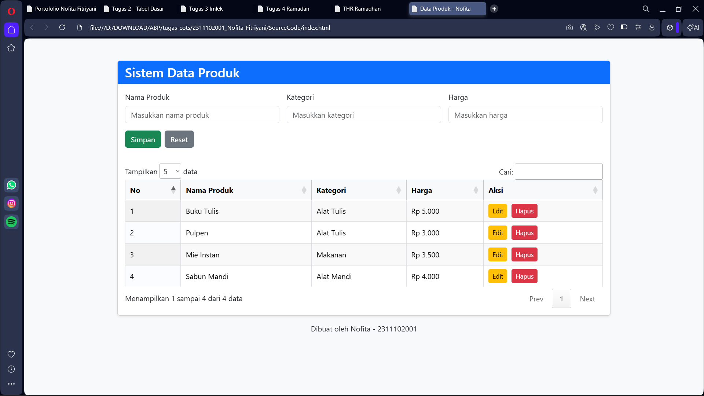

<h1 align="center">LAPORAN PRAKTIKUM</h1>
<h1 align="center">APLIKASI BERBASIS PLATFORM</h1>

<br>

<h2 align="center">TUGAS COTS</h2>
<h2 align="center">DATA PRODUK</h2>

<br><br>

<p align="center">

</p>
<br><br><br>

<h2 align="center">Disusun Oleh :</h2>

<p align="center" style="font-size:28px;">
  <b>Nofita Fitriyani</b><br>
  <b>2311102001</b><br>
  <b>S1 IF-11-REG 01</b>
</p>
<br>
<h2 align="center">Dosen Pengampu :</h2>

<p align="center" style="font-size:28px;">
  <b>Dimas Fanny Hebrasianto Permadi, S.ST., M.Kom</b>
</p>
<br>
<h2 align="center">Asisten Praktikum :</h2>

<p align="center" style="font-size:28px;">
  <b>Apri Pandu Wicaksono</b><br>
  <b>Rangga Pradarrell Fathi</b>
</p>
<br>
<h1 align="center">LABORATORIUM HIGH PERFORMANCE</h1>
<h1 align="center">FAKULTAS INFORMATIKA</h1>
<h1 align="center">UNIVERSITAS TELKOM PURWOKERTO</h1>
<h1 align="center">TAHUN 2026</h1>

<hr>

## Dasar Teori
### HTML (HyperText Markup Language)
HTML merupakan bahasa markup yang digunakan untuk membangun struktur dasar sebuah halaman web. HTML berfungsi untuk mengatur elemen-elemen yang tampil di halaman web seperti teks, gambar, form, tabel, dan berbagai komponen lainnya.

Dalam pengembangan aplikasi web sederhana, HTML digunakan untuk membuat kerangka halaman seperti form input, tabel data, dan layout halaman secara keseluruhan. HTML bekerja bersama dengan CSS untuk mengatur tampilan dan JavaScript untuk mengatur logika serta interaksi pengguna.

Pada sistem ini, HTML digunakan untuk membuat form input data produk serta tabel yang digunakan untuk menampilkan data produk yang telah dimasukkan oleh pengguna.

### CSS (Cascading Style Sheets)
CSS merupakan bahasa yang digunakan untuk mengatur tampilan atau desain dari elemen HTML pada halaman web. Dengan menggunakan CSS, pengembang dapat mengatur warna, ukuran teks, posisi elemen, jarak antar elemen, serta berbagai aspek visual lainnya.

CSS membantu memisahkan struktur halaman (HTML) dengan tampilan visual sehingga kode menjadi lebih rapi dan mudah dikelola.
Pada sistem ini, CSS digunakan untuk:
- Mengatur tampilan halaman agar lebih rapi
- Membuat watermark pada halaman
- Mengatur tampilan tabel dan elemen lainnya

### Bootstrap
Bootstrap merupakan framework CSS yang digunakan untuk mempercepat proses pembuatan tampilan website yang responsif dan modern. Bootstrap menyediakan berbagai komponen siap pakai seperti tombol, form, tabel, navbar, dan grid layout.

Dengan menggunakan Bootstrap, pengembang tidak perlu membuat desain dari awal karena Bootstrap sudah menyediakan berbagai class yang dapat langsung digunakan.
Pada sistem ini, Bootstrap digunakan untuk:
- Membuat tampilan form input produk
- Mendesain tabel data produk
- Mengatur layout halaman agar lebih rapi dan responsif

### JavaScript
JavaScript merupakan bahasa pemrograman yang digunakan untuk membuat halaman web menjadi interaktif. Dengan JavaScript, halaman web dapat merespon tindakan pengguna seperti klik tombol, mengisi form, atau memproses data secara dinamis.

JavaScript memungkinkan pengolahan data secara langsung di sisi client tanpa harus menggunakan server.
Pada sistem ini, JavaScript digunakan untuk:
- Mengambil data dari form input
- Menyimpan data produk ke dalam array object
- Menampilkan data produk ke dalam tabel
- Menghapus data produk
- Mengedit data produk

### jQuery
jQuery merupakan library JavaScript yang dibuat untuk mempermudah penggunaan JavaScript. Dengan jQuery, penulisan kode JavaScript menjadi lebih singkat dan lebih mudah dipahami.

jQuery sering digunakan untuk:
- Manipulasi elemen HTML
- Mengambil data dari form
- Mengatur event seperti klik dan submit
- Mengubah isi halaman secara dinamis
Dalam sistem ini, jQuery digunakan untuk mempermudah manipulasi DOM serta menangani event pada form input.

### CRUD (Create, Read, Update, Delete)
CRUD merupakan konsep dasar dalam pengolahan data pada sebuah sistem informasi. CRUD terdiri dari empat operasi utama yaitu:
- Create
Digunakan untuk menambahkan data baru ke dalam sistem.
- Read
Digunakan untuk menampilkan data yang tersimpan dalam sistem.
- Update
Digunakan untuk memperbarui data yang sudah ada.
- Delete
Digunakan untuk menghapus data dari sistem.

Pada sistem ini seluruh operasi CRUD dilakukan menggunakan JavaScript dengan penyimpanan data menggunakan array of object.

## Source Code
### index.html
```
<!DOCTYPE html>
<html lang="id">
<head>
  <meta charset="UTF-8" />
  <meta name="viewport" content="width=device-width, initial-scale=1.0" />
  <title>Data Produk - Nofita</title>

  <!-- Bootstrap CSS -->
  <link
    href="https://cdn.jsdelivr.net/npm/bootstrap@5.3.3/dist/css/bootstrap.min.css"
    rel="stylesheet"
  />

  <!-- DataTables CSS -->
  <link
    rel="stylesheet"
    href="https://cdn.datatables.net/1.13.8/css/jquery.dataTables.min.css"
  />

  <link rel="stylesheet" href="style.css" />
</head>
<body>
  <div class="watermark">Nofita - 2311102001</div>

  <div class="container py-5">
    <div class="row justify-content-center">
      <div class="col-lg-10">
        <div class="card shadow-sm">
          <div class="card-header bg-primary text-white">
            <h3 class="mb-0">Sistem Data Produk</h3>
          </div>
          <div class="card-body">
            <form id="formProduk" class="row g-3 mb-4">
              <input type="hidden" id="indexEdit" value="-1" />

              <div class="col-md-4">
                <label for="namaProduk" class="form-label">Nama Produk</label>
                <input
                  type="text"
                  class="form-control"
                  id="namaProduk"
                  placeholder="Masukkan nama produk"
                  required
                />
              </div>

              <div class="col-md-4">
                <label for="kategoriProduk" class="form-label">Kategori</label>
                <input
                  type="text"
                  class="form-control"
                  id="kategoriProduk"
                  placeholder="Masukkan kategori"
                  required
                />
              </div>

              <div class="col-md-4">
                <label for="hargaProduk" class="form-label">Harga</label>
                <input
                  type="number"
                  class="form-control"
                  id="hargaProduk"
                  placeholder="Masukkan harga"
                  required
                />
              </div>

              <div class="col-12 d-flex gap-2">
                <button type="submit" class="btn btn-success" id="tombolSimpan">
                  Simpan
                </button>
                <button type="button" class="btn btn-secondary" id="tombolReset">
                  Reset
                </button>
              </div>
            </form>

            <div class="table-responsive">
              <table id="tabelProduk" class="display table table-bordered align-middle">
                <thead class="table-light">
                  <tr>
                    <th>No</th>
                    <th>Nama Produk</th>
                    <th>Kategori</th>
                    <th>Harga</th>
                    <th>Aksi</th>
                  </tr>
                </thead>
                <tbody></tbody>
              </table>
            </div>
          </div>
        </div>

        <p class="text-center mt-3 teks-bawah">
          Dibuat oleh Nofita - 2311102001
        </p>
      </div>
    </div>
  </div>

  <!-- jQuery -->
  <script src="https://code.jquery.com/jquery-3.7.1.min.js"></script>

  <!-- DataTables -->
  <script src="https://cdn.datatables.net/1.13.8/js/jquery.dataTables.min.js"></script>

  <!-- Bootstrap JS -->
  <script src="https://cdn.jsdelivr.net/npm/bootstrap@5.3.3/dist/js/bootstrap.bundle.min.js"></script>

  <script src="script.js"></script>
</body>
</html>
```
### style.css
```
body {
  background-color: #f8f9fa;
  position: relative;
  min-height: 100vh;
}

.watermark {
  position: fixed;
  top: 50%;
  left: 50%;
  transform: translate(-50%, -50%) rotate(-30deg);
  font-size: 48px;
  color: rgba(0, 0, 0, 0.06);
  font-weight: bold;
  pointer-events: none;
  user-select: none;
  z-index: 0;
  white-space: nowrap;
}

.card,
.teks-bawah {
  position: relative;
  z-index: 1;
}

#tabelProduk_wrapper {
  margin-top: 10px;
}

.btn-aksi {
  margin-right: 5px;
}
```
### script.js
```
let dataProduk = [
  {
    nama: "Buku Tulis",
    kategori: "Alat Tulis",
    harga: 5000
  },
  {
    nama: "Pulpen",
    kategori: "Alat Tulis",
    harga: 3000
  }
];

let tabelData;

$(document).ready(function () {
  tampilkanDataKeTabel();

  tabelData = $("#tabelProduk").DataTable({
    pageLength: 5,
    lengthMenu: [5, 10, 25, 50],
    language: {
      search: "Cari:",
      lengthMenu: "Tampilkan _MENU_ data",
      info: "Menampilkan _START_ sampai _END_ dari _TOTAL_ data",
      paginate: {
        first: "Awal",
        last: "Akhir",
        next: "Next",
        previous: "Prev"
      },
      zeroRecords: "Data tidak ditemukan",
      infoEmpty: "Belum ada data",
      infoFiltered: "(disaring dari _MAX_ total data)"
    }
  });

  $("#formProduk").on("submit", function (e) {
    e.preventDefault();
    simpanProduk();
  });

  $("#tombolReset").on("click", function () {
    resetForm();
  });
});

function simpanProduk() {
  let namaProduk = $("#namaProduk").val().trim();
  let kategoriProduk = $("#kategoriProduk").val().trim();
  let hargaProduk = $("#hargaProduk").val().trim();
  let indexEdit = $("#indexEdit").val();

  if (namaProduk === "" || kategoriProduk === "" || hargaProduk === "") {
    alert("Semua field harus diisi!");
    return;
  }

  let objekProduk = {
    nama: namaProduk,
    kategori: kategoriProduk,
    harga: parseInt(hargaProduk)
  };

  if (indexEdit == -1) {
    dataProduk.push(objekProduk);
    alert("Data berhasil ditambahkan.");
  } else {
    dataProduk[indexEdit] = objekProduk;
    alert("Data berhasil diupdate.");
  }

  tampilkanUlangDataTable();
  resetForm();
}

function tampilkanDataKeTabel() {
  let isiTabel = "";

  dataProduk.forEach(function (produk, index) {
    isiTabel += `
      <tr>
        <td>${index + 1}</td>
        <td>${produk.nama}</td>
        <td>${produk.kategori}</td>
        <td>Rp ${produk.harga.toLocaleString("id-ID")}</td>
        <td>
          <button class="btn btn-warning btn-sm btn-aksi" onclick="editProduk(${index})">
            Edit
          </button>
          <button class="btn btn-danger btn-sm" onclick="hapusProduk(${index})">
            Hapus
          </button>
        </td>
      </tr>
    `;
  });

  $("#tabelProduk tbody").html(isiTabel);
}

function tampilkanUlangDataTable() {
  tabelData.destroy();
  tampilkanDataKeTabel();

  tabelData = $("#tabelProduk").DataTable({
    pageLength: 5,
    lengthMenu: [5, 10, 25, 50],
    language: {
      search: "Cari:",
      lengthMenu: "Tampilkan _MENU_ data",
      info: "Menampilkan _START_ sampai _END_ dari _TOTAL_ data",
      paginate: {
        first: "Awal",
        last: "Akhir",
        next: "Next",
        previous: "Prev"
      },
      zeroRecords: "Data tidak ditemukan",
      infoEmpty: "Belum ada data",
      infoFiltered: "(disaring dari _MAX_ total data)"
    }
  });
}

function editProduk(index) {
  let produk = dataProduk[index];

  $("#namaProduk").val(produk.nama);
  $("#kategoriProduk").val(produk.kategori);
  $("#hargaProduk").val(produk.harga);
  $("#indexEdit").val(index);

  $("#tombolSimpan").text("Update");
}

function hapusProduk(index) {
  let konfirmasi = confirm("Yakin ingin menghapus data ini?");

  if (konfirmasi) {
    dataProduk.splice(index, 1);
    tampilkanUlangDataTable();
    resetForm();
    alert("Data berhasil dihapus.");
  }
}

function resetForm() {
  $("#formProduk")[0].reset();
  $("#indexEdit").val(-1);
  $("#tombolSimpan").text("Simpan");
}
```
## Output


## Penjelasan Kode Program
### Struktur HTML
Pada bagian HTML dibuat struktur utama halaman yang terdiri dari beberapa komponen yaitu:
Form input produk
Form ini digunakan untuk memasukkan data produk yang terdiri dari:
- Nama Produk
- Kategori
- Harga
Contoh kode:

`<input type="text" class="form-control" id="namaProduk">`

Input tersebut digunakan untuk mengambil nama produk dari pengguna.

### Tabel Data Produk
Tabel digunakan untuk menampilkan data produk yang telah dimasukkan oleh pengguna.

Contoh kode:
`<table id="tabelProduk">`
Tabel ini nantinya akan diproses oleh plugin DataTables sehingga memiliki fitur search dan pagination.

### Penyimpanan Data Produk
Data produk disimpan dalam sebuah array object.

Contoh kode:

`let dataProduk = [];`

Setiap produk disimpan dalam bentuk object seperti berikut:

`{
nama: "Buku Tulis",
kategori: "Alat Tulis",
harga: 5000
}`
Dengan menggunakan struktur ini, data dapat dengan mudah dimanipulasi menggunakan JavaScript.

### Fungsi Menyimpan Data
Fungsi ini digunakan untuk mengambil data dari form input kemudian menyimpannya ke dalam array dataProduk.

Contoh kode:

`function simpanProduk() {`

Langkah yang dilakukan:
1. Mengambil nilai dari form input
2. Membuat object produk
3. Menyimpan object ke dalam array dataProduk
4. Menampilkan kembali data ke tabel

### Fungsi Menampilkan Data ke Tabel
Fungsi ini digunakan untuk menampilkan seluruh data produk yang ada di dalam array ke dalam tabel HTML.

Contoh kode:

`function tampilkanDataKeTabel() {`

Data ditampilkan menggunakan perulangan:

`dataProduk.forEach(function(produk, index)`

Perulangan ini akan menambahkan setiap data produk sebagai baris baru pada tabel.

### Fungsi Edit Data
Fungsi edit digunakan untuk mengambil data yang dipilih kemudian memasukkannya kembali ke dalam form agar dapat diperbarui.

Contoh kode:

`function editProduk(index)`

Index digunakan untuk mengetahui posisi data dalam array.

### Fungsi Hapus Data
Fungsi hapus digunakan untuk menghapus data dari array dataProduk.

Contoh kode:

`dataProduk.splice(index, 1);`

Perintah tersebut akan menghapus data pada posisi index tertentu.

### Inisialisasi DataTables
Plugin DataTables diaktifkan dengan kode berikut:

`$("#tabelProduk").DataTable()`

Dengan menggunakan DataTables, tabel secara otomatis memiliki fitur:
- pencarian data
- pagination
- pengaturan jumlah data

## Kesimpulan
Berdasarkan hasil pembuatan program ini dapat disimpulkan bahwa penggunaan HTML, CSS, Bootstrap, JavaScript, jQuery, dan DataTables dapat digunakan untuk membangun sebuah sistem manajemen data produk sederhana.

Sistem ini mampu melakukan operasi CRUD yaitu menambahkan data produk, menampilkan data produk, mengedit data produk, serta menghapus data produk. Data disimpan menggunakan struktur array object sehingga pengolahan data dapat dilakukan dengan mudah menggunakan JavaScript.

Selain itu penggunaan Bootstrap membuat tampilan halaman menjadi lebih rapi dan responsif, sedangkan DataTables memberikan fitur tambahan seperti pencarian data dan pagination sehingga tabel menjadi lebih interaktif dan mudah digunakan.

Dengan demikian sistem yang dibuat telah memenuhi seluruh ketentuan yang diberikan yaitu menampilkan data produk melalui form input dan tabel yang dilengkapi dengan fitur pencarian, pagination, serta tombol hapus dan edit.