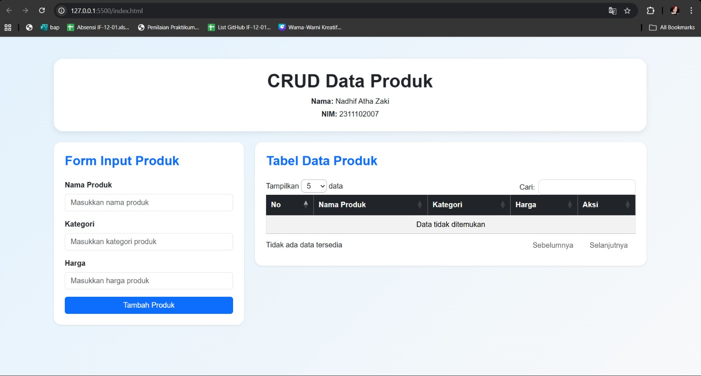
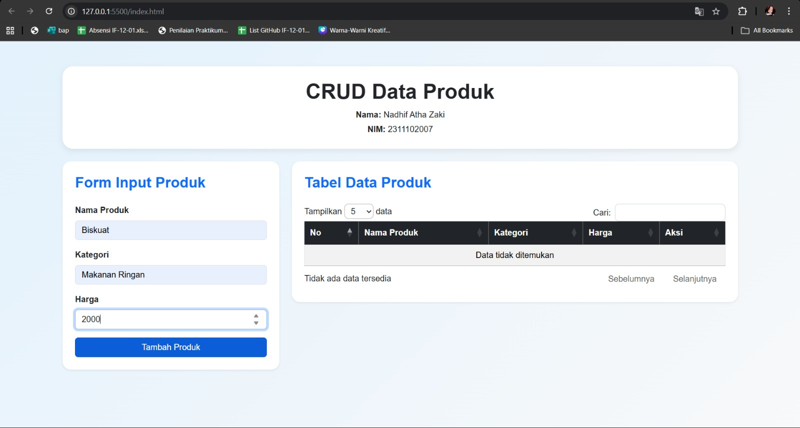
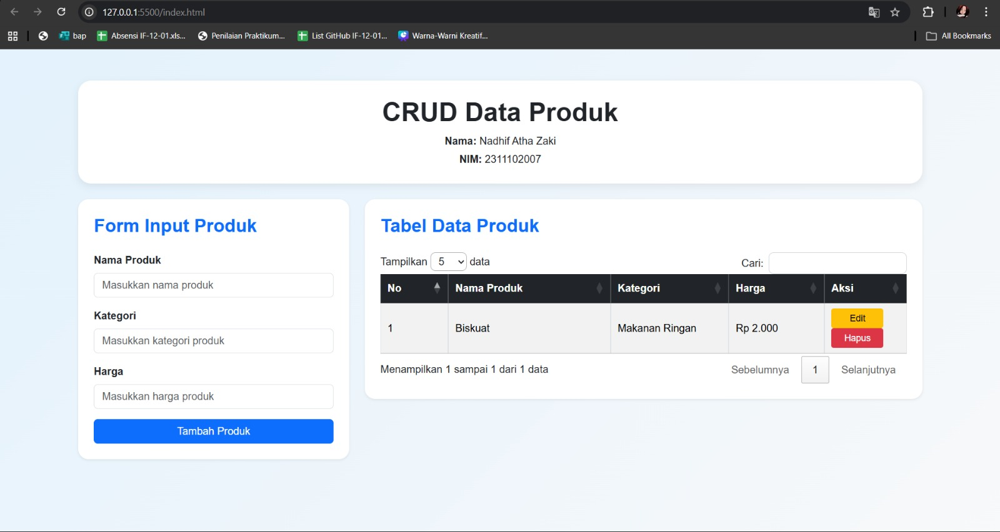
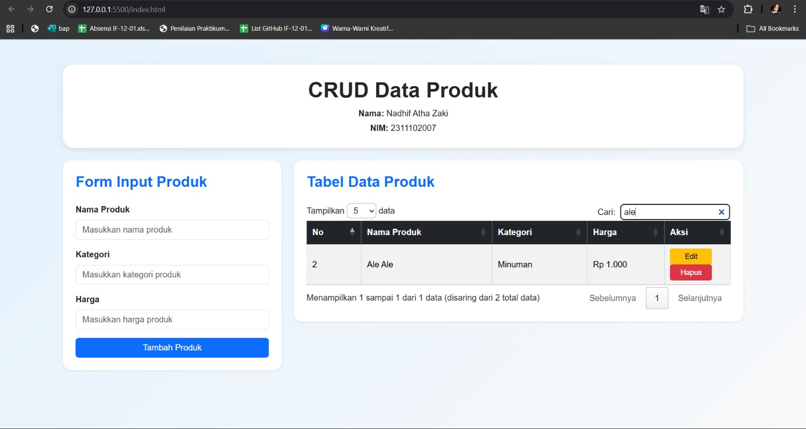
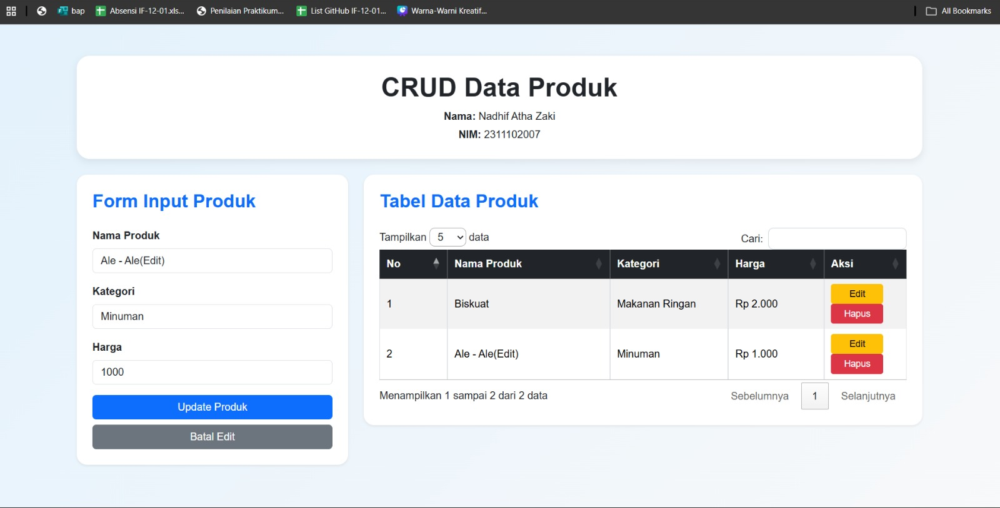
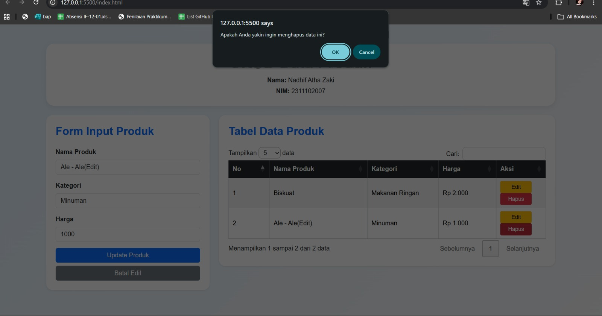

<div align="center">
  <br />
  <h1>LAPORAN PRAKTIKUM <br>APLIKASI BERBASIS PLATFORM</h1>
  <br />
  <h3>DATA PRODUK <br> Bootstrap, jQuery DataTables & JavaScript</h3>
  <br />
  <br />
  
  <br />
  <br />
  <h3>Disusun Oleh :</h3>
  <p>
    <strong>Nadhif Atha Zaki</strong><br>
    <strong>2311102007</strong><br>
    <strong>S1 IF-11-01</strong>
  </p>
  <br />
  <br />
  <h3>Dosen Pengampu :</h3>
  <p>
    <strong>Dimas Fanny Hebrasianto Permadi, S.ST., M.Kom</strong>
  </p>
  <br />
  <br />
  <h4>Asisten Praktikum :</h4>
  <strong>Apri Pandu Wicaksono</strong> <br>
  <strong>Rangga Pradarrell Fathi</strong>
  <br />
  <h3>LABORATORIUM HIGH PERFORMANCE
 <br>FAKULTAS INFORMATIKA <br>UNIVERSITAS TELKOM PURWOKERTO <br>2026</h3>
</div>

---

## 1. Dasar Teori

**CRUD (Create, Read, Update, Delete)** merupakan empat operasi utama yang digunakan untuk mengelola data dalam sebuah aplikasi. Pada pengembangan aplikasi web, konsep CRUD digunakan agar pengguna dapat menambahkan data, menampilkan data, memperbarui data, serta menghapus data secara dinamis. Proses ini dapat dilakukan di sisi klien (*client-side*) dengan bantuan JavaScript tanpa harus melakukan komunikasi langsung dengan server.

**Bootstrap** adalah framework CSS bersifat open-source yang menyediakan berbagai komponen antarmuka siap pakai, seperti form, tombol, modal, serta sistem grid yang responsif. Dengan adanya kumpulan kelas utilitas yang sudah terstandarisasi, Bootstrap membantu mempercepat proses pembuatan desain antarmuka pada aplikasi web.

**jQuery DataTables** merupakan plugin berbasis jQuery yang berfungsi untuk meningkatkan fitur pada elemen `<table>` HTML. Dengan menggunakan plugin ini, tabel dapat memiliki fitur tambahan seperti pencarian data (*search*), pengurutan data berdasarkan kolom (*sorting*), serta pembagian halaman (*pagination*) secara otomatis hanya melalui satu baris proses inisialisasi.

**Object Mapping** adalah metode penyimpanan data pada JavaScript yang menggunakan struktur objek. Dalam metode ini, setiap data disimpan sebagai nilai (*value*) dengan kunci (*key*) yang bersifat unik sebagai penanda identitas. Contohnya seperti `{ "p1": { id, nama, kategori, harga } }`. Pendekatan ini memudahkan proses akses, pembaruan, maupun penghapusan data dengan kompleksitas waktu O(1).

---

## 2. Penjelasan Kode HTML, CSS, dan JS


---

### Kode HTML (`index.html`)

```html
<!DOCTYPE html>
<html lang="id">
<head>
  <meta charset="UTF-8" />
  <meta name="viewport" content="width=device-width, initial-scale=1.0" />
  <title>CRUD Data Produk | Nadhif Atha Zaki</title>

  <!-- Bootstrap CSS -->
  <link
    href="https://cdn.jsdelivr.net/npm/bootstrap@5.3.3/dist/css/bootstrap.min.css"
    rel="stylesheet"
  />

  <!-- DataTables CSS -->
  <link
    rel="stylesheet"
    href="https://cdn.datatables.net/1.13.8/css/jquery.dataTables.min.css"
  />

  <!-- Custom CSS -->
  <link rel="stylesheet" href="style.css" />
</head>
<body>
  <div class="container py-5">
    <div class="header-box text-center mb-4">
      <h1 class="fw-bold mb-2">CRUD Data Produk</h1>
      <p class="mb-1"><strong>Nama:</strong> Nadhif Atha Zaki</p>
      <p class="mb-0"><strong>NIM:</strong> 2311102007</p>
    </div>

    <div class="row g-4">
      <!-- Form Input -->
      <div class="col-lg-4">
        <div class="card shadow-sm border-0 rounded-4">
          <div class="card-body p-4">
            <h3 class="card-title mb-4">Form Input Produk</h3>

            <form id="productForm">
              <input type="hidden" id="productId" />

              <div class="mb-3">
                <label for="namaProduk" class="form-label">Nama Produk</label>
                <input
                  type="text"
                  class="form-control"
                  id="namaProduk"
                  placeholder="Masukkan nama produk"
                  required
                />
              </div>

              <div class="mb-3">
                <label for="kategoriProduk" class="form-label">Kategori</label>
                <input
                  type="text"
                  class="form-control"
                  id="kategoriProduk"
                  placeholder="Masukkan kategori produk"
                  required
                />
              </div>

              <div class="mb-3">
                <label for="hargaProduk" class="form-label">Harga</label>
                <input
                  type="number"
                  class="form-control"
                  id="hargaProduk"
                  placeholder="Masukkan harga produk"
                  min="0"
                  required
                />
              </div>

              <div class="d-grid gap-2">
                <button type="submit" class="btn btn-primary" id="submitBtn">
                  Tambah Produk
                </button>
                <button type="button" class="btn btn-secondary" id="cancelEditBtn" style="display: none;">
                  Batal Edit
                </button>
              </div>
            </form>
          </div>
        </div>
      </div>

      <!-- Tabel Data -->
      <div class="col-lg-8">
        <div class="card shadow-sm border-0 rounded-4">
          <div class="card-body p-4">
            <h3 class="card-title mb-4">Tabel Data Produk</h3>

            <div class="table-responsive">
              <table id="productTable" class="table table-striped table-bordered align-middle">
                <thead class="table-dark">
                  <tr>
                    <th>No</th>
                    <th>Nama Produk</th>
                    <th>Kategori</th>
                    <th>Harga</th>
                    <th>Aksi</th>
                  </tr>
                </thead>
                <tbody>
                  <!-- Data akan diisi lewat JavaScript -->
                </tbody>
              </table>
            </div>
          </div>
        </div>
      </div>
    </div>
  </div>

  <!-- jQuery -->
  <script src="https://code.jquery.com/jquery-3.7.1.min.js"></script>

  <!-- Bootstrap JS -->
  <script src="https://cdn.jsdelivr.net/npm/bootstrap@5.3.3/dist/js/bootstrap.bundle.min.js"></script>

  <!-- DataTables JS -->
  <script src="https://cdn.datatables.net/1.13.8/js/jquery.dataTables.min.js"></script>

  <!-- Custom JS -->
  <script src="script.js"></script>
</body>
</html>
```

---

### Kode CSS (`style.css`)

```css
body {
  background: linear-gradient(135deg, #e3f2fd, #f8f9fa);
  min-height: 100vh;
  font-family: Arial, sans-serif;
}

.header-box {
  background-color: #ffffff;
  padding: 25px;
  border-radius: 20px;
  box-shadow: 0 4px 12px rgba(0, 0, 0, 0.08);
}

.card-title {
  font-weight: 700;
  color: #0d6efd;
}

.form-label {
  font-weight: 600;
}

.table td,
.table th {
  vertical-align: middle;
}

.btn-action {
  min-width: 80px;
}

.dataTables_wrapper .dataTables_filter input {
  margin-left: 8px;
  border-radius: 8px;
  border: 1px solid #ced4da;
  padding: 4px 8px;
}

.dataTables_wrapper .dataTables_length select {
  border-radius: 8px;
  padding: 4px 8px;
}
```

---

### Kode JavaScript (`script.js`)

```javascript
let products = {};
let productCounter = 1;
let dataTable;

$(document).ready(function () {
  dataTable = $("#productTable").DataTable({
    pageLength: 5,
    lengthMenu: [5, 10, 25, 50],
    language: {
      search: "Cari:",
      lengthMenu: "Tampilkan _MENU_ data",
      info: "Menampilkan _START_ sampai _END_ dari _TOTAL_ data",
      paginate: {
        first: "Awal",
        last: "Akhir",
        next: "Selanjutnya",
        previous: "Sebelumnya"
      },
      zeroRecords: "Data tidak ditemukan",
      infoEmpty: "Tidak ada data tersedia",
      infoFiltered: "(disaring dari _MAX_ total data)"
    }
  });

  renderTable();

  $("#productForm").on("submit", function (e) {
    e.preventDefault();

    const id = $("#productId").val();
    const nama = $("#namaProduk").val().trim();
    const kategori = $("#kategoriProduk").val().trim();
    const harga = $("#hargaProduk").val().trim();

    if (!nama || !kategori || !harga) {
      alert("Semua field harus diisi!");
      return;
    }

    if (id) {
      updateProduct(id, nama, kategori, harga);
    } else {
      createProduct(nama, kategori, harga);
    }

    resetForm();
    renderTable();
  });

  $("#cancelEditBtn").on("click", function () {
    resetForm();
  });
});

function createProduct(nama, kategori, harga) {
  const id = "p" + productCounter++;

  products[id] = {
    id: id,
    nama: nama,
    kategori: kategori,
    harga: parseInt(harga)
  };
}

function readProducts() {
  return Object.values(products);
}

function updateProduct(id, nama, kategori, harga) {
  if (products[id]) {
    products[id].nama = nama;
    products[id].kategori = kategori;
    products[id].harga = parseInt(harga);
  }
}

function deleteProduct(id) {
  if (products[id]) {
    delete products[id];
    renderTable();
  }
}

function renderTable() {
  dataTable.clear();

  const productList = readProducts();

  productList.forEach((product, index) => {
    dataTable.row.add([
      index + 1,
      product.nama,
      product.kategori,
      "Rp " + Number(product.harga).toLocaleString("id-ID"),
      `
        <button class="btn btn-warning btn-sm btn-action me-1" onclick="editProduct('${product.id}')">
          Edit
        </button>
        <button class="btn btn-danger btn-sm btn-action" onclick="confirmDelete('${product.id}')">
          Hapus
        </button>
      `
    ]);
  });

  dataTable.draw();
}

function editProduct(id) {
  const product = products[id];

  if (product) {
    $("#productId").val(product.id);
    $("#namaProduk").val(product.nama);
    $("#kategoriProduk").val(product.kategori);
    $("#hargaProduk").val(product.harga);

    $("#submitBtn").text("Update Produk");
    $("#cancelEditBtn").show();
  }
}

function confirmDelete(id) {
  const yakin = confirm("Apakah Anda yakin ingin menghapus data ini?");
  if (yakin) {
    deleteProduct(id);
  }
}

function resetForm() {
  $("#productForm")[0].reset();
  $("#productId").val("");
  $("#submitBtn").text("Tambah Produk");
  $("#cancelEditBtn").hide();
}
```

---

### Hasil Tampilan (Screenshot)

#### 1. Tampilan Awal Halaman



#### 2. Input Data & Data Berhasil Ditambahkan





#### 3. Fitur Pencarian (Search)



#### 4. Edit Data



#### 5. Hapus Data



---

### Penjelasan Kode

#### 1. HTML (`index.html`)

- Pada baris **4–7**, elemen `<meta charset="UTF-8">` memastikan teks dengan karakter khusus seperti huruf beraksen dapat ditampilkan dengan benar, sedangkan `<meta name="viewport">` membuat tampilan halaman menyesuaikan ukuran layar perangkat sehingga tetap responsif di desktop maupun perangkat mobile.

- Pada baris **10–17**, beberapa `<link>` digunakan untuk mengimpor dependensi eksternal yang diperlukan oleh halaman. Bootstrap CSS digunakan untuk menyediakan komponen antarmuka seperti grid, form, tombol, dan kartu (*card*). Sementara itu DataTables CSS digunakan untuk memberikan styling pada tabel agar mendukung fitur pencarian, pagination, dan pengurutan data.

- Pada baris **20**, file `style.css` diimpor sebagai stylesheet lokal yang berisi kustomisasi tampilan tambahan seperti latar belakang halaman, pengaturan font, serta penyesuaian tampilan tabel dan form.

- Pada baris **24–34**, elemen `<div class="header-box">` digunakan sebagai bagian header halaman yang menampilkan judul aplikasi **CRUD Data Produk** serta identitas mahasiswa yaitu **Nama: Nadhif Atha Zaki** dan **NIM: 2311102007**.

- Pada baris **38–84**, terdapat komponen **Form Input Produk** yang dibungkus dalam `<form id="productForm">`. Form ini berisi tiga field input yaitu **Nama Produk**, **Kategori**, dan **Harga**. Selain itu terdapat `<input type="hidden" id="productId">` yang digunakan untuk menyimpan ID produk ketika pengguna melakukan proses edit data.

- Pada baris **68–82**, terdapat dua tombol yaitu tombol **Tambah Produk** untuk menyimpan data ke dalam sistem serta tombol **Batal Edit** yang hanya muncul ketika pengguna sedang berada pada mode edit.

- Pada baris **90–115**, terdapat tabel `<table id="productTable">` yang digunakan untuk menampilkan data produk. Struktur tabel hanya memiliki `<thead>` sebagai header kolom yang berisi **No, Nama Produk, Kategori, Harga, dan Aksi**, sedangkan bagian `<tbody>` akan diisi secara dinamis menggunakan JavaScript.

- Pada baris **120–137**, beberapa `<script>` dimuat untuk menyediakan fungsionalitas halaman. jQuery dimuat terlebih dahulu karena DataTables bergantung padanya, kemudian Bootstrap JavaScript untuk komponen interaktif, plugin DataTables untuk fitur tabel, dan terakhir file `script.js` yang berisi seluruh logika CRUD aplikasi.

---

#### 2. CSS (`style.css`)

- Pada baris **1–6**, properti `body` mengatur latar belakang halaman menggunakan *linear gradient* agar tampilan terlihat lebih modern serta menetapkan tinggi minimum halaman menggunakan `min-height: 100vh`.

- Pada baris **8–14**, kelas `.header-box` digunakan untuk mempercantik bagian header dengan memberikan latar putih, *padding*, sudut melengkung (`border-radius`), dan bayangan lembut menggunakan `box-shadow`.

- Pada baris **16–20**, kelas `.card-title` mengubah warna judul pada setiap kartu Bootstrap agar lebih menonjol serta memberikan kesan visual yang konsisten.

- Pada baris **22–24**, kelas `.form-label` memberikan ketebalan huruf pada label form sehingga teks label lebih jelas dibaca oleh pengguna.

- Pada baris **26–31**, aturan `.table td` dan `.table th` memastikan isi tabel memiliki perataan vertikal di tengah sehingga tampilan data lebih rapi.

- Pada baris **33–35**, kelas `.btn-action` memberikan ukuran minimum pada tombol aksi agar tombol edit dan hapus memiliki ukuran yang konsisten.

- Pada baris **37–45**, aturan `.dataTables_wrapper` menyesuaikan tampilan elemen kontrol DataTables seperti kotak pencarian (*search box*) dan dropdown jumlah data sehingga lebih selaras dengan desain Bootstrap.

---

#### 3. JavaScript (`script.js`)

- Pada baris **1–3**, dua variabel global dideklarasikan yaitu `products` sebagai objek penyimpanan data produk menggunakan pola **mapping object**, serta `productCounter` yang berfungsi untuk menghasilkan ID unik setiap kali data baru ditambahkan.

- Pada baris **5–24**, fungsi `$(document).ready()` dari jQuery memastikan seluruh elemen HTML sudah dimuat sebelum JavaScript dijalankan. Pada bagian ini juga dilakukan inisialisasi **jQuery DataTables** pada tabel dengan pengaturan jumlah data per halaman, menu pagination, serta teks antarmuka berbahasa Indonesia.

- Pada baris **26**, fungsi `renderTable()` dipanggil pertama kali untuk menampilkan data awal ke dalam tabel meskipun data masih kosong.

- Pada baris **28–50**, event `submit` pada form menangkap data input dari pengguna. Nilai dari field **nama produk**, **kategori**, dan **harga** diambil menggunakan jQuery `.val()`. Jika terdapat nilai `productId`, maka fungsi `updateProduct()` akan dipanggil, sedangkan jika tidak ada maka fungsi `createProduct()` dijalankan untuk menambah data baru.

- Pada baris **52–60**, fungsi `createProduct()` membuat ID produk unik dengan format `"p" + productCounter`. Data produk kemudian disimpan ke dalam objek `products` dengan struktur `{ id, nama, kategori, harga }`.

- Pada baris **62–64**, fungsi `readProducts()` mengembalikan seluruh data produk menggunakan `Object.values(products)` sehingga objek mapping dapat diubah menjadi array untuk ditampilkan pada tabel.

- Pada baris **66–73**, fungsi `updateProduct()` memperbarui data produk yang sudah ada berdasarkan ID produk yang dipilih.

- Pada baris **75–82**, fungsi `deleteProduct()` menghapus data produk dari objek `products` menggunakan perintah `delete products[id]` lalu memanggil `renderTable()` untuk memperbarui tampilan tabel.

- Pada baris **84–110**, fungsi `renderTable()` bertugas menampilkan semua data produk ke dalam tabel DataTables. Fungsi ini terlebih dahulu menghapus seluruh baris tabel menggunakan `dataTable.clear()`, kemudian menambahkan baris baru menggunakan `dataTable.row.add()`.

- Pada baris **112–125**, fungsi `editProduct()` digunakan ketika tombol **Edit** ditekan. Fungsi ini mengambil data produk dari objek `products`, kemudian mengisi kembali field form agar pengguna dapat melakukan perubahan data.

- Pada baris **127–132**, fungsi `confirmDelete()` menampilkan dialog konfirmasi menggunakan `confirm()` sebelum data benar-benar dihapus.

- Pada baris **134–140**, fungsi `resetForm()` digunakan untuk mengosongkan semua field input setelah proses tambah atau edit data selesai, serta mengembalikan tombol ke kondisi awal.
---

## 3. Referensi

- [Bootstrap 5 Documentation](https://getbootstrap.com/docs/5.3/)
- [jQuery DataTables Documentation](https://datatables.net/manual/)
- [Bootstrap Icons](https://icons.getbootstrap.com/)
- [MDN Web Docs — JavaScript Array & Object Methods](https://developer.mozilla.org/en-US/docs/Web/JavaScript)
- [Google Fonts — Plus Jakarta Sans](https://fonts.google.com/specimen/Plus+Jakarta+Sans)