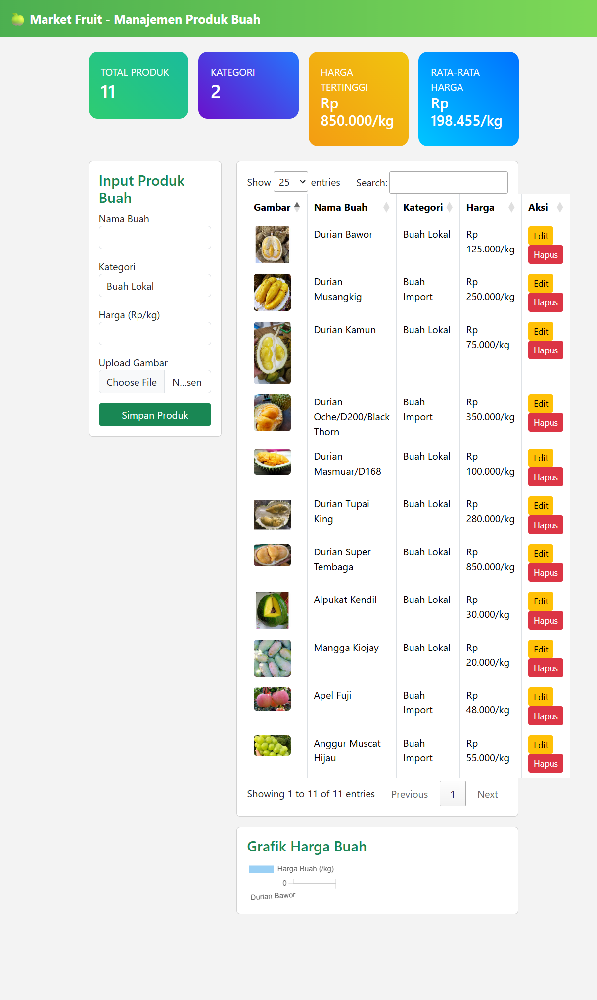
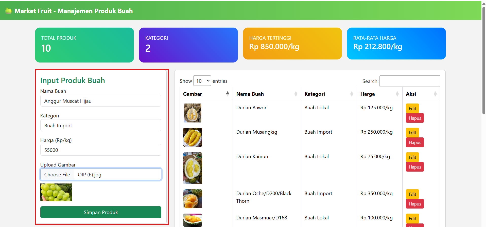
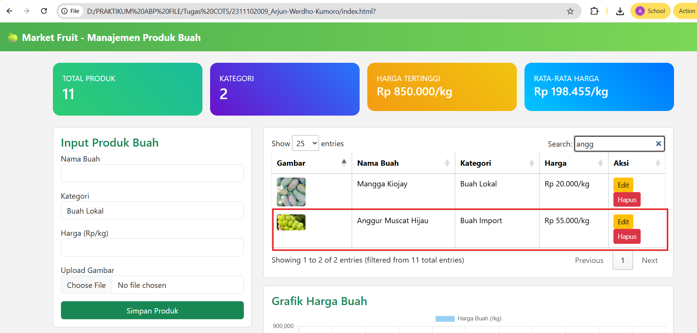
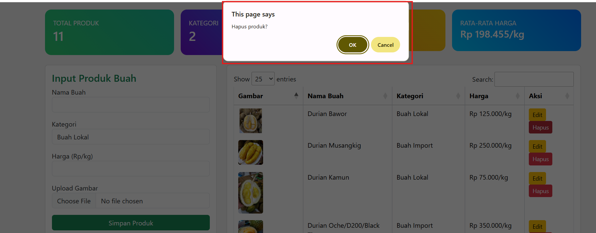
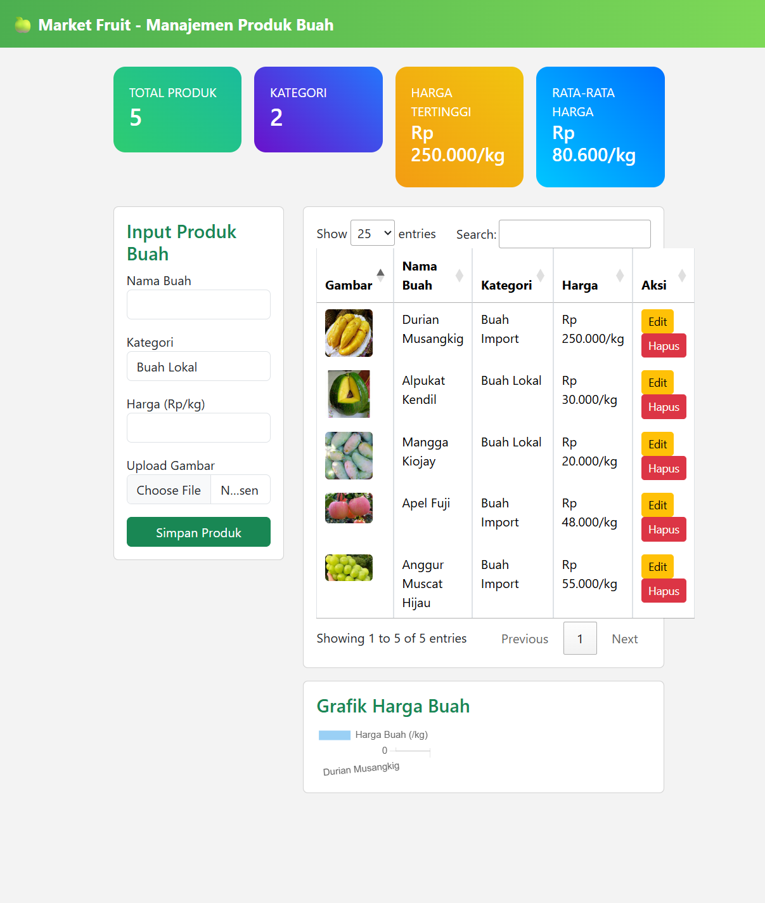
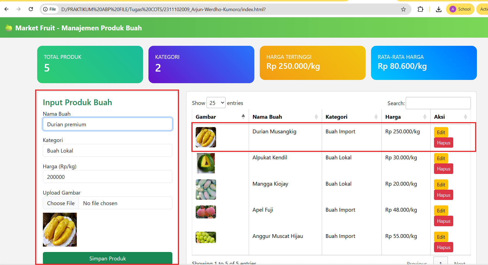
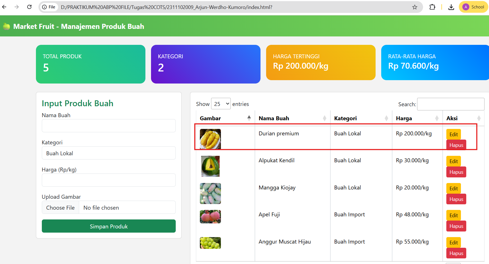

<div align="center">
  <br />
  <h1>LAPORAN PRAKTIKUM <br>APLIKASI BERBASIS PLATFORM</h1>
  <br />
  <h3>TUGAS 1 <br> COTS</h3>
  <br />
    
  <br /><br /><br />

  <h3>Disusun Oleh :</h3>
  <p>
    <strong>Arjun Werdho Kumoro</strong><br>
    <strong>2311102009</strong><br>
    <strong>IF-11-REG01</strong>
  </p>

  <br />

  <h3>Dosen Pengampu :</h3>
  <p>
    <strong>Dimas Fanny Hebrasianto Permadi, S.ST., M.Kom</strong>
  </p>

  <br />

  <h4>Asisten Praktikum :</h4>
  <strong>Apri Pandu Wicaksono</strong><br>
  <strong>Rangga Pradarrell Fathi</strong>

  <br /><br />

  <h3>
  LABORATORIUM HIGH PERFORMANCE <br>
  FAKULTAS INFORMATIKA <br>
  UNIVERSITAS TELKOM PURWOKERTO <br>
  2026
  </h3>
</div>

---

# DASAR TEORI

HTML (HyperText Markup Language) merupakan bahasa markup yang digunakan untuk membuat struktur dasar sebuah halaman web. HTML berfungsi untuk mengatur elemen-elemen yang terdapat pada halaman seperti judul, paragraf, gambar, tabel, form, dan berbagai komponen lainnya. Dengan menggunakan tag-tag tertentu seperti `<html>`, `<head>`, `<body>`, `<div>`, dan `<table>`, HTML dapat menyusun kerangka tampilan sebuah website sehingga dapat ditampilkan oleh browser. HTML menjadi fondasi utama dalam pengembangan web karena semua halaman web pada dasarnya dibangun menggunakan struktur HTML.

CSS (Cascading Style Sheets) adalah bahasa yang digunakan untuk mengatur tampilan dan desain halaman web agar lebih menarik dan rapi. CSS memungkinkan pengembang web untuk mengatur warna, ukuran teks, jenis font, tata letak, jarak antar elemen, serta berbagai efek visual lainnya. Dengan CSS, tampilan halaman web dapat dibuat lebih konsisten dan responsif. CSS biasanya digunakan bersama HTML untuk memisahkan antara struktur halaman dan desain tampilan, sehingga memudahkan proses pengelolaan dan pengembangan website.

JavaScript (JS) merupakan bahasa pemrograman yang digunakan untuk menambahkan interaksi dan fungsi dinamis pada halaman web. Dengan JavaScript, halaman web dapat merespons tindakan pengguna seperti klik tombol, pengisian form, maupun perubahan data secara langsung tanpa harus memuat ulang halaman. JavaScript juga sering digunakan untuk memanipulasi elemen HTML, melakukan validasi form, menampilkan animasi, serta mengolah data yang ditampilkan pada halaman web sehingga website menjadi lebih interaktif.

Bootstrap adalah framework CSS yang digunakan untuk mempermudah pembuatan tampilan website yang responsif dan modern. Bootstrap menyediakan berbagai komponen siap pakai seperti navbar, card, button, form, grid system, dan tabel yang dapat langsung digunakan oleh pengembang. Dengan menggunakan Bootstrap, proses pembuatan tampilan website menjadi lebih cepat dan konsisten di berbagai ukuran layar, baik pada komputer, tablet, maupun perangkat mobile.

jQuery merupakan library JavaScript yang dirancang untuk menyederhanakan penggunaan JavaScript dalam pengembangan web. jQuery mempermudah proses manipulasi elemen HTML, pengolahan event, animasi, serta komunikasi dengan server menggunakan AJAX. Dengan sintaks yang lebih sederhana dibandingkan JavaScript murni, jQuery membantu pengembang menulis kode yang lebih singkat dan mudah dipahami. Library ini juga sering digunakan bersama plugin lain seperti DataTables untuk menambahkan fitur interaktif pada tabel data di dalam halaman web.


---

# UNGUIDED

## Code HTML

```html
<!DOCTYPE html>
<html lang="id">
<head>
<meta charset="UTF-8">
<title>Market Fruit - Manajemen Produk Buah</title>

<link href="https://cdn.jsdelivr.net/npm/bootstrap@5.3.2/dist/css/bootstrap.min.css" rel="stylesheet">

<link rel="stylesheet" href="https://cdn.datatables.net/1.13.6/css/jquery.dataTables.min.css">

<script src="https://cdn.jsdelivr.net/npm/chart.js"></script>

<style>

body{
background:#f3f3f3;
}

.header{
background:linear-gradient(90deg,#4CAF50,#7ED957);
color:white;
padding:15px;
font-size:20px;
font-weight:bold;
}

.card-stat{
color:white;
border-radius:15px;
padding:20px;
}

.stat1{background:linear-gradient(45deg,#2ecc71,#1abc9c);}
.stat2{background:linear-gradient(45deg,#6a11cb,#2575fc);}
.stat3{background:linear-gradient(45deg,#f39c12,#f1c40f);}
.stat4{background:linear-gradient(45deg,#00c6ff,#0072ff);}

.table img{
width:60px;
border-radius:5px;
}

#preview{
width:100px;
margin-top:10px;
display:none;
}

</style>
</head>

<body>

<div class="header">
🍏 Market Fruit - Manajemen Produk Buah
</div>

<div class="container mt-4">

<!-- STATISTIK -->
<div class="row g-3 mb-4">

<div class="col-md-3">
<div class="card-stat stat1">
TOTAL PRODUK
<h2 id="totalProduk">0</h2>
</div>
</div>

<div class="col-md-3">
<div class="card-stat stat2">
KATEGORI
<h2 id="totalKategori">0</h2>
</div>
</div>

<div class="col-md-3">
<div class="card-stat stat3">
HARGA TERTINGGI
<h4 id="hargaMax">Rp 0/kg</h4>
</div>
</div>

<div class="col-md-3">
<div class="card-stat stat4">
RATA-RATA HARGA
<h4 id="hargaAvg">Rp 0/kg</h4>
</div>
</div>

</div>

<div class="row">

<!-- FORM -->
<div class="col-md-4">

<div class="card p-3">

<h4 class="text-success">Input Produk Buah</h4>

<form id="fruitForm">

<input type="hidden" id="editId">

<div class="mb-3">
<label>Nama Buah</label>
<input type="text" id="nama" class="form-control" required>
</div>

<div class="mb-3">
<label>Kategori</label>
<select id="kategori" class="form-control">
<option>Buah Lokal</option>
<option>Buah Import</option>
</select>
</div>

<div class="mb-3">
<label>Harga (Rp/kg)</label>
<input type="number" id="harga" class="form-control" required>
</div>

<div class="mb-3">
<label>Upload Gambar</label>
<input type="file" id="gambar" class="form-control">

</div>

<button class="btn btn-success w-100">Simpan Produk</button>

</form>

</div>

</div>

<!-- TABEL -->
<div class="col-md-8">

<div class="card p-3 mb-3">

<table id="fruitTable" class="table table-bordered">

<thead>
<tr>
<th>Gambar</th>
<th>Nama Buah</th>
<th>Kategori</th>
<th>Harga</th>
<th>Aksi</th>
</tr>
</thead>

<tbody></tbody>

</table>

</div>

<!-- GRAFIK -->

<div class="card p-3">

<h4 class="text-success">Grafik Harga Buah</h4>

<canvas id="fruitChart"></canvas>

</div>

</div>

</div>

</div>

<script src="https://code.jquery.com/jquery-3.7.0.min.js"></script>

<script src="https://cdn.datatables.net/1.13.6/js/jquery.dataTables.min.js"></script>

<script>

let dataProduk = JSON.parse(localStorage.getItem("buah")) || {};

let table;
let chart;

$(document).ready(function(){

table = $('#fruitTable').DataTable();

renderTable();


// preview gambar
$('#gambar').change(function(){

let file=this.files[0];

if(file){

let reader=new FileReader();

reader.onload=function(e){

$('#preview').attr("src",e.target.result).show();

}

reader.readAsDataURL(file);

}

});


// submit form
$('#fruitForm').submit(function(e){

e.preventDefault();

let id=$('#editId').val();
let nama=$('#nama').val();
let kategori=$('#kategori').val();
let harga=$('#harga').val();

let file=$('#gambar')[0].files[0];

let reader=new FileReader();

reader.onload=function(e){

let img=e.target.result;

if(id==""){

let newId=Date.now();

dataProduk[newId]={nama,kategori,harga,img};

}else{

dataProduk[id]={nama,kategori,harga,img};

}

saveData();
renderTable();
resetForm();

}

if(file){

reader.readAsDataURL(file);

}else{

let img="";

if(id!="" && dataProduk[id].img){
img=dataProduk[id].img;
}

if(id==""){
let newId=Date.now();
dataProduk[newId]={nama,kategori,harga,img};
}else{
dataProduk[id]={nama,kategori,harga,img};
}

saveData();
renderTable();
resetForm();

}

});

});


function renderTable(){

table.clear();

let hargaList=[];
let kategoriSet=new Set();

for(let id in dataProduk){

let p=dataProduk[id];

hargaList.push(parseInt(p.harga));
kategoriSet.add(p.kategori);

table.row.add([

p.img?``:"",

p.nama,

p.kategori,

"Rp "+parseInt(p.harga).toLocaleString("id-ID")+"/kg",

`
<button class="btn btn-warning btn-sm" onclick="editProduk('${id}')">Edit</button>
<button class="btn btn-danger btn-sm" onclick="hapusProduk('${id}')">Hapus</button>
`

]);

}

table.draw();

updateStat(hargaList,kategoriSet);

updateChart();

}


function editProduk(id){

let p=dataProduk[id];

$('#editId').val(id);
$('#nama').val(p.nama);
$('#kategori').val(p.kategori);
$('#harga').val(p.harga);

if(p.img){
$('#preview').attr("src",p.img).show();
}

}


function hapusProduk(id){

if(confirm("Hapus produk?")){

delete dataProduk[id];

saveData();
renderTable();

}

}


function saveData(){

localStorage.setItem("buah",JSON.stringify(dataProduk));

}


function resetForm(){

$('#fruitForm')[0].reset();
$('#editId').val("");
$('#preview').hide();

}


function updateStat(hargaList,kategoriSet){

$('#totalProduk').text(Object.keys(dataProduk).length);

$('#totalKategori').text(kategoriSet.size);

if(hargaList.length>0){

let max=Math.max(...hargaList);

let avg=hargaList.reduce((a,b)=>a+b,0)/hargaList.length;

$('#hargaMax').text("Rp "+max.toLocaleString("id-ID")+"/kg");

$('#hargaAvg').text("Rp "+Math.round(avg).toLocaleString("id-ID")+"/kg");

}

}


function updateChart(){

let labels=[];
let data=[];

for(let id in dataProduk){

labels.push(dataProduk[id].nama);

data.push(dataProduk[id].harga);

}

if(chart){
chart.destroy();
}

chart=new Chart(document.getElementById('fruitChart'),{

type:'bar',

data:{
labels:labels,
datasets:[{
label:'Harga Buah (/kg)',
data:data
}]
}

});

}

</script>

</body>
</html>
```


## Output

### 1. Tampilan Awal Dashboard

Tampilan Dashboard Awal “Market Fruit – Manajemen Produk Buah” merupakan halaman utama yang digunakan untuk mengelola data produk buah. Pada bagian paling atas terdapat header berwarna hijau yang menampilkan judul aplikasi, yaitu Market Fruit – Manajemen Produk Buah. Bagian ini berfungsi sebagai identitas sistem dan memberikan gambaran bahwa halaman tersebut digunakan untuk mengelola data produk buah.

Di bawah header terdapat empat card statistik yang menampilkan ringkasan data produk. Card pertama adalah Total Produk yang menunjukkan jumlah seluruh produk buah yang tersimpan dalam sistem. Card kedua adalah Kategori yang menampilkan jumlah kategori buah yang tersedia, misalnya buah lokal dan buah impor. Card ketiga adalah Harga Tertinggi, yang menunjukkan harga buah paling mahal per kilogram dari seluruh data yang ada. Card keempat adalah Rata-rata Harga, yang menampilkan nilai rata-rata harga semua buah yang telah dimasukkan ke dalam sistem. Keempat card ini membantu pengguna melihat informasi penting secara cepat tanpa harus melihat tabel data.

Pada bagian kiri halaman terdapat form input produk buah yang digunakan untuk menambahkan data buah baru. Form ini terdiri dari beberapa field yaitu Nama Buah, Kategori, Harga (Rp/kg), dan Upload Gambar. Pengguna dapat mengisi nama buah, memilih kategori buah lokal atau impor, memasukkan harga per kilogram, serta mengunggah gambar buah. Setelah semua data diisi, pengguna dapat menekan tombol Simpan Produk untuk menambahkan data ke dalam sistem.

Di sebelah kanan form terdapat tabel data produk buah yang menampilkan seluruh data buah yang telah dimasukkan. Tabel ini berisi beberapa kolom yaitu Gambar, Nama Buah, Kategori, Harga, dan Aksi. Kolom gambar menampilkan foto buah, kolom nama buah berisi nama produk, kolom kategori menunjukkan jenis buah apakah lokal atau impor, dan kolom harga menampilkan harga buah per kilogram dalam format rupiah. Pada kolom aksi terdapat dua tombol yaitu Edit untuk mengubah data produk dan Hapus untuk menghapus data produk dari tabel. Tabel ini menggunakan fitur DataTables sehingga memiliki fasilitas pencarian (search), pengaturan jumlah data yang ditampilkan, serta pagination untuk memudahkan navigasi data.

Pada bagian paling bawah dashboard terdapat grafik harga buah yang menampilkan perbandingan harga setiap buah dalam bentuk grafik batang. Grafik ini membantu pengguna untuk melihat visualisasi harga buah secara lebih jelas dan memudahkan dalam membandingkan harga antar produk. Grafik akan diperbarui secara otomatis ketika ada penambahan, pengeditan, atau penghapusan data produk. Secara keseluruhan, dashboard ini berfungsi sebagai pusat pengelolaan data buah yang menyediakan fitur CRUD (Create, Read, Update, Delete) serta menampilkan informasi data dalam bentuk tabel dan grafik agar lebih mudah dipahami oleh pengguna.

### 2. Tampilan membuat produk baru

Menambahkan produk baru yaitu Anggur Muscat Hijau, kategori buah import dengan harga 55.000
 
Data berhasil di tambahkan/dibuat.

### 3. Tampilan hapus produk
Menghapus 6 produk yaitu Durian Bawor, Durian Kamun, Durian Oche/D200/Black Thorn, Durian Masmuar/D168, Durian tupai King, dan Durian Super Tembaga

Tampilan terbaru dashboard setelah menghapus beberapa item


### 4. Tampilan edit produk
Edit Produk Nama buah Durian Musangking diganti dengan Durian Premium, kemudian untuk kategori di ubah dari import ke lokal dan harganya dari 250.00/kg menjadi200.000/kg  kemudian update dengan kliksimpan produk

Hasil setelah edit produk 



# Penjelasan

Kode halaman “Market Fruit – Manajemen Produk Buah” dibuat menggunakan kombinasi HTML, CSS, JavaScript, Bootstrap, jQuery, DataTables, dan Chart.js untuk membuat aplikasi web sederhana yang dapat mengelola data produk buah. Pada bagian awal kode terdapat struktur dasar HTML yang dimulai dengan `<!DOCTYPE html>` yang menandakan bahwa halaman menggunakan standar HTML5. Di dalam bagian `<head>` terdapat beberapa library yang dipanggil seperti Bootstrap yang digunakan untuk mempercantik tampilan halaman, DataTables untuk menambahkan fitur pencarian (search), pagination, dan pengurutan pada tabel, serta Chart.js yang digunakan untuk menampilkan grafik harga buah. Selain itu terdapat juga bagian CSS yang digunakan untuk mengatur tampilan halaman seperti warna background, desain card statistik, serta ukuran gambar yang ditampilkan pada tabel.

Pada bagian body halaman terdapat header dengan judul “Market Fruit – Manajemen Produk Buah” yang berfungsi sebagai identitas aplikasi. Di bawah header terdapat empat buah card statistik yang menampilkan informasi penting yaitu total produk, jumlah kategori, harga tertinggi, dan rata-rata harga. Nilai dari statistik tersebut akan berubah secara otomatis berdasarkan data produk yang dimasukkan oleh pengguna. Selanjutnya terdapat form input produk yang berfungsi untuk memasukkan data buah yang terdiri dari nama buah, kategori buah, harga per kilogram, serta upload gambar buah. Ketika pengguna memilih gambar, sistem akan menampilkan preview gambar sebelum data disimpan agar pengguna dapat melihat gambar yang akan diunggah.

Setelah form input, terdapat tabel data produk yang digunakan untuk menampilkan seluruh data buah yang telah dimasukkan. Tabel ini menggunakan plugin jQuery DataTables sehingga memiliki fitur pencarian data, pagination, dan pengurutan data secara otomatis. Setiap baris tabel menampilkan gambar buah, nama buah, kategori, harga dalam format rupiah per kilogram seperti Rp 120.000/kg, serta tombol aksi berupa Edit dan Hapus. Tombol edit digunakan untuk mengubah data produk yang sudah ada, sedangkan tombol hapus digunakan untuk menghapus data produk dari daftar.

Pada bagian JavaScript, sistem menggunakan object mapping untuk menyimpan data produk dalam bentuk objek dengan struktur key dan value. Setiap produk disimpan menggunakan ID unik yang dihasilkan dari Date.now(). Data tersebut kemudian disimpan ke dalam LocalStorage browser sehingga data tidak akan hilang meskipun halaman direfresh. Fungsi renderTable() digunakan untuk menampilkan data produk ke dalam tabel, sedangkan fungsi saveData() digunakan untuk menyimpan data produk ke LocalStorage. Selain itu terdapat juga fungsi updateStat() yang berfungsi untuk menghitung jumlah produk, jumlah kategori, harga tertinggi, dan rata-rata harga berdasarkan data yang ada.

Terakhir, sistem juga menampilkan grafik harga buah menggunakan Chart.js yang menampilkan perbandingan harga setiap buah dalam bentuk grafik batang. Grafik ini akan diperbarui secara otomatis setiap kali data produk ditambahkan, diedit, atau dihapus. Dengan demikian, halaman web ini telah memenuhi fungsi CRUD sederhana (Create, Read, Update, Delete) serta menampilkan data secara interaktif menggunakan tabel DataTables dan grafik visualisasi harga buah.