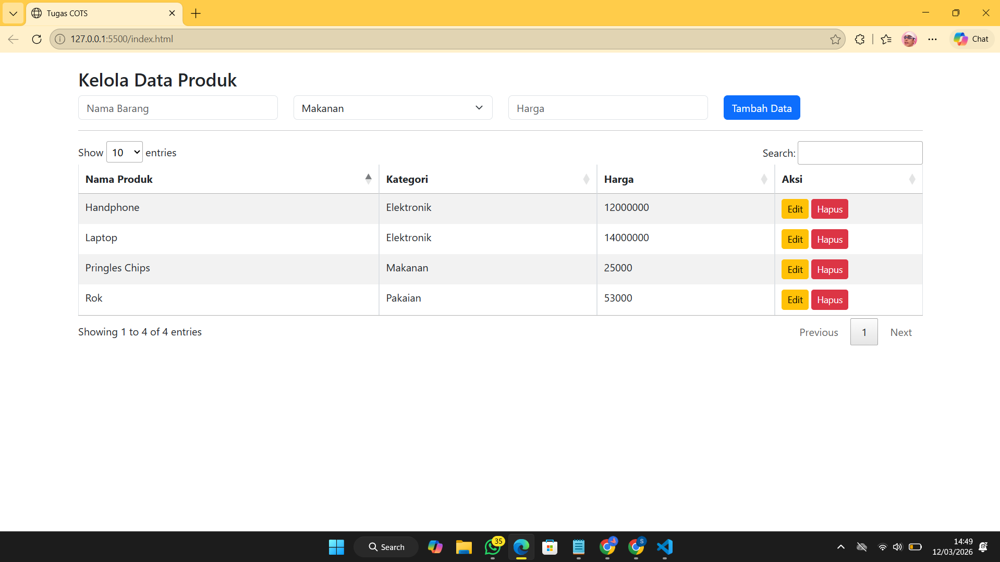

<div align="center">

# LAPORAN PRAKTIKUM
# APLIKASI BERBASIS PLATFORM

## Tugas COTS


**Disusun Oleh :**

**Sherine Naura Early Gunawan**

**2311102020**

**S1 IF-11-REG01**

**Dosen Pengampu :**

Dimas Fanny Hebrasianto Permadi, S.ST., M.Kom

**PROGRAM STUDI S1 INFORMATIKA**

**FAKULTAS INFORMATIKA**

**UNIVERSITAS TELKOM PURWOKERTO**

**2025/2026**

</div>

---

## 1. Source code

```html
<!DOCTYPE html>
<html>

<head>
    <title>Tugas COTS</title>
    <link href="https://cdn.jsdelivr.net/npm/bootstrap@5.3.0/dist/css/bootstrap.min.css" rel="stylesheet">
    <link rel="stylesheet" href="https://cdn.datatables.net/1.13.4/css/jquery.dataTables.min.css">
</head>

<body class="container mt-4">

    <h3>Kelola Data Produk</h3>
    <div class="row mb-3">
        <div class="col">
            <input type="text" id="inputNama" class="form-control" placeholder="Nama Barang">
        </div>
        <div class="col">
            <select id="inputKategori" class="form-select">
                <option value="Elektronik">Elektronik</option>
                <option value="Pakaian">Pakaian</option>
                <option value="Makanan">Makanan</option>
            </select>
        </div>
        <div class="col">
            <input type="number" id="inputHarga" class="form-control" placeholder="Harga">
        </div>
        <div class="col">
            <button id="tombolSimpan" class="btn btn-primary">Tambah Data</button>
        </div>
    </div>

    <hr>

    <table id="tabelProduk" class="table table-striped table-bordered">
        <thead>
            <tr>
                <th>Nama Produk</th>
                <th>Kategori</th>
                <th>Harga</th>
                <th>Aksi</th>
            </tr>
        </thead>
        <tbody></tbody>
    </table>

    <script src="https://code.jquery.com/jquery-3.6.0.min.js"></script>
    <script src="https://cdn.datatables.net/1.13.4/js/jquery.dataTables.min.js"></script>

    <script>
        $(document).ready(function () {
            var tabel = $('#tabelProduk').DataTable();
            var barisDiedit = null; // Buat nandain baris mana yang lagi diedit

            $('#tombolSimpan').on('click', function () {
                var nm = $('#inputNama').val();
                var kt = $('#inputKategori').val();
                var hg = $('#inputHarga').val();

                if (nm == "" || hg == "") {
                    alert("Isi dulu semua barisnya!");
                    return;
                }

                // Cek lagi mode edit atau tambah
                if (barisDiedit == null) {
                    // MODE TAMBAH
                    tabel.row.add([
                        nm, kt, hg,
                        '<button class="btn btn-warning btn-sm btnEdit">Edit</button> ' +
                        '<button class="btn btn-danger btn-sm btnHapus">Hapus</button>'
                    ]).draw();
                } else {
                    // MODE UPDATE (Ganti data di baris yang tadi diklik)
                    tabel.row(barisDiedit).data([
                        nm, kt, hg,
                        '<button class="btn btn-warning btn-sm btnEdit">Edit</button> ' +
                        '<button class="btn btn-danger btn-sm btnHapus">Hapus</button>'
                    ]).draw();

                    barisDiedit = null;
                    $(this).text('Tambah Data').removeClass('btn-info').addClass('btn-primary');
                }

                // Reset input
                $('#inputNama').val('');
                $('#inputHarga').val('');
            });

            // Fungsi Tombol Hapus
            $('#tabelProduk tbody').on('click', '.btnHapus', function () {
                tabel.row($(this).parents('tr')).remove().draw();
            });

            // Fungsi Tombol Edit
            $('#tabelProduk tbody').on('click', '.btnEdit', function () {
                barisDiedit = $(this).parents('tr'); // Tandain barisnya
                var data = tabel.row(barisDiedit).data(); // Ambil data di baris itu

                // Masukin balik ke inputan atas
                $('#inputNama').val(data[0]);
                $('#inputKategori').val(data[1]);
                $('#inputHarga').val(data[2]);

                // Ganti tulisan tombol biar keren dikit
                $('#tombolSimpan').text('Update Data').removeClass('btn-primary').addClass('btn-info');
            });
        });
    </script>
</body>
</html>
```
### Penjelasan kode

Secara keseluruhan, halaman ini dirancang sebagai aplikasi pengelolaan data produk yang bersifat client-side.
Artinya, semua proses penyimpanan dan manipulasi data terjadi langsung di browser tanpa memerlukan database di server.
Program ini memanfaatkan Bootstrap 5 untuk standarisasi tampilan agar responsif, serta plugin jQuery DataTables untuk
memberikan kecanggihan pada tabel statis sehingga memiliki fitur pencarian, pengurutan, dan pembagian halaman secara
otomatis.
1. Create (Tambah Data)
Proses ini terjadi saat data dimasukkan melalui form input. Begitu tombol "Tambah Data" diklik, sistem menangkap nilai
dari inputan Nama, Kategori, dan Harga, lalu memasukkannya sebagai baris baru ke dalam tabel menggunakan fungsi
.row.add().
2. Read (Menampilkan Data)
Fungsi Read dijalankan secara otomatis oleh library DataTables. Setiap data yang berhasil ditambahkan akan langsung
dirender ke dalam tabel. Plugin ini juga menyediakan fitur pencarian dan navigasi halaman sehingga user bisa membaca dan
mencari data produk dengan sangat cepat meskipun jumlah datanya banyak.
3. Update (Ubah Data)
Fitur ini bekerja dengan memanfaatkan variabel penanda barisDiedit. Saat tombol Edit di baris tertentu diklik, data pada
baris tersebut akan "dilempar" kembali ke kotak input di atas agar bisa diperbaiki. Setelah diubah, tombol simpan akan
menimpa data baris lama menggunakan perintah .data().draw().
4. Delete (Hapus Data)
Operasi ini memungkinkan penghapusan baris data tertentu. Program akan mencari elemen induk berupa baris (tr)
berdasarkan tombol hapus yang diklik, kemudian menghapusnya secara permanen dari tampilan tabel menggunakan perintah
.remove().draw().

---

## 3. Hasil

<div align="center">
    
</div>