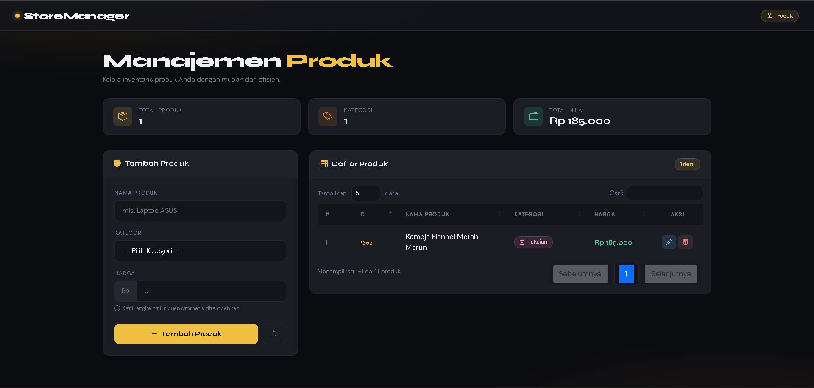
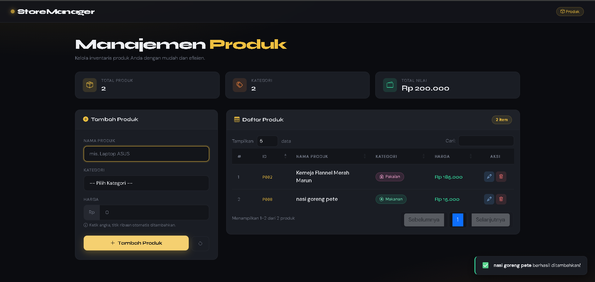
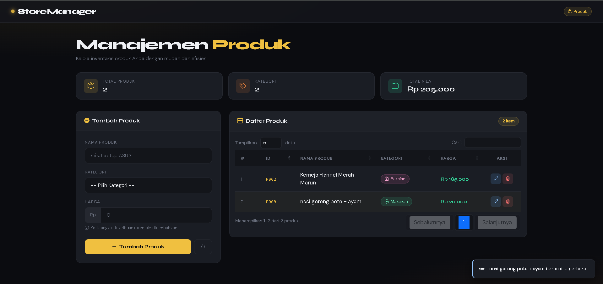
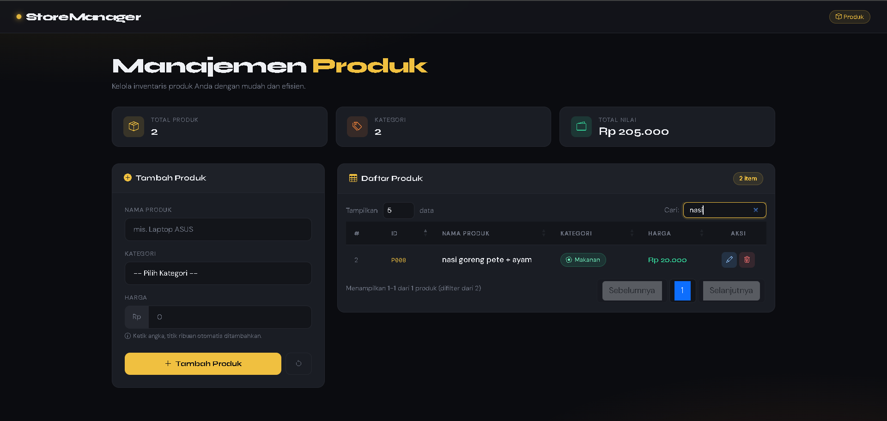
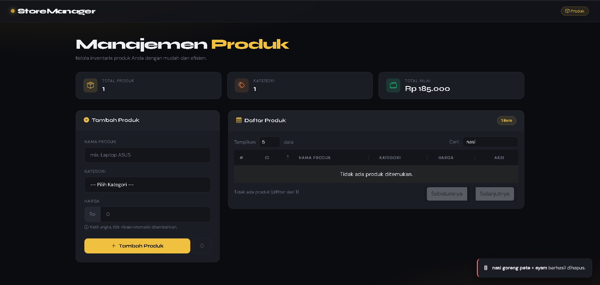

<div align="center">

# LAPORAN TUGAS
# APLIKASI BERBASIS PLATFORM

---

## TUGAS COTS
## MANAJEMEN PRODUK DENGAN JQUERY DATATABLE

---


---

**Disusun Oleh :**

**TEGAR BANGKIT WIJAYA**

**2311102027**

**S1 IF-11-REG01**

---

**Dosen Pengampu :**

Dimas Fanny Hebrasianto Permadi, S.ST., M.Kom

---

**PROGRAM STUDI S1 INFORMATIKA**

**FAKULTAS INFORMATIKA**

**UNIVERSITAS TELKOM PURWOKERTO**

**2025/2026**

</div>

---

## 1. Dasar Teori

### Bootstrap 5
Bootstrap 5 adalah framework front-end berbasis CSS dan JavaScript yang dikembangkan oleh Twitter dan kini dikelola sebagai proyek open-source. Framework ini menyediakan sistem grid 12 kolom yang responsif, komponen UI siap pakai, serta utilitas CSS yang memudahkan pembuatan tampilan halaman web modern tanpa perlu menulis CSS dari nol. Pada tugas ini Bootstrap 5 digunakan untuk mengatur layout halaman menggunakan grid system dengan class `col-lg-4` dan `col-lg-8`, styling form input dan select, tampilan modal edit produk, serta responsivitas halaman pada berbagai ukuran layar. Bootstrap di-import menggunakan CDN `jsdelivr.net` sehingga tidak perlu mengunduh file secara lokal.

### jQuery
jQuery adalah library JavaScript yang menyederhanakan interaksi dengan DOM (Document Object Model), penanganan event, animasi, dan manipulasi elemen HTML. jQuery memungkinkan penulisan kode JavaScript yang lebih ringkas dan mudah dibaca. Pada tugas ini jQuery digunakan secara intensif untuk inisialisasi DataTable, penanganan event klik tombol Tambah, Reset, dan Simpan Edit, serta binding event input pada field harga agar angka diformat otomatis dengan titik ribuan menggunakan fungsi `bindHargaInput()`. Semua operasi DOM pada halaman ini berjalan di atas jQuery.

### jQuery DataTable
jQuery DataTable adalah plugin jQuery yang paling banyak digunakan untuk menampilkan data tabular secara interaktif di halaman web. Plugin ini mengubah elemen `<table>` HTML biasa menjadi tabel canggih dengan fitur lengkap yang berjalan di sisi client. Pada tugas ini DataTable diinisialisasi menggunakan pendekatan column-based dengan mendefinisikan setiap kolom melalui properti `columns` yang masing-masing memiliki `data`, `orderable`, dan `className`. Fitur-fitur DataTable yang aktif digunakan antara lain:
- **Search** untuk memfilter data secara real-time berdasarkan kata kunci yang diketik pada kolom pencarian
- **Pagination** untuk membagi daftar produk ke dalam beberapa halaman dengan pilihan 5, 10, 25, atau Semua data per halaman
- **Sorting** untuk mengurutkan data berdasarkan kolom yang diklik, kecuali kolom No dan Aksi yang dinonaktifkan dengan `orderable: false`
- **drawCallback** adalah callback khusus yang dipanggil setiap kali tabel selesai di-render, digunakan untuk memperbarui nomor urut pada kolom pertama agar selalu berurutan sesuai halaman yang aktif

### Object Mapping sebagai Data Store
Pada tugas ini data produk tidak disimpan ke database melainkan menggunakan JavaScript object biasa sebagai in-memory data store. Object mapping dipilih karena memungkinkan akses data berdasarkan key secara langsung dengan kompleksitas O(1), sehingga operasi CRUD menjadi sangat efisien. Struktur penyimpanannya adalah `{ "P001": { id, nama, kat, harga }, "P002": {...}, ... }` dimana setiap key adalah ID produk yang di-generate otomatis menggunakan fungsi `newId()` dengan format `P001`, `P002`, dan seterusnya menggunakan `String.padStart(3,'0')`. Operasi CRUD pada object mapping ini adalah:
- **Create** — `store[id] = { id, nama, kat, harga }` untuk menyimpan produk baru
- **Read** — `Object.values(store)` untuk membaca semua produk, `store[id]` untuk satu produk
- **Update** — `store[id] = { ...data baru }` untuk mengganti data produk yang sudah ada
- **Delete** — `delete store[id]` untuk menghapus produk berdasarkan ID

### Format Harga Otomatis
Salah satu fitur menarik pada tugas ini adalah input harga yang secara otomatis memformat angka dengan titik ribuan saat pengguna mengetik. Fitur ini diimplementasikan menggunakan fungsi `formatRibuan()` yang menghapus semua karakter non-digit lalu menambahkan titik setiap 3 digit dari kanan menggunakan regex `/\B(?=(\d{3})+(?!\d))/g`. Fungsi ini di-bind ke event `input` pada field harga menggunakan `bindHargaInput()`. Untuk menyimpan data, nilai harga dikonversi kembali ke angka murni menggunakan fungsi `rawHarga()` yang menghapus semua titik sebelum diparsing ke integer.

### Toast Notification
Sistem notifikasi pada tugas ini menggunakan custom toast yang diimplementasikan sendiri tanpa library tambahan. Toast muncul di pojok kanan bawah layar menggunakan `position: fixed` dengan `bottom: 1.4rem` dan `right: 1.4rem`. Setiap toast memiliki tipe berbeda yaitu `success`, `del`, `edit`, dan `warn` yang masing-masing memiliki warna border kiri dan ikon emoji yang berbeda. Toast otomatis menghilang setelah 3 detik dengan animasi `tsOut` yang menggeser toast ke kanan sambil mengurangi opacity.

---

## 2. Source Code

### index.html
```html
<!DOCTYPE html>
<html lang="id">
<head>
  <meta charset="UTF-8" />
  <meta name="viewport" content="width=device-width, initial-scale=1.0" />
  <title>Manajemen Produk</title>

  <link href="https://fonts.googleapis.com/css2?family=Syne:wght@400;600;700;800&family=DM+Sans:ital,opsz,wght@0,9..40,300;0,9..40,400;0,9..40,500&display=swap" rel="stylesheet" />
  <link href="https://cdn.jsdelivr.net/npm/bootstrap@5.3.2/dist/css/bootstrap.min.css" rel="stylesheet" />
  <link href="https://cdn.jsdelivr.net/npm/bootstrap-icons@1.11.3/font/bootstrap-icons.min.css" rel="stylesheet" />
  <link href="https://cdn.datatables.net/1.13.7/css/dataTables.bootstrap5.min.css" rel="stylesheet" />

  <style>
    :root {
      --bg:      #0b0c10;
      --surface: #13151a;
      --card:    #1a1d24;
      --border:  #252830;
      --accent:  #f0c040;
      --accent2: #e07b39;
      --text:    #eef0f4;
      --muted:   #6c7280;
      --success: #34d399;
      --danger:  #f87171;
      --radius:  14px;
    }

    *, *::before, *::after { box-sizing: border-box; margin: 0; padding: 0; }

    body {
      background: var(--bg);
      color: var(--text);
      font-family: 'DM Sans', sans-serif;
      font-size: 15px;
      min-height: 100vh;
      overflow-x: hidden;
    }

    body::before {
      content: '';
      position: fixed; inset: 0; z-index: 0; pointer-events: none;
      background:
        radial-gradient(ellipse 80% 50% at 10% -10%, rgba(240,192,64,.10) 0%, transparent 60%),
        radial-gradient(ellipse 60% 40% at 90% 110%, rgba(224,123,57,.09) 0%, transparent 55%);
    }

    .wrapper { position: relative; z-index: 1; }

    .topbar {
      background: rgba(19,21,26,.88);
      backdrop-filter: blur(14px);
      border-bottom: 1px solid var(--border);
      padding: 0 2rem;
      height: 62px;
      display: flex; align-items: center; justify-content: space-between;
      position: sticky; top: 0; z-index: 200;
    }
    .brand {
      font-family: 'Syne', sans-serif;
      font-weight: 800; font-size: 1.25rem; letter-spacing: -.03em;
      display: flex; align-items: center; gap: .55rem;
    }
    .brand-dot {
      width: 9px; height: 9px; border-radius: 50%;
      background: var(--accent);
      box-shadow: 0 0 10px var(--accent);
      animation: blink 2s ease-in-out infinite;
    }
    @keyframes blink {
      0%,100%{opacity:1;transform:scale(1)}
      50%{opacity:.4;transform:scale(1.5)}
    }

    .main { padding: 2.5rem 2rem; max-width: 1340px; margin: 0 auto; }

    .pg-title {
      font-family: 'Syne', sans-serif;
      font-weight: 800;
      font-size: clamp(1.8rem, 3vw, 2.5rem);
      letter-spacing: -.04em; line-height: 1.15;
    }
    .pg-title span { color: var(--accent); }

    .stats { display: flex; gap: 1rem; flex-wrap: wrap; margin: 1.8rem 0 2rem; }
    .stat {
      flex: 1; min-width: 140px;
      background: var(--card);
      border: 1px solid var(--border);
      border-radius: var(--radius);
      padding: 1rem 1.3rem;
      display: flex; align-items: center; gap: .85rem;
    }
    .stat-ico {
      width: 40px; height: 40px; border-radius: 9px;
      display: flex; align-items: center; justify-content: center;
      font-size: 1.15rem; flex-shrink: 0;
    }
    .ico-gold   { background: rgba(240,192,64,.14); color: var(--accent); }
    .ico-orange { background: rgba(224,123,57,.14); color: var(--accent2); }
    .ico-green  { background: rgba(52,211,153,.14); color: var(--success); }

    .gcard {
      background: var(--card);
      border: 1px solid var(--border);
      border-radius: var(--radius);
      overflow: hidden;
    }
    .gcard-head {
      padding: 1rem 1.4rem;
      border-bottom: 1px solid var(--border);
      display: flex; align-items: center; justify-content: space-between;
    }
    .gcard-title {
      font-family: 'Syne', sans-serif;
      font-weight: 700; font-size: .97rem;
      display: flex; align-items: center; gap: .5rem;
    }
    .gcard-title i { color: var(--accent); }
    .gcard-body { padding: 1.5rem; }

    .form-label {
      font-size: .74rem; font-weight: 500;
      text-transform: uppercase; letter-spacing: .06em;
      color: var(--muted); margin-bottom: .4rem;
      display: block;
    }
    .form-control, .form-select {
      background: var(--surface) !important;
      border: 1px solid var(--border) !important;
      color: var(--text) !important;
      border-radius: 10px !important;
      padding: .65rem 1rem !important;
      font-size: .9rem !important;
      width: 100%;
    }
    .form-control:focus, .form-select:focus {
      border-color: var(--accent) !important;
      box-shadow: 0 0 0 3px rgba(240,192,64,.14) !important;
    }
    .form-select option { background: #1a1d24; color: var(--text); }

    .ig-prefix { display: flex; }
    .ig-prefix .prefix-text {
      background: var(--border);
      border: 1px solid var(--border);
      border-right: none;
      color: var(--muted);
      padding: .65rem .9rem;
      border-radius: 10px 0 0 10px;
      font-size: .85rem;
      display: flex; align-items: center;
    }
    .ig-prefix .form-control { border-radius: 0 10px 10px 0 !important; border-left: none !important; }

    .btn-add {
      background: var(--accent);
      color: #0b0c10;
      border: none; border-radius: 10px;
      padding: .65rem 0;
      font-family: 'Syne', sans-serif;
      font-weight: 700; font-size: .88rem;
      display: flex; align-items: center; justify-content: center; gap: .45rem;
      cursor: pointer; width: 100%;
      transition: transform .15s, box-shadow .15s;
    }
    .btn-add:hover { background: #f5d070; transform: translateY(-2px); box-shadow: 0 6px 20px rgba(240,192,64,.3); }

    .btn-reset {
      background: transparent; color: var(--muted);
      border: 1px solid var(--border); border-radius: 10px;
      padding: .62rem 1.1rem; font-size: .85rem; cursor: pointer;
    }

    .btn-save-modal {
      background: linear-gradient(135deg, var(--accent), var(--accent2));
      color: #0b0c10; border: none; border-radius: 10px;
      padding: .6rem 1.4rem;
      font-family: 'Syne', sans-serif; font-weight: 700; font-size: .86rem;
      cursor: pointer;
    }

    #productTable thead th {
      background: var(--surface) !important;
      color: var(--muted) !important;
      font-size: .72rem !important;
      text-transform: uppercase; letter-spacing: .07em;
      border-bottom: 1px solid var(--border) !important;
      border-top: none !important;
      padding: .85rem 1rem !important;
    }
    #productTable tbody td {
      padding: .82rem 1rem !important;
      border-bottom: 1px solid var(--border) !important;
      color: var(--text) !important;
      background: transparent !important;
      vertical-align: middle;
    }
    #productTable tbody tr:hover td { background: rgba(240,192,64,.035) !important; }

    .cat-badge {
      display: inline-flex; align-items: center; gap: .32rem;
      padding: .2rem .65rem; border-radius: 20px;
      font-size: .74rem; font-weight: 500;
    }
    .b-elektronik { background:rgba(96,165,250,.12);  color:#93c5fd; border:1px solid rgba(96,165,250,.25); }
    .b-pakaian    { background:rgba(244,114,182,.12); color:#f9a8d4; border:1px solid rgba(244,114,182,.25); }
    .b-makanan    { background:rgba(52,211,153,.12);  color:#6ee7b7; border:1px solid rgba(52,211,153,.25); }
    .b-perabot    { background:rgba(167,139,250,.12); color:#c4b5fd; border:1px solid rgba(167,139,250,.25); }
    .b-olahraga   { background:rgba(251,191,36,.12);  color:#fcd34d; border:1px solid rgba(251,191,36,.25); }
    .b-lainnya    { background:rgba(148,163,184,.12); color:#cbd5e1; border:1px solid rgba(148,163,184,.25); }

    .price-cell { font-family:'Syne',sans-serif; font-weight:600; color:var(--success); }
    .id-cell    { font-size:.78rem; color:var(--accent); font-family:monospace; }

    .btn-act {
      width: 30px; height: 30px; border-radius: 7px;
      border: none; cursor: pointer;
      display: inline-flex; align-items: center; justify-content: center;
      font-size: .8rem; transition: all .15s;
    }
    .btn-act.edit { background:rgba(96,165,250,.15); color:#93c5fd; }
    .btn-act.edit:hover { background:rgba(96,165,250,.32); }
    .btn-act.del  { background:rgba(248,113,113,.12); color:var(--danger); }
    .btn-act.del:hover  { background:rgba(248,113,113,.28); }

    div.dataTables_filter label,
    div.dataTables_length label { color:var(--muted) !important; font-size:.82rem !important; }
    div.dataTables_filter input {
      background: var(--surface) !important;
      border: 1px solid var(--border) !important;
      color: var(--text) !important;
      border-radius: 8px !important;
      padding: .28rem .75rem !important;
      margin-left: .5rem !important;
    }
    div.dataTables_length select {
      background: var(--surface) !important;
      border: 1px solid var(--border) !important;
      color: var(--text) !important;
      border-radius: 8px !important;
      padding: .25rem .45rem !important;
      margin: 0 .4rem !important;
    }
    div.dataTables_info { color:var(--muted) !important; font-size:.8rem !important; }
    .paginate_button {
      background: var(--surface) !important;
      border: 1px solid var(--border) !important;
      color: var(--muted) !important;
      border-radius: 7px !important; margin: 0 2px !important;
    }
    .paginate_button.current { background: var(--accent) !important; color: #0b0c10 !important; font-weight: 700 !important; }
    .paginate_button:hover:not(.disabled) { background: rgba(240,192,64,.12) !important; color: var(--accent) !important; }

    .modal-content {
      background: var(--card) !important;
      border: 1px solid var(--border) !important;
      border-radius: var(--radius) !important;
      color: var(--text);
    }
    .modal-header { border-bottom:1px solid var(--border) !important; }
    .modal-footer { border-top:1px solid var(--border) !important; }
    .btn-close { filter:invert(1) !important; }

    #toastWrap { position:fixed; bottom:1.4rem; right:1.4rem; z-index:9999; display:flex; flex-direction:column; gap:.55rem; }
    .tst {
      background: var(--card); border: 1px solid var(--border);
      border-radius: 11px; padding: .8rem 1.1rem;
      display: flex; align-items: center; gap: .7rem;
      min-width: 250px; box-shadow: 0 8px 28px rgba(0,0,0,.5);
      animation: tsIn .3s ease;
    }
    @keyframes tsIn  { from{transform:translateX(110%);opacity:0} to{transform:none;opacity:1} }
    @keyframes tsOut { to{transform:translateX(110%);opacity:0} }
    .tst.hide { animation: tsOut .3s ease forwards; }
  </style>
</head>
<body>
<div class="wrapper">

  <nav class="topbar">
    <div class="brand">
      <div class="brand-dot"></div>
      StoreManager
    </div>
    <span class="topbar-pill" style="font-size:.72rem;background:rgba(240,192,64,.1);color:var(--accent);border:1px solid rgba(240,192,64,.28);padding:.22rem .7rem;border-radius:30px;">
      <i class="bi bi-box me-1"></i>Produk
    </span>
  </nav>

  <div class="main">
    <div class="pg-title">Manajemen <span>Produk</span></div>
    <div style="color:var(--muted);margin-top:.35rem;font-size:.9rem;">Kelola inventaris produk Anda dengan mudah dan efisien.</div>

    <div class="stats">
      <div class="stat">
        <div class="stat-ico ico-gold"><i class="bi bi-box-seam"></i></div>
        <div>
          <div style="font-size:.72rem;color:var(--muted);text-transform:uppercase;letter-spacing:.06em;">Total Produk</div>
          <div style="font-family:'Syne',sans-serif;font-weight:700;font-size:1.35rem;" id="sTotal">0</div>
        </div>
      </div>
      <div class="stat">
        <div class="stat-ico ico-orange"><i class="bi bi-tags"></i></div>
        <div>
          <div style="font-size:.72rem;color:var(--muted);text-transform:uppercase;letter-spacing:.06em;">Kategori</div>
          <div style="font-family:'Syne',sans-serif;font-weight:700;font-size:1.35rem;" id="sKat">0</div>
        </div>
      </div>
      <div class="stat">
        <div class="stat-ico ico-green"><i class="bi bi-wallet2"></i></div>
        <div>
          <div style="font-size:.72rem;color:var(--muted);text-transform:uppercase;letter-spacing:.06em;">Total Nilai</div>
          <div style="font-family:'Syne',sans-serif;font-weight:700;font-size:1.35rem;" id="sNilai">Rp 0</div>
        </div>
      </div>
    </div>

    <div class="row g-4">
      <div class="col-lg-4">
        <div class="gcard">
          <div class="gcard-head">
            <div class="gcard-title"><i class="bi bi-plus-circle-fill"></i> Tambah Produk</div>
          </div>
          <div class="gcard-body">
            <div class="mb-3">
              <label class="form-label" for="fNama">Nama Produk</label>
              <input type="text" id="fNama" class="form-control" placeholder="mis. Laptop ASUS" autocomplete="off" />
            </div>
            <div class="mb-3">
              <label class="form-label" for="fKat">Kategori</label>
              <select id="fKat" class="form-select">
                <option value="">-- Pilih Kategori --</option>
                <option value="Elektronik">Elektronik</option>
                <option value="Pakaian">Pakaian</option>
                <option value="Makanan">Makanan</option>
                <option value="Perabot">Perabot</option>
                <option value="Olahraga">Olahraga</option>
                <option value="Lainnya">Lainnya</option>
              </select>
            </div>
            <div class="mb-4">
              <label class="form-label" for="fHarga">Harga</label>
              <div class="ig-prefix">
                <span class="prefix-text">Rp</span>
                <input type="text" id="fHarga" class="form-control" placeholder="0" inputmode="numeric" autocomplete="off" />
              </div>
            </div>
            <div class="d-flex gap-2">
              <button class="btn-add flex-grow-1" id="btnAdd">
                <i class="bi bi-plus-lg"></i> Tambah Produk
              </button>
              <button class="btn-reset" id="btnReset">
                <i class="bi bi-arrow-counterclockwise"></i>
              </button>
            </div>
          </div>
        </div>
      </div>

      <div class="col-lg-8">
        <div class="gcard">
          <div class="gcard-head">
            <div class="gcard-title"><i class="bi bi-table"></i> Daftar Produk</div>
            <span id="cntBadge" style="font-size:.73rem;background:rgba(240,192,64,.1);color:var(--accent);border:1px solid rgba(240,192,64,.25);padding:.18rem .65rem;border-radius:20px;font-weight:600;">0 item</span>
          </div>
          <div class="gcard-body" style="padding:1rem;">
            <div class="table-responsive">
              <table id="productTable" class="table">
                <thead>
                  <tr>
                    <th style="width:42px">#</th>
                    <th style="width:68px">ID</th>
                    <th>Nama Produk</th>
                    <th>Kategori</th>
                    <th>Harga</th>
                    <th style="width:80px;text-align:center">Aksi</th>
                  </tr>
                </thead>
                <tbody></tbody>
              </table>
            </div>
          </div>
        </div>
      </div>
    </div>
  </div>
</div>

<div class="modal fade" id="editModal" tabindex="-1">
  <div class="modal-dialog modal-dialog-centered">
    <div class="modal-content">
      <div class="modal-header">
        <h5 class="modal-title"><i class="bi bi-pencil-square me-2" style="color:var(--accent)"></i>Edit Produk</h5>
        <button class="btn-close" data-bs-dismiss="modal"></button>
      </div>
      <div class="modal-body">
        <input type="hidden" id="eId" />
        <div class="mb-3">
          <label class="form-label">Nama Produk</label>
          <input type="text" id="eNama" class="form-control" />
        </div>
        <div class="mb-3">
          <label class="form-label">Kategori</label>
          <select id="eKat" class="form-select">
            <option value="Elektronik">Elektronik</option>
            <option value="Pakaian">Pakaian</option>
            <option value="Makanan">Makanan</option>
            <option value="Perabot">Perabot</option>
            <option value="Olahraga">Olahraga</option>
            <option value="Lainnya">Lainnya</option>
          </select>
        </div>
        <div class="mb-0">
          <label class="form-label">Harga</label>
          <div class="ig-prefix">
            <span class="prefix-text">Rp</span>
            <input type="text" id="eHarga" class="form-control" inputmode="numeric" autocomplete="off" />
          </div>
        </div>
      </div>
      <div class="modal-footer">
        <button class="btn-cancel" data-bs-dismiss="modal" style="background:transparent;color:var(--muted);border:1px solid var(--border);border-radius:9px;padding:.55rem 1.1rem;font-size:.85rem;cursor:pointer;">Batal</button>
        <button class="btn-save-modal" id="btnSave"><i class="bi bi-check-lg"></i> Simpan</button>
      </div>
    </div>
  </div>
</div>

<div id="toastWrap"></div>

<!-- Nama  : Tegar Bangkit Wijaya -->
<!-- NIM   : 2311102027 -->
<!-- Kelas : S1 IF-11-REG01 -->
<script src="https://cdn.jsdelivr.net/npm/jquery@3.7.1/dist/jquery.min.js"></script>
<script src="https://cdn.jsdelivr.net/npm/bootstrap@5.3.2/dist/js/bootstrap.bundle.min.js"></script>
<script src="https://cdn.datatables.net/1.13.7/js/jquery.dataTables.min.js"></script>
<script src="https://cdn.datatables.net/1.13.7/js/dataTables.bootstrap5.min.js"></script>

<script>
var store   = {};
var counter = 1;

function newId() {
  return 'P' + String(counter++).padStart(3,'0');
}

function formatRibuan(val) {
  var digits = val.replace(/\D/g, '');
  if (!digits) return '';
  return digits.replace(/\B(?=(\d{3})+(?!\d))/g, '.');
}

function rawHarga(val) {
  return parseInt(val.replace(/\./g, ''), 10);
}

function bindHargaInput(selector) {
  $(document).on('input', selector, function() {
    var pos = this.selectionStart;
    var before = this.value.length;
    this.value = formatRibuan(this.value);
    var diff = this.value.length - before;
    this.setSelectionRange(pos + diff, pos + diff);
  });
  $(document).on('keydown', selector, function(e) {
    var allowed = ['Backspace','Delete','ArrowLeft','ArrowRight','Tab','Home','End'];
    if (allowed.indexOf(e.key) !== -1) return;
    if (e.ctrlKey || e.metaKey) return;
    if (!/^\d$/.test(e.key)) e.preventDefault();
  });
}

bindHargaInput('#fHarga');
bindHargaInput('#eHarga');

function setHarga(selector, angka) {
  $(selector).val(formatRibuan(String(angka)));
}

function rupiah(n) {
  return 'Rp ' + Number(n).toLocaleString('id-ID');
}

var catIcons = {
  Elektronik:'bi-cpu', Pakaian:'bi-bag-heart',
  Makanan:'bi-egg-fried', Perabot:'bi-lamp',
  Olahraga:'bi-trophy', Lainnya:'bi-three-dots'
};
var catClass = {
  Elektronik:'b-elektronik', Pakaian:'b-pakaian',
  Makanan:'b-makanan', Perabot:'b-perabot',
  Olahraga:'b-olahraga', Lainnya:'b-lainnya'
};

function badge(kat) {
  var ic  = catIcons[kat]  || 'bi-tag';
  var cls = catClass[kat]  || 'b-lainnya';
  return '<span class="cat-badge '+cls+'"><i class="bi '+ic+'"></i>'+kat+'</span>';
}

function actionBtns(id) {
  return '<button class="btn-act edit me-1" onclick="openEdit(\''+id+'\')" title="Edit"><i class="bi bi-pencil"></i></button>'
       + '<button class="btn-act del" onclick="delProduk(\''+id+'\')" title="Hapus"><i class="bi bi-trash3"></i></button>';
}

var dt;

$(function() {
  dt = $('#productTable').DataTable({
    data: [],
    columns: [
      { data: 'no',    orderable: false },
      { data: 'id' },
      { data: 'nama' },
      { data: 'kat' },
      { data: 'harga' },
      { data: 'aksi',  orderable: false, searchable: false, className: 'text-center' }
    ],
    pageLength: 5,
    lengthMenu: [[5,10,25,-1],[5,10,25,'Semua']],
    order: [[1,'asc']],
    language: {
      search: 'Cari:', lengthMenu: 'Tampilkan _MENU_ data',
      info: 'Menampilkan _START_-_END_ dari _TOTAL_ produk',
      infoEmpty: 'Tidak ada produk', zeroRecords: 'Tidak ada produk ditemukan.',
      paginate: { first:'Pertama', last:'Terakhir', next:'Selanjutnya', previous:'Sebelumnya' }
    },
    drawCallback: function() {
      var api = this.api();
      var info = api.page.info();
      api.rows({ page:'current' }).every(function(i) {
        $('td:first', this.node()).html('<span style="font-size:.8rem;color:var(--muted)">'+(info.start+i+1)+'</span>');
      });
    }
  });

  seedData();

  $('#btnAdd').on('click', function() {
    var nama = $('#fNama').val().trim();
    var kat  = $('#fKat').val();
    var hargaRaw = rawHarga($('#fHarga').val());
    if (!nama) { toast('warn','Nama produk tidak boleh kosong.'); return; }
    if (!kat)  { toast('warn','Pilih kategori terlebih dahulu.'); return; }
    if (!$('#fHarga').val() || isNaN(hargaRaw) || hargaRaw < 0) { toast('warn','Masukkan harga yang valid.'); return; }
    addProduk(nama, kat, hargaRaw);
    resetForm();
  });

  $('#btnReset').on('click', function() { resetForm(); });

  $('#btnSave').on('click', function() {
    var id    = $('#eId').val();
    var nama  = $('#eNama').val().trim();
    var kat   = $('#eKat').val();
    var harga = rawHarga($('#eHarga').val());
    if (!nama || !kat || isNaN(harga) || harga < 0) { toast('warn','Lengkapi semua field.'); return; }
    store[id] = { id:id, nama:nama, kat:kat, harga:harga };
    renderTable();
    bootstrap.Modal.getInstance(document.getElementById('editModal')).hide();
    toast('edit','<b>'+nama+'</b> berhasil diperbarui.');
  });
});

function renderTable() {
  var rows = [];
  Object.values(store).forEach(function(p) {
    rows.push({
      no: '',
      id: '<span class="id-cell">'+p.id+'</span>',
      nama: '<span style="font-weight:500">'+escHtml(p.nama)+'</span>',
      kat: badge(p.kat),
      harga: '<span class="price-cell">'+rupiah(p.harga)+'</span>',
      aksi: actionBtns(p.id)
    });
  });
  dt.clear();
  if (rows.length) dt.rows.add(rows);
  dt.draw();
  updateStats();
}

function escHtml(s) {
  return s.replace(/&/g,'&amp;').replace(/</g,'&lt;').replace(/>/g,'&gt;');
}

function updateStats() {
  var all  = Object.values(store);
  var cats = new Set(all.map(function(p){ return p.kat; })).size;
  var total = all.reduce(function(s,p){ return s + Number(p.harga); }, 0);
  $('#sTotal').text(all.length);
  $('#sKat').text(cats);
  $('#sNilai').text(total >= 1000000 ? 'Rp '+(total/1000000).toFixed(1)+' jt' : rupiah(total));
  $('#cntBadge').text(all.length+' item');
}

function addProduk(nama, kat, harga) {
  var id = newId();
  store[id] = { id:id, nama:nama, kat:kat, harga:Number(harga) };
  renderTable();
  toast('success','<b>'+escHtml(nama)+'</b> berhasil ditambahkan!');
}

function delProduk(id) {
  if (!store[id]) return;
  var nama = store[id].nama;
  delete store[id];
  renderTable();
  toast('del','<b>'+escHtml(nama)+'</b> berhasil dihapus.');
}

function openEdit(id) {
  var p = store[id];
  if (!p) return;
  $('#eId').val(p.id);
  $('#eNama').val(p.nama);
  $('#eKat').val(p.kat);
  setHarga('#eHarga', p.harga);
  new bootstrap.Modal(document.getElementById('editModal')).show();
}

function resetForm() {
  $('#fNama').val('');
  $('#fKat').val('');
  $('#fHarga').val('');
}

function toast(type, msg) {
  var cfg = {
    success: { icon:'✅', left:'var(--success)' },
    del:     { icon:'🗑️', left:'var(--danger)'  },
    edit:    { icon:'✏️', left:'#93c5fd'        },
    warn:    { icon:'⚠️', left:'var(--accent)'  }
  }[type] || { icon:'ℹ️', left:'var(--muted)' };
  var el = $('<div class="tst"></div>')
    .css('border-left','3px solid '+cfg.left)
    .html('<span style="font-size:1.1rem">'+cfg.icon+'</span><span style="font-size:.86rem">'+msg+'</span>');
  $('#toastWrap').append(el);
  setTimeout(function() {
    el.addClass('hide');
    setTimeout(function(){ el.remove(); }, 350);
  }, 3000);
}

function seedData() {
  var samples = [
    { nama:'Laptop ASUS VivoBook 14',    kat:'Elektronik', harga:8500000 },
    { nama:'Kemeja Flannel Merah Marun', kat:'Pakaian',    harga:185000  },
    { nama:'Kursi Gaming ErgoMax Pro',   kat:'Perabot',    harga:2350000 },
    { nama:'Mie Ayam Spesial 500g',      kat:'Makanan',    harga:25000   },
    { nama:'Sepatu Lari Nike Air Run',   kat:'Olahraga',   harga:980000  },
  ];
  samples.forEach(function(s){ addProduk(s.nama, s.kat, s.harga); });
}
</script>
</body>
</html>
```

---

## 3. Langkah-Langkah Penggunaan

### 3.1 Tampilan Awal Halaman
Saat halaman pertama kali dibuka di browser, akan tampil antarmuka StoreManager dengan tema dark mode bergradasi hitam pekat (`#0b0c10`) dan aksen warna emas (`#f0c040`). Di bagian paling atas terdapat top navigation bar yang posisinya sticky sehingga tetap terlihat saat pengguna scroll ke bawah. Navbar menampilkan brand name "StoreManager" dengan animasi titik emas yang berkedip menggunakan `@keyframes blink`. Di bawah navbar terdapat halaman utama dengan judul "Manajemen Produk" diikuti tiga buah stats card yang menampilkan Total Produk, jumlah Kategori, dan Total Nilai seluruh produk secara real-time. Halaman sudah memuat 5 data produk awal dari fungsi `seedData()` yang dipanggil otomatis saat DOM siap, sehingga tabel langsung berisi data saat pertama dibuka. Layout halaman terbagi menjadi dua kolom yaitu form input di sebelah kiri (`col-lg-4`) dan tabel produk di sebelah kanan (`col-lg-8`).



---

### 3.2 Menambah Produk Baru
Untuk menambahkan produk baru, pengguna mengisi tiga field pada form di sebelah kiri halaman. Field **Nama Produk** menerima input teks bebas, field **Kategori** menggunakan dropdown select dengan pilihan Elektronik, Pakaian, Makanan, Perabot, Olahraga, dan Lainnya, sedangkan field **Harga** secara unik menggunakan input bertipe `text` bukan `number` agar bisa diformat dengan titik ribuan otomatis. Saat pengguna mengetik angka pada field harga, fungsi `formatRibuan()` dipanggil secara real-time melalui event `input` dan langsung menambahkan titik setiap 3 digit dari kanan. Jika ada field yang kosong atau harga tidak valid saat tombol **Tambah Produk** diklik, sistem menampilkan toast notifikasi peringatan berwarna kuning emas di pojok kanan bawah. Setelah semua field valid dan tombol diklik, fungsi `addProduk()` dipanggil untuk menyimpan data ke object mapping store dengan ID otomatis format `P001`, `P002`, dan seterusnya.



---

### 3.3 Edit Produk
Untuk mengubah data produk yang sudah ada, pengguna klik tombol ikon pensil berwarna biru muda pada kolom Aksi di baris produk yang ingin diedit. Tombol ini memanggil fungsi `openEdit(id)` yang mengambil data produk dari object store menggunakan `store[id]`, lalu mengisi semua field pada modal edit dengan data produk tersebut. Nilai harga pada modal juga diformat otomatis dengan titik ribuan menggunakan fungsi `setHarga()` yang memanggil `formatRibuan()`. Modal edit kemudian ditampilkan di tengah layar menggunakan `new bootstrap.Modal(...).show()`. Setelah pengguna mengubah data yang diinginkan dan klik tombol **Simpan**, fungsi pada event listener `#btnSave` memvalidasi semua field lalu memperbarui data di object store menggunakan `store[id] = { ...data baru }` dan memanggil `renderTable()` untuk me-refresh tampilan tabel. Toast notifikasi biru muncul sebagai konfirmasi bahwa produk berhasil diperbarui.



---

### 3.4 Fitur Pencarian
DataTable menyediakan kolom pencarian di bagian kanan atas tabel yang memungkinkan pengguna memfilter data secara real-time. Cukup ketik kata kunci pada kolom pencarian dan DataTable secara otomatis memfilter semua baris yang mengandung kata kunci tersebut tanpa perlu menekan Enter atau tombol apapun. Pencarian dilakukan secara client-side terhadap semua kolom yang `searchable` secara default, kecuali kolom Aksi yang dinonaktifkan dengan `searchable: false`. Teks informasi di bawah tabel akan menampilkan jumlah hasil yang ditemukan beserta keterangan difilter dari berapa total data. Fitur ini sangat berguna ketika jumlah produk sudah banyak dan pengguna ingin menemukan produk tertentu berdasarkan nama, kategori, ID, maupun harganya.



---

### 3.5 Menghapus Produk
Untuk menghapus produk, pengguna klik tombol ikon tong sampah berwarna merah pada kolom Aksi di baris produk yang ingin dihapus. Klik tombol tersebut langsung memanggil fungsi `delProduk(id)` tanpa dialog konfirmasi tambahan. Fungsi ini mengambil nama produk dari store terlebih dahulu untuk ditampilkan pada toast notifikasi, lalu menghapus data dari object mapping menggunakan operator `delete store[id]`. Setelah penghapusan berhasil, fungsi `renderTable()` dipanggil untuk me-refresh tabel sehingga produk yang dihapus langsung hilang dari tampilan. Nomor urut pada kolom pertama juga otomatis diperbarui oleh `drawCallback` agar tetap berurutan. Stats card di bagian atas halaman juga langsung diperbarui mengikuti jumlah data terbaru termasuk total nilai yang berkurang sesuai harga produk yang dihapus. Toast notifikasi merah muncul di pojok kanan bawah sebagai konfirmasi penghapusan berhasil.



---

<div align="center">

*2311102027 - Tegar Bangkit Wijaya - S1 IF-11-REG01*

</div>