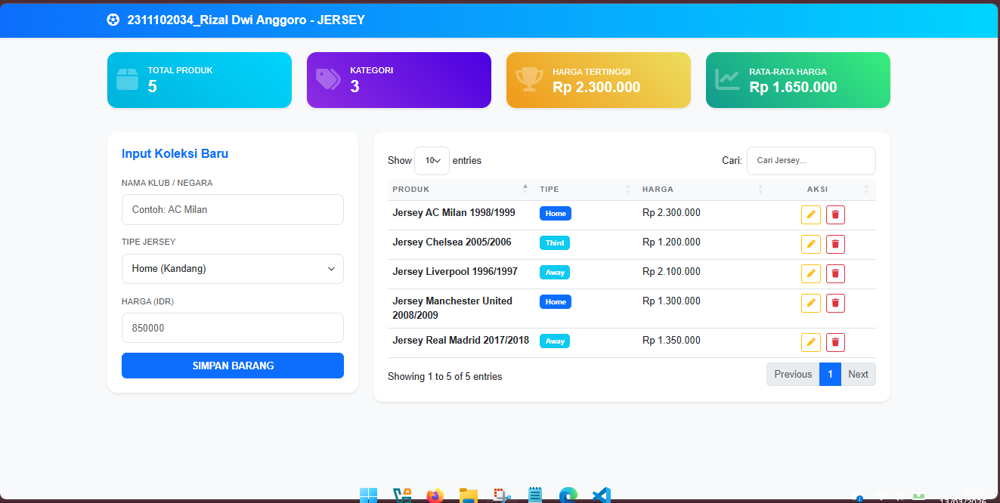
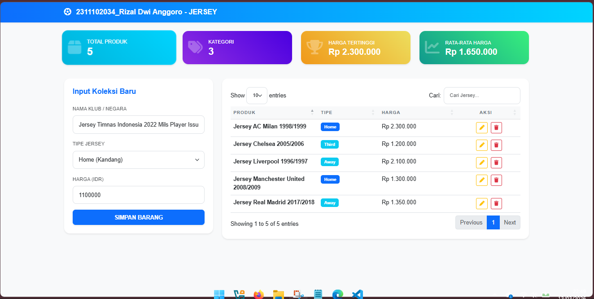
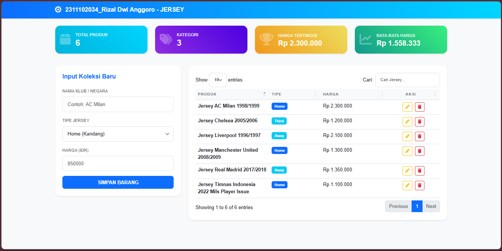
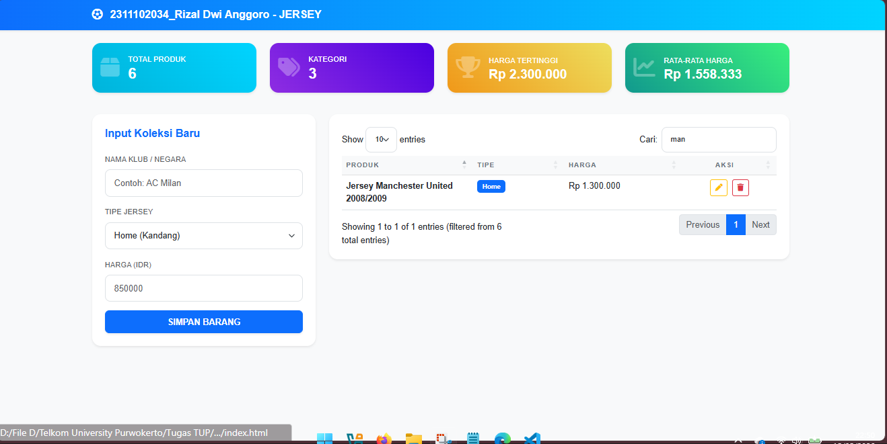
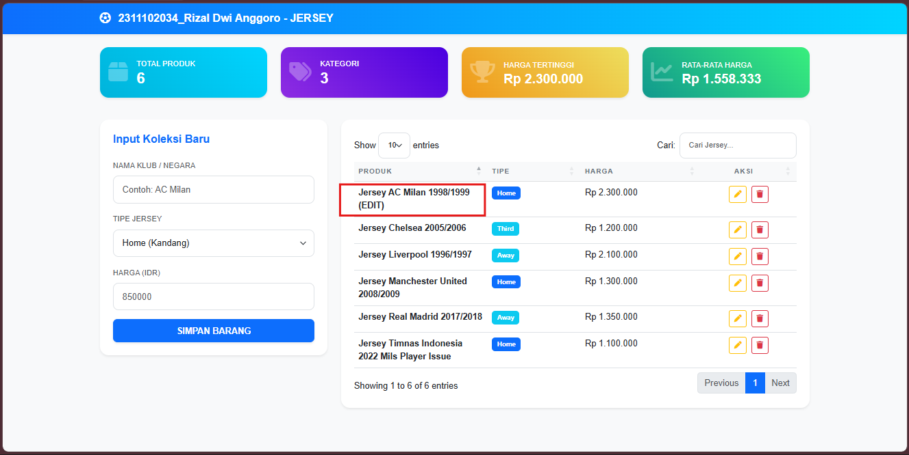
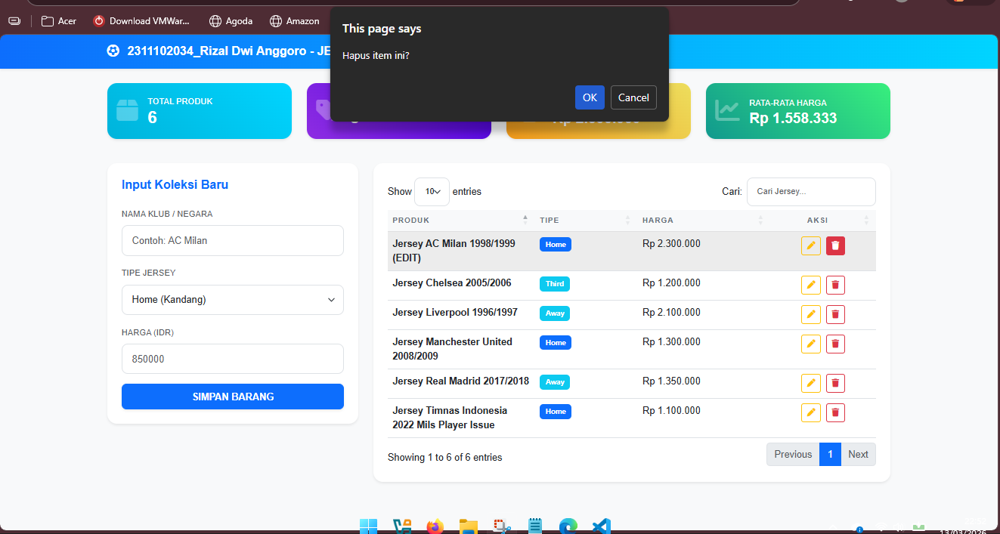
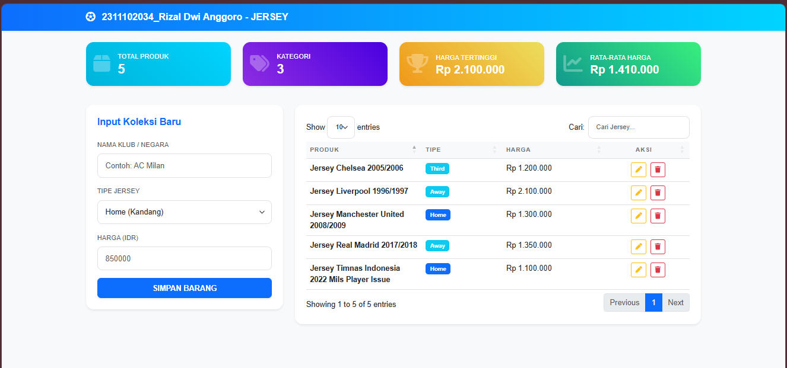

<div align="center">
  <br />
  <h1>LAPORAN PRAKTIKUM <br>APLIKASI BERBASIS PLATFORM</h1>
  <br />
  <h3>TES COTS <br> WEB MANAGEMENT PRODUCT  </h3>
  <br />
   
  <br />
  <br />
  <br />
  <h3>Disusun Oleh :</h3>
  <p>
    <strong>Rizal Dwi Anggoro</strong><br>
    <strong>2311102034</strong><br>
    <strong>IF-11-REG01</strong>
  </p>
  <br />
  <h3>Dosen Pengampu :</h3>
  <p>
    <strong>Dimas Fanny Hebrasianto Permadi, S.ST., M.Kom</strong>
  </p>
  <br />
  <br />
    <h4>Asisten Praktikum :</h4>
    <strong> Apri Pandu Wicaksono </strong> <br>
    <strong>Rangga Pradarrell Fathi</strong>
  <br />
  <h3>LABORATORIUM HIGH PERFORMANCE
 <br>FAKULTAS INFORMATIKA <br>UNIVERSITAS TELKOM PURWOKERTO <br>2026</h3>
</div>

---
### DASAR MATERI

**1. CRUD**

CRUD merupakan konsep dasar dalam pengelolaan data pada suatu sistem informasi. CRUD adalah singkatan dari Create, Read, Update, dan Delete yang menggambarkan empat operasi utama yang dapat dilakukan terhadap data dalam sebuah aplikasi. Operasi Create digunakan untuk menambahkan data baru ke dalam sistem. Operasi Read digunakan untuk menampilkan atau membaca data yang telah tersimpan. Operasi Update digunakan untuk memperbarui atau mengubah data yang sudah ada. Sedangkan operasi Delete digunakan untuk menghapus data dari sistem.

Konsep CRUD banyak digunakan dalam pengembangan aplikasi berbasis web maupun aplikasi desktop karena hampir semua sistem memerlukan proses pengelolaan data. Dalam pengembangan web sederhana menggunakan JavaScript, operasi CRUD dapat dilakukan dengan memanfaatkan array atau object sebagai tempat penyimpanan sementara data tanpa menggunakan database.

**2. Bootstrap**

Bootstrap merupakan sebuah framework front-end yang digunakan untuk mempermudah proses pembuatan tampilan antarmuka (user interface) pada aplikasi web. Bootstrap pertama kali dikembangkan oleh Mark Otto dan Jacob Thornton di Twitter dan dirilis sebagai proyek open-source pada tahun 2011.

Bootstrap menyediakan berbagai komponen siap pakai berbasis HTML, CSS, dan JavaScript, seperti tombol, form, tabel, navigasi, card, dan grid system. Dengan menggunakan Bootstrap, pengembang dapat membuat tampilan web yang responsif, sehingga halaman dapat menyesuaikan ukuran layar perangkat seperti komputer, tablet, maupun smartphone. Selain itu, Bootstrap juga membantu mempercepat proses pengembangan karena banyak komponen desain yang sudah disediakan secara default. 

**3. jQuery DataTables**

jQuery DataTables merupakan sebuah plugin jQuery yang digunakan untuk meningkatkan fungsi tabel pada halaman web agar menjadi lebih interaktif. DataTables memungkinkan tabel HTML biasa memiliki berbagai fitur tambahan seperti pencarian data (search), pengurutan (sorting), dan pembagian halaman (pagination) secara otomatis.

Dengan menggunakan DataTables, data yang ditampilkan dalam tabel menjadi lebih mudah untuk diakses dan dikelola oleh pengguna. Plugin ini juga mendukung integrasi dengan berbagai framework front-end seperti Bootstrap sehingga tampilan tabel menjadi lebih rapi dan menarik. DataTables sering digunakan dalam aplikasi web yang membutuhkan pengolahan data dalam jumlah banyak dengan tampilan yang dinamis.

**4. Data Mapping**

Data mapping merupakan proses menghubungkan atau memetakan data dari satu struktur ke struktur lainnya agar dapat digunakan dalam sistem atau aplikasi. Dalam pemrograman JavaScript, data mapping sering dilakukan dengan menggunakan object atau array untuk merepresentasikan data yang dimasukkan oleh pengguna.

Sebagai contoh, data yang dimasukkan melalui form seperti nama produk, kategori, dan harga akan dipetakan ke dalam sebuah object JavaScript. Object tersebut kemudian disimpan dalam array sehingga data dapat ditampilkan kembali ke dalam tabel. Dengan menggunakan teknik data mapping, pengembang dapat mengelola data dengan lebih terstruktur dan mempermudah proses manipulasi data seperti penambahan, pengubahan, maupun penghapusan data.

### CRUD Dan Penjelasan Code

**Kode HTML :**
```html
<!DOCTYPE html>
<html lang="id">
<head>
    <meta charset="UTF-8">
    <meta name="viewport" content="width=device-width, initial-scale=1.0">
    <title>Rizal Dwi Anggoro JERSEY - Admin Panel</title>
    
    <!-- Import CSS Bootstrap untuk styling -->
    <link href="https://cdn.jsdelivr.net/npm/bootstrap@5.3.0/dist/css/bootstrap.min.css" rel="stylesheet">
    
    <!-- Import CSS DataTables untuk membuat tabel lebih interaktif -->
    <link href="https://cdn.datatables.net/1.13.6/css/dataTables.bootstrap5.min.css" rel="stylesheet">
    
    <!-- Import Font Awesome untuk icon -->
    <link href="https://cdnjs.cloudflare.com/ajax/libs/font-awesome/6.4.0/css/all.min.css" rel="stylesheet">
    
    <!-- File CSS tambahan buatan sendiri -->
    <link rel="stylesheet" href="style.css">
</head>
<body>

<!-- Navbar / Header halaman -->
<nav class="navbar navbar-expand-lg navbar-dark shadow-sm mb-4">
    <div class="container">
        <a class="navbar-brand fw-bold" href="#"><i class="fa-solid fa-futbol me-2"></i> 2311102034_Rizal Dwi Anggoro - JERSEY</a>
    </div>
</nav>

<div class="container">
    <!-- Bagian statistik produk -->
    <div class="row mb-4 text-white">

 
        <!-- Card Total Produk -->       
        <div class="col-md-3 mb-3">
            <div class="stat-card bg-info-gradient p-3 shadow-sm rounded-4">
                <div class="d-flex align-items-center">
                    <div class="stat-icon me-3"><i class="fa-solid fa-box"></i></div>
                    <div>
                        <small>TOTAL PRODUK</small>
                        <h3 id="statTotal" class="mb-0 fw-bold">0</h3>
                    </div>
                </div>
            </div>
        </div>
        
        <!-- Card Jumlah Kategori -->
        <div class="col-md-3 mb-3">
            <div class="stat-card bg-purple-gradient p-3 shadow-sm rounded-4">
                <div class="d-flex align-items-center">
                    <div class="stat-icon me-3"><i class="fa-solid fa-tags"></i></div>
                    <div>
                        <small>KATEGORI</small>
                        <h3 id="statKategori" class="mb-0 fw-bold">0</h3>
                    </div>
                </div>
            </div>
        </div>

        <!-- Card Harga Tertinggi -->
        <div class="col-md-3 mb-3">
            <div class="stat-card bg-orange-gradient p-3 shadow-sm rounded-4">
                <div class="d-flex align-items-center">
                    <div class="stat-icon me-3"><i class="fa-solid fa-trophy"></i></div>
                    <div>
                        <small>HARGA TERTINGGI</small>
                        <h4 id="statTertinggi" class="mb-0 fw-bold">Rp 0</h4>
                    </div>
                </div>
            </div>
        </div>

        <!-- Card Rata-rata Harga -->
        <div class="col-md-3 mb-3">
            <div class="stat-card bg-green-gradient p-3 shadow-sm rounded-4">
                <div class="d-flex align-items-center">
                    <div class="stat-icon me-3"><i class="fa-solid fa-chart-line"></i></div>
                    <div>
                        <small>RATA-RATA HARGA</small>
                        <h4 id="statRata" class="mb-0 fw-bold">Rp 0</h4>
                    </div>
                </div>
            </div>
        </div>
    </div>

    <div class="row">

        <!-- Form input data jersey -->
        <div class="col-lg-4 mb-4">
            <div class="card border-0 shadow-sm p-4 rounded-4">
                <h5 class="mb-4 fw-bold text-primary">Input Koleksi Baru</h5>   
                 <!-- Form untuk menambah produk -->               
                <form id="jerseyForm">
                    <div class="mb-3">
                        <label class="form-label small text-muted">NAMA KLUB / NEGARA</label>
                        <input type="text" id="clubName" class="form-control" placeholder="Contoh: AC Milan" required>
                    </div>
                    <!-- Pilihan tipe jersey -->
                    <div class="mb-3">
                        <label class="form-label small text-muted">TIPE JERSEY</label>
                        <select id="type" class="form-select" required>
                            <option value="Home">Home (Kandang)</option>
                            <option value="Away">Away (Tandang)</option>
                            <option value="Third">Third (Ketiga)</option>
                        </select>
                    </div>
                    <!-- Input harga jersey -->
                    <div class="mb-3">
                        <label class="form-label small text-muted">HARGA (IDR)</label>
                        <input type="number" id="price" class="form-control" placeholder="850000" required>
                    </div>
                    <!-- Tombol submit -->
                    <button type="submit" class="btn btn-primary w-100 fw-bold py-2 rounded-3 shadow-sm">SIMPAN BARANG</button>
                </form>
            </div>
        </div>

        <!-- Tabel daftar produk jersey -->
        <div class="col-lg-8">
            <div class="card border-0 shadow-sm p-4 rounded-4">
                <table id="jerseyTable" class="table table-hover w-100">
                    <thead class="table-light">
                        <tr>
                            <th>PRODUK</th>
                            <th>TIPE</th>
                            <th>HARGA</th>
                            <th class="text-center">AKSI</th>
                        </tr>
                    </thead>
                    <tbody></tbody>
                </table>
            </div>
        </div>
    </div>
</div>

<!-- Modal untuk edit data jersey -->
<div class="modal fade" id="editModal" tabindex="-1">
    <div class="modal-dialog">
        <div class="modal-content rounded-4 border-0">
            <!-- Header modal -->
            <div class="modal-header">
                <h5 class="modal-title fw-bold">Update Detail Jersey</h5>
                <button type="button" class="btn-close" data-bs-dismiss="modal"></button>
            </div>
            <!-- Form edit -->
            <form id="editForm">
                <div class="modal-body">
                    <!-- ID produk disimpan secara hidden -->
                    <input type="hidden" id="editId">
                    <!-- Edit nama klub -->
                    <div class="mb-3">
                        <label class="form-label">Nama Klub</label>
                        <input type="text" id="editClub" class="form-control" required>
                    </div>
                    <!-- Edit tipe jersey -->
                    <div class="mb-3">
                        <label class="form-label">Tipe</label>
                        <select id="editType" class="form-select">
                            <option value="Home">Home</option>
                            <option value="Away">Away</option>
                            <option value="Third">Third</option>
                        </select>
                    </div>
                    <!-- Edit harga -->
                    <div class="mb-3">
                        <label class="form-label">Harga</label>
                        <input type="number" id="editPrice" class="form-control" required>
                    </div>
                </div>
                <!-- Tombol modal -->
                <div class="modal-footer">
                    <button type="button" class="btn btn-light" data-bs-dismiss="modal">Batal</button>
                    <button type="submit" class="btn btn-primary fw-bold">Simpan Perubahan</button>
                </div>
            </form>
        </div>
    </div>
</div>

<!-- Import library JavaScript -->
<script src="https://code.jquery.com/jquery-3.7.0.min.js"></script>
<script src="https://cdn.jsdelivr.net/npm/bootstrap@5.3.0/dist/js/bootstrap.bundle.min.js"></script>
<script src="https://cdn.datatables.net/1.13.6/js/jquery.dataTables.min.js"></script>
<script src="https://cdn.datatables.net/1.13.6/js/dataTables.bootstrap5.min.js"></script>
<script src="script.js"></script>
</body>
</html>
```

**Penjelasan Kode HTML:**
- Pada baris 3–6, bagian `<head>` berisi metadata halaman seperti `<meta charset="UTF-8">` untuk memastikan karakter teks dapat ditampilkan dengan benar, `<meta name="viewport">` untuk membuat tampilan halaman responsif pada perangkat mobile, serta `<title>` yang menentukan judul halaman pada tab browser yaitu 2311102034 JERSEY – Admin Panel.

- Pada baris 8–12, tag `<link>` digunakan untuk mengimpor Bootstrap 5 CSS dari CDN yang berfungsi untuk menyediakan berbagai komponen layout seperti grid system, card, form, tombol, dan utilitas styling agar tampilan halaman lebih modern dan responsif.

- Pada baris 11–12, tag `<link>` digunakan untuk mengimpor CSS DataTables yang berfungsi untuk meningkatkan tampilan tabel HTML sehingga memiliki fitur interaktif seperti search, pagination, dan sorting.

- Pada baris 14–15, tag `<link>` digunakan untuk mengimpor Font Awesome yang menyediakan berbagai ikon seperti ikon bola, box, tag, trophy, dan chart yang digunakan pada tampilan halaman.

- Pada baris 17–18, tag `<link rel="stylesheet" href="style.css">` digunakan untuk menghubungkan file CSS tambahan buatan sendiri yang berisi styling kustom untuk mempercantik tampilan halaman.

- Pada baris 20–27, elemen `<nav class="navbar navbar-expand-lg navbar-dark shadow-sm mb-4">` digunakan untuk membuat navbar atau header halaman menggunakan komponen Bootstrap. Navbar ini menampilkan judul aplikasi 2311102034 – JERSEY serta ikon bola dari Font Awesome.

- Pada baris 29–33, elemen `<div class="container">` dan `<div class="row">` digunakan sebagai struktur layout utama halaman menggunakan Bootstrap Grid System agar komponen dapat tersusun rapi dalam bentuk baris dan kolom.

- Pada baris 35–80, terdapat beberapa komponen Bootstrap Card yang digunakan untuk menampilkan statistik produk seperti Total Produk, Jumlah Kategori, Harga Tertinggi, dan Rata-rata Harga. Setiap card memiliki elemen dengan id seperti statTotal, statKategori, statTertinggi, dan statRata yang nilainya akan diperbarui secara dinamis menggunakan JavaScript.

- Pada baris 84–112, terdapat elemen `<form id="jerseyForm">` yang digunakan untuk memasukkan data produk jersey baru. Form ini memiliki beberapa input yaitu clubName untuk nama klub atau negara, type untuk memilih tipe jersey (Home, Away, Third), serta price untuk memasukkan harga jersey. Tombol Simpan Barang digunakan untuk menambahkan data produk ke dalam sistem.

- Pada baris 116–129, elemen `<table id="jerseyTable">` digunakan untuk menampilkan daftar produk jersey yang telah dimasukkan oleh pengguna. Tabel ini memiliki beberapa kolom yaitu Produk, Tipe, Harga, dan Aksi, sedangkan bagian `<tbody>` akan diisi secara dinamis menggunakan JavaScript dan plugin jQuery DataTables.

- Pada baris 134–170, terdapat komponen Bootstrap Modal yang digunakan untuk melakukan proses edit atau update data jersey. Modal ini berisi form edit yang memungkinkan pengguna mengubah nama klub, tipe jersey, serta harga produk yang telah disimpan sebelumnya.

- Pada baris 173–177, beberapa library JavaScript diimpor menggunakan tag `<script>` seperti jQuery, Bootstrap JS, dan DataTables yang digunakan untuk memberikan fungsi interaktif pada halaman seperti manipulasi tabel, penggunaan modal, serta fitur pencarian dan pagination pada tabel.

- Pada baris 178–179, tag `</body> dan </html>` menandakan akhir dari struktur dokumen HTML.

---

**Kode CSS :**
```css
body { 
    background-color: #f8f9fa; 
    color: #333;
    font-family: 'Poppins', sans-serif;
    padding-bottom: 50px;
}

.navbar { background: linear-gradient(90deg, #0d6efd, #00d4ff); }

/* Gradien untuk Stat Cards */
.bg-info-gradient { background: linear-gradient(45deg, #00b4db, #00d4ff); }
.bg-purple-gradient { background: linear-gradient(45deg, #8e2de2, #4a00e0); }
.bg-orange-gradient { background: linear-gradient(45deg, #f09819, #edde5d); }
.bg-green-gradient { background: linear-gradient(45deg, #11998e, #38ef7d); }

.stat-card {
    transition: transform 0.3s ease;
    border: none;
}
.stat-card:hover { transform: scale(1.05); }

.stat-icon {
    font-size: 2.5rem;
    opacity: 0.3;
}

.card { border: none; }

.form-control, .form-select {
    padding: 0.75rem 1rem;
    border-radius: 10px;
    border: 1px solid #dee2e6;
}

.form-control:focus {
    box-shadow: 0 0 0 0.25rem rgba(13, 110, 253, 0.1);
}

.table thead th {
    font-size: 0.8rem;
    letter-spacing: 1px;
    color: #6c757d;
    text-transform: uppercase;
}

.badge { padding: 0.5em 0.8em; }
```

**Penjelasan Kode CSS :**
- Pada baris 1–6, selector body digunakan untuk mengatur tampilan dasar halaman web. Properti `background-color` memberikan warna latar belakang abu muda, color mengatur warna teks utama menjadi lebih gelap agar mudah dibaca, `font-family: 'Poppins'`, `sans-serif` digunakan untuk menentukan jenis font yang digunakan pada halaman, sedangkan padding-bottom memberikan jarak tambahan di bagian bawah halaman agar konten tidak terlalu mepet dengan batas layar.

- Pada baris 8, selector `.navbar` digunakan untuk memberikan tampilan khusus pada bagian navigasi halaman dengan menggunakan properti background berupa linear gradient yang menghasilkan perpaduan warna biru hingga cyan sehingga tampilan navbar terlihat lebih modern.

- Pada baris 10–13, beberapa kelas seperti `.bg-info-gradient`, `.bg-purple-gradient`, `.bg-orange-gradient`, dan `.bg-green-gradient` digunakan untuk memberikan warna latar belakang gradasi pada kartu statistik produk. Warna gradasi ini membuat tampilan card terlihat lebih menarik dibandingkan warna polos.

- Pada baris 15–18, kelas `.stat-card` digunakan untuk mengatur tampilan dasar kartu statistik. Properti `transition: transform 0.3s ease` digunakan untuk memberikan efek animasi yang halus ketika card mengalami perubahan posisi atau ukuran, sedangkan `border: none` digunakan untuk menghilangkan garis tepi pada card.

- Pada baris 19, selector `.stat-card:hover` digunakan untuk memberikan efek interaksi ketika pengguna mengarahkan kursor ke `card`. Properti `transform: scale(1.05)` membuat card sedikit membesar sehingga memberikan efek hover animation yang lebih menarik.

- Pada baris 21–24, kelas `.stat-icon` digunakan untuk mengatur tampilan ikon pada kartu statistik. Properti `font-size` memperbesar ukuran ikon agar lebih terlihat jelas, sedangkan `opacity` mengurangi tingkat transparansi sehingga ikon terlihat lebih lembut sebagai elemen dekoratif.

- Pada baris 26, selector `.card` digunakan untuk menghilangkan garis tepi default pada komponen card Bootstrap dengan menggunakan properti `border: none` sehingga tampilan card terlihat lebih bersih.

- Pada baris 28–33, selector `.form-control` dan `.form-select` digunakan untuk mengatur tampilan input form dan dropdown. Properti padding memberikan ruang di dalam input agar teks tidak terlalu menempel pada tepi, `border-radius` membuat sudut input menjadi lebih melengkung, dan border memberikan garis tepi tipis agar elemen form terlihat lebih rapi.

- Pada baris 35–37, selector `.form-control:focus` digunakan untuk mengatur efek ketika input sedang aktif atau dipilih oleh pengguna. Properti `box-shadow` memberikan efek bayangan berwarna biru muda sehingga pengguna dapat dengan mudah mengetahui bahwa input tersebut sedang digunakan.

- Pada baris 39–44, selector `.table thead th` digunakan untuk mengatur tampilan header tabel. Properti `font-size` memperkecil ukuran teks header, `letter-spacing` memberikan jarak antar huruf agar lebih jelas, `color` mengubah warna teks menjadi abu-abu, dan `text-transform: uppercase` membuat teks header ditampilkan dalam huruf kapital.

- Pada baris 46, selector `.badge` digunakan untuk mengatur ukuran padding pada elemen badge sehingga teks di dalam badge memiliki ruang yang cukup dan terlihat lebih rapi.

---

**Kode Js :**
```js
$(document).ready(function() {
    // --- 1. INISIALISASI DATA ---
    // Mengambil data dari LocalStorage, jika kosong maka buat objek {} baru
    // Kita menggunakan format JSON agar data bisa disimpan sebagai teks permanen
    let jerseyData = JSON.parse(localStorage.getItem('jerseyV3')) || {};

    // --- 2. INISIALISASI DATATABLE (JQuery Plugin) ---
    // Mengubah tabel HTML biasa menjadi tabel pintar dengan fitur cari & halaman
    const table = $('#jerseyTable').DataTable({
        responsive: true,
        language: { 
            search: "Cari:", 
            searchPlaceholder: "Cari Jersey..." 
        }
    });

    // --- 3. FUNGSI STATISTIK (Fitur Ringkasan) ---
    // Fungsi ini menghitung angka-angka di kotak atas secara otomatis
    function updateStats() {
        const items = Object.values(jerseyData); // Mengubah objek menjadi array agar bisa dihitung
        const total = items.length; // Menghitung jumlah total produk
        
        // Mengambil kategori unik menggunakan 'Set' (agar tidak ada duplikat)
        const kategori = new Set(items.map(i => i.type)).size;
        
        // Mengumpulkan semua harga ke dalam satu list (array)
        const hargaArr = items.map(i => parseInt(i.price));
        
        // Mencari harga tertinggi dan menghitung rata-rata harga
        const tertinggi = total > 0 ? Math.max(...hargaArr) : 0;
        const rata = total > 0 ? hargaArr.reduce((a, b) => a + b, 0) / total : 0;

        // Menampilkan hasil hitungan ke layar HTML
        $('#statTotal').text(total);
        $('#statKategori').text(kategori);
        $('#statTertinggi').text(`Rp ${tertinggi.toLocaleString('id-ID')}`);
        $('#statRata').text(`Rp ${Math.round(rata).toLocaleString('id-ID')}`);
    }

    // --- 4. FUNGSI RENDER TABEL ---
    // Membersihkan tabel lama dan menggambar ulang dengan data terbaru
    function renderTable() {
        table.clear(); // Kosongkan isi tabel agar tidak double
        
        // Looping (putar) setiap ID yang ada di dalam data JSON
        Object.keys(jerseyData).forEach(id => {
            const item = jerseyData[id];
            // Menambahkan baris baru ke dalam DataTable
            table.row.add([
                `<span class="fw-bold">${item.club}</span>`,
                `<span class="badge ${item.type === 'Home' ? 'bg-primary' : 'bg-info'}">${item.type}</span>`,
                `Rp ${parseInt(item.price).toLocaleString('id-ID')}`,
                `<div class="text-center">
                    <button class="btn btn-outline-warning btn-sm me-1 btn-edit" data-id="${id}"><i class="fa fa-pen"></i></button>
                    <button class="btn btn-outline-danger btn-sm btn-delete" data-id="${id}"><i class="fa fa-trash"></i></button>
                 </div>`
            ]);
        });
        table.draw(); // Tampilkan perubahan ke layar
        updateStats(); // Perbarui angka statistik di atas
    }

    // Jalankan fungsi tampil tabel saat pertama kali web dibuka
    renderTable();

    // --- 5. FUNGSI CREATE (TAMBAH DATA) ---
    $('#jerseyForm').on('submit', function(e) {
        e.preventDefault(); // Mencegah halaman refresh saat klik simpan
        
        const id = Date.now(); // Membuat ID unik berdasarkan waktu saat ini
        
        // Mengambil input dari user dan dimasukkan ke objek
        jerseyData[id] = {
            club: $('#clubName').val(),
            type: $('#type').val(),
            price: $('#price').val()
        };
        
        saveData(); // Simpan ke memori browser
    });

    // --- 6. FUNGSI DELETE (HAPUS DATA) ---
    // Menggunakan '.on' karena tombolnya dibuat secara dinamis oleh JavaScript
    $('#jerseyTable tbody').on('click', '.btn-delete', function() {
        if(confirm('Hapus item ini?')) {
            const id = $(this).data('id'); // Ambil ID dari atribut 'data-id'
            delete jerseyData[id]; // Hapus data dari objek berdasarkan ID tersebut
            saveData();
        }
    });

    // --- 7. FUNGSI EDIT (AMBIL DATA KE MODAL) ---
    $('#jerseyTable tbody').on('click', '.btn-edit', function() {
        const id = $(this).data('id');
        const item = jerseyData[id];
        
        // Masukkan data lama ke dalam form di dalam Modal
        $('#editId').val(id);
        $('#editClub').val(item.club);
        $('#editType').val(item.type);
        $('#editPrice').val(item.price);
        
        $('#editModal').modal('show'); // Tampilkan modal edit
    });

    // --- 8. FUNGSI UPDATE (SIMPAN PERUBAHAN) ---
    $('#editForm').on('submit', function(e) {
        e.preventDefault();
        const id = $('#editId').val(); // Ambil ID yang tadi disimpan di input hidden
        
        // Timpa data lama dengan data baru dari form edit
        jerseyData[id] = {
            club: $('#editClub').val(),
            type: $('#editType').val(),
            price: $('#editPrice').val()
        };
        
        $('#editModal').modal('hide'); // Tutup modal
        saveData();
    });

    // --- 9. FUNGSI HELPER (SIMPAN KE LOCALSTORAGE) ---
    function saveData() {
        // Mengubah objek JavaScript menjadi teks JSON dan menyimpannya di browser
        localStorage.setItem('jerseyV3', JSON.stringify(jerseyData));
        renderTable(); // Gambar ulang tabel
        $('#jerseyForm')[0].reset(); // Kosongkan form input
    }
});
```
**Penjelasan Kode Js :**
- Pada baris 1, fungsi `$(document).ready(function() { ... })` digunakan untuk memastikan seluruh elemen HTML telah dimuat terlebih dahulu sebelum kode JavaScript dijalankan. Hal ini penting agar manipulasi elemen seperti tabel, form, dan modal dapat berjalan dengan baik.

- Pada baris 3–7, variabel `jerseyData` digunakan untuk mengambil data yang tersimpan pada `LocalStorage` dengan `key jerseyV3`. Fungsi `JSON.parse()` digunakan untuk mengubah data teks JSON menjadi objek JavaScript. Jika data belum tersedia, maka akan dibuat objek kosong `{}` sebagai tempat penyimpanan data jersey.

- Pada baris 9–16, dilakukan inisialisasi jQuery DataTables pada tabel dengan id jerseyTable. Plugin ini digunakan untuk mengubah tabel HTML biasa menjadi tabel interaktif yang memiliki fitur pencarian data, pagination, dan responsif. Pada bagian language juga ditambahkan kustomisasi teks pencarian agar sesuai dengan bahasa yang digunakan.

- Pada baris 18–36, terdapat fungsi `updateStats()` yang digunakan untuk menghitung statistik data produk secara otomatis. Fungsi ini mengambil seluruh data jersey dari objek jerseyData, kemudian menghitung jumlah total produk, jumlah kategori unik menggunakan objek Set, harga tertinggi menggunakan fungsi `Math.max()`, serta rata-rata harga menggunakan metode `reduce()`. Hasil perhitungan tersebut kemudian ditampilkan pada elemen HTML dengan id statTotal, statKategori, statTertinggi, dan statRata.

- Pada baris 38–62, terdapat fungsi `renderTable()` yang berfungsi untuk menampilkan data jersey ke dalam tabel DataTables. Fungsi ini terlebih dahulu mengosongkan isi tabel menggunakan `table.clear()`, kemudian melakukan perulangan terhadap setiap data jersey menggunakan `Object.keys()`. Setiap data kemudian ditambahkan ke tabel menggunakan `table.row.add()` dengan format kolom yang berisi nama klub, tipe jersey, harga, serta tombol aksi edit dan hapus.

- Pada baris 64, fungsi `renderTable()` dijalankan ketika halaman pertama kali dibuka sehingga data yang tersimpan pada LocalStorage langsung ditampilkan pada tabel.

- Pada baris 66–80, terdapat fungsi `Create` (Tambah Data) yang dijalankan ketika form dengan id jerseyForm disubmit. Fungsi ini menggunakan `e.preventDefault()` untuk mencegah halaman melakukan refresh. Data yang dimasukkan pengguna kemudian diambil dari input form dan disimpan ke dalam objek jerseyData dengan ID unik yang dibuat menggunakan `Date.now()`.

- Pada baris 82–90, terdapat fungsi `Delete` (Hapus Data) yang dijalankan ketika tombol hapus diklik. Event ini menggunakan metode `.on()` karena tombol dibuat secara dinamis oleh JavaScript. Jika pengguna mengonfirmasi penghapusan melalui `confirm()`, maka data dengan ID yang sesuai akan dihapus dari objek jerseyData.

- Pada baris 92–104, terdapat fungsi `Edit` Data yang digunakan untuk mengambil data jersey yang dipilih dan menampilkannya pada form edit di dalam modal. Data lama akan dimasukkan ke dalam input form seperti `editClub`, `editType`, dan `editPrice`, kemudian modal edit ditampilkan menggunakan perintah `$('#editModal').modal('show')`.

- Pada baris 106–120, terdapat fungsi `Update` Data yang dijalankan ketika form edit disubmit. Fungsi ini mengambil ID produk yang sedang diedit, kemudian mengganti data lama pada objek jerseyData dengan data baru yang dimasukkan oleh pengguna. Setelah itu modal akan ditutup dan data akan disimpan kembali.

- Pada baris 122–128, terdapat fungsi `saveData()` yang berfungsi sebagai helper untuk menyimpan data ke `LocalStorage.` Fungsi ini mengubah objek jerseyData menjadi format JSON menggunakan `JSON.stringify()` dan menyimpannya di browser. Setelah data disimpan, fungsi `renderTable()` dipanggil kembali untuk memperbarui tampilan tabel dan statistik, serta form input akan dikosongkan menggunakan reset().

- Pada baris 129, penutup `});` menandakan akhir dari fungsi document.ready dan seluruh script JavaScript.

---

### Hasil Tampilan (Screenshoot):

1. **Tampilan Halaman Awal**


2. **Input Data & Data Berhasil Ditambahkan**




3. **Fitur Pencarian (Search)**


4. **Edit Data**


5. **Hapus Data**




---
### Referensi
- [Bootstrap 5 Documentation](https://getbootstrap.com/docs/5.3/)
- [jQuery DataTables Documentation](https://datatables.net/manual/)
- [Bootstrap Icons](https://icons.getbootstrap.com/)
- [MDN Web Docs - JavaScript Array & Object Methods](https://developer.mozilla.org/en-US/docs/Web/JavaScript)
