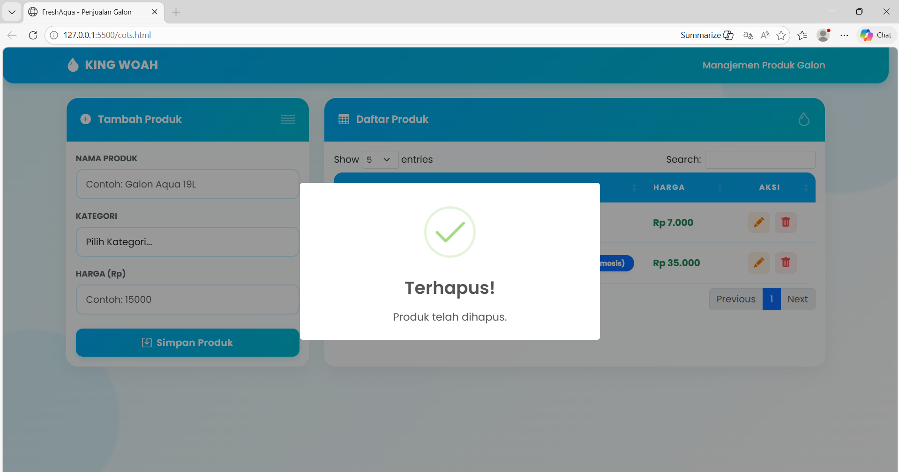

<div align="center">
  <br />
  <h1>LAPORAN PRAKTIKUM <br>APLIKASI BERBASIS PLATFORM</h1>
  <br />
  <h3>DATA PRODUK <br> Bootstrap, jQuery DataTables & JavaScript</h3>
  <br />
  <br />
  
  <br />
  <br />
  <h3>Disusun Oleh :</h3>
  <p>
    <strong>Shiva Indah Kurnia</strong><br>
    <strong>2311102035</strong><br>
    <strong>S1 IF-11-01</strong>
  </p>
  <br />
  <br />
  <h3>Dosen Pengampu :</h3>
  <p>
    <strong>Dimas Fanny Hebrasianto Permadi, S.ST., M.Kom</strong>
  </p>
  <br />
  <br />
  <h4>Asisten Praktikum :</h4>
  <strong>Apri Pandu Wicaksono</strong> <br>
  <strong>Rangga Pradarrell Fathi</strong>
  <br />
  <h3>LABORATORIUM HIGH PERFORMANCE
 <br>FAKULTAS INFORMATIKA <br>UNIVERSITAS TELKOM PURWOKERTO <br>2026</h3>
</div>

---

## 1. Dasar Teori

**CRUD (Create, Read, Update, Delete)** merupakan pilar utama dalam pengelolaan data di sebuah aplikasi. Dalam konteks pengembangan web, implementasi CRUD memungkinkan pengguna berinteraksi dengan data secara dinamis, mulai dari proses penambahan, pemaparan, penyuntingan, hingga penghapusan. Operasi ini dapat dieksekusi di sisi klien (client-side) memanfaatkan JavaScript, sehingga manipulasi data dapat terjadi secara instan tanpa perlu berinteraksi dengan server secara terus-menerus.

**Bootstrap** merupakan kerangka kerja (framework) CSS sumber terbuka yang dirancang untuk mempermudah pengembangan antarmuka web. Framework ini menawarkan berbagai komponen UI siap pakai, mulai dari sistem grid yang responsif hingga elemen seperti tombol dan modal. Penggunaan kelas utilitas yang terstandarisasi dalam Bootstrap memungkinkan pengembang untuk membangun desain web yang estetis dan adaptif dalam waktu yang lebih singkat.

**jQuery DataTables** adalah plugin berbasis jQuery yang dirancang untuk mengoptimalkan fungsionalitas elemen tabel pada HTML. Integrasi plugin ini memungkinkan tabel memiliki kemampuan manajemen data tingkat lanjut, seperti fitur pencarian (searching), pengurutan otomatis (sorting), dan manajemen halaman (pagination). Semua fitur tersebut dapat diaktifkan melalui satu langkah inisialisasi, sehingga meningkatkan efisiensi penyajian data pada antarmuka web.

**Object Mapping**  adalah cara menyimpan data sebagai objek dengan sistem unique key sebagai penanda. Misalnya, data produk disimpan dengan ID tertentu sebagai kuncinya. Metode ini sangat disukai karena membuat proses pengambilan atau perubahan data menjadi jauh lebih efisien dan cepat (skalabilitas $O(1)$) dibandingkan menggunakan struktur array biasa.

---

## 2. Penjelasan Kode HTML, CSS, dan JS


---

### Kode HTML (`cots.html`)

```html
<nav class="navbar navbar-expand-lg navbar-dark mb-4">
    <div class="container">
        <a class="navbar-brand" href="#">
            <i class="bi bi-droplet-fill"></i> KING WOAH
        </a>
        <span class="navbar-text text-white fw-medium">
            Manajemen Produk Galon
        </span>
    </div>
</nav>

<div class="container mb-5">
    <div class="row g-4">
        <div class="col-lg-4">
            <div class="card card-water h-100">
                <div class="card-header">
                    <h5 class="card-title" id="formTitle"><i class="bi bi-plus-circle-fill me-2"></i> Tambah Produk</h5>
                </div>
                <div class="card-body">
                    <form id="formProduk">
                        <button type="submit" class="btn btn-water w-100" id="btnSimpan">Simpan Produk</button>
                    </form>
                </div>
            </div>
        </div>

        <div class="col-lg-8">
            <div class="card card-water h-100">
                <div class="card-header">
                    <h5 class="card-title"><i class="bi bi-table me-2"></i> Daftar Produk</h5>
                </div>
                <div class="card-body">
                    <table id="tabelProduk" class="table table-water table-hover w-100">
                        <thead>
                            <tr>
                                <th>ID</th>
                                <th>Nama Produk</th>
                                <th>Kategori</th>
                                <th>Harga</th>
                                <th>Aksi</th>
                            </tr>
                        </thead>
                        <tbody></tbody>
                    </table>
                </div>
            </div>
        </div>
    </div>
</div>
```

---

### Kode CSS (`style.css`)

```css
/* --- Tema Warna & Variabel --- */
:root {
    --primary-aqua: #00bcd4; 
    --secondary-aqua: #03a9f4; 
    --water-gradient: linear-gradient(135deg, #e0f7fa 0%, #ffffff 100%);
    --blue-gradient: linear-gradient(135deg, var(--secondary-aqua) 0%, var(--primary-aqua) 100%);
}

/* --- Desain Kartu Transparan (Glassmorphism) --- */
.card-water {
    border: 1px solid rgba(255, 255, 255, 0.4);
    border-radius: 20px;
    background: rgba(255, 255, 255, 0.85);
    backdrop-filter: blur(10px);
    transition: all 0.3s ease;
}

/* --- Efek Hover Tabel --- */
.table-water tbody tr:hover {
    background-color: rgba(129, 212, 250, 0.15);
    transform: scale(1.01);
}

/* --- Tombol Kustom --- */
.btn-water {
    background: var(--blue-gradient);
    border-radius: 12px;
    color: white;
    font-weight: 600;
}
```

---

### Kode JavaScript (`script.js`)

```javascript
$(document).ready(function() {
    // 1. Ambil data dari penyimpanan lokal browser
    let productsArr = JSON.parse(localStorage.getItem('dataFreshAqua')) || [];

    // 2. Fungsi untuk menampilkan data ke dalam tabel
    const renderProducts = () => {
        dataTable.clear(); 
        productsArr.forEach((product) => {
            dataTable.row.add([
                `#${product.id.toString().slice(-4)}`,
                product.nama,
                product.kategori,
                formatRupiah(product.harga),
                `<button class="btn-edit" data-id="${product.id}">Edit</button>`
            ]);
        });
        dataTable.draw();
    };

    // 3. Logika Simpan & Update Data
    $('#formProduk').on('submit', function(e) {
        e.preventDefault();
        // Cek apakah mode Edit atau Tambah Baru
        if (currentEditId) {
            // Logika Update (Cari index lalu ganti isinya)
        } else {
            // Logika Create (Push data baru ke array)
        }
        localStorage.setItem('dataFreshAqua', JSON.stringify(productsArr));
        renderProducts();
    });

    // 4. Logika Hapus Data dengan Konfirmasi SweetAlert2
    $('#tabelProduk').on('click', '.btn-hapus', function() {
        // Filter array untuk menghapus ID yang dipilih
    });
});
```

---

### Hasil Tampilan (Screenshot)

#### 1. Tampilan Awal Halaman


#### 2. Input Data & Data Berhasil Ditambahkan


#### 3. Fitur Pencarian (Search)


#### 4. Edit Data


#### 5. Hapus Data



---

### Penjelasan Kode

#### 1. HTML (`index.html`)

HTML (HyperText Markup Language) bertugas sebagai fondasi atau kerangka utama aplikasi.
* Framework Bootstrap 5: Digunakan untuk mempercepat pembuatan tata letak (layout) yang rapi dan responsif tanpa harus menulis banyak baris kode dasar.
* Sistem Grid: Menggunakan kelas .row dan .col-lg- untuk membagi layar menjadi dua bagian: Panel Input (kiri) dan Panel Tabel Data (kanan).
* Komponen Form: Menggunakan tag <form> dengan berbagai tipe input (text, number, select) untuk menangkap data spesifikasi galon dari pengguna.
* Placeholder Tabel: Tag <table> dengan ID tabelProduk disediakan sebagai wadah kosong yang nantinya akan diisi secara dinamis oleh JavaScript.
* Integrasi Library: Terdapat pemanggilan CDN untuk Font Poppins, Bootstrap Icons, DataTables, dan SweetAlert2 agar tampilan lebih modern.

---

#### 2. CSS (`style.css`)

CSS (Cascading Style Sheets) bertugas memberikan identitas visual "FreshAqua" yang segar dan profesional.
* Custom Variables (:root): Menggunakan variabel untuk menyimpan kode warna biru air (cyan dan aqua). Ini memudahkan perubahan tema warna secara global hanya dengan mengubah satu baris kode.
* Konsep Glassmorphism: Implementasi pada kelas .card-water yang menggunakan backdrop-filter: blur(10px) dan latar belakang transparan. Hal ini memberikan efek "kaca buram" yang elegan.
* Desain Responsif: Memberikan aturan visual agar elemen seperti tombol dan input tetap terlihat proporsional baik di layar laptop maupun ponsel.
* User Experience (UX): Menambahkan efek transition dan hover (seperti efek kartu yang sedikit terangkat saat didekati kursor) untuk memberikan umpan balik visual kepada pengguna.

---

#### 3. JavaScript (`script.js`)

JavaScript (JS) bertugas sebagai otak yang mengatur alur data dan interaksi pengguna agar aplikasi tidak hanya statis.

* Manajemen Array & Local Storage:
  - productsArr: Variabel array untuk menampung seluruh data produk.
  - localStorage: Berfungsi menyimpan data ke dalam memori browser. Hasilnya, data tidak akan hilang meskipun halaman di-refresh atau browser ditutup.

* Logika CRUD (Create, Read, Update, Delete):
  - Create: Menangkap input dari form dan menambahkannya ke array menggunakan push().
  - Read: Fungsi renderProducts() secara otomatis membersihkan tabel lama dan menggambarnya kembali dengan data terbaru.
  - Update: Menggunakan variabel currentEditId untuk membedakan apakah pengguna sedang menambah data baru atau memperbaiki data yang sudah ada.
  - Delete: Menggunakan fungsi filter() untuk menghapus item berdasarkan ID unik yang dihasilkan dari Date.now().

* DataTables Plugin: Mengubah tabel HTML biasa menjadi tabel pintar yang memiliki fitur pencarian (search), pengurutan (sorting), dan pembagian halaman (pagination) secara otomatis.
* SweetAlert2: Menggantikan jendela peringatan bawaan browser yang kaku dengan notifikasi pop-up yang cantik dan interaktif.
---

## 3. Referensi

- [Bootstrap 5](https://getbootstrap.com/docs/5.3/getting-started/introduction/)
- [jQuery DataTables](https://datatables.net/manual/)
- [MDN Web Docs - Window.localStorage](https://developer.mozilla.org/en-US/docs/Web/API/Window/localStorage)
- [MDN Web Docs - Array.prototype.splice()](https://developer.mozilla.org/en-US/docs/Web/JavaScript/Reference/Global_Objects/Array/splice)
- [Google Fonts - Outfit](https://fonts.google.com/specimen/Outfit)
- [Bootstrap Icons](https://icons.getbootstrap.com/)
