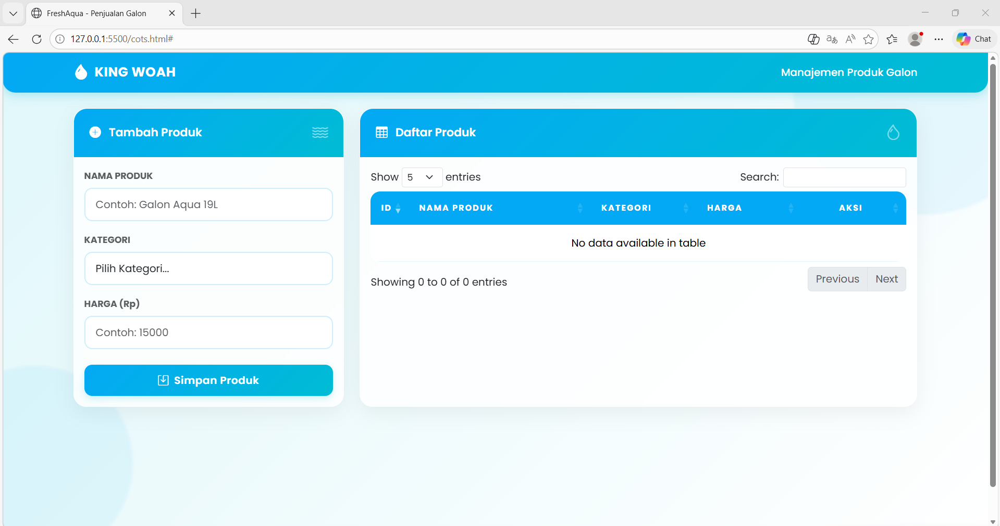
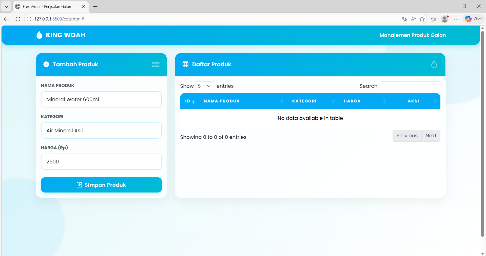
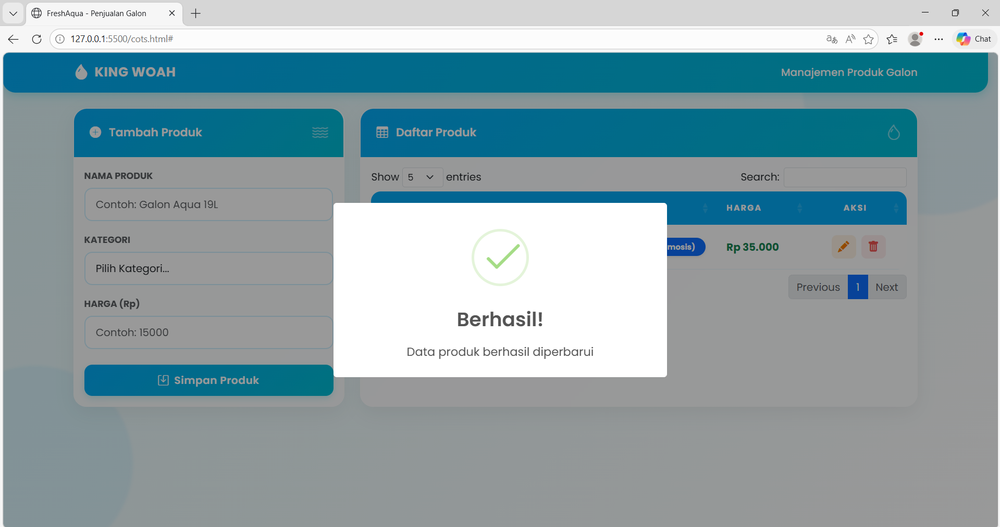
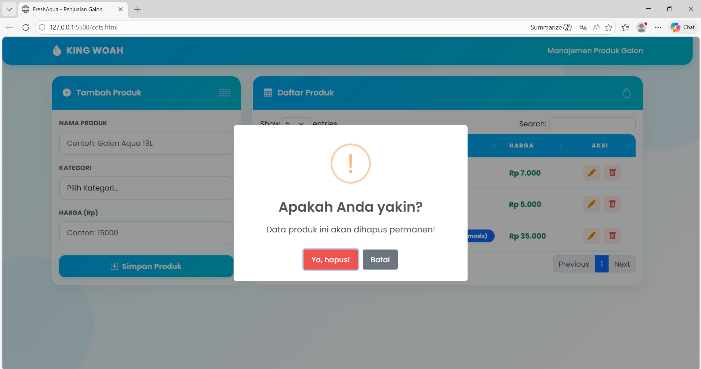
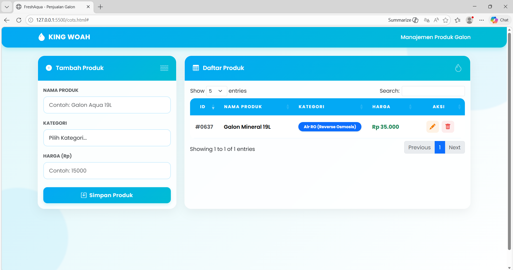
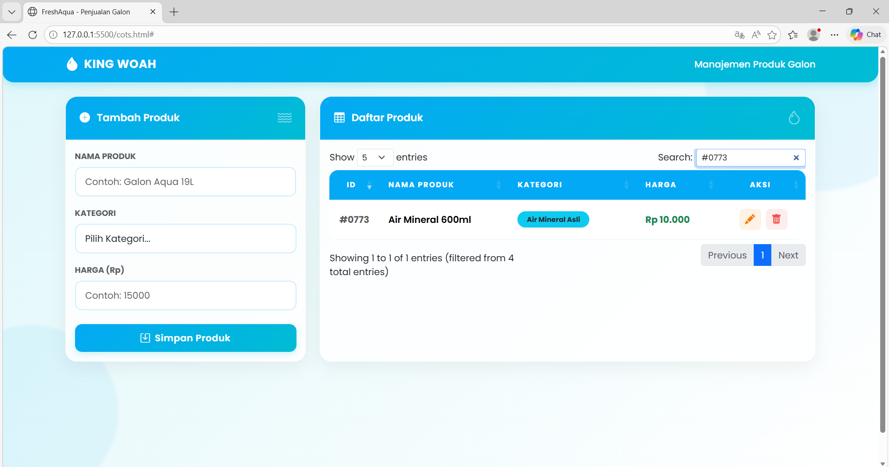

<div align="center">
  <br />
  <h1>LAPORAN PRAKTIKUM <br>APLIKASI BERBASIS PLATFORM</h1>
  <br />
  <h3>DATA PRODUK <br> Bootstrap, jQuery DataTables & JavaScript</h3>
  <br />
  <br />
  
  <br />
  <br />
  <h3>Disusun Oleh :</h3>
  <p>
    <strong>Mohammad Alfan Naraya</strong><br>
    <strong>2311102170</strong><br>
    <strong>S1 IF-11-01</strong>
  </p>
  <br />
  <br />
  <h3>Dosen Pengampu :</h3>
  <p>
    <strong>Dimas Fanny Hebrasianto Permadi, S.ST., M.Kom</strong>
  </p>
  <br />
  <br />
  <h4>Asisten Praktikum :</h4>
  <strong>Apri Pandu Wicaksono</strong> <br>
  <strong>Rangga Pradarrell Fathi</strong>
  <br />
  <h3>LABORATORIUM HIGH PERFORMANCE
 <br>FAKULTAS INFORMATIKA <br>UNIVERSITAS TELKOM PURWOKERTO <br>2026</h3>
</div>

---

## 1. Dasar Teori

**CRUD (Create, Read, Update, Delete)** merupakan pilar utama dalam pengelolaan data di sebuah aplikasi. Dalam konteks pengembangan web, implementasi CRUD memungkinkan pengguna berinteraksi dengan data secara dinamis, mulai dari proses penambahan, pemaparan, penyuntingan, hingga penghapusan. Operasi ini dapat dieksekusi di sisi klien (client-side) memanfaatkan JavaScript, sehingga manipulasi data dapat terjadi secara instan tanpa perlu berinteraksi dengan server secara terus-menerus.

**Bootstrap** merupakan kerangka kerja (framework) CSS sumber terbuka yang dirancang untuk mempermudah pengembangan antarmuka web. Framework ini menawarkan berbagai komponen UI siap pakai, mulai dari sistem grid yang responsif hingga elemen seperti tombol dan modal. Penggunaan kelas utilitas yang terstandarisasi dalam Bootstrap memungkinkan pengembang untuk membangun desain web yang estetis dan adaptif dalam waktu yang lebih singkat.

**jQuery DataTables** adalah plugin berbasis jQuery yang dirancang untuk mengoptimalkan fungsionalitas elemen tabel pada HTML. Integrasi plugin ini memungkinkan tabel memiliki kemampuan manajemen data tingkat lanjut, seperti fitur pencarian (searching), pengurutan otomatis (sorting), dan manajemen halaman (pagination). Semua fitur tersebut dapat diaktifkan melalui satu langkah inisialisasi, sehingga meningkatkan efisiensi penyajian data pada antarmuka web.

**Object Mapping**  adalah cara menyimpan data sebagai objek dengan sistem unique key sebagai penanda. Misalnya, data produk disimpan dengan ID tertentu sebagai kuncinya. Metode ini sangat disukai karena membuat proses pengambilan atau perubahan data menjadi jauh lebih efisien dan cepat (skalabilitas $O(1)$) dibandingkan menggunakan struktur array biasa.

---

## 2. Penjelasan Kode HTML, CSS, dan JS


---

### Kode HTML (`cots.html`)

```html
<!DOCTYPE html>
<html lang="id">
<head>
    <meta charset="UTF-8">
    <meta name="viewport" content="width=device-width, initial-scale=1.0">
    <title>Nara Music Store - Inventaris</title>
    
    <link href="https://fonts.googleapis.com/css2?family=Outfit:wght@300;400;600;700&display=swap" rel="stylesheet">
    <link href="https://cdn.jsdelivr.net/npm/bootstrap@5.3.0/dist/css/bootstrap.min.css" rel="stylesheet">
    <link href="https://cdn.datatables.net/1.13.6/css/dataTables.bootstrap5.min.css" rel="stylesheet">
    <link rel="stylesheet" href="https://cdn.jsdelivr.net/npm/bootstrap-icons@1.11.1/font/bootstrap-icons.css">

    <link rel="stylesheet" href="style.css">
</head>
<body>

<div class="container-fluid">
    <div class="row">
        <div class="col-lg-3 sidebar-brand">
            <div class="mb-5 text-center">
                <i class="bi bi-music-note-beamed fs-1 text-info"></i>
                <h3 class="fw-bold mt-2">NARA MUSIC STORE</h3>
                <p class="small text-white-50">Manajemen Inventaris Gitar</p>
            </div>

            <div class="mt-4">
                <h6 class="text-white-50 mb-3">FORM INPUT</h6>
                <form id="guitarForm">
                    <div class="mb-3">
                        <label class="small text-white-50">Nama Model</label>
                        <input type="text" id="modelName" class="form-control bg-transparent text-white border-secondary" placeholder="Contoh: Fender Stratocaster" required>
                    </div>
                    <div class="mb-3">
                        <label class="small text-white-50">Kategori</label>
                        <select id="category" class="form-select bg-transparent text-white border-secondary" required>
                            <option value="" class="text-dark">Pilih Kategori</option>
                            <option value="Elektrik" class="text-dark">Gitar Elektrik</option>
                            <option value="Akustik" class="text-dark">Gitar Akustik</option>
                            <option value="Bass" class="text-dark">Gitar Bass</option>
                        </select>
                    </div>
                    <div class="mb-4">
                        <label class="small text-white-50">Harga Jual (Rp)</label>
                        <input type="number" id="price" class="form-control bg-transparent text-white border-secondary" placeholder="0" required>
                    </div>
                    <button type="submit" class="btn btn-purple w-100">
                        <i class="bi bi-plus-lg me-2"></i>Tambah ke Stok
                    </button>
                </form>
            </div>
        </div>

        <div class="col-lg-9 p-5">
            <div class="d-flex justify-content-between align-items-center mb-5">
                <div>
                    <h1 class="fw-bold m-0">NARA MUSIC STORE</h1>
                    <p class="text-muted">Pantau dan kelola koleksi instrumen Anda.</p>
                </div>
                <span class="badge bg-white text-dark shadow-sm p-3 rounded-4">
                    <i class="bi bi-calendar3 me-2 text-primary"></i>
                    <span id="dateDisplay"></span>
                </span>
            </div>

            <div class="card guitar-card p-4">
                <table id="inventoryTable" class="table w-100">
                    <thead>
                        <tr>
                            <th>ID</th>
                            <th>Model Instrumen</th>
                            <th>Kategori</th>
                            <th>Nilai Harga</th>
                            <th>Aksi</th>
                        </tr>
                    </thead>
                    <tbody></tbody>
                </table>
            </div>
        </div>
    </div>
</div>

<div class="modal fade" id="editModal" tabindex="-1" aria-hidden="true">
    <div class="modal-dialog modal-dialog-centered">
        <div class="modal-content" style="border-radius: 20px;">
            <div class="modal-header border-0 p-4">
                <h5 class="fw-bold">Edit Data Instrumen</h5>
                <button type="button" class="btn-close" data-bs-dismiss="modal" aria-label="Close"></button>
            </div>
            <div class="modal-body p-4">
                <form id="editForm">
                    <input type="hidden" id="editIndex">
                    <div class="mb-3">
                        <label class="form-label small fw-bold text-muted">Nama Model</label>
                        <input type="text" id="editModelName" class="form-control" required>
                    </div>
                    <div class="mb-3">
                        <label class="form-label small fw-bold text-muted">Kategori</label>
                        <select id="editCategory" class="form-select" required>
                            <option value="Elektrik">Gitar Elektrik</option>
                            <option value="Akustik">Gitar Akustik</option>
                            <option value="Bass">Gitar Bass</option>
                        </select>
                    </div>
                    <div class="mb-4">
                        <label class="form-label small fw-bold text-muted">Harga (Rp)</label>
                        <input type="number" id="editPrice" class="form-control" required>
                    </div>
                    <button type="submit" class="btn btn-purple w-100">Simpan Perubahan</button>
                </form>
            </div>
        </div>
    </div>
</div>

<script src="https://code.jquery.com/jquery-3.7.0.min.js"></script>
<script src="https://cdn.jsdelivr.net/npm/bootstrap@5.3.0/dist/js/bootstrap.bundle.min.js"></script>
<script src="https://cdn.datatables.net/1.13.6/js/jquery.dataTables.min.js"></script>
<script src="https://cdn.datatables.net/1.13.6/js/dataTables.bootstrap5.min.js"></script>

<script src="script.js"></script>
</body>
</html>
```

---

### Kode CSS (`style.css`)

```css
:root {
    --primary-purple: #4834d4;
    --dark-purple: #130f40;
    --light-bg: #f5f6fa;
    --white: #ffffff;
}

body {
    background-color: var(--light-bg);
    font-family: 'Outfit', sans-serif;
    color: var(--dark-purple);
}

.sidebar-brand {
    padding: 30px;
    background: var(--dark-purple);
    color: white;
    min-height: 100vh;
    border-right: 4px solid var(--primary-purple);
}

.guitar-card {
    background: var(--white);
    border: none;
    border-radius: 20px;
    box-shadow: 0 10px 30px rgba(19, 15, 64, 0.05);
}

.form-control, .form-select {
    border-radius: 12px;
    border: 2px solid #eee;
    padding: 12px;
}

.form-control:focus {
    border-color: var(--primary-purple);
    box-shadow: none;
}

.btn-purple {
    background: linear-gradient(135deg, #686de0, #4834d4);
    color: white;
    border: none;
    padding: 15px;
    border-radius: 15px;
    font-weight: 600;
    text-transform: uppercase;
}

.btn-purple:hover { color: white; opacity: 0.9; }

.badge-type {
    background: #f0edff;
    color: var(--primary-purple);
    padding: 8px 15px;
    border-radius: 10px;
    font-weight: 600;
}

.price-text {
    color: #000;
    font-weight: 700;
}
```

---

### Kode JavaScript (`script.js`)

```javascript
$(document).ready(function() {
    // Tampilkan Tanggal Saat Ini
    $('#dateDisplay').text(new Date().toLocaleDateString('id-ID', { 
        day: 'numeric', 
        month: 'long', 
        year: 'numeric' 
    }));

    // 1. DATA MANAGEMENT: Ambil dari LocalStorage atau buat array kosong
    let guitarInventory = JSON.parse(localStorage.getItem('nara_inventory')) || [];

    // 2. INITIALIZE DATATABLES: Konfigurasi fitur tabel
    const table = $('#inventoryTable').DataTable({
        pageLength: 7,
        language: {
            search: "",
            searchPlaceholder: "Cari instrumen...",
            lengthMenu: "Tampilkan _MENU_ data",
            info: "Menampilkan _START_ sampai _END_ dari _TOTAL_ data",
            infoEmpty: "Data tidak ditemukan",
            zeroRecords: "Pencarian tidak ditemukan",
            paginate: { 
                next: '<i class="bi bi-chevron-right"></i>', 
                previous: '<i class="bi bi-chevron-left"></i>' 
            }
        }
    });

    // 3. REFRESH FUNCTION: Sinkronisasi data array ke tampilan tabel
    function refreshInventory() {
        table.clear();
        guitarInventory.map((item, index) => {
            table.row.add([
                `<span class="text-muted">#GTR-${index + 1}</span>`,
                `<div class="d-flex align-items-center">
                    <div class="bg-light p-2 rounded me-3"><i class="bi bi-guitar-fill text-primary"></i></div>
                    <span class="fw-bold">${item.nama}</span>
                </div>`,
                `<span class="badge-type">${item.kategori}</span>`,
                `<span class="price-text">Rp ${parseInt(item.harga).toLocaleString('id-ID')}</span>`,
                `<div class="d-flex gap-2">
                    <button class="btn btn-sm btn-outline-primary border-0 rounded-circle" onclick="openEditModal(${index})" title="Edit">
                        <i class="bi bi-pencil-square"></i>
                    </button>
                    <button class="btn btn-sm btn-outline-danger border-0 rounded-circle" onclick="deleteItem(${index})" title="Hapus">
                        <i class="bi bi-trash3-fill"></i>
                    </button>
                </div>`
            ]);
        });
        table.draw();
        
        // Simpan ke LocalStorage agar data tidak hilang saat refresh halaman
        localStorage.setItem('nara_inventory', JSON.stringify(guitarInventory));
    }

    // Jalankan render pertama kali saat halaman dibuka
    refreshInventory();

    // 4. CREATE: Menambah data baru
    $('#guitarForm').on('submit', function(e) {
        e.preventDefault();
        guitarInventory.push({
            nama: $('#modelName').val(),
            kategori: $('#category').val(),
            harga: $('#price').val()
        });
        this.reset();
        refreshInventory();
    });

    // 5. UPDATE (Part 1): Membuka Modal Edit dan mengisi data lama
    window.openEditModal = function(index) {
        const item = guitarInventory[index];
        $('#editIndex').val(index);
        $('#editModelName').val(item.nama);
        $('#editCategory').val(item.kategori);
        $('#editPrice').val(item.harga);
        $('#editModal').modal('show');
    };

    // 5. UPDATE (Part 2): Menyimpan perubahan dari modal
    $('#editForm').on('submit', function(e) {
        e.preventDefault();
        const index = $('#editIndex').val();
        guitarInventory[index] = {
            nama: $('#editModelName').val(),
            kategori: $('#editCategory').val(),
            harga: $('#editPrice').val()
        };
        $('#editModal').modal('hide');
        refreshInventory();
    });

    // 6. DELETE: Menghapus data berdasarkan index
    window.deleteItem = function(i) {
        if(confirm("Apakah Anda yakin ingin menghapus instrumen ini dari daftar stok?")) {
            guitarInventory.splice(i, 1);
            refreshInventory();
        }
    }
});
```

---

### Hasil Tampilan (Screenshot)

#### 1. Tampilan Awal Halaman



#### 2. Input Data & Data Berhasil Ditambahkan




#### 3. Fitur Pencarian (Search)



#### 4. Edit Data



#### 5. Hapus Data



---

### Penjelasan Kode

#### 1. HTML (`index.html`)

* **Pada baris 1–17**, merupakan bagian **Head & Metadata**. Di sini dideklarasikan `<!DOCTYPE html>` dan penggunaan `<meta charset="UTF-8">` untuk memastikan karakter teks ditampilkan dengan benar. Baris ini juga memuat dependensi eksternal seperti Bootstrap CSS, DataTables CSS, dan Google Fonts, serta menghubungkan file `style.css` lokal untuk kustomisasi tampilan.
* **Pada baris 21–51**, terdapat bagian **Sidebar & Form Input**. Area ini menggunakan sistem *grid* Bootstrap `.col-lg-3`. Di dalamnya terdapat elemen `<form id="guitarForm">` yang berfungsi sebagai antarmuka penginputan data instrumen. Setiap input memiliki `id` spesifik seperti `modelName`, `category`, dan `price` yang krusial bagi JavaScript untuk mengambil nilai data secara akurat.
* **Pada baris 53–83**, merupakan bagian **Main Content & Tabel Data**. Menggunakan area utama `.col-lg-9` untuk menampilkan judul toko dan elemen `<span id="dateDisplay">` untuk tanggal dinamis. Terdapat elemen `<table>` dengan `id="inventoryTable"` yang akan diubah secara otomatis oleh library DataTables menjadi tabel interaktif dengan fitur pencarian dan paginasi.
* **Pada baris 87–114**, terdapat komponen **Modal System**. Bagian ini menggunakan kelas `.modal` dari Bootstrap yang berfungsi sebagai jendela *pop-up* untuk melakukan proses perubahan data (*Update*). Form di dalamnya memiliki input tersembunyi (`id="editIndex"`) untuk menyimpan referensi baris data yang sedang disunting oleh pengguna.
* **Pada baris 117–123**, merupakan bagian **Script Loader**. Pustaka JavaScript (jQuery, Bootstrap, DataTables) dan file `script.js` lokal diletakkan di akhir dokumen sebelum tag penutup `</body>`. Hal ini bertujuan untuk mengoptimalkan performa pemuatan halaman agar struktur visual tampil terlebih dahulu sebelum logika program dijalankan.

---

#### 2. CSS (`style.css`)

* **Pada baris 1–6**, terdapat deklarasi variabel CSS pada pseudo-class `:root`. Bagian ini mendefinisikan palet warna utama seperti `--primary-purple` dan `--dark-purple` untuk menjaga konsistensi warna di seluruh aplikasi serta mempermudah proses pemeliharaan kode (*maintenance*).
* **Pada baris 8–12**, elemen `body` dikonfigurasi menggunakan font 'Outfit' dengan *fallback* sans-serif untuk memberikan kesan modern. Selain itu, penggunaan warna latar belakang `--light-bg` bertujuan untuk memberikan kontras yang lembut terhadap elemen kartu dan teks.
* **Pada baris 14–20**, terdapat kelas `.sidebar-brand` yang mengatur tampilan area samping. Penggunaan warna `--dark-purple` dan penambahan aksen `border-right` setebal 4px memberikan identitas visual yang kuat serta pemisah yang jelas antara area input dan area data.
* **Pada baris 22–27**, kelas `.guitar-card` dirancang untuk membungkus tabel inventaris. Penggunaan `border-radius: 20px` dan `box-shadow` halus memberikan efek kedalaman (*depth*) sehingga tampilan terlihat lebih elegan dan modern.
* **Pada baris 29–41**, dilakukan kustomisasi pada elemen formulir dan tombol. Elemen `.form-control` dibuat lebih membulat, sementara kelas `.btn-purple` menggunakan teknik *linear-gradient* agar tombol terlihat lebih interaktif dan menonjol.
* **Pada baris 43–54**, terdapat pengaturan untuk kelas `.badge-type` dan `.price-text`. Bagian ini berfungsi untuk memberikan penanda visual pada kategori instrumen serta memberikan penekanan cetak tebal pada nilai harga agar mudah dibaca oleh pengguna.

---

#### 3. JavaScript (`script.js`)

* **Pada baris 1–4**, dilakukan inisialisasi variabel `guitars` yang mengambil data dari `localStorage`. Bagian ini menggunakan `JSON.parse` untuk mengubah data string kembali menjadi objek, sehingga data yang telah disimpan sebelumnya tidak hilang saat halaman dimuat ulang.
* **Pada baris 7–15**, terdapat fungsi `displayDate()` yang berfungsi untuk memanipulasi elemen `#dateDisplay`. Fungsi ini mengambil data waktu dari sistem dan menampilkannya dalam format tanggal lokal Indonesia pada bagian header aplikasi.
* **Pada baris 18–35**, terdapat logika utama untuk fitur **Create**. *Event listener* pada `guitarForm` menangkap data inputan pengguna, mencegah perilaku *default* pengiriman form, dan memasukkan data objek baru ke dalam array menggunakan metode `.push()`.
* **Pada baris 38–55**, terdapat fungsi `renderTable()` yang menangani aspek **Read**. Bagian ini akan mengosongkan isi tabel terlebih dahulu, kemudian melakukan iterasi (*looping*) pada array untuk mencetak baris-baris data baru secara dinamis ke dalam elemen `<tbody>`.
* **Pada baris 58–72**, didefinisikan fungsi untuk fitur **Update**. Saat tombol edit ditekan, data pada baris tersebut akan dikirim ke **Modal Edit**, dan sistem menggunakan input tersembunyi `editIndex` untuk memastikan data yang diubah berada pada posisi yang benar di dalam array.
* **Pada baris 75–83**, terdapat fungsi untuk fitur **Delete**. Fungsi ini menggunakan metode `.splice()` berdasarkan indeks data yang dipilih oleh pengguna untuk menghapus instrumen dari daftar, yang kemudian diikuti dengan pembaruan penyimpanan lokal.
* **Pada baris 86–95**, dilakukan inisialisasi **DataTables API**. Bagian ini sangat penting karena mengintegrasikan tabel HTML dengan pustaka DataTables untuk mengaktifkan fitur pencarian otomatis (*search*), pengurutan (*sorting*), dan pembagian halaman (*pagination*).
---

## 3. Referensi

- [Bootstrap 5](https://getbootstrap.com/docs/5.3/getting-started/introduction/)
- [jQuery DataTables](https://datatables.net/manual/)
- [MDN Web Docs - Window.localStorage](https://developer.mozilla.org/en-US/docs/Web/API/Window/localStorage)
- [MDN Web Docs - Array.prototype.splice()](https://developer.mozilla.org/en-US/docs/Web/JavaScript/Reference/Global_Objects/Array/splice)
- [Google Fonts - Outfit](https://fonts.google.com/specimen/Outfit)
- [Bootstrap Icons](https://icons.getbootstrap.com/)
