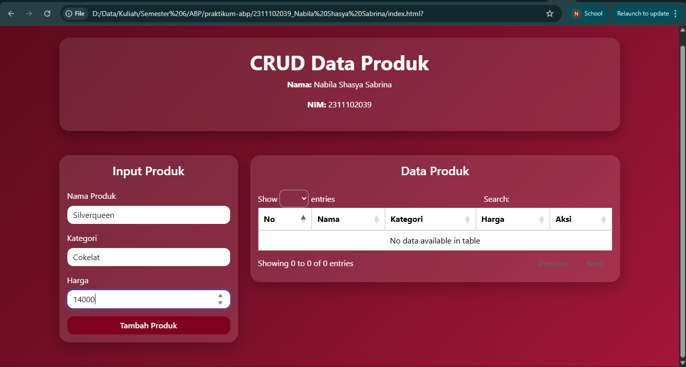
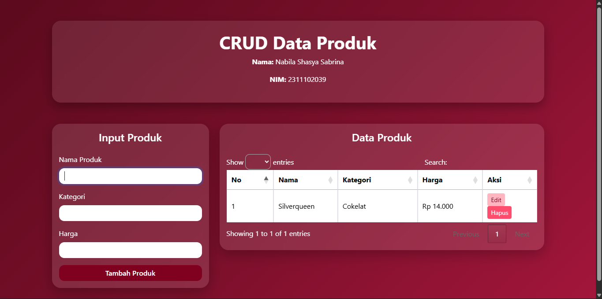
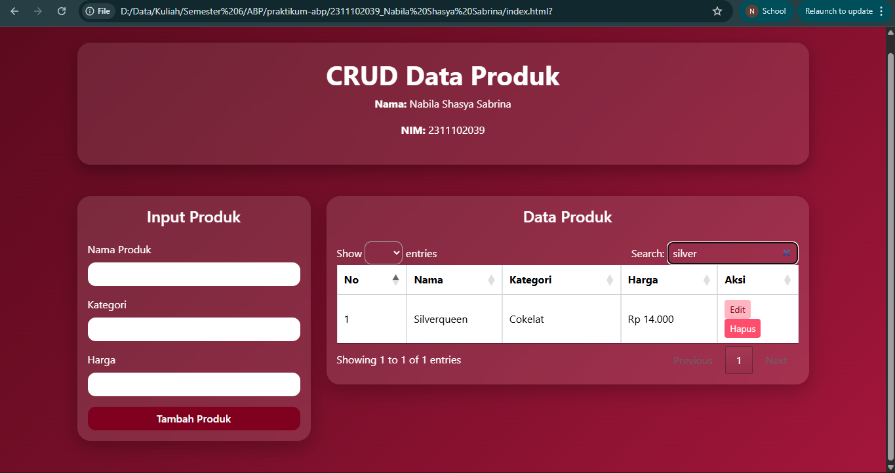
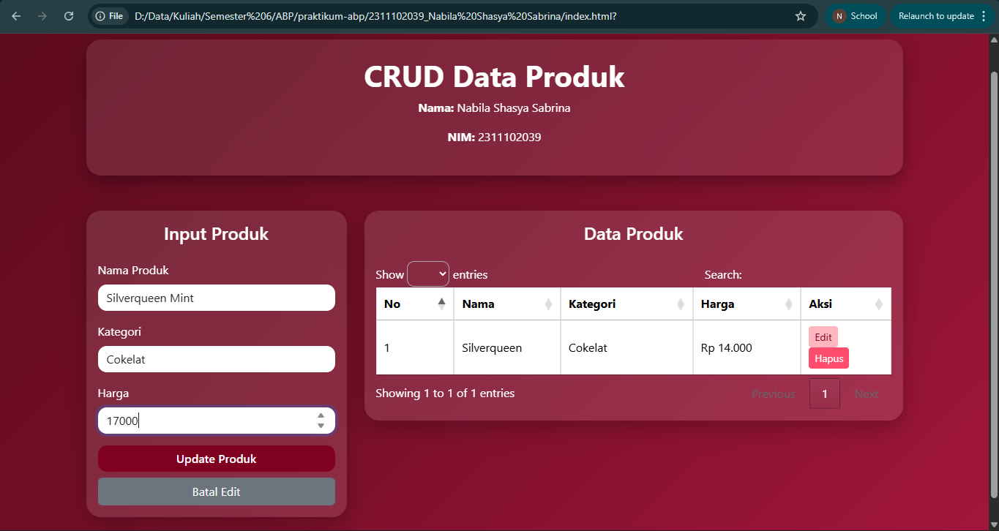
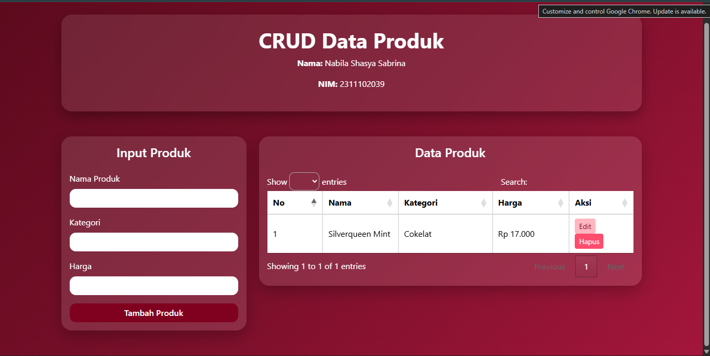
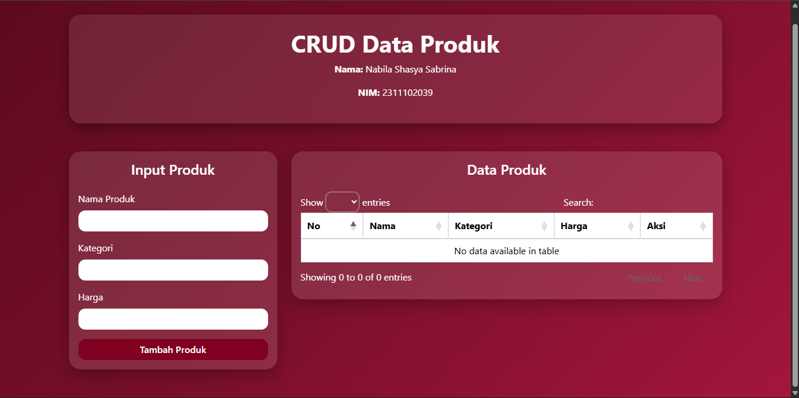

<div align="center">
  <br />
  <h1>LAPORAN PRAKTIKUM <br>APLIKASI BERBASIS PLATFORM</h1>
  <br />
  <h3>DATA PRODUK <br> Bootstrap, jQuery DataTables & JavaScript</h3>
  <br />
  <br />
  
  <br />
  <br />
  <h3>Disusun Oleh :</h3>
  <p>
    <strong>Nabila Shasya Sabrina</strong><br>
    <strong>2311102039</strong><br>
    <strong>S1 IF-11-01</strong>
  </p>
  <br />
  <br />
  <h3>Dosen Pengampu :</h3>
  <p>
    <strong>Dimas Fanny Hebrasianto Permadi, S.ST., M.Kom</strong>
  </p>
  <br />
  <br />
  <h4>Asisten Praktikum :</h4>
  <strong>Apri Pandu Wicaksono</strong> <br>
  <strong>Rangga Pradarrell Fathi</strong>
  <br />
  <h3>LABORATORIUM HIGH PERFORMANCE
 <br>FAKULTAS INFORMATIKA <br>UNIVERSITAS TELKOM PURWOKERTO <br>2026</h3>
</div>

---

## 1. Dasar Teori
CRUD (Create, Read, Update, Delete) merupakan empat operasi dasar yang digunakan dalam pengelolaan data pada sebuah sistem informasi atau aplikasi. Operasi Create digunakan untuk menambahkan data baru ke dalam sistem, Read digunakan untuk menampilkan atau mengambil data yang telah tersimpan, Update digunakan untuk memperbarui data yang sudah ada, dan Delete digunakan untuk menghapus data yang tidak diperlukan. Pada pengembangan aplikasi web, konsep CRUD sangat penting karena memungkinkan pengguna melakukan manipulasi data secara dinamis melalui antarmuka aplikasi.

Bootstrap adalah framework CSS bersifat open-source yang digunakan untuk mempermudah proses pembuatan antarmuka (user interface) pada aplikasi web. Bootstrap menyediakan berbagai komponen siap pakai seperti form, tombol, kartu (card), tabel, serta sistem grid yang responsif. Dengan memanfaatkan kelas-kelas yang telah disediakan oleh Bootstrap, pengembang dapat membuat tampilan aplikasi yang konsisten, responsif, dan lebih cepat tanpa harus menulis banyak kode CSS dari awal.

jQuery DataTables merupakan plugin berbasis jQuery yang berfungsi untuk meningkatkan kemampuan tabel HTML. Dengan menggunakan DataTables, tabel dapat memiliki berbagai fitur tambahan seperti pencarian data (search), pengurutan data berdasarkan kolom (sorting), serta pembagian halaman (pagination). Plugin ini sangat membantu dalam menampilkan data dalam jumlah banyak agar tetap mudah dibaca dan diakses oleh pengguna.

Object Mapping adalah teknik penyimpanan data dalam JavaScript menggunakan struktur objek. Dalam metode ini, setiap data disimpan sebagai pasangan key dan value, di mana key berfungsi sebagai identitas unik dari data tersebut. Contohnya seperti { "p1": { id, nama, kategori, harga } }. Pendekatan ini mempermudah proses pengaksesan, pembaruan, dan penghapusan data karena setiap data dapat diakses secara langsung menggunakan key yang dimilikinya.

---

## 2. Penjelasan Code HTML, CSS. dan JS

---

### Code HTML

```html
<!DOCTYPE html>
<html lang="id">
<head>

<meta charset="UTF-8">
<meta name="viewport" content="width=device-width, initial-scale=1.0">

<title>CRUD Data Produk</title>

<!-- Font -->
<link href="https://fonts.googleapis.com/css2?family=Poppins:wght@300;400;500;600;700&display=swap" rel="stylesheet">

<!-- Bootstrap -->
<link href="https://cdn.jsdelivr.net/npm/bootstrap@5.3.3/dist/css/bootstrap.min.css" rel="stylesheet">

<!-- DataTables -->
<link rel="stylesheet" href="https://cdn.datatables.net/1.13.8/css/jquery.dataTables.min.css">

<link rel="stylesheet" href="style.css">

</head>

<body>

<div class="container py-5">

<div class="header-box text-center mb-5">

<h1 class="fw-bold">CRUD Data Produk</h1>

<p><strong>Nama:</strong> Nabila Shasya Sabrina</p>
<p><strong>NIM:</strong> 2311102039</p>

</div>

<div class="row g-4">

<!-- FORM -->

<div class="col-lg-4">

<div class="card custom-card">

<div class="card-body">

<h4 class="mb-4 text-center">Input Produk</h4>

<form id="productForm">

<input type="hidden" id="productId">

<div class="mb-3">
<label class="form-label">Nama Produk</label>
<input type="text" class="form-control" id="namaProduk" required>
</div>

<div class="mb-3">
<label class="form-label">Kategori</label>
<input type="text" class="form-control" id="kategoriProduk" required>
</div>

<div class="mb-3">
<label class="form-label">Harga</label>
<input type="number" class="form-control" id="hargaProduk" required>
</div>

<div class="d-grid gap-2">

<button type="submit" class="btn btn-maroon" id="submitBtn">
Tambah Produk
</button>

<button type="button" class="btn btn-secondary" id="cancelEditBtn" style="display:none">
Batal Edit
</button>

</div>

</form>

</div>
</div>
</div>

<!-- TABEL -->

<div class="col-lg-8">

<div class="card custom-card">

<div class="card-body">

<h4 class="mb-4 text-center">Data Produk</h4>

<div class="table-responsive">

<table id="productTable" class="table table-bordered align-middle">

<thead class="table-maroon">

<tr>
<th>No</th>
<th>Nama</th>
<th>Kategori</th>
<th>Harga</th>
<th>Aksi</th>
</tr>

</thead>

<tbody></tbody>

</table>

</div>
</div>
</div>
</div>

</div>
</div>

<!-- JS -->

<script src="https://code.jquery.com/jquery-3.7.1.min.js"></script>

<script src="https://cdn.jsdelivr.net/npm/bootstrap@5.3.3/dist/js/bootstrap.bundle.min.js"></script>

<script src="https://cdn.datatables.net/1.13.8/js/jquery.dataTables.min.js"></script>

<script src="script.js"></script>

</body>
</html>
```

---

### Code CSS

```css
body{
background: linear-gradient(135deg,#5c0a1d,#7a0f2a,#a3163b);
min-height:100vh;
font-family: 'Segoe UI',sans-serif;
color:white;
}

.header-box{
background:rgba(255,255,255,0.1);
backdrop-filter:blur(10px);
padding:25px;
border-radius:20px;
box-shadow:0 10px 25px rgba(0,0,0,0.3);
}

.custom-card{
background:rgba(255,255,255,0.12);
backdrop-filter:blur(12px);
border:none;
border-radius:20px;
color:white;
box-shadow:0 10px 30px rgba(0,0,0,0.25);
}

.form-control{
border-radius:12px;
border:none;
}

.btn-maroon{
background:#800020;
color:white;
border:none;
border-radius:12px;
font-weight:600;
transition:0.3s;
}

.btn-maroon:hover{
background:#a1123a;
transform:scale(1.03);
}

.table-maroon{
background:#800020;
color:white;
}

.table{
color:white;
}

.dataTables_wrapper .dataTables_filter input{
border-radius:10px;
border:none;
padding:6px 10px;
}

.dataTables_wrapper .dataTables_length select{
border-radius:10px;
padding:5px;
}

.btn-warning{
background:#ffb6c1;
border:none;
color:#800020;
}

.btn-danger{
background:#ff4d6d;
border:none;
}
```

---

### Code JS

```javascript
let products = {};
let productCounter = 1;
let dataTable;

$(document).ready(function(){

dataTable = $("#productTable").DataTable({
pageLength:5
});

renderTable();

$("#productForm").on("submit",function(e){

e.preventDefault();

const id = $("#productId").val();
const nama = $("#namaProduk").val().trim();
const kategori = $("#kategoriProduk").val().trim();
const harga = $("#hargaProduk").val().trim();

if(!nama || !kategori || !harga){
alert("Semua field harus diisi!");
return;
}

if(id){
updateProduct(id,nama,kategori,harga);
}else{
createProduct(nama,kategori,harga);
}

resetForm();
renderTable();

});

$("#cancelEditBtn").click(function(){
resetForm();
});

});

function createProduct(nama,kategori,harga){

const id = "p"+productCounter++;

products[id] = {
id:id,
nama:nama,
kategori:kategori,
harga:Number(harga)
};

}

function readProducts(){
return Object.values(products);
}

function updateProduct(id,nama,kategori,harga){

if(products[id]){

products[id].nama = nama;
products[id].kategori = kategori;
products[id].harga = Number(harga);

}

}

function deleteProduct(id){

if(confirm("Apakah yakin ingin menghapus data ini?")){

delete products[id];
renderTable();

}

}

function renderTable(){

dataTable.clear();

const productList = readProducts();

productList.forEach((product,index)=>{

dataTable.row.add([

index+1,
product.nama,
product.kategori,
"Rp "+product.harga.toLocaleString("id-ID"),

`
<button class="btn btn-warning btn-sm me-1" onclick="editProduct('${product.id}')">
Edit
</button>

<button class="btn btn-danger btn-sm" onclick="deleteProduct('${product.id}')">
Hapus
</button>
`

]);

});

dataTable.draw();

}

function editProduct(id){

const product = products[id];

if(product){

$("#productId").val(product.id);
$("#namaProduk").val(product.nama);
$("#kategoriProduk").val(product.kategori);
$("#hargaProduk").val(product.harga);

$("#submitBtn").text("Update Produk");
$("#cancelEditBtn").show();

}

}

function resetForm(){

$("#productForm")[0].reset();
$("#productId").val("");

$("#submitBtn").text("Tambah Produk");
$("#cancelEditBtn").hide();

}
```

---

### Hasil Tampilan

#### 1. Tampilan Awal


#### 2. Input Data & Data Berhasil Ditambahkan




#### 3. Fitur Pencarian (Search)



#### 4. Edit Data




#### 5. Hapus Data




---

### Penjelasan Kode

#### 1. HTML 
Pada bagian awal dokumen digunakan deklarasi <!DOCTYPE html> yang berfungsi untuk memberitahu browser bahwa dokumen yang digunakan adalah HTML5.

Tag <head> berisi berbagai konfigurasi halaman seperti pengaturan karakter menggunakan <meta charset="UTF-8"> serta pengaturan tampilan responsif menggunakan <meta name="viewport">. Selain itu pada bagian ini juga dilakukan pemanggilan beberapa library eksternal seperti Bootstrap, DataTables, serta font Poppins dari Google Fonts.

Pada bagian <body> terdapat sebuah container utama yang dibuat menggunakan class Bootstrap container dan py-5. Container ini berfungsi untuk menempatkan seluruh konten halaman agar tersusun dengan rapi.

Selanjutnya terdapat bagian header yang menampilkan judul aplikasi CRUD serta identitas pembuat. Header ini dibuat menggunakan elemen <div> dengan class header-box yang telah diberi styling menggunakan CSS.

Setelah itu terdapat layout dua kolom menggunakan sistem grid Bootstrap yaitu row dan col-lg-4 serta col-lg-8. Kolom pertama berisi form input produk, sedangkan kolom kedua berisi tabel data produk.

Form input produk dibuat menggunakan elemen <form> yang memiliki id productForm. Di dalam form terdapat beberapa input yaitu:

Nama Produk

Kategori Produk

Harga Produk

Setiap input menggunakan class form-control dari Bootstrap agar tampilannya lebih rapi.

Selain itu terdapat dua tombol yaitu tombol Tambah Produk yang berfungsi untuk menambahkan data baru serta tombol Batal Edit yang digunakan ketika pengguna ingin membatalkan proses pengeditan data.

Pada bagian tabel digunakan elemen <table> dengan id productTable. Tabel ini akan digunakan oleh plugin DataTables untuk menampilkan data produk secara dinamis.

Di bagian akhir dokumen HTML dilakukan pemanggilan beberapa file JavaScript seperti jQuery, Bootstrap JS, DataTables JS, serta file JavaScript utama script.js yang berisi logika program CRUD.

---

#### 2. CSS
Pada bagian awal dokumen digunakan deklarasi <!DOCTYPE html> yang berfungsi untuk memberitahu browser bahwa dokumen yang digunakan adalah HTML5.

Tag <head> berisi berbagai konfigurasi halaman seperti pengaturan karakter menggunakan <meta charset="UTF-8"> serta pengaturan tampilan responsif menggunakan <meta name="viewport">. Selain itu pada bagian ini juga dilakukan pemanggilan beberapa library eksternal seperti Bootstrap, DataTables, serta font Poppins dari Google Fonts.

Pada bagian <body> terdapat sebuah container utama yang dibuat menggunakan class Bootstrap container dan py-5. Container ini berfungsi untuk menempatkan seluruh konten halaman agar tersusun dengan rapi.

Selanjutnya terdapat bagian header yang menampilkan judul aplikasi CRUD serta identitas pembuat. Header ini dibuat menggunakan elemen <div> dengan class header-box yang telah diberi styling menggunakan CSS.

Setelah itu terdapat layout dua kolom menggunakan sistem grid Bootstrap yaitu row dan col-lg-4 serta col-lg-8. Kolom pertama berisi form input produk, sedangkan kolom kedua berisi tabel data produk.

Form input produk dibuat menggunakan elemen <form> yang memiliki id productForm. Di dalam form terdapat beberapa input yaitu:

Nama Produk

Kategori Produk

Harga Produk

Setiap input menggunakan class form-control dari Bootstrap agar tampilannya lebih rapi.

Selain itu terdapat dua tombol yaitu tombol Tambah Produk yang berfungsi untuk menambahkan data baru serta tombol Batal Edit yang digunakan ketika pengguna ingin membatalkan proses pengeditan data.

Pada bagian tabel digunakan elemen <table> dengan id productTable. Tabel ini akan digunakan oleh plugin DataTables untuk menampilkan data produk secara dinamis.

Di bagian akhir dokumen HTML dilakukan pemanggilan beberapa file JavaScript seperti jQuery, Bootstrap JS, DataTables JS, serta file JavaScript utama script.js yang berisi logika program CRUD.

---

#### JS

File JavaScript berfungsi untuk mengatur logika program CRUD pada aplikasi.

Pada bagian awal kode dibuat sebuah objek bernama products yang digunakan untuk menyimpan seluruh data produk. Selain itu terdapat variabel productCounter yang berfungsi untuk memberikan id unik pada setiap produk yang ditambahkan.

Ketika halaman selesai dimuat, fungsi $(document).ready() akan dijalankan. Pada bagian ini juga dilakukan inisialisasi plugin DataTables pada tabel dengan id productTable.

Selanjutnya terdapat event listener pada form dengan id productForm. Ketika form disubmit, event default akan dicegah menggunakan e.preventDefault() agar halaman tidak melakukan refresh.

Data dari input form kemudian diambil menggunakan jQuery seperti $("#namaProduk").val() dan disimpan ke dalam variabel. Jika semua input sudah terisi, program akan menentukan apakah data tersebut merupakan data baru atau data yang sedang diedit.

Jika data merupakan data baru, maka fungsi createProduct() akan dijalankan untuk menambahkan data produk ke dalam objek products. Namun jika data sedang diedit, maka fungsi updateProduct() akan dijalankan untuk memperbarui data yang sudah ada.

Fungsi renderTable() digunakan untuk menampilkan seluruh data produk ke dalam tabel. Data yang tersimpan di dalam objek products akan diubah menjadi array menggunakan Object.values() kemudian dimasukkan ke dalam tabel DataTables menggunakan dataTable.row.add().

Pada setiap baris tabel juga ditambahkan dua tombol aksi yaitu tombol Edit dan Hapus. Tombol Edit akan memanggil fungsi editProduct() untuk memasukkan kembali data ke dalam form sehingga dapat diperbarui. Sedangkan tombol Hapus akan memanggil fungsi deleteProduct() untuk menghapus data dari objek products.

Setelah data ditambahkan, diubah, atau dihapus, fungsi renderTable() akan dipanggil kembali agar tampilan tabel diperbarui sesuai dengan data terbaru.

Dengan demikian aplikasi ini mampu melakukan operasi Create, Read, Update, dan Delete terhadap data produk secara dinamis tanpa perlu melakukan reload halaman.

---

## 3. Referensi

- [Bootstrap 5 Documentation](https://getbootstrap.com/docs/5.3/)
- [jQuery DataTables Documentation](https://datatables.net/manual/)
- [Bootstrap Icons](https://icons.getbootstrap.com/)
