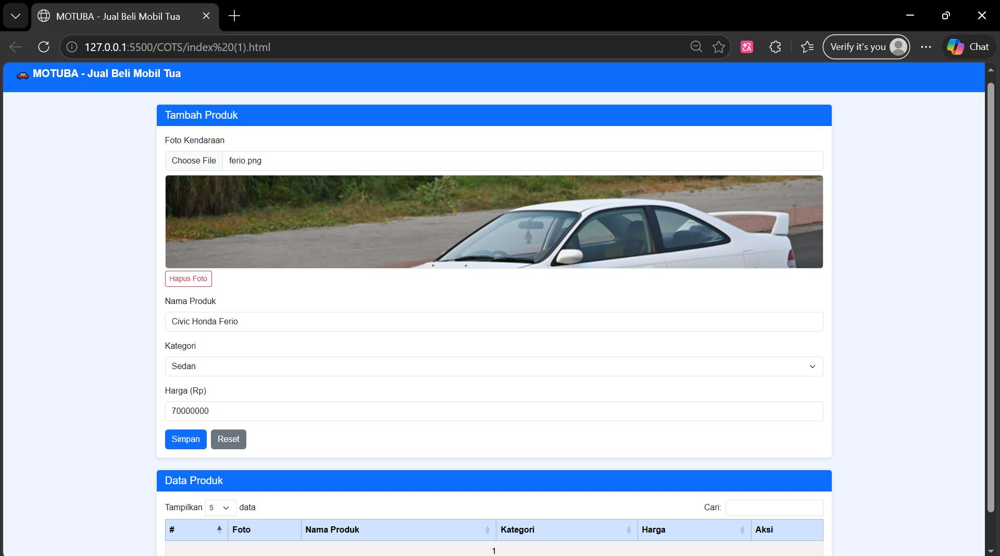
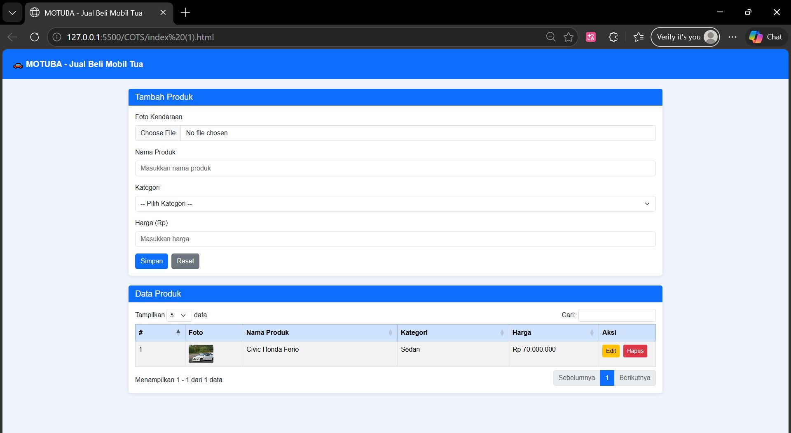
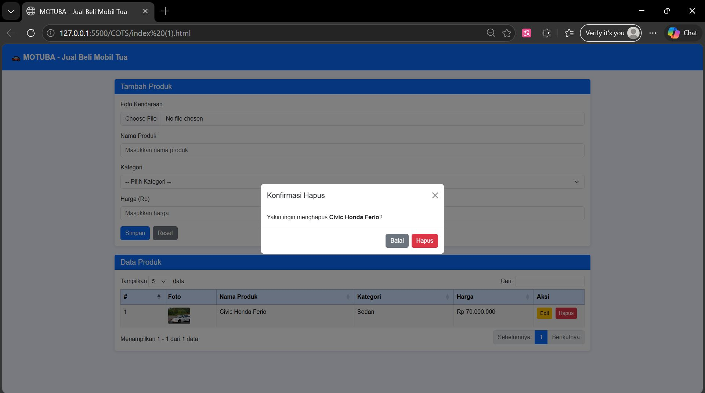
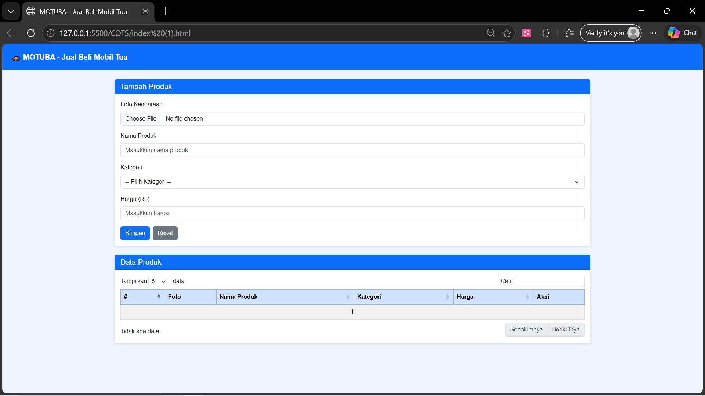
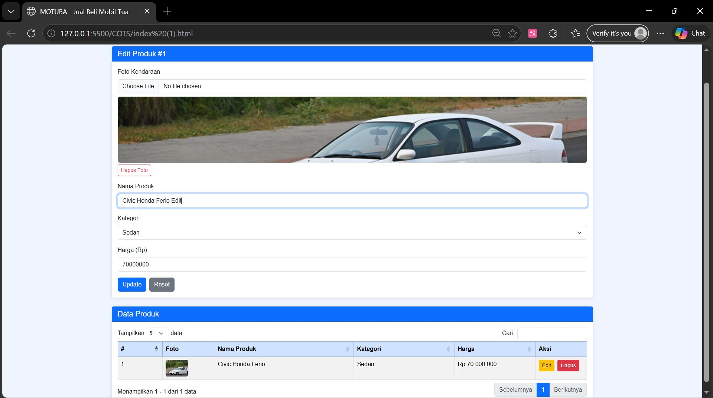
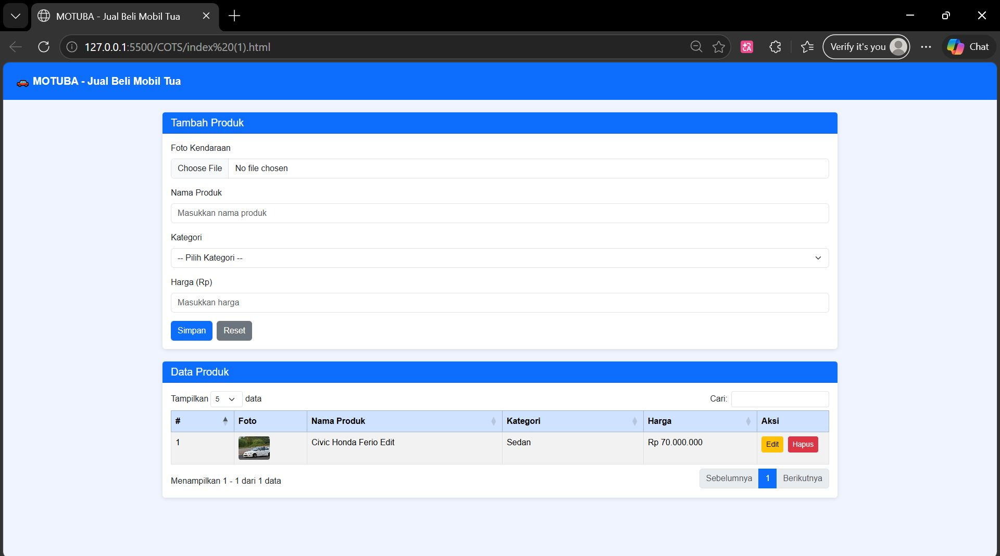

<div align="center">

# LAPORAN PRAKTIKUM  
# APLIKASI BERBASIS PLATFORM

## TES COTS 
## WEB MANAGEMENT PRODUCT


### Disusun Oleh
**Raihan Ramadhan**  
2311102040  
S1 IF-11-REG01  

### Dosen Pengampu
**Dimas Fanny Hebrasianto Permadi, S.ST., M.Kom**

### Asisten Praktikum
Apri Pandu Wicaksono  
Rangga Pradarrell Fathi  

### LABORATORIUM HIGH PERFORMANCE  
FAKULTAS INFORMATIKA  
UNIVERSITAS TELKOM PURWOKERTO  
2026

</div>

---
# Dasar Teori
---
## 1. CRUD (Create, Read, Update, Delete)

CRUD merupakan singkatan dari **Create, Read, Update, dan Delete**, yaitu empat operasi dasar yang digunakan untuk mengelola data dalam suatu sistem atau aplikasi pengolah data. Konsep CRUD biasanya diterapkan dalam **sistem informasi, aplikasi web, maupun aplikasi mobile** untuk mengatur interaksi dengan database.

Setiap operasi CRUD memiliki fungsi yang berbeda, yaitu:

- **Create**: menambahkan data baru ke dalam database.
- **Read**: menampilkan atau membaca data yang tersimpan di database.
- **Update**: memperbarui atau mengubah data yang sudah ada.
- **Delete**: menghapus data dari database.

Dengan adanya operasi CRUD, pengelolaan data dalam suatu sistem dapat dilakukan secara lebih terstruktur dan efisien.

---

## 2. Bootstrap

Bootstrap merupakan **framework front-end open source** yang menyediakan kumpulan kode **CSS, JavaScript, dan berbagai komponen antarmuka pengguna (UI)** yang siap digunakan, seperti tombol, formulir, navigasi, serta sistem grid. Framework ini memudahkan pengembang dalam membuat desain web yang **konsisten, rapi, dan responsif**.

Dengan menggunakan Bootstrap, tampilan website dapat **secara otomatis menyesuaikan ukuran layar perangkat**, baik pada perangkat mobile, tablet, maupun desktop, sehingga meningkatkan kenyamanan pengguna dalam mengakses website.

---

## 3. jQuery

jQuery adalah **library JavaScript open-source** yang dirancang untuk menyederhanakan penggunaan JavaScript dalam pengembangan web. Library ini memungkinkan pengembang untuk menulis kode dengan lebih **singkat, cepat, dan efisien** dibandingkan menggunakan JavaScript murni.

jQuery sering digunakan untuk berbagai kebutuhan seperti:

- Manipulasi elemen HTML
- Pengelolaan event
- Animasi
- Interaksi dengan AJAX

Dengan demikian, jQuery membantu mempercepat proses pengembangan aplikasi web.

---

## 4. DataTables

DataTables merupakan **library JavaScript yang digunakan untuk meningkatkan fungsi tabel HTML** agar menjadi lebih interaktif dan dinamis. Library ini dibangun dengan konsep **progressive enhancement**, sehingga dapat menambahkan berbagai fitur canggih pada tabel HTML yang sudah ada.

Beberapa fitur yang disediakan oleh DataTables antara lain:

- **Searching** (pencarian data)
- **Sorting** (pengurutan data)
- **Pagination** (pembagian halaman)
- **Pengolahan data secara dinamis**

Dengan menggunakan DataTables, tampilan tabel pada website menjadi **lebih mudah digunakan, interaktif, dan efisien dalam menampilkan data dalam jumlah besar**.

## 1. Struktur Dasar HTML

Berikut adalah kode lengkap dari file `index.html`.

```html
<!DOCTYPE html>
<html lang="id">
<head>
  <meta charset="UTF-8"/>
  <meta name="viewport" content="width=device-width, initial-scale=1.0"/>
  <title>MOTUBA - Jual Beli Mobil Tua</title>

  <!-- Bootstrap 5 -->
  <link href="https://cdn.jsdelivr.net/npm/bootstrap@5.3.3/dist/css/bootstrap.min.css" rel="stylesheet"/>
  <!-- DataTables Bootstrap 5 -->
  <link href="https://cdn.datatables.net/1.13.8/css/dataTables.bootstrap5.min.css" rel="stylesheet"/>

  <link rel="stylesheet" href="style.css"/>
</head>
<body>

  <!-- NAVBAR -->
  <nav class="navbar navbar-dark bg-primary px-4 py-3 mb-4">
    <span class="navbar-brand fw-bold fs-5">🚗 MOTUBA - Jual Beli Mobil Tua</span>
  </nav>

  <div class="container">

    <!-- FORM INPUT -->
    <div class="card mb-4">
      <div class="card-header bg-primary text-white">
        <h5 class="mb-0" id="formJudul">Tambah Produk</h5>
      </div>
      <div class="card-body">
        <input type="hidden" id="editId"/>

        <div class="mb-3">
          <label class="form-label">Foto Kendaraan</label>
          <input type="file" class="form-control" id="fotoInput" accept="image/*"/>
          <div id="fotoPreview" class="mt-2" style="display:none">
            
            <button type="button" class="btn btn-sm btn-outline-danger mt-1" onclick="hapusFoto()">Hapus Foto</button>
          </div>
        </div>

        <div class="mb-3">
          <label class="form-label">Nama Produk</label>
          <input type="text" class="form-control" id="namaProduk" placeholder="Masukkan nama produk"/>
        </div>

        <div class="mb-3">
          <label class="form-label">Kategori</label>
          <select class="form-select" id="kategori">
            <option value="" disabled selected>-- Pilih Kategori --</option>
            <option value="Sedan">Sedan</option>
            <option value="SUV">SUV / Jeep</option>
            <option value="Pickup">Pickup / Truk</option>
            <option value="Minivan">Minivan / MPV</option>
            <option value="Sport">Sport / Coupe</option>
            <option value="Lainnya">Lainnya</option>
          </select>
        </div>

        <div class="mb-3">
          <label class="form-label">Harga (Rp)</label>
          <input type="number" class="form-control" id="harga" placeholder="Masukkan harga" min="0"/>
        </div>

        <div class="d-flex gap-2">
          <button class="btn btn-primary" onclick="simpanProduk()">
            <span id="btnText">Simpan</span>
          </button>
          <button class="btn btn-secondary" onclick="resetForm()">Reset</button>
        </div>
      </div>
    </div>

    <!-- TABEL DATA PRODUK -->
    <div class="card">
      <div class="card-header bg-primary text-white">
        <h5 class="mb-0">Data Produk</h5>
      </div>
      <div class="card-body">
        <table id="tabelProduk" class="table table-bordered table-striped w-100">
          <thead class="table-primary">
            <tr>
              <th>#</th>
              <th>Foto</th>
              <th>Nama Produk</th>
              <th>Kategori</th>
              <th>Harga</th>
              <th>Aksi</th>
            </tr>
          </thead>
          <tbody></tbody>
        </table>
      </div>
    </div>

  </div>

  <!-- MODAL HAPUS -->
  <div class="modal fade" id="modalHapus" tabindex="-1">
    <div class="modal-dialog modal-dialog-centered">
      <div class="modal-content">
        <div class="modal-header">
          <h5 class="modal-title">Konfirmasi Hapus</h5>
          <button type="button" class="btn-close" data-bs-dismiss="modal"></button>
        </div>
        <div class="modal-body">
          Yakin ingin menghapus <strong id="namaHapus"></strong>?
        </div>
        <div class="modal-footer">
          <button class="btn btn-secondary" data-bs-dismiss="modal">Batal</button>
          <button class="btn btn-danger" id="btnKonfirmasiHapus">Hapus</button>
        </div>
      </div>
    </div>
  </div>

  <!-- Scripts -->
  <script src="https://code.jquery.com/jquery-3.7.1.min.js"></script>
  <script src="https://cdn.jsdelivr.net/npm/bootstrap@5.3.3/dist/js/bootstrap.bundle.min.js"></script>
  <script src="https://cdn.datatables.net/1.13.8/js/jquery.dataTables.min.js"></script>
  <script src="https://cdn.datatables.net/1.13.8/js/dataTables.bootstrap5.min.js"></script>
  <script src="script.js"></script>

</body>
</html>
```

---

## Penjelasan Struktur `index.html`
Bagian <head> berisi pengaturan dasar halaman seperti encoding karakter (UTF-8), pengaturan tampilan di perangkat mobile (viewport), dan judul tab browser. Di sini juga dimuat tiga file CSS dari luar, yaitu Bootstrap 5 untuk tampilan komponen, DataTables untuk styling tabel, dan style.css milik kita sendiri.
Di bagian <body>, halaman dibuka dengan sebuah navbar menggunakan class Bootstrap navbar navbar-dark bg-primary yang menampilkan nama aplikasi MOTUBA dengan latar belakang biru. Di bawah navbar ada sebuah container yang membungkus seluruh konten utama.
Konten pertama adalah card form input. Di dalamnya terdapat sebuah input type="hidden" dengan id editId yang fungsinya menyimpan id produk saat mode edit — jika terisi berarti sedang edit, jika kosong berarti sedang tambah baru. Di atas field Nama Produk terdapat input file untuk upload foto (fotoInput) beserta sebuah div preview (fotoPreview) yang awalnya disembunyikan dengan display:none dan baru muncul setelah foto dipilih. Tiga field utama sesuai syarat tugas ada di sini yaitu Nama Produk (text), Kategori (select dropdown), dan Harga (number). Ada dua tombol di bawahnya, tombol Simpan yang memanggil fungsi simpanProduk() dan tombol Reset yang memanggil resetForm().
Konten kedua adalah card tabel data produk. Di dalamnya terdapat elemen <table> dengan id tabelProduk yang akan diinisialisasi oleh jQuery DataTables di JavaScript. Tabel ini memiliki enam kolom yaitu nomor urut, foto, nama produk, kategori, harga, dan aksi. Bagian <tbody> dibiarkan kosong karena semua isi baris akan dimasukkan secara dinamis oleh JavaScript.
Di bawah konten utama terdapat sebuah modal Bootstrap dengan id modalHapus. Modal ini muncul sebagai popup konfirmasi setiap kali tombol Hapus diklik, menampilkan nama produk yang akan dihapus dan dua pilihan tombol yaitu Batal dan Hapus. Terakhir di bagian paling bawah dimuat empat file JavaScript secara berurutan: jQuery, Bootstrap JS, DataTables, lalu script.js milik kita — urutannya penting karena script.js bergantung pada ketiga library sebelumnya.

## 2. JS

Berikut adalah kode lengkap dari file `script.js`.

```js
/* MOTUBA - script.js */

// Penyimpanan data dengan mapping object
const produkMap = {};
let nextId = 1;
let deleteTarget = null;
let currentFoto = null; // simpan base64 foto
let dt;
let modalHapus;

$(document).ready(function () {

  // Inisialisasi DataTables
  dt = $('#tabelProduk').DataTable({
    language: {
      search:       'Cari:',
      lengthMenu:   'Tampilkan _MENU_ data',
      info:         'Menampilkan _START_ - _END_ dari _TOTAL_ data',
      infoEmpty:    'Tidak ada data',
      paginate:     { previous: 'Sebelumnya', next: 'Berikutnya' },
      emptyTable:   'Belum ada data produk',
      zeroRecords:  'Data tidak ditemukan'
    },
    columnDefs: [{ orderable: false, targets: [1, 5] }],
    pageLength: 5,
    lengthMenu: [5, 10, 25],
    order: [[0, 'asc']],
    drawCallback: renumberRows
  });

  // Inisialisasi Modal
  modalHapus = new bootstrap.Modal(document.getElementById('modalHapus'));

  // Preview foto saat file dipilih
  document.getElementById('fotoInput').addEventListener('change', function () {
    const file = this.files[0];
    if (!file) return;
    if (file.size > 5 * 1024 * 1024) {
      alert('Ukuran file maksimal 5MB!');
      this.value = '';
      return;
    }
    const reader = new FileReader();
    reader.onload = function (e) {
      currentFoto = e.target.result;
      document.getElementById('previewImg').src = currentFoto;
      document.getElementById('fotoPreview').style.display = 'block';
    };
    reader.readAsDataURL(file);
  });

  // Tombol konfirmasi hapus
  document.getElementById('btnKonfirmasiHapus').addEventListener('click', function () {
    if (deleteTarget === null) return;

    const id   = deleteTarget;
    const nama = produkMap[id]?.namaProduk || '';

    // Hapus dari mapping object
    delete produkMap[id];

    // Hapus dari tabel
    dt.rows().every(function () {
      const d = this.data();
      if (d[4] && d[4].includes(`hapusProduk(${id})`)) {
        this.remove();
        return false;
      }
    });
    dt.draw(false);

    modalHapus.hide();
    deleteTarget = null;
    alert(`Produk "${nama}" berhasil dihapus.`);
  });

});

// Simpan produk (tambah atau update)
function simpanProduk() {
  const nama     = $('#namaProduk').val().trim();
  const kategori = $('#kategori').val();
  const harga    = parseInt($('#harga').val());
  const editId   = $('#editId').val();

  // Validasi
  if (!nama)               return alert('Nama produk wajib diisi!');
  if (!kategori)           return alert('Pilih kategori terlebih dahulu!');
  if (!harga || harga < 0) return alert('Masukkan harga yang valid!');

  if (editId) {
    const id   = parseInt(editId);
    const foto = currentFoto !== null ? currentFoto : produkMap[id].foto;
    produkMap[id] = { id, namaProduk: nama, kategori, harga, foto };

    dt.rows().every(function () {
      const d = this.data();
      if (d[5] && d[5].includes(`editProduk(${id})`)) {
        this.data(buatBaris(id, nama, kategori, harga, foto)).draw(false);
        return false;
      }
    });
    alert(`Produk "${nama}" berhasil diperbarui.`);
  } else {
    const id = nextId++;
    produkMap[id] = { id, namaProduk: nama, kategori, harga, foto: currentFoto };
    dt.row.add(buatBaris(id, nama, kategori, harga, currentFoto)).draw(false);
    alert(`Produk "${nama}" berhasil ditambahkan.`);
  }

  resetForm();
}

// Buat array data untuk satu baris tabel
function buatBaris(id, nama, kategori, harga, foto) {
  const gambar = foto
    ? ``
    : `<span class="text-muted small">-</span>`;

  return [
    '',
    gambar,
    nama,
    kategori,
    formatRupiah(harga),
    `<button class="btn btn-warning btn-sm me-1" onclick="editProduk(${id})">Edit</button>
     <button class="btn btn-danger btn-sm"       onclick="hapusProduk(${id})">Hapus</button>`
  ];
}

// Edit — isi form dengan data yang dipilih
function editProduk(id) {
  const p = produkMap[id];
  if (!p) return;

  $('#editId').val(id);
  $('#namaProduk').val(p.namaProduk);
  $('#kategori').val(p.kategori);
  $('#harga').val(p.harga);

  currentFoto = p.foto || null;
  if (p.foto) {
    document.getElementById('previewImg').src = p.foto;
    document.getElementById('fotoPreview').style.display = 'block';
  } else {
    document.getElementById('fotoPreview').style.display = 'none';
  }
  document.getElementById('fotoInput').value = '';

  document.getElementById('formJudul').textContent = `Edit Produk #${id}`;
  document.getElementById('btnText').textContent   = 'Update';
  window.scrollTo({ top: 0, behavior: 'smooth' });
}

// Hapus — tampilkan modal konfirmasi
function hapusProduk(id) {
  deleteTarget = id;
  const p = produkMap[id];
  document.getElementById('namaHapus').textContent = p ? p.namaProduk : 'produk ini';
  modalHapus.show();
}

// Reset form ke kondisi awal
function resetForm() {
  $('#editId').val('');
  $('#namaProduk').val('');
  $('#kategori').val('');
  $('#harga').val('');
  currentFoto = null;
  document.getElementById('fotoInput').value = '';
  document.getElementById('fotoPreview').style.display = 'none';
  document.getElementById('previewImg').src = '';
  document.getElementById('formJudul').textContent = 'Tambah Produk';
  document.getElementById('btnText').textContent   = 'Simpan';
}

// Hapus foto dari form
function hapusFoto() {
  currentFoto = null;
  document.getElementById('fotoInput').value = '';
  document.getElementById('fotoPreview').style.display = 'none';
  document.getElementById('previewImg').src = '';
}

// Lihat foto ukuran penuh (tab baru)
function lihatFoto(src) {
  const win = window.open();
  win.document.write(``);
}

// Penomoran baris ulang setelah setiap draw
function renumberRows() {
  let i = 1;
  $('#tabelProduk tbody tr').each(function () {
    $('td:first', this).text(i++);
  });
}

// Format angka ke Rupiah
function formatRupiah(n) {
  return 'Rp ' + parseInt(n).toLocaleString('id-ID');
}
```

---

## Penjelasan Struktur JS

File **script.js** berisi logika utama aplikasi untuk mengelola data produk mobil. Pada bagian awal dideklarasikan beberapa variabel global seperti `produkMap` sebagai penyimpanan data produk dalam bentuk object, `nextId` sebagai penghitung id otomatis, `deleteTarget` untuk menyimpan id produk yang akan dihapus, dan `currentFoto` untuk menyimpan foto dalam format base64. Semua kode utama dijalankan setelah halaman selesai dimuat melalui `$(document).ready()`, yang menginisialisasi **DataTables** pada tabel produk dengan pengaturan bahasa Indonesia, pagination, serta penonaktifan sorting pada kolom foto dan aksi. Selain itu juga diinisialisasi **Bootstrap Modal** untuk konfirmasi hapus dan event listener pada input foto untuk menampilkan preview gambar serta validasi ukuran maksimal 5MB. Fungsi `simpanProduk()` digunakan untuk menambahkan atau memperbarui data produk dengan validasi input, lalu menyimpan data ke `produkMap` dan memperbarui tabel DataTables. Fungsi `buatBaris()` membuat struktur data satu baris tabel termasuk tombol Edit dan Hapus. Fungsi `editProduk()` mengisi kembali form dengan data yang dipilih untuk proses update, sedangkan `hapusProduk()` menampilkan modal konfirmasi sebelum penghapusan data. Fungsi `resetForm()` mengembalikan form ke kondisi awal, `hapusFoto()` menghapus foto dari form, `lihatFoto()` menampilkan gambar ukuran penuh di tab baru, `renumberRows()` memperbarui nomor urut tabel setelah DataTables dirender ulang, dan `formatRupiah()` digunakan untuk mengubah angka menjadi format mata uang Rupiah.

## 3.CSS

Berikut adalah kode lengkap dari file `style.css`.

```css
/* MOTUBA - style.css */

body {
  background-color: #f0f4ff;
  font-family: sans-serif;
}

.navbar-brand {
  font-size: 1.2rem;
}

.card {
  border: none;
  box-shadow: 0 2px 8px rgba(0,0,0,0.1);
}

.card-header {
  font-weight: 600;
}
```

---

## Penjelasan Struktur CSS

File **style.css** digunakan untuk menambahkan sedikit penyesuaian tampilan pada aplikasi MOTUBA karena sebagian besar desain sudah ditangani oleh framework Bootstrap. Pada bagian `body`, properti `background-color: #f0f4ff` memberikan warna latar halaman yang sedikit kebiruan agar tampilan tidak terlalu putih polos, sedangkan `font-family: sans-serif` digunakan sebagai jenis font yang sederhana, bersih, dan mudah dibaca. Class `.navbar-brand` diatur dengan `font-size: 1.2rem` agar nama aplikasi pada navbar terlihat lebih jelas dan sedikit lebih besar. Pada class `.card`, border bawaan dihilangkan menggunakan `border: none` lalu ditambahkan `box-shadow` tipis agar card terlihat sedikit melayang dan memberikan kesan modern. Terakhir, class `.card-header` diberi `font-weight: 600` supaya teks judul pada header card terlihat lebih tebal dan tegas sehingga mudah dibedakan dari isi card.

**Output:**

Sebelum input Data
<p align="center">  </p>
Sesudah Add Data
<p align="center">  </p>

Sebelum Hapus Data
<p align="center">  </p>
Sesudah Hapus Data
<p align="center">  </p>

Sebelum Edit
<p align="center">  </p>
Setelah Edit
<p align="center">  </p>

## Refrensi
- [CRUD](https://fikti.umsu.ac.id/crud-pengertian-fungsi-dan-contoh-program-crud-php/)
- [BOOTSTRAP](https://binus.ac.id/bekasi/2025/07/bootstrap/#:~:text=Bootstrap%20adalah%20framework%20front%2Dend,web%20yang%20konsisten%20dan%20responsif.)
- [JQUERY](https://www.hostinger.com/id/tutorial/apa-itu-jquery)
- [DATA TABLES](https://datatables.net/)