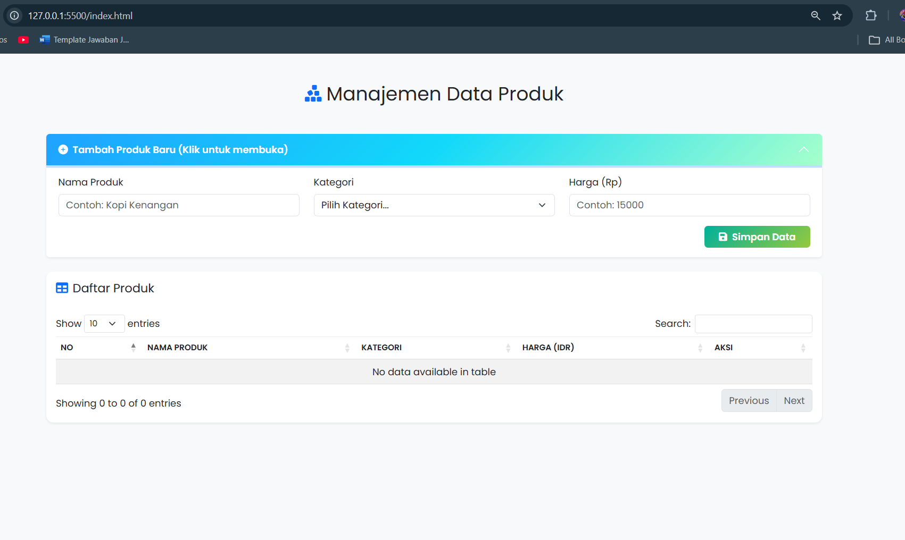
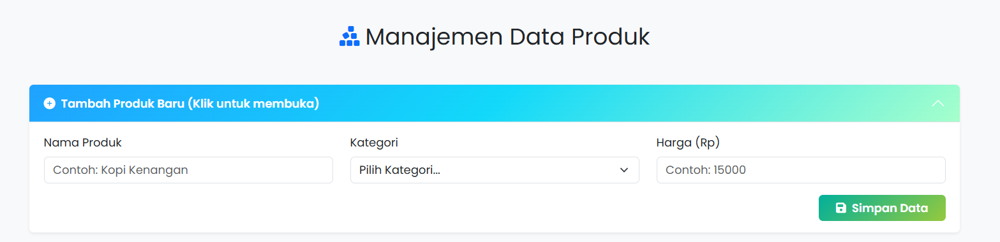
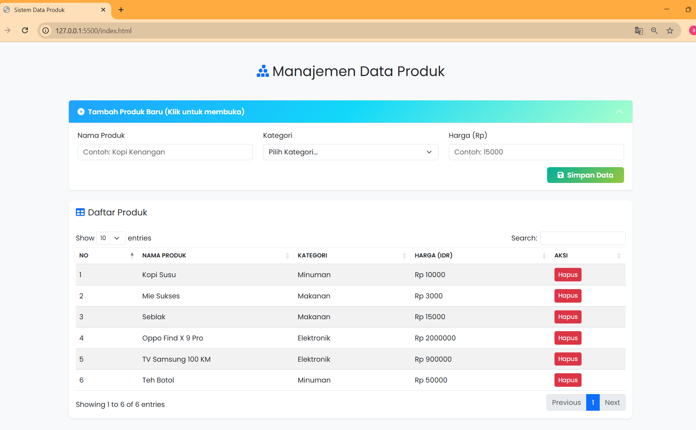
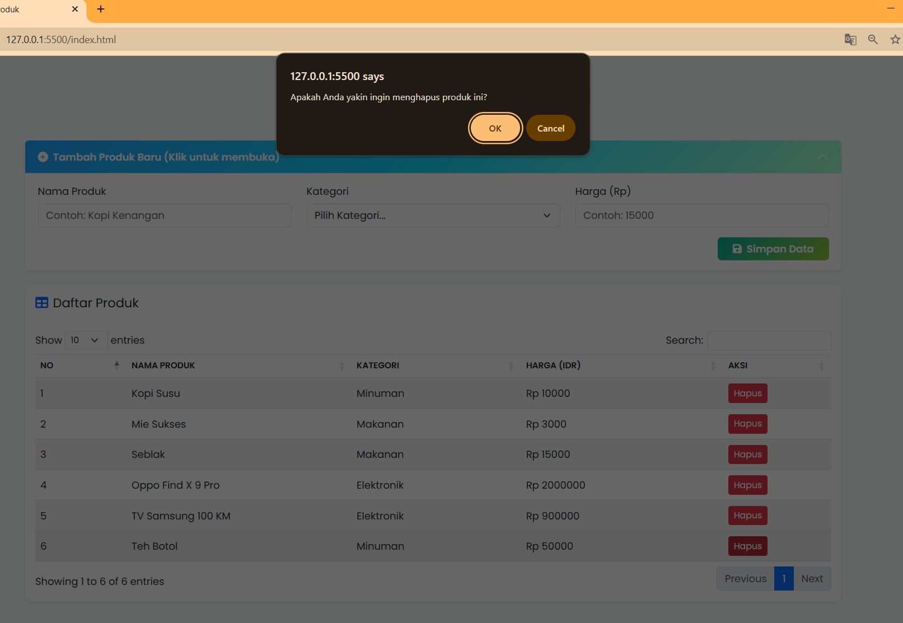
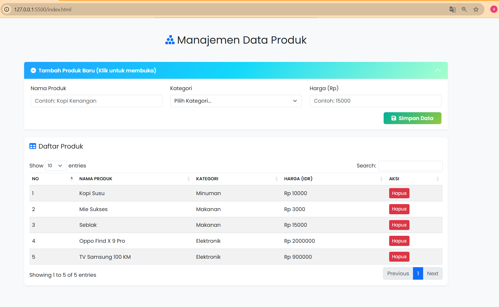

<div align="center">
  <br />

  <h1>LAPORAN PRAKTIKUM <br>
  APLIKASI BERBASIS PLATFORM
  </h1>

  <br />

  <h3>COTS<br>
  Manajemen Data Produk
  </h3>

  <br />

  <p align="center">

</p>

  <br />
  <br />
  <br />

  <h3>Disusun Oleh :</h3>

  <p>
    <strong>Abda Firas Rahman</strong><br>
    <strong>2311102049</strong><br>
    <strong>S1 IF-11-REG01</strong>
  </p>

  <br />

  <h3>Dosen Pengampu :</h3>

  <p>
    <strong>Dimas Fanny Hebrasianto Permadi, S.ST., M.Kom</strong>
  </p>
  
  <br />
  <br />
    <h4>Asisten Praktikum :</h4>
    <strong>Apri Pandu Wicaksono </strong> <br>
    <strong>Rangga Pradarrell Fathi</strong>
  <br />

  <h3>LABORATORIUM HIGH PERFORMANCE
 <br>FAKULTAS INFORMATIKA <br>UNIVERSITAS TELKOM PURWOKERTO <br>2026</h3>
</div>

<hr>

### Deskripsi
Bootstrap 5
`Bootstrap 5` merupakan framework CSS open-source yang digunakan untuk membantu membuat tampilan website yang modern dan responsif. Framework ini menyediakan berbagai komponen siap pakai seperti form, tabel, tombol, modal, dan sistem grid untuk mengatur layout halaman. Pada tugas ini, `Bootstrap` digunakan untuk mengatur struktur halaman, mempercantik tampilan form input produk, menata tombol aksi, serta memastikan halaman dapat menyesuaikan dengan berbagai ukuran layar. Bootstrap diintegrasikan melalui CDN sehingga tidak perlu mengunduh file secara manual.

jQuery
`jQuery` merupakan library JavaScript yang mempermudah proses manipulasi DOM, pengelolaan event, animasi, serta pemanggilan AJAX. Dengan jQuery, penulisan kode JavaScript menjadi lebih singkat dan mudah dipahami dibandingkan menggunakan JavaScript murni. Pada tugas ini, `jQuery` digunakan untuk menangani event submit pada form, event klik tombol Edit dan Hapus menggunakan event delegation, serta membuat efek scroll otomatis ke form ketika mode edit diaktifkan.

jQuery DataTable
`jQuery DataTable` adalah plugin dari jQuery yang berfungsi mengubah tabel HTML biasa menjadi tabel yang lebih interaktif. Plugin ini menyediakan berbagai fitur seperti pencarian data secara real-time, pagination untuk membagi data ke beberapa halaman, sorting untuk mengurutkan data berdasarkan kolom, serta pengaturan jumlah data yang ditampilkan per halaman. DataTable diaktifkan menggunakan `$('#idTabel').DataTable({...})` setelah DOM siap melalui `$(document).ready()`.

### Penjelasan Beserta Kode HTML, JS, CSS:

### File HTML
Berikut adalah kode program HTML:

```html
<!-- Abda Firas Rahman - 2311102049 - Tugas Cots -->

<!DOCTYPE html>
<html lang="id">

<head>
    <meta charset="UTF-8">
    <meta name="viewport" content="width=device-width, initial-scale=1.0">
    <title>Sistem Data Produk </title>

    <link href="https://cdn.jsdelivr.net/npm/bootstrap@5.3.0/dist/css/bootstrap.min.css" rel="stylesheet">
    <link href="https://cdn.datatables.net/1.13.6/css/dataTables.bootstrap5.min.css" rel="stylesheet">
    <link href="https://cdnjs.cloudflare.com/ajax/libs/font-awesome/6.4.2/css/all.min.css" rel="stylesheet">
    <link href="https://fonts.googleapis.com/css2?family=Poppins:wght@300;400;600&display=swap" rel="stylesheet">

    <link rel="stylesheet" href="style.css">
</head>

<body class="bg-light">
    <div class="container mt-5 mb-5">
        <div class="row">
            <div class="col-12">
                <h2 class="text-center mb-5 text-dark">
                    <i class="fa fa-cubes-stacked me-2 text-primary"></i>Manajemen Data Produk
                </h2>
            </div>
        </div>

        <div class="row">
            <div class="col-12 mb-4">
                <div class="accordion" id="accordionForm">
                    <div class="accordion-item card-custom shadow-sm">
                        <h2 class="accordion-header" id="headingOne">
                            <button class="accordion-button collapsed header-custom" type="button"
                                data-bs-toggle="collapse" data-bs-target="#collapseForm">
                                <i class="fa fa-plus-circle me-2"></i>Tambah Produk Baru (Klik untuk membuka)
                            </button>
                        </h2>
                        <div id="collapseForm" class="accordion-collapse collapse" data-bs-parent="#accordionForm">
                            <div class="accordion-body">
                                <form id="formProduk">
                                    <div class="row">
                                        <div class="col-md-4 mb-3">
                                            <label class="form-label font-weight-600">Nama Produk</label>
                                            <input type="text" class="form-control" id="inputNama" required
                                                placeholder="Contoh: Kopi Kenangan">
                                        </div>
                                        <div class="col-md-4 mb-3">
                                            <label class="form-label font-weight-600">Kategori</label>
                                            <select class="form-select" id="inputKategori" required>
                                                <option value="">Pilih Kategori...</option>
                                                <option value="Minuman">Minuman</option>
                                                <option value="Makanan">Makanan</option>
                                                <option value="Elektronik">Elektronik</option>
                                            </select>
                                        </div>
                                        <div class="col-md-4 mb-3">
                                            <label class="form-label font-weight-600">Harga (Rp)</label>
                                            <input type="number" class="form-control" id="inputHarga" required
                                                placeholder="Contoh: 15000">
                                        </div>
                                    </div>
                                    <div class="row">
                                        <div class="col-12 text-end">
                                            <button type="button" class="btn btn-gradient-success px-4"
                                                onclick="simpanProduk()">
                                                <i class="fa fa-save me-2"></i>Simpan Data
                                            </button>
                                        </div>
                                    </div>
                                </form>
                            </div>
                        </div>
                    </div>
                </div>
            </div>

            <div class="col-12">
                <div class="card card-custom shadow-sm">
                    <div class="card-header bg-white border-0 py-3">
                        <h5 class="mb-0 text-dark"><i class="fa fa-table me-2 text-primary"></i>Daftar Produk</h5>
                    </div>
                    <div class="card-body">
                        <div class="table-responsive">
                            <table id="tabelProduk"
                                class="table table-hover table-striped table-custom dt-responsive nowrap">
                                <thead class="text-uppercase text-muted" style="font-size: 0.85rem;">
                                    <tr>
                                        <th>No</th>
                                        <th>Nama Produk</th>
                                        <th>Kategori</th>
                                        <th>Harga (IDR)</th>
                                        <th>Aksi</th>
                                    </tr>
                                </thead>
                                <tbody id="isiTabel"></tbody>
                            </table>
                        </div>
                    </div>
                </div>
            </div>
        </div>
    </div>

    <script src="https://code.jquery.com/jquery-3.7.0.min.js"></script>
    <script src="https://cdn.jsdelivr.net/npm/bootstrap@5.3.0/dist/js/bootstrap.bundle.min.js"></script>
    <script src="https://cdn.datatables.net/1.13.6/js/jquery.dataTables.min.js"></script>
    <script src="https://cdn.datatables.net/1.13.6/js/dataTables.bootstrap5.min.js"></script>
    <script src="script.js"></script>
</body>
</html>
```

### File Js
Berikut adalah kode program JS:
```javascript
let daftarProduk = [];
let tabelDT;

/* Abda Firas Rahman - 2311102049 - Tugas Cots*/

// Inisialisasi DataTable saat halaman dimuat
$(document).ready(function () {
    tabelDT = $('#tabelProduk').DataTable();
});

// Fungsi untuk menyimpan data produk
function simpanProduk() {
    let nama = $('#inputNama').val();
    let kategori = $('#inputKategori').val();
    let harga = $('#inputHarga').val();

    // Validasi input kosong
    if (nama === '' || kategori === '' || harga === '') {
        alert('Harap isi semua data produk.');
        return;
    }

    // Pembuatan object produk baru
    let produkBaru = {
        id: Date.now(),
        nama: nama,
        kategori: kategori,
        harga: harga
    };

    // Simpan ke array dan perbarui tabel
    daftarProduk.push(produkBaru);
    $('#formProduk')[0].reset();
    tampilkanKeTabel();
}

// Fungsi untuk menampilkan data dari array ke dalam DataTable
function tampilkanKeTabel() {
    tabelDT.clear();

    for (let i = 0; i < daftarProduk.length; i++) {
        let produk = daftarProduk[i];
        let tombolHapus = `<button class="btn btn-danger btn-sm" onclick="hapusProduk(${produk.id})">Hapus</button>`;

        tabelDT.row.add([
            i + 1,
            produk.nama,
            produk.kategori,
            `Rp ${produk.harga}`,
            tombolHapus
        ]);
    }

    tabelDT.draw();
}

// Fungsi untuk menghapus produk berdasarkan ID
function hapusProduk(idProduk) {
    if (confirm('Apakah Anda yakin ingin menghapus produk ini?')) {
        daftarProduk = daftarProduk.filter(function (produk) {
            return produk.id !== idProduk;
        });
        tampilkanKeTabel();
    }
}
```

### File CSS
Berikut adalah kode program CSS:
```CSS
body {
    font-family: 'Poppins', sans-serif;
    background-color: #f0f2f5;
}

/* Gradasi Biru*/
.header-custom {
    background: linear-gradient(135deg, #1fa2ff 0%, #12d8fa 50%, #a6ffcb 100%);
    color: white !important;
    font-weight: 600;
    border-bottom: none;
}

/* Abda Firas Rahman - 2311102049 - Tugas Cots*/

.header-custom::after {
    filter: brightness(0) invert(1);
  
}

.card-custom {
    border: none;
    border-radius: 12px;
    overflow: hidden;
}

.btn-gradient-success {
    background: linear-gradient(135deg, #00b09b 0%, #96c93d 100%);
    color: white;
    border: none;
    font-weight: 600;
}

.btn-gradient-success:hover {
    opacity: 0.9;
    color: white;
}

.table-custom {
    border-collapse: separate;
    border-spacing: 0;
    width: 100% !important;
}

.table-custom thead {
    background-color: #f8f9fa;
}

.table-custom td,
.table-custom th {
    vertical-align: middle;
    border-top: 1px solid #ebedf2;
}
```

### Penjelasan Kode Program
### Penjelasan HTML (`index.html`)
Pada file `index.html` dibuat struktur utama halaman web untuk sistem manajemen data produk. Pada bagian `<head>` diimport beberapa library melalui CDN seperti `Bootstrap 5` untuk layout dan styling, `DataTables` untuk membuat tabel interaktif `Font Awesome` untuk ikon serta `Google Fonts (Poppins)` untuk tampilan font. Selain itu juga dihubungkan file `style.css` untuk menambahkan styling tambahan.

Pada bagian `<body>` terdapat container utama yang berisi judul halaman **Manajemen Data Produk**. Di bawahnya terdapat komponen accordion yang berisi form untuk menambahkan produk baru dengan tiga input utama yaitu nama produk, kategori, dan harga. Tombol **Simpan Data** akan memanggil fungsi `simpanProduk()` yang terdapat pada file JavaScript. Selain itu terdapat tabel dengan id `tabelProduk` yang digunakan untuk menampilkan daftar produk yang telah ditambahkan. Tabel ini nantinya akan diolah menggunakan plugin DataTables agar memiliki fitur pencarian, pagination, dan sorting.

### Penjelasan JavaScript (`script.js`)
Pada file `script.js` berisi logika utama aplikasi yang mengatur proses penyimpanan, penampilan, dan penghapusan data produk. Variabel `daftarProduk` digunakan sebagai array untuk menyimpan data produk secara sementara di sisi client. Selain itu terdapat variabel `tabelDT` yang digunakan untuk menyimpan instance dari DataTables.

Pada saat halaman dimuat fungsi `$(document).ready()` dijalankan untuk melakukan inisialisasi DataTables pada tabel `#tabelProduk`. Fungsi `simpanProduk()` digunakan untuk mengambil data dari input form yaitu nama produk, kategori, dan harga. Setelah itu dilakukan validasi agar tidak ada input yang kosong. Jika data valid maka dibuat objek produk baru yang memiliki id unik menggunakan `Date.now()` lalu dimasukkan ke dalam array `daftarProduk`. Setelah data tersimpan, form akan di-reset dan fungsi `tampilkanKeTabel()` dipanggil untuk memperbarui isi tabel.

Fungsi `tampilkanKeTabel()` digunakan untuk menampilkan semua data yang ada di dalam array `daftarProduk` ke tabel DataTables. Tabel akan dibersihkan terlebih dahulu menggunakan `clear()` lalu setiap data dimasukkan kembali menggunakan `row.add()`. Pada kolom aksi ditambahkan tombol **Hapus** yang akan memanggil fungsi `hapusProduk()`.

Fungsi `hapusProduk()` digunakan untuk menghapus data produk berdasarkan ID. Ketika tombol hapus ditekan, akan muncul konfirmasi menggunakan `confirm()`. Jika pengguna menyetujui, data tersebut akan dihapus dari array menggunakan `filter()` dan tabel akan diperbarui kembali.

### Penjelasan CSS (`style.css`)
File `style.css` digunakan untuk menambahkan styling tambahan agar tampilan halaman lebih menarik. Pada bagian awal diatur font utama menggunakan `Poppins` dan warna background halaman dibuat abu-abu terang. Class `.header-custom` digunakan untuk memberikan efek gradasi warna pada header accordion. Class `.card-custom` digunakan untuk membuat tampilan card lebih modern dengan sudut membulat. Selain itu terdapat class `.btn-gradient-success` untuk membuat tombol simpan memiliki efek warna gradient. Pengaturan tabel juga ditambahkan melalui `.table-custom` agar tampilan data lebih rapi dan mudah dibaca.

### Hasil Program
### Tampilan Awal


## Tambah Produk


## After Tambah Produk


## Hapus Menu


## After Hapus Menu



