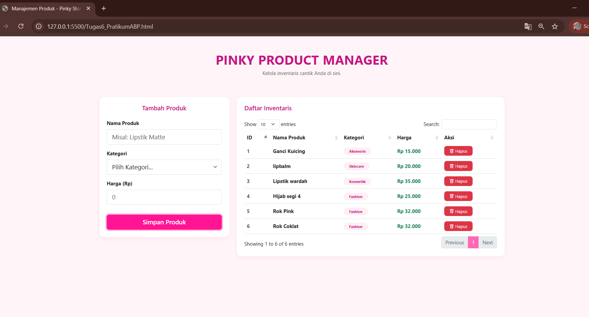
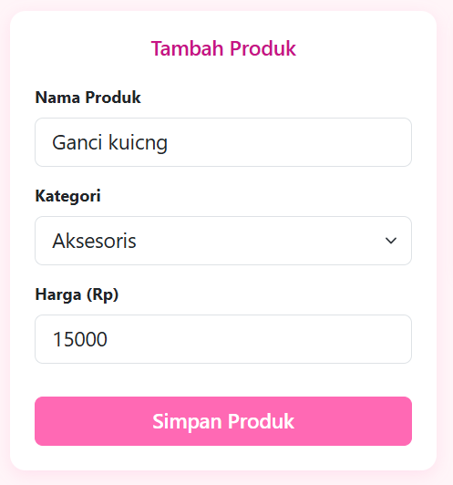
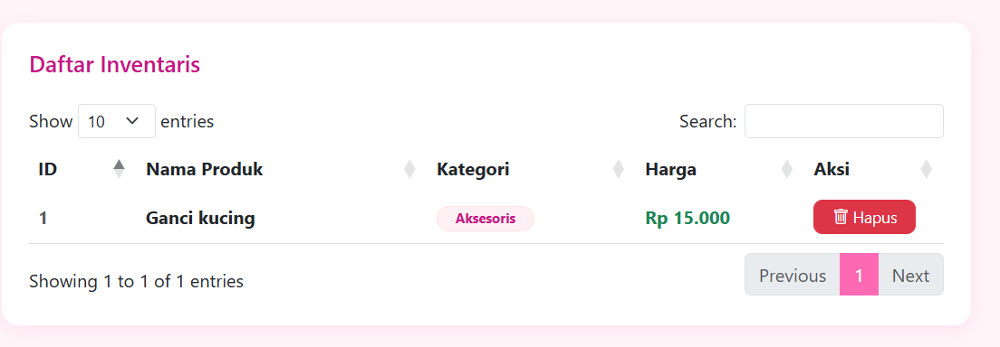
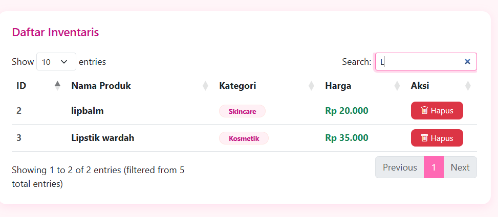
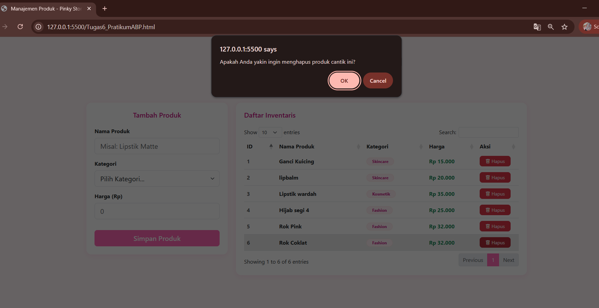
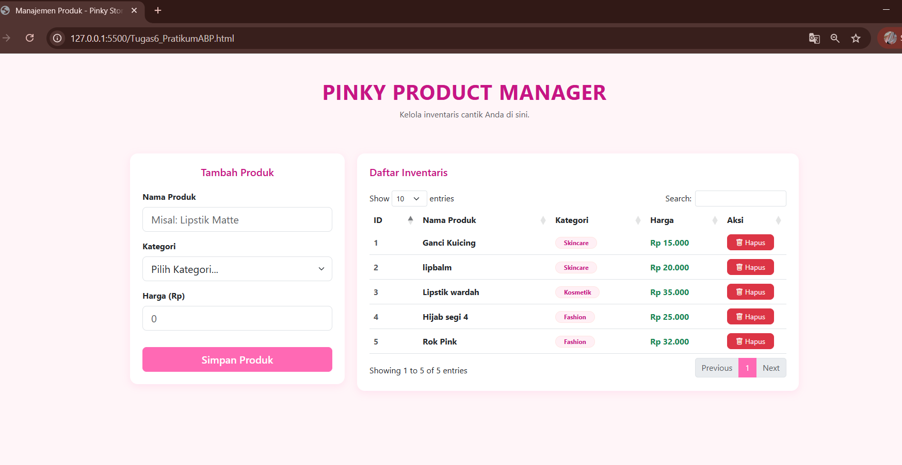
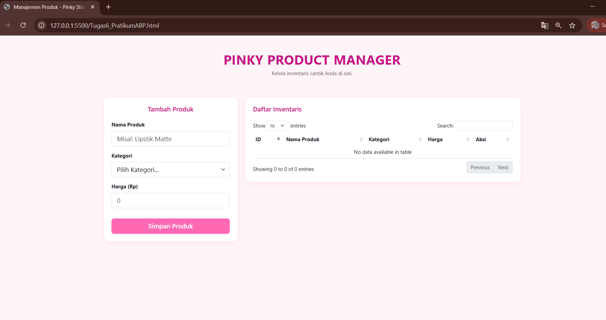
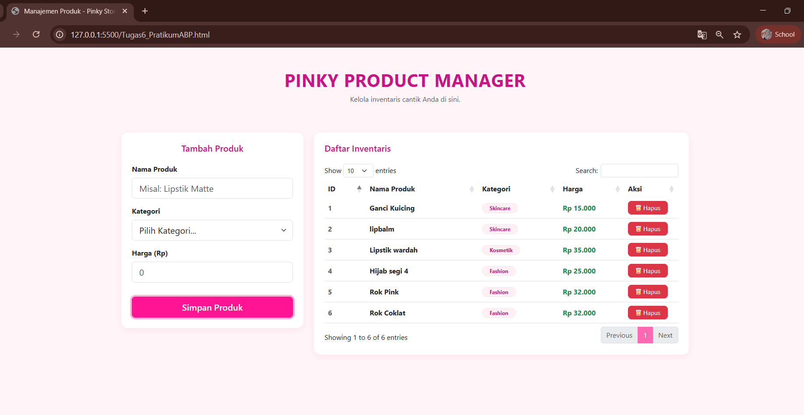

<div align="center">
  <br />

  <h1>LAPORAN PRAKTIKUM <br>
  APLIKASI BERBASIS PLATFORM
  </h1>

  <br />

  <h3>TUGAS COTS<br>
  Manajemen Produk "Pinky Product Manager"
  </h3>

  <br />

  <p align="center">

</p>

  <br />
  <br />
  <br />

  <h3>Disusun Oleh :</h3>

  <p>
    <strong>Aisyah Anis Mazaya</strong><br>
    <strong>2311102095</strong><br>
    <strong>S1 IF-11-REG01</strong>
  </p>

  <br />

  <h3>Dosen Pengampu :</h3>

  <p>
    <strong>Dimas Fanny Hebrasianto Permadi, S.ST., M.Kom</strong>
  </p>
  
  <br />
  <br />
    <h4>Asisten Praktikum :</h4>
    <strong>Apri Pandu Wicaksono </strong> <br>
    <strong>Rangga Pradarrell Fathi</strong>
  <br />

  <h3>LABORATORIUM HIGH PERFORMANCE
 <br>FAKULTAS INFORMATIKA <br>UNIVERSITAS TELKOM PURWOKERTO <br>2026</h3>
</div>

<hr>

### Perintah Praktikum

Buatlah sebuah halaman web sederhana untuk menampilkan data produk. Pada halaman tersebut terdapat form input dan tabel data produk.

## Ketentuan
1. Gunakan Bootstrap untuk tampilan halaman.
2. Buat form input dengan data:
   * Nama Produk
   * Kategori
   * Harga
3. Data yang diinput dari form harus ditampilkan pada tabel.
4. Gunakan JQuery Datatable pada tabel.
5. Tambahkan tombol hapus pada setiap data di tabel.
6. Pastikan tabel memiliki fitur search dan pagination.
7. Bikin crud sederhana dengan sistem penyimpanan dengan mapping object.

## Output
* Halaman memiliki form input produk
* Data yang dimasukkan muncul di tabel
* Tabel menggunakan Datatable
* Tampilan menggunakan Bootstrap

### Penjelasan dan langkah nya:
### 1. Sistem Penyimpanan Data (Mapping Object)


Sistem ini menggunakan memori sementara peramban (browser) melalui objek JavaScript, bukan menggunakan database sungguhan. Objek ini menyimpan data dalam format Key-Value, di mana variabel currentId bertindak sebagai kunci (ID) unik yang akan terus bertambah setiap kali ada produk baru yang disimpan.
## Kode Program Bagian Sistem Penyimpanan Data (Mapping Object)

```html
1. Sistem Penyimpanan Mapping Object (RAM)
let productStorage = {}; 
let currentId = 1;
```
### 2. Fitur Form Tambah Produk (Create)


Fitur ini menangani proses saat pengguna menekan tombol "Simpan Produk". Sistem menggunakan e.preventDefault() agar halaman tidak melakukan refresh. Kemudian, sistem mengambil nilai dari setiap input form, membungkusnya ke dalam objek newProduct, dan menyimpannya ke dalam productStorage berdasarkan currentId yang sedang aktif. Setelah itu, form dikosongkan.
## Kode Program Bagian Fitur Form Tambah Produk (Create)

```html
// 4. Event Submit Form (Create)
$('#productForm').on('submit', function(e) {
    e.preventDefault();

    // Ambil value dari input
    const nama = $('#nama').val();
    const kategori = $('#kategori').val();
    const harga = $('#harga').val();

    // Simpan ke mapping object menggunakan ID sebagai key
    const newProduct = {
        id: currentId,
        nama: nama,
        kategori: kategori,
        harga: harga
    };

    productStorage[currentId] = newProduct;
    
    // Reset form dan naikkan counter ID
    currentId++;
    this.reset();
    
    // Update tampilan tabel
    refreshTable();
});
```

### 3. Fitur Menampilkan Data ke Tabel (Read / Render)


Fungsi refreshTable() bertugas untuk memperbarui tampilan tabel HTML. Setiap kali ada penambahan atau penghapusan data, fungsi ini dipanggil. Prosesnya dimulai dengan mengosongkan isi tabel di layar, lalu membaca seluruh data di productStorage, dan memasukkannya kembali ke dalam baris tabel satu per satu beserta tombol hapusnya.
## Kode Program Bagian Fitur Menampilkan Data ke Tabel (Read / Render)

```html
// 3. Fungsi Render Tabel (Update UI)
function refreshTable() {
    table.clear(); // Hapus data lama di tabel tampilan
    
    // Iterasi melalui mapping object dan masukkan ke DataTable
    Object.keys(productStorage).forEach(id => {
        const item = productStorage[id];
        table.row.add([
            `<span class="fw-bold text-muted">${item.id}</span>`,
            `<span class="fw-bold">${item.nama}</span>`,
            `<span class="badge badge-pink rounded-pill px-3">${item.kategori}</span>`,
            `<span class="text-success fw-bold">Rp ${parseInt(item.harga).toLocaleString('id-ID')}</span>`,
            `<button class="btn btn-danger btn-sm px-3" onclick="deleteProduct(${item.id})">
                <i class="bi bi-trash"></i> Hapus
             </button>`
        ]);
    });
    
    table.draw(); // Gambar ulang tabel dengan data baru
}
```

### 4. Fitur Pencarian dan Pagination (DataTables)


Bagian ini menginisialisasi library jQuery DataTables pada elemen tabel HTML yang memiliki ID productTable. Fitur pencarian otomatis dan pemisahan halaman (pagination) langsung ditangani oleh library ini. Konfigurasi dom ditambahkan untuk mengatur ulang tata letak fitur pencarian dan penomoran agar rapi dan sejajar dengan kerangka kerja Bootstrap.
## Kode program Bagian Fitur Pencarian dan Pagination (DataTables)

```html
// 2. Inisialisasi DataTable dengan konfigurasi Bahasa Indonesia
const table = $('#productTable').DataTable({
    language: {
        url: '//cdn.datatables.net/plug-ins/1.13.6/i18n/id.json'
    },
    // Mengatur DOM agar search bar dan info terlihat rapi dengan Bootstrap
    dom: "<'row'<'col-sm-12 col-md-6'l><'col-sm-12 col-md-6'f>>" +
         "<'row'<'col-sm-12'tr>>" +
         "<'row'<'col-sm-12 col-md-5'i><'col-sm-12 col-md-7'p>>",
});
```

### 5. Fitur Hapus Produk (Delete)




Fungsi ini ditautkan pada tombol hapus di setiap baris tabel. Karena DataTables mengubah struktur DOM, fungsi ini dibuat secara global (window.deleteProduct). Saat ditekan, akan muncul kotak konfirmasi. Jika pengguna setuju, data dengan ID terkait akan dihapus dari productStorage, dan tabel akan dirender ulang agar data tersebut hilang dari layar.
## Kode Program Bagian Fitur Hapus Produk (Delete)

```html
// 5. Fungsi Hapus (Delete)
// Dibuat global agar bisa dipanggil oleh attribute onclick di dalam row tabel
window.deleteProduct = function(id) {
    if(confirm('Apakah Anda yakin ingin menghapus produk cantik ini?')) {
        delete productStorage[id]; // Menghapus data dari object mapping
        refreshTable(); // Refresh tampilan
    }
};
```

## Kode program Keseluruhan
Berikut adalah kode program:
```html
<!DOCTYPE html>
<html lang="id">
<head>
    <meta charset="UTF-8">
    <meta name="viewport" content="width=device-width, initial-scale=1.0">
    <title>Manajemen Produk - Pinky Store</title>
    
    <link href="https://cdn.jsdelivr.net/npm/bootstrap@5.3.0/dist/css/bootstrap.min.css" rel="stylesheet">
    <link href="https://cdn.datatables.net/1.13.6/css/dataTables.bootstrap5.min.css" rel="stylesheet">
    
    <style>
        /* --- KUSTOMISASI COLOR PALETTE PINK --- */
        :root {
            --pink-primary: #ff69b4; /* Hot Pink */
            --pink-hover: #ff1493;   /* Deep Pink */
            --pink-light: #ffe4e1;   /* Misty Rose */
            --pink-dark: #c71585;    /* Medium Violet Red */
        }

        /* --- AISYAH ANIS MAZAYA - 2311102095 - TUGAS COTS --- */
        
        body { 
            background-color: #fff5f8; /* Background pink sangat muda */
            padding-top: 50px; 
            color: #444;
        }

        .card { 
            border: none; 
            box-shadow: 0 4px 15px rgba(255, 105, 180, 0.15); /* Shadow nuansa pink */
            border-radius: 15px;
        }

        .header-title { 
            color: var(--pink-dark); 
            font-weight: bold; 
            text-transform: uppercase;
            letter-spacing: 1px;
        }

        /* Styling Tombol Primary jadi Pink */
        .btn-primary {
            background-color: var(--pink-primary);
            border-color: var(--pink-primary);
            border-radius: 8px;
            font-weight: 600;
        }
        .btn-primary:hover, .btn-primary:focus {
            background-color: var(--pink-hover) !important;
            border-color: var(--pink-hover) !important;
            box-shadow: 0 0 0 0.25rem rgba(255, 105, 180, 0.5);
        }

        /* Styling Input Form saat Fokus */
        .form-control:focus, .form-select:focus {
            border-color: var(--pink-primary);
            box-shadow: 0 0 0 0.25rem rgba(255, 105, 180, 0.25);
        }

        /* Styling Tabel */
        table.dataTable thead {
            background-color: var(--pink-primary);
            color: white;
        }
        table.dataTable thead th {
            border-bottom: none !important;
        }
        .table-striped>tbody>tr:nth-of-type(odd)>* {
            --bs-table-accent-bg: var(--pink-light); /* Baris belang pink muda */
        }
        
        /* Badge Kategori */
        .badge-pink {
            background-color: #fff0f5;
            color: var(--pink-dark);
            border: 1px solid var(--pink-light);
        }

        /* Styling Pagination DataTables */
        .page-item.active .page-link {
            background-color: var(--pink-primary);
            border-color: var(--pink-primary);
        }
        .page-link {
            color: var(--pink-dark);
        }
        .page-link:hover {
            color: var(--pink-hover);
            background-color: var(--pink-light);
        }
        
        /* Tombol Hapus tetap Merah tapi disesuaikan */
        .btn-danger {
            border-radius: 8px;
        }

    </style>
</head>
<body>

<div class="container">
    <div class="row mb-5">
        <div class="col-md-12 text-center">
            <h1 class="header-title">Pinky Product Manager</h1>
            <p class="text-muted">Kelola inventaris cantik Anda di sini.</p>
        </div>
    </div>

    <div class="row">
        <div class="col-md-4 mb-4">
            <div class="card">
                <div class="card-body p-4">
                    <h5 class="card-title mb-4 text-center" style="color: var(--pink-dark);">Tambah Produk</h5>
                    <form id="productForm">
                        <div class="mb-3">
                            <label class="form-label fw-bold">Nama Produk</label>
                            <input type="text" id="nama" class="form-control form-control-lg" placeholder="Misal: Lipstik Matte" required>
                        </div>
                        <div class="mb-3">
                            <label class="form-label fw-bold">Kategori</label>
                            <select id="kategori" class="form-select form-select-lg" required>
                                <option value="">Pilih Kategori...</option>
                                <option value="Kosmetik">Kosmetik</option>
                                <option value="Skincare">Skincare</option>
                                <option value="Aksesoris">Aksesoris</option>
                                <option value="Fashion">Fashion</option>
                            </select>
                        </div>
                        <div class="mb-3">
                            <label class="form-label fw-bold">Harga (Rp)</label>
                            <input type="number" id="harga" class="form-control form-control-lg" placeholder="0" required>
                        </div>
                        <button type="submit" class="btn btn-primary btn-lg w-100 mt-3">Simpan Produk</button>
                    </form>
                </div>
            </div>
        </div>

        <div class="col-md-8">
            <div class="card">
                <div class="card-body p-4">
                    <h5 class="card-title mb-4" style="color: var(--pink-dark);">Daftar Inventaris</h5>
                    <div class="table-responsive">
                        <table id="productTable" class="table table-hover align-middle" style="width:100%">
                            <thead>
                                <tr>
                                    <th>ID</th>
                                    <th>Nama Produk</th>
                                    <th>Kategori</th>
                                    <th>Harga</th>
                                    <th>Aksi</th>
                                </tr>
                            </thead>
                            <tbody>
                                </tbody>
                        </table>
                    </div>
                </div>
            </div>
        </div>
    </div>
</div>

<script src="https://code.jquery.com/jquery-3.7.0.min.js"></script>
<script src="https://cdn.datatables.net/1.13.6/js/jquery.dataTables.min.js"></script>
<script src="https://cdn.datatables.net/1.13.6/js/dataTables.bootstrap5.min.js"></script>

<script>
    $(document).ready(function() {
        // 1. Sistem Penyimpanan Mapping Object (RAM)
        let productStorage = {}; 
        let currentId = 1;

        // 2. Inisialisasi DataTable dengan konfigurasi Bahasa Indonesia
        const table = $('#productTable').DataTable({
            language: {
                url: '//cdn.datatables.net/plug-ins/1.13.6/i18n/id.json'
            },
            // Mengatur DOM agar search bar dan info terlihat rapi dengan Bootstrap
            dom: "<'row'<'col-sm-12 col-md-6'l><'col-sm-12 col-md-6'f>>" +
                 "<'row'<'col-sm-12'tr>>" +
                 "<'row'<'col-sm-12 col-md-5'i><'col-sm-12 col-md-7'p>>",
        });

        // 3. Fungsi Render Tabel (Update UI)
        function refreshTable() {
            table.clear(); // Hapus data lama di tabel tampilan
            
            // Iterasi melalui mapping object dan masukkan ke DataTable
            Object.keys(productStorage).forEach(id => {
                const item = productStorage[id];
                table.row.add([
                    `<span class="fw-bold text-muted">${item.id}</span>`,
                    `<span class="fw-bold">${item.nama}</span>`,
                    `<span class="badge badge-pink rounded-pill px-3">${item.kategori}</span>`,
                    `<span class="text-success fw-bold">Rp ${parseInt(item.harga).toLocaleString('id-ID')}</span>`,
                    `<button class="btn btn-danger btn-sm px-3" onclick="deleteProduct(${item.id})">
                        <i class="bi bi-trash"></i> Hapus
                     </button>`
                ]);
            });
            
            table.draw(); // Gambar ulang tabel dengan data baru
        }

        // 4. Event Submit Form (Create)
        $('#productForm').on('submit', function(e) {
            e.preventDefault();

            // Ambil value dari input
            const nama = $('#nama').val();
            const kategori = $('#kategori').val();
            const harga = $('#harga').val();

            // Simpan ke mapping object menggunakan ID sebagai key
            const newProduct = {
                id: currentId,
                nama: nama,
                kategori: kategori,
                harga: harga
            };

            productStorage[currentId] = newProduct;
            
            // Reset form dan naikkan counter ID
            currentId++;
            this.reset();
            
            // Update tampilan tabel
            refreshTable();
        });

        // 5. Fungsi Hapus (Delete)
        // Dibuat global agar bisa dipanggil oleh attribute onclick di dalam row tabel
        window.deleteProduct = function(id) {
            if(confirm('Apakah Anda yakin ingin menghapus produk cantik ini?')) {
                delete productStorage[id]; // Menghapus data dari object mapping
                refreshTable(); // Refresh tampilan
            }
        };
    });
</script>

<link rel="stylesheet" href="https://cdn.jsdelivr.net/npm/bootstrap-icons@1.11.1/font/bootstrap-icons.css">

</body>
</html>
```
### Panduan Cara Mengisi:
1. Menambahkan Data Produk

    -Arahkan kursor ke bagian "Tambah Produk" di sebelah kiri.

    -Pada kolom Nama Produk ketikkan nama barang (Contoh: "Serum Vitamin C").

    -Klik pada dropdown Kategori dan pilih salah satu (Contoh: "Skincare").

    -Pada kolom Harga (Rp) masukkan angka tanpa titik atau koma (Contoh: ketik "75000" untuk Rp 75.000).

    -Klik tombol merah muda Simpan Produk. Data akan langsung muncul di tabel sebelah kanan.

2. Mencari Data

    -Jika data sudah banyak arahkan kursor ke kotak Search di kanan atas tabel.

    -Ketik nama produk atau kategori yang ingin dicari tabel akan otomatis menyaring data yang relevan.

3. Menghapus Data

    -Pilih salah satu produk di dalam tabel yang ingin dihapus.

    -Klik tombol merah Hapus di kolom "Aksi" pada baris tersebut.

    -Akan muncul peringatan di bagian atas layar. Klik OK untuk mengonfirmasi penghapusan.

### Tampilan Hasil Kode Program
### Tampilan Awal:


### Tampilan Setelah Di Isi:

