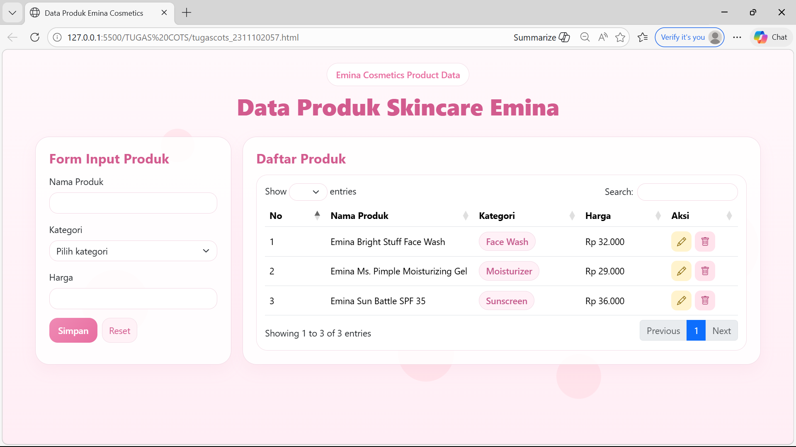
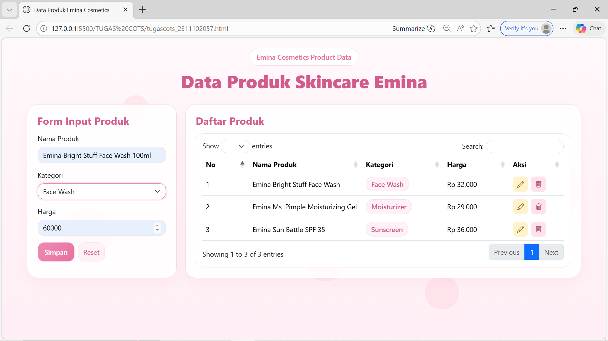
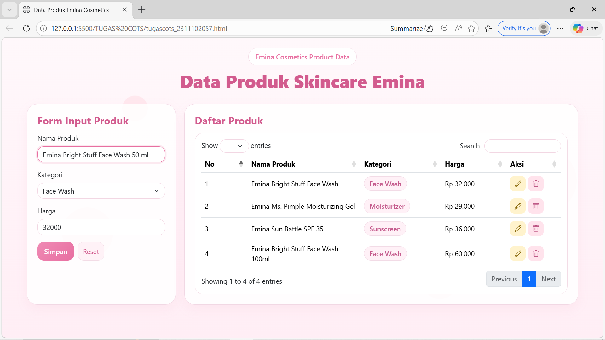
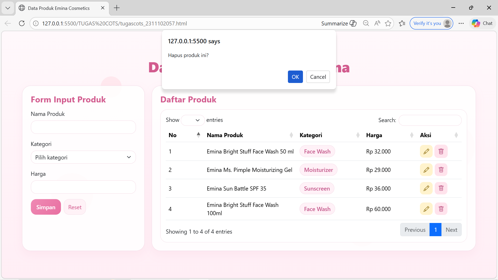

<div align="center">
  <br />
  <h1>LAPORAN PRAKTIKUM <br>APLIKASI BERBASIS PLATFORM</h1>
  <br />
  <h3>TUGAS COTS</h3>
  <br />
   
  <br />
  <br />
  <br />
  <h3>Disusun Oleh :</h3>
  <p>
    <strong>Nia Novela Ariandini</strong><br>
    <strong>2311102057</strong><br>
    <strong>S1 IF-11-01</strong>
  </p>
  <br />
  <h3>Dosen Pengampu :</h3>
  <p>
    <strong>Dimas Fanny Hebrasianto Permadi, S.ST., M.Kom</strong>
  </p>
  <br />
  <br />
    <h4>Asisten Praktikum :</h4>
    <strong> Apri Pandu Wicaksono </strong> <br>
    <strong>Rangga Pradarrell Fathi</strong>
  <br />
  <br />
  <br />
  <br />
  <h3>LABORATORIUM HIGH PERFORMANCE
 <br>FAKULTAS INFORMATIKA <br>UNIVERSITAS TELKOM PURWOKERTO <br>2026</h3>
</div>

---

## 1. Dasar Teori

**Bootstrap** merupakan salah satu *framework front-end* yang digunakan untuk membantu membuat tampilan website agar lebih cepat, rapi, dan responsif. Bootstrap menyediakan banyak komponen siap pakai seperti form, tombol, kartu, grid layout, dan tabel, sehingga proses pengembangan halaman web menjadi lebih praktis.

Selain Bootstrap, pada tugas ini juga digunakan **jQuery DataTables**. DataTables adalah plugin berbasis jQuery yang dipakai untuk menambahkan fitur interaktif pada tabel, seperti **search**, **pagination**, dan pengaturan jumlah data yang ditampilkan. Dengan DataTables, tabel menjadi lebih mudah digunakan dan terlihat lebih profesional.

Pada bagian logika data, digunakan konsep **mapping object**. Mapping object adalah cara menyimpan data dalam bentuk objek JavaScript, di mana setiap data memiliki **id** sebagai kunci. Dengan cara ini, proses menambah, mengubah, menghapus, dan mengambil data dapat dilakukan dengan lebih sederhana.

Pada halaman ini, data produk skincare dari **Emina Cosmetics** ditampilkan dalam bentuk form input dan tabel. Tampilan dibuat menggunakan nuansa **soft pink** agar terlihat lucu, bersih, dan sesuai dengan tema produk skincare.

---

## 2. Penjelasan Kode HTML, CSS, dan JavaScript

### Kode HTML (`tugascots_2311102057.html`)

```html
<!DOCTYPE html>
<html lang="id">

<head>
    <meta charset="UTF-8">
    <meta name="viewport" content="width=device-width, initial-scale=1.0">
    <title>Data Produk Emina Cosmetics</title>

    <!-- BOOTSTRAP -->
    <link href="https://cdn.jsdelivr.net/npm/bootstrap@5.3.3/dist/css/bootstrap.min.css" rel="stylesheet">

    <!-- DATATABLE -->
    <link href="https://cdn.datatables.net/1.13.8/css/dataTables.bootstrap5.min.css" rel="stylesheet">

    <!-- ICON -->
    <link rel="stylesheet" href="https://cdn.jsdelivr.net/npm/bootstrap-icons@1.11.3/font/bootstrap-icons.css">

    <style>
        body {
            font-family: "Segoe UI", sans-serif;
            background: linear-gradient(180deg, #fff8fb, #ffeef5);
            min-height: 100vh;
            overflow-x: hidden;
        }

        /* BACKGROUND ANIMATION */

        .bg-decor {
            position: fixed;
            width: 100%;
            height: 100%;
            top: 0;
            left: 0;
            z-index: -1;
            overflow: hidden;
        }

        .bubble {
            position: absolute;
            border-radius: 50%;
            background: rgba(255, 192, 203, 0.25);
            animation: float 12s infinite ease-in-out;
        }

        .bubble:nth-child(1) {
            width: 120px;
            height: 120px;
            left: 10%;
            top: 60%;
            animation-delay: 0s;
        }

        .bubble:nth-child(2) {
            width: 80px;
            height: 80px;
            left: 70%;
            top: 80%;
            animation-delay: 2s;
        }

        .bubble:nth-child(3) {
            width: 150px;
            height: 150px;
            left: 85%;
            top: 40%;
            animation-delay: 4s;
        }

        .bubble:nth-child(4) {
            width: 60px;
            height: 60px;
            left: 20%;
            top: 20%;
            animation-delay: 6s;
        }

        .bubble:nth-child(5) {
            width: 100px;
            height: 100px;
            left: 50%;
            top: 70%;
            animation-delay: 8s;
        }

        @keyframes float {
            0% {
                transform: translateY(0)
            }

            50% {
                transform: translateY(-30px)
            }

            100% {
                transform: translateY(0)
            }
        }

        /* HEADER */

        .hero {
            text-align: center;
            margin-bottom: 30px;
        }

        .hero-badge {
            display: inline-block;
            background: white;
            padding: 8px 16px;
            border-radius: 30px;
            border: 1px solid #f3dce6;
            color: #e86fa1;
            font-weight: 600;
            margin-bottom: 10px;
        }

        .hero-title {
            color: #d25b8e;
            font-weight: 800;
            font-size: 2.6rem;
        }

        /* LAYOUT */

        .main-grid {
            display: grid;
            grid-template-columns: 350px 1fr;
            gap: 20px;
        }

        /* CARD */

        .card-soft {
            background: rgba(255, 255, 255, 0.85);
            border: 1px solid #f1d8e4;
            border-radius: 25px;
            box-shadow: 0 10px 25px rgba(230, 120, 170, 0.08);
        }

        .card-body {
            padding: 24px;
        }

        .section-title {
            color: #d25b8e;
            font-weight: 700;
            margin-bottom: 15px;
        }

        /* FORM */

        .form-control,
        .form-select {
            border-radius: 15px;
            border: 1px solid #f2d7e3;
        }

        .form-control:focus,
        .form-select:focus {
            border-color: #e86fa1;
            box-shadow: 0 0 0 0.2rem rgba(232, 111, 161, 0.15);
        }

        /* BUTTON */

        .btn-pink {
            background: linear-gradient(135deg, #ef8ab4, #e86fa1);
            border: none;
            color: white;
            font-weight: 600;
            border-radius: 15px;
            padding: 10px 16px;
        }

        .btn-pink:hover {
            background: #df5c94;
        }

        .btn-soft {
            background: #fff2f7;
            border: 1px solid #f3dce6;
            color: #d25b8e;
            border-radius: 15px;
        }

        /* TABLE */

        .table-shell {
            background: white;
            border-radius: 20px;
            padding: 15px;
            border: 1px solid #f3dce6;
        }

        .badge-category {
            background: #fff1f7;
            border: 1px solid #f2dbe6;
            padding: 6px 12px;
            border-radius: 30px;
            color: #c45a8c;
            font-weight: 600;
        }

        /* ICON BUTTON */

        .icon-btn {
            border: none;
            width: 36px;
            height: 36px;
            border-radius: 10px;
            display: flex;
            align-items: center;
            justify-content: center;
            font-size: 16px;
        }

        .btn-edit {
            background: #fff3cd;
            color: #856404;
        }

        .btn-delete {
            background: #ffe3ec;
            color: #b84d7d;
        }

        .icon-btn:hover {
            transform: scale(1.05);
        }

        @media(max-width:900px) {
            .main-grid {
                grid-template-columns: 1fr;
            }
        }
    </style>
</head>

<body>

    <div class="bg-decor">
        <div class="bubble"></div>
        <div class="bubble"></div>
        <div class="bubble"></div>
        <div class="bubble"></div>
        <div class="bubble"></div>
    </div>

    <div class="container py-4">

        <div class="hero">
            <div class="hero-badge">Emina Cosmetics Product Data</div>
            <h1 class="hero-title">Data Produk Skincare Emina</h1>
        </div>

        <div class="main-grid">

            <!-- FORM -->

            <div class="card-soft">
                <div class="card-body">

                    <h4 class="section-title">Form Input Produk</h4>

                    <form id="productForm">

                        <input type="hidden" id="productId">

                        <div class="mb-3">
                            <label class="form-label">Nama Produk</label>
                            <input type="text" class="form-control" id="namaProduk" required>
                        </div>

                        <div class="mb-3">
                            <label class="form-label">Kategori</label>
                            <select class="form-select" id="kategori">
                                <option value="">Pilih kategori</option>
                                <option>Face Wash</option>
                                <option>Moisturizer</option>
                                <option>Serum</option>
                                <option>Sunscreen</option>
                                <option>Toner</option>
                            </select>
                        </div>

                        <div class="mb-3">
                            <label class="form-label">Harga</label>
                            <input type="number" class="form-control" id="harga" required>
                        </div>

                        <div class="d-flex gap-2">
                            <button type="submit" class="btn btn-pink">Simpan</button>
                            <button type="button" class="btn btn-soft" id="resetBtn">Reset</button>
                        </div>

                    </form>

                </div>
            </div>

            <!-- TABLE -->

            <div class="card-soft">
                <div class="card-body">

                    <h4 class="section-title">Daftar Produk</h4>

                    <div class="table-shell">

                        <table id="productTable" class="table align-middle" style="width:100%">
                            <thead>
                                <tr>
                                    <th>No</th>
                                    <th>Nama Produk</th>
                                    <th>Kategori</th>
                                    <th>Harga</th>
                                    <th>Aksi</th>
                                </tr>
                            </thead>
                            <tbody></tbody>
                        </table>

                    </div>

                </div>
            </div>

        </div>
    </div>

    <!-- JS -->

    <script src="https://code.jquery.com/jquery-3.7.1.min.js"></script>
    <script src="https://cdn.jsdelivr.net/npm/bootstrap@5.3.3/dist/js/bootstrap.bundle.min.js"></script>
    <script src="https://cdn.datatables.net/1.13.8/js/jquery.dataTables.min.js"></script>
    <script src="https://cdn.datatables.net/1.13.8/js/dataTables.bootstrap5.min.js"></script>

    <script>

        const productStore = {
            data: {},
            currentId: 1,

            add(product) {
                const id = this.currentId++;
                this.data[id] = { id, ...product };
            },

            update(id, data) {
                this.data[id] = { id: Number(id), ...data };
            },

            delete(id) {
                delete this.data[id];
            },

            getAll() {
                return Object.values(this.data);
            },

            getById(id) {
                return this.data[id];
            }

        };

        let dataTable;

        function formatRupiah(num) {
            return "Rp " + Number(num).toLocaleString("id-ID");
        }

        function renderTable() {

            const products = productStore.getAll();

            dataTable.clear();

            products.forEach((p, i) => {

                dataTable.row.add([
                    i + 1,
                    p.namaProduk,
                    `<span class="badge-category">${p.kategori}</span>`,
                    formatRupiah(p.harga),

                    `
<div style="display:flex;gap:6px">
<button class="icon-btn btn-edit" onclick="editProduct(${p.id})">
<i class="bi bi-pencil"></i>
</button>

<button class="icon-btn btn-delete" onclick="deleteProduct(${p.id})">
<i class="bi bi-trash"></i>
</button>
</div>
`

                ]);

            });

            dataTable.draw();

        }

        function resetForm() {
            document.getElementById("productForm").reset();
            document.getElementById("productId").value = "";
        }

        function editProduct(id) {

            const p = productStore.getById(id);

            document.getElementById("productId").value = p.id;
            document.getElementById("namaProduk").value = p.namaProduk;
            document.getElementById("kategori").value = p.kategori;
            document.getElementById("harga").value = p.harga;

        }

        function deleteProduct(id) {

            if (confirm("Hapus produk ini?")) {
                productStore.delete(id);
                renderTable();
            }

        }

        document.addEventListener("DOMContentLoaded", () => {

            dataTable = $("#productTable").DataTable({
                pageLength: 5
            });

            productStore.add({
                namaProduk: "Emina Bright Stuff Face Wash",
                kategori: "Face Wash",
                harga: 32000
            });

            productStore.add({
                namaProduk: "Emina Ms. Pimple Moisturizing Gel",
                kategori: "Moisturizer",
                harga: 29000
            });

            productStore.add({
                namaProduk: "Emina Sun Battle SPF 35",
                kategori: "Sunscreen",
                harga: 36000
            });

            renderTable();

            document.getElementById("productForm")
                .addEventListener("submit", (e) => {

                    e.preventDefault();

                    const id = document.getElementById("productId").value;

                    const data = {
                        namaProduk: document.getElementById("namaProduk").value,
                        kategori: document.getElementById("kategori").value,
                        harga: Number(document.getElementById("harga").value)
                    };

                    if (id) {
                        productStore.update(id, data);
                    } else {
                        productStore.add(data);
                    }

                    renderTable();
                    resetForm();

                });

            document.getElementById("resetBtn")
                .addEventListener("click", resetForm);

        });

    </script>

</body>

</html>
```

### Hasil Tampilan (Screenshot)



### Tambah Produk


### Edit Produk


### Hapus Produk


## Penjelasan Code

### 1. HTML

Pada bagian awal terdapat deklarasi `<!DOCTYPE html>` yang 
menunjukkan bahwa dokumen menggunakan standar **HTML5**. 
Tag `<html lang="id">` digunakan untuk menandai bahwa bahasa 
utama halaman adalah **Bahasa Indonesia**.

Di dalam bagian `<head>`, terdapat tag `<meta charset="UTF-8">` 
agar karakter teks dapat tampil dengan benar. Lalu tag 
`<meta name="viewport" content="width=device-width, initial-scale=1.0">` 
digunakan supaya tampilan halaman tetap responsif saat dibuka 
di berbagai ukuran layar.

Pada bagian ini juga dipanggil beberapa file eksternal, yaitu:

- **Bootstrap CSS** untuk membantu tampilan layout dan form  
- **DataTables CSS** untuk mempercantik tabel  
- **Bootstrap Icons** untuk menampilkan ikon edit dan hapus  

Di dalam `<body>`, terdapat elemen `<div class="bg-decor">` 
yang berisi beberapa `<div class="bubble">`. Bagian ini 
digunakan sebagai dekorasi latar belakang animasi agar tampilan 
halaman terlihat lebih lucu dan tidak polos.

Setelah itu terdapat `<div class="container py-4">` yang menjadi 
wadah utama seluruh isi halaman.

Bagian header ditampilkan melalui `<div class="hero">` yang 
berisi badge kecil **Emina Cosmetics Product Data** dan judul 
utama **Data Produk Skincare Emina**.

Selanjutnya digunakan `<div class="main-grid">` untuk membagi 
halaman menjadi dua bagian, yaitu form input di sebelah kiri 
dan tabel data di sebelah kanan.

Pada sisi kiri terdapat kartu dengan judul **Form Input Produk**. 
Di dalamnya terdapat elemen `<form id="productForm">` yang berisi:

- input **Nama Produk**  
- pilihan **Kategori**  
- input **Harga**  
- tombol **Simpan**  
- tombol **Reset**  

Terdapat juga `<input type="hidden" id="productId">` yang 
digunakan untuk menyimpan id data saat proses edit.

Pada sisi kanan terdapat kartu dengan judul **Daftar Produk**. 
Di dalamnya terdapat tabel dengan id `productTable`. Tabel ini 
memiliki beberapa kolom yaitu:

- **No**  
- **Nama Produk**  
- **Kategori**  
- **Harga**  
- **Aksi**  

Kolom aksi nantinya akan berisi tombol ikon **edit** dan 
**hapus**.

Di bagian bawah dokumen dipanggil beberapa file JavaScript, yaitu:

- **jQuery**  
- **Bootstrap Bundle JS**  
- **DataTables JS**  

Ketiga file tersebut dibutuhkan agar tabel interaktif dan 
komponen Bootstrap dapat berjalan dengan baik.

---

### 2. CSS

Bagian CSS digunakan untuk mengatur tampilan halaman agar 
terlihat **soft pink, bersih, dan lucu**.

Pada bagian `body`, digunakan background gradasi warna pink 
muda agar tampilan terasa lembut dan sesuai dengan tema 
produk skincare.

Class `.bg-decor` berfungsi sebagai wadah dekorasi background 
animasi. Di dalamnya terdapat beberapa elemen `.bubble` yang 
dibuat berbentuk lingkaran transparan dengan warna pink lembut. 
Animasi gelembung ini diatur menggunakan `@keyframes float` 
sehingga elemen terlihat bergerak naik turun secara halus.

Class `.hero`, `.hero-badge`, dan `.hero-title` digunakan untuk 
mengatur bagian judul halaman agar tampil di tengah dengan warna 
pink yang menonjol tetapi tetap soft.

Class `.main-grid` digunakan untuk membuat layout dua kolom, 
sehingga form dan tabel ditampilkan berdampingan. Pada ukuran 
layar kecil, layout ini akan berubah menjadi satu kolom melalui 
`@media`.

Class `.card-soft` digunakan untuk membuat tampilan kartu putih 
semi transparan dengan sudut melengkung dan bayangan halus. 
Tujuannya agar form dan tabel terlihat lebih rapi dan modern.

Class `.form-control` dan `.form-select` digunakan untuk 
mempercantik input form. Saat elemen difokuskan, border akan 
berubah warna menjadi pink dan muncul efek bayangan halus.

Class `.btn-pink` digunakan untuk tombol simpan dengan tampilan 
gradasi pink. Sementara itu `.btn-soft` digunakan untuk tombol 
reset dengan warna lebih lembut.

Class `.table-shell` digunakan untuk membungkus tabel agar 
terlihat lebih rapi.

Class `.badge-category` digunakan untuk menampilkan kategori 
produk dalam bentuk badge pink kecil yang manis.

Class `.icon-btn` digunakan untuk tombol aksi berbentuk ikon. 
Class `.btn-edit` memberi warna kuning lembut pada tombol edit, 
sedangkan `.btn-delete` memberi warna pink muda pada tombol 
hapus. Hover pada tombol dibuat sedikit membesar agar terasa 
lebih interaktif.

---

### 3. JavaScript

Bagian JavaScript digunakan untuk membuat fitur **CRUD sederhana** 
dan menampilkan data ke dalam tabel.

Variabel `productStore` dibuat sebagai **mapping object** untuk 
menyimpan data produk. Di dalamnya terdapat :

- `data` untuk menyimpan seluruh data produk  
- `currentId` untuk memberi id otomatis  
- `add()` untuk menambah data  
- `update()` untuk mengubah data  
- `delete()` untuk menghapus data  
- `getAll()` untuk mengambil semua data  
- `getById()` untuk mengambil data berdasarkan id  

Variabel `dataTable` digunakan untuk menyimpan instance dari 
plugin DataTables.

Fungsi `formatRupiah()` digunakan untuk mengubah angka harga 
menjadi format rupiah, misalnya `32000` menjadi `Rp 32.000`.

Fungsi `renderTable()` digunakan untuk menampilkan seluruh data 
produk ke tabel. Fungsi ini akan :

- mengambil semua data dari `productStore`  
- mengosongkan isi tabel lama  
- menambahkan data satu per satu ke DataTables  
- menampilkan tombol aksi edit dan hapus berbentuk ikon  

Fungsi `resetForm()` digunakan untuk mengosongkan form dan 
menghapus id tersembunyi setelah data disimpan atau saat tombol 
reset ditekan.

Fungsi `editProduct(id)` digunakan untuk mengambil data 
berdasarkan id, lalu mengisi kembali form input agar data dapat 
diedit.

Fungsi `deleteProduct(id)` digunakan untuk menghapus data produk 
setelah pengguna menekan konfirmasi hapus.

Pada bagian `DOMContentLoaded`, DataTables diinisialisasi 
menggunakan:

```javascript
$("#productTable").DataTable({
pageLength:5
});
```

Artinya, tabel akan menampilkan **5 data per halaman**.

Setelah itu, ditambahkan beberapa data awal produk Emina 
menggunakan `productStore.add()` agar tabel tidak kosong saat 
halaman pertama kali dibuka.

Kemudian fungsi `renderTable()` dijalankan untuk menampilkan 
data awal tersebut ke dalam tabel.

Event **submit** pada form digunakan untuk menangani proses 
**tambah data** dan **update data**. Jika `productId` berisi 
nilai, maka data yang ada akan diperbarui. Namun jika 
`productId` kosong, maka sistem akan menambahkan data produk 
baru ke dalam penyimpanan.

Setelah data berhasil disimpan, tabel akan **dirender ulang** 
agar data terbaru langsung terlihat oleh pengguna. Selain itu, 
form juga akan dikosongkan kembali menggunakan fungsi 
`resetForm()`.

Event pada tombol **reset** digunakan untuk memanggil fungsi 
`resetForm()` sehingga seluruh input pada form kembali kosong.

---

## Kesimpulan

Halaman ini merupakan implementasi **CRUD sederhana** untuk 
mengelola data produk menggunakan **Bootstrap**, 
**jQuery DataTables**, dan **mapping object JavaScript**.

Tampilan halaman dibuat dengan nuansa **soft pink** agar sesuai 
dengan tema produk skincare Emina, serta dilengkapi dengan 
animasi background agar halaman terlihat lebih menarik dan 
tidak monoton.

Dengan adanya fitur **tambah data, edit data, hapus data, 
pencarian (search), dan pagination**, halaman ini sudah mampu 
memenuhi kebutuhan dasar dalam pengelolaan data produk secara 
sederhana namun tetap interaktif dan mudah digunakan.

---

## Daftar Pustaka

1. Bootstrap. (2025). *Bootstrap Documentation*.  
   https://getbootstrap.com/

2. DataTables. (2025). *DataTables Manual and Examples*.  
   https://datatables.net/

3. jQuery. (2025). *jQuery Documentation*.  
   https://jquery.com/

4. Bootstrap Icons. (2025). *Bootstrap Icons Documentation*.  
   https://icons.getbootstrap.com/

5. Mozilla Developer Network. (2025). *JavaScript Guide*.  
   https://developer.mozilla.org/en-US/docs/Web/JavaScript

6. Mozilla Developer Network. (2025). *HTML: HyperText Markup Language*.  
   https://developer.mozilla.org/en-US/docs/Web/HTML

7. Mozilla Developer Network. (2025). *CSS: Cascading Style Sheets*.  
   https://developer.mozilla.org/en-US/docs/Web/CSS