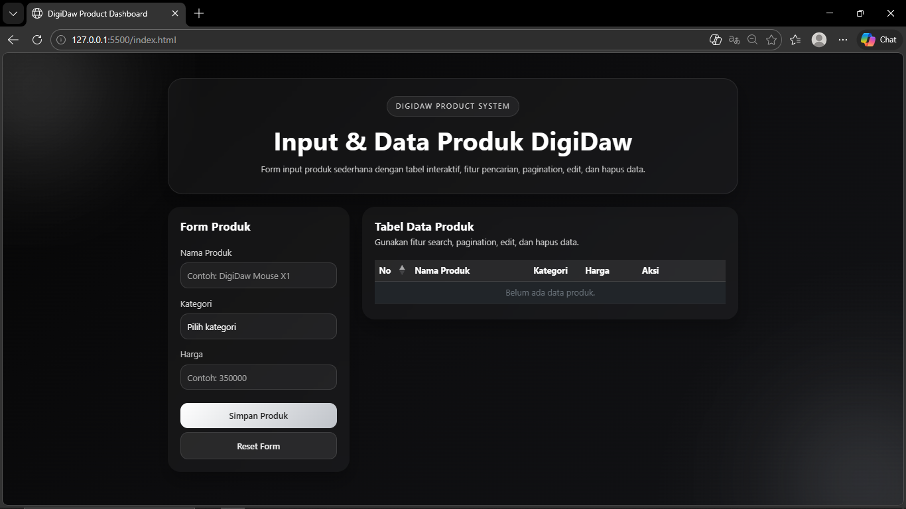
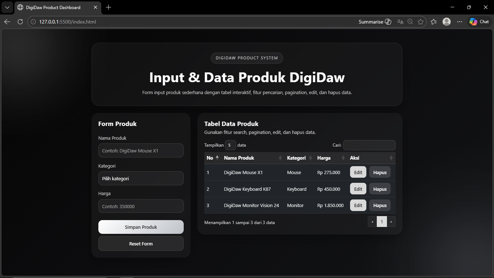
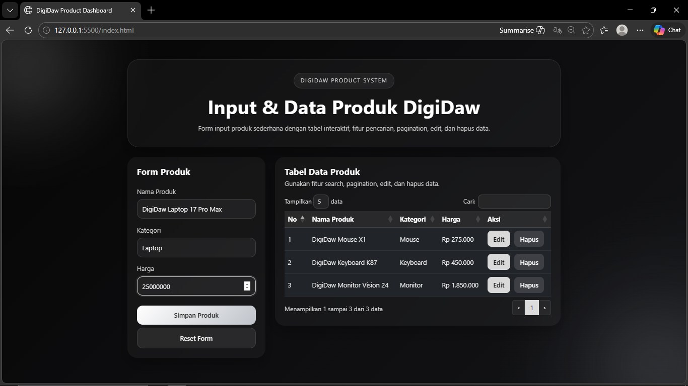
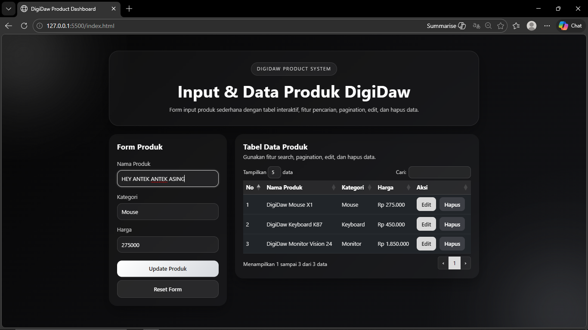
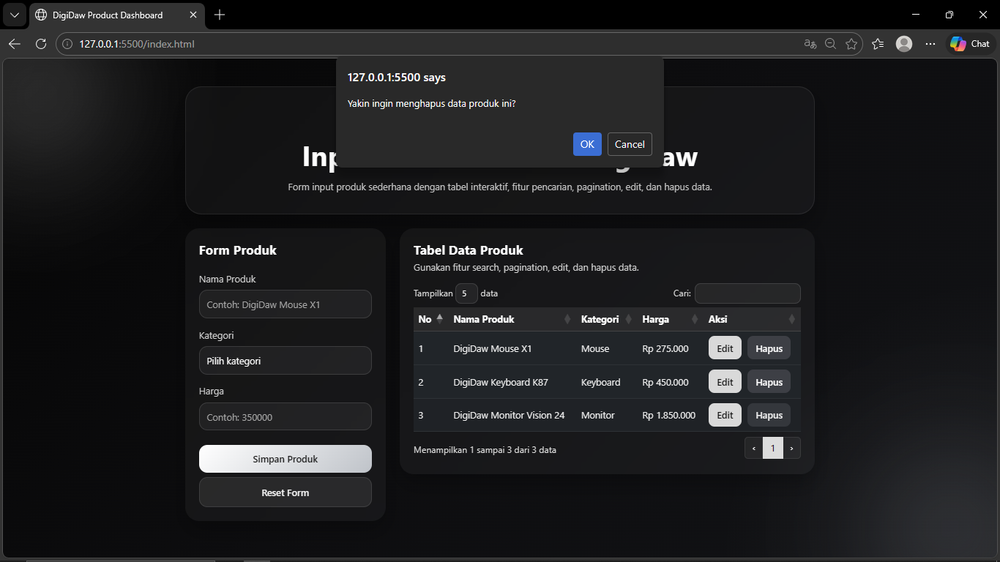

<div align="center">
  <br />
  <h1>LAPORAN PRAKTIKUM <br>APLIKASI BERBASIS PLATFORM</h1>
  <br />
  <h3>Tugas COTS</h3>
  <br />
  <br />
  
  <br />
  <br />
  <h3>Disusun Oleh :</h3>
  <p>
    <strong>Muhammad Hamzah Haifan Ma'ruf</strong><br>
    <strong>2311102091</strong><br>
    <strong>S1 IF-11-01</strong>
  </p>
  <br />
  <br />
  <h3>Dosen Pengampu :</h3>
  <p>
    <strong>Dimas Fanny Hebrasianto Permadi, S.ST., M.Kom</strong>
  </p>
  <br />
  <br />
  <h4>Asisten Praktikum :</h4>
  <strong>Apri Pandu Wicaksono</strong> <br>
  <strong>Rangga Pradarrell Fathi</strong>
  <br />
  <h3>LABORATORIUM HIGH PERFORMANCE
 <br>FAKULTAS INFORMATIKA <br>UNIVERSITAS TELKOM PURWOKERTO <br>2026</h3>
</div>

---

## 1. Dasar Teori

**JavaScript** merupakan bahasa pemrograman yang digunakan untuk membuat halaman web menjadi lebih **interaktif, dinamis, dan responsif**. Jika HTML berperan sebagai kerangka utama halaman dan CSS mengatur tampilannya, maka JavaScript bertugas menambahkan logika, aksi, dan interaksi pada elemen web, misalnya saat tombol ditekan, data ditambahkan ke tabel, atau tampilan diperbarui tanpa memuat ulang halaman.

Dalam pengembangan web, JavaScript bekerja bersama **DOM (Document Object Model)**. DOM adalah representasi struktur dokumen HTML yang memungkinkan JavaScript untuk mengakses, membaca, mengubah, menambah, maupun menghapus elemen pada halaman secara langsung. Dengan DOM, data yang diinput dari form dapat segera ditampilkan ke tabel, diubah, atau dihapus sesuai kebutuhan pengguna.

Selain JavaScript, pada praktikum ini juga digunakan **Bootstrap** untuk membantu membuat tampilan antarmuka menjadi lebih rapi, konsisten, dan responsif. Bootstrap menyediakan berbagai class siap pakai seperti `container`, `row`, `col`, `card`, `form-control`, `btn`, dan `table` sehingga pembuatan tampilan halaman menjadi lebih cepat.

Untuk pengelolaan tabel, digunakan **jQuery DataTables**. Library ini berfungsi untuk menambahkan fitur **search**, **pagination**, dan pengelolaan tampilan tabel secara otomatis. Dengan DataTables, data produk yang dimasukkan ke dalam tabel dapat dicari dengan mudah dan ditampilkan secara lebih terstruktur.

Pada tugas ini, sistem penyimpanan data dibuat dengan konsep **mapping object**, yaitu data produk disimpan ke dalam objek JavaScript menggunakan **id** sebagai kunci. Pendekatan ini memudahkan proses tambah, ubah, tampil, dan hapus data secara sederhana dalam satu halaman web.

---

## 2. Penjelasan Kode HTML, CSS, dan JS

### Kode HTML (`index.html`)

```html
<!DOCTYPE html>
<html lang="id">
<head>
  <meta charset="UTF-8" />
  <meta name="viewport" content="width=device-width, initial-scale=1.0" />
  <title>DigiDaw Product Dashboard</title>

  <!-- Bootstrap 5 -->
  <link
    href="https://cdn.jsdelivr.net/npm/bootstrap@5.3.3/dist/css/bootstrap.min.css"
    rel="stylesheet"
  />

  <!-- DataTables -->
  <link
    rel="stylesheet"
    href="https://cdn.datatables.net/1.13.8/css/dataTables.bootstrap5.min.css"
  />

  <!-- Custom CSS -->
  <link rel="stylesheet" href="style.css" />
</head>
<body>
  <div class="bg-glow glow-one"></div>
  <div class="bg-glow glow-two"></div>

  <div class="container py-5">
    <div class="row justify-content-center">
      <div class="col-12 col-xl-10">
        <div class="hero-box mb-4 text-center">
          <p class="mini-badge mb-3">DIGIDAW PRODUCT SYSTEM</p>
          <h1 class="hero-title">Input & Data Produk DigiDaw</h1>
          <p class="hero-subtitle mb-0">
            Form input produk sederhana dengan tabel interaktif, fitur pencarian,
            pagination, edit, dan hapus data.
          </p>
        </div>

        <div class="row g-4">
          <div class="col-12 col-lg-4">
            <div class="card custom-card h-100 border-0">
              <div class="card-body p-4">
                <h2 class="section-title mb-4">Form Produk</h2>

                <form id="productForm">
                  <input type="hidden" id="editId" />

                  <div class="mb-3">
                    <label for="namaProduk" class="form-label">Nama Produk</label>
                    <input
                      type="text"
                      class="form-control custom-input"
                      id="namaProduk"
                      placeholder="Contoh: DigiDaw Mouse X1"
                      required
                    />
                  </div>

                  <div class="mb-3">
                    <label for="kategori" class="form-label">Kategori</label>
                    <select class="form-select custom-input" id="kategori" required>
                      <option value="">Pilih kategori</option>
                      <option value="Laptop">Laptop</option>
                      <option value="Keyboard">Keyboard</option>
                      <option value="Mouse">Mouse</option>
                      <option value="Monitor">Monitor</option>
                      <option value="Audio">Audio</option>
                      <option value="Aksesoris">Aksesoris</option>
                    </select>
                  </div>

                  <div class="mb-4">
                    <label for="harga" class="form-label">Harga</label>
                    <input
                      type="number"
                      class="form-control custom-input"
                      id="harga"
                      placeholder="Contoh: 350000"
                      required
                    />
                  </div>

                  <div class="d-grid gap-2">
                    <button type="submit" class="btn btn-save" id="submitBtn">
                      Simpan Produk
                    </button>
                    <button type="button" class="btn btn-reset" id="resetBtn">
                      Reset Form
                    </button>
                  </div>
                </form>
              </div>
            </div>
          </div>

          <div class="col-12 col-lg-8">
            <div class="card custom-card border-0">
              <div class="card-body p-4">
                <div class="table-header mb-3">
                  <h2 class="section-title mb-1">Tabel Data Produk</h2>
                  <p class="table-subtitle mb-0">
                    Gunakan fitur search, pagination, edit, dan hapus data.
                  </p>
                </div>

                <div class="table-responsive">
                  <table
                    id="productTable"
                    class="table table-dark table-hover align-middle custom-table w-100"
                  >
                    <thead>
                      <tr>
                        <th>No</th>
                        <th>Nama Produk</th>
                        <th>Kategori</th>
                        <th>Harga</th>
                        <th>Aksi</th>
                      </tr>
                    </thead>
                    <tbody></tbody>
                  </table>
                </div>
              </div>
            </div>
          </div>
        </div>

      </div>
    </div>
  </div>

  <!-- jQuery -->
  <script src="https://code.jquery.com/jquery-3.7.1.min.js"></script>

  <!-- Bootstrap JS -->
  <script src="https://cdn.jsdelivr.net/npm/bootstrap@5.3.3/dist/js/bootstrap.bundle.min.js"></script>

  <!-- DataTables -->
  <script src="https://cdn.datatables.net/1.13.8/js/jquery.dataTables.min.js"></script>
  <script src="https://cdn.datatables.net/1.13.8/js/dataTables.bootstrap5.min.js"></script>

  <!-- Custom JS -->
  <script src="script.js"></script>
</body>
</html>
```

### Kode CSS (`style.css`)

```css
* {
  margin: 0;
  padding: 0;
  box-sizing: border-box;
  font-family: "Segoe UI", Arial, sans-serif;
}

body {
  min-height: 100vh;
  background:
    radial-gradient(circle at top left, rgba(255, 255, 255, 0.06), transparent 20%),
    radial-gradient(circle at bottom right, rgba(192, 192, 192, 0.08), transparent 25%),
    linear-gradient(135deg, #050505, #0d0d0f, #121316);
  color: #f5f5f5;
  position: relative;
  overflow-x: hidden;
}

.bg-glow {
  position: fixed;
  border-radius: 50%;
  filter: blur(90px);
  z-index: 0;
  opacity: 0.18;
}

.glow-one {
  width: 230px;
  height: 230px;
  background: #ffffff;
  top: -50px;
  left: -50px;
}

.glow-two {
  width: 280px;
  height: 280px;
  background: #9ea3ad;
  bottom: -90px;
  right: -60px;
}

.container {
  position: relative;
  z-index: 2;
}

.hero-box {
  background: rgba(255, 255, 255, 0.04);
  border: 1px solid rgba(255, 255, 255, 0.08);
  border-radius: 28px;
  padding: 32px 24px;
  box-shadow: 0 18px 40px rgba(0, 0, 0, 0.28);
  backdrop-filter: blur(12px);
}

.mini-badge {
  display: inline-block;
  padding: 8px 16px;
  border-radius: 999px;
  background: rgba(255, 255, 255, 0.06);
  color: #d9d9d9;
  font-size: 0.85rem;
  letter-spacing: 2px;
  border: 1px solid rgba(255, 255, 255, 0.1);
}

.hero-title {
  font-size: clamp(2rem, 4vw, 3rem);
  font-weight: 700;
  color: #ffffff;
  margin-bottom: 10px;
}

.hero-subtitle {
  color: #c7c7c7;
  font-size: 1rem;
  line-height: 1.8;
}

.custom-card {
  background: rgba(255, 255, 255, 0.045);
  border-radius: 24px;
  box-shadow: 0 16px 35px rgba(0, 0, 0, 0.25);
  backdrop-filter: blur(14px);
}

.section-title {
  font-size: 1.35rem;
  font-weight: 700;
  color: #ffffff;
}

.table-subtitle,
.form-label {
  color: #d2d2d2;
}

.custom-input {
  background: rgba(255, 255, 255, 0.05);
  border: 1px solid rgba(255, 255, 255, 0.12);
  color: #ffffff;
  border-radius: 14px;
  min-height: 48px;
}

.custom-input:focus {
  background: rgba(255, 255, 255, 0.06);
  color: #ffffff;
  border-color: #cfcfcf;
  box-shadow: 0 0 0 0.2rem rgba(255, 255, 255, 0.08);
}

.custom-input::placeholder {
  color: #a9a9a9;
}

.form-select option {
  color: #111111;
}

.btn-save,
.btn-reset,
.btn-edit-action,
.btn-delete-action {
  border: none;
  border-radius: 14px;
  font-weight: 600;
  padding: 12px 18px;
  transition: 0.3s ease;
}

.btn-save {
  background: linear-gradient(135deg, #ffffff, #bfc3c9);
  color: #111111;
}

.btn-save:hover {
  transform: translateY(-2px);
  background: linear-gradient(135deg, #ffffff, #d6d9de);
  color: #111111;
}

.btn-reset {
  background: rgba(255, 255, 255, 0.08);
  color: #f5f5f5;
  border: 1px solid rgba(255, 255, 255, 0.1);
}

.btn-reset:hover {
  background: rgba(255, 255, 255, 0.12);
  color: #ffffff;
}

.custom-table {
  border-color: rgba(255, 255, 255, 0.08);
  margin-bottom: 0;
}

.custom-table thead th {
  background: rgba(255, 255, 255, 0.08);
  color: #ffffff;
  border-bottom: 1px solid rgba(255, 255, 255, 0.12);
  white-space: nowrap;
}

.custom-table tbody td {
  color: #f0f0f0;
  border-color: rgba(255, 255, 255, 0.06);
  vertical-align: middle;
}

.btn-edit-action {
  background: #d9d9d9;
  color: #101010;
  margin-right: 6px;
  padding: 8px 14px;
  border-radius: 10px;
}

.btn-edit-action:hover {
  background: #ffffff;
}

.btn-delete-action {
  background: #3d3f45;
  color: #ffffff;
  padding: 8px 14px;
  border-radius: 10px;
}

.btn-delete-action:hover {
  background: #5c6169;
}

.dataTables_wrapper .dataTables_length label,
.dataTables_wrapper .dataTables_filter label,
.dataTables_wrapper .dataTables_info,
.dataTables_wrapper .dataTables_paginate {
  color: #dedede !important;
  font-size: 0.95rem;
}

.dataTables_wrapper .dataTables_filter input,
.dataTables_wrapper .dataTables_length select {
  background: rgba(255, 255, 255, 0.06) !important;
  border: 1px solid rgba(255, 255, 255, 0.12) !important;
  color: #ffffff !important;
  border-radius: 10px !important;
  padding: 6px 10px !important;
}

.dataTables_wrapper .page-link {
  background: rgba(255, 255, 255, 0.05);
  color: #ffffff;
  border: 1px solid rgba(255, 255, 255, 0.08);
}

.dataTables_wrapper .page-item.active .page-link {
  background: #dcdcdc;
  color: #111111;
  border-color: #dcdcdc;
}

.dataTables_wrapper .page-link:hover {
  background: rgba(255, 255, 255, 0.15);
  color: #ffffff;
}

@media (max-width: 768px) {
  .hero-box {
    padding: 24px 18px;
  }

  .custom-card {
    border-radius: 20px;
  }

  .btn-edit-action,
  .btn-delete-action {
    display: block;
    width: 100%;
    margin-right: 0;
  }

  .btn-edit-action {
    margin-bottom: 8px;
  }
}
```

### Kode JavaScript (`script.js`)

```javascript
let productMap = {};
let dataTable = null;

const productForm = document.getElementById("productForm");
const editId = document.getElementById("editId");
const namaProduk = document.getElementById("namaProduk");
const kategori = document.getElementById("kategori");
const harga = document.getElementById("harga");
const submitBtn = document.getElementById("submitBtn");
const resetBtn = document.getElementById("resetBtn");
const tableBody = document.querySelector("#productTable tbody");

function formatRupiah(number) {
  return "Rp " + Number(number).toLocaleString("id-ID");
}

function generateId() {
  return "PRD-" + Date.now();
}

function resetForm() {
  productForm.reset();
  editId.value = "";
  submitBtn.textContent = "Simpan Produk";
}

function renderTable() {
  const productArray = Object.values(productMap);

  if (dataTable) {
    dataTable.destroy();
  }

  tableBody.innerHTML = "";

  if (productArray.length === 0) {
    tableBody.innerHTML = `
      <tr>
        <td colspan="5" class="text-center text-secondary">Belum ada data produk.</td>
      </tr>
    `;
  } else {
    productArray.forEach((product, index) => {
      tableBody.innerHTML += `
        <tr>
          <td>${index + 1}</td>
          <td>${product.nama}</td>
          <td>${product.kategori}</td>
          <td>${formatRupiah(product.harga)}</td>
          <td>
            <button class="btn btn-edit-action" onclick="editProduct('${product.id}')">Edit</button>
            <button class="btn btn-delete-action" onclick="deleteProduct('${product.id}')">Hapus</button>
          </td>
        </tr>
      `;
    });
  }

  dataTable = $("#productTable").DataTable({
    responsive: true,
    pageLength: 5,
    lengthMenu: [5, 10, 25, 50],
    language: {
      search: "Cari:",
      lengthMenu: "Tampilkan _MENU_ data",
      info: "Menampilkan _START_ sampai _END_ dari _TOTAL_ data",
      paginate: {
        first: "Awal",
        last: "Akhir",
        next: "›",
        previous: "‹"
      },
      zeroRecords: "Data tidak ditemukan",
      infoEmpty: "Belum ada data",
      infoFiltered: "(difilter dari _MAX_ total data)"
    }
  });
}

function editProduct(id) {
  const product = productMap[id];
  if (!product) return;

  editId.value = product.id;
  namaProduk.value = product.nama;
  kategori.value = product.kategori;
  harga.value = product.harga;
  submitBtn.textContent = "Update Produk";

  window.scrollTo({
    top: 0,
    behavior: "smooth"
  });
}

function deleteProduct(id) {
  const confirmDelete = confirm("Yakin ingin menghapus data produk ini?");
  if (!confirmDelete) return;

  delete productMap[id];
  renderTable();
  resetForm();
}

productForm.addEventListener("submit", function (e) {
  e.preventDefault();

  const id = editId.value || generateId();

  productMap[id] = {
    id: id,
    nama: namaProduk.value.trim(),
    kategori: kategori.value,
    harga: harga.value
  };

  renderTable();
  resetForm();
});

resetBtn.addEventListener("click", function () {
  resetForm();
});

productMap = {
  "PRD-1001": {
    id: "PRD-1001",
    nama: "DigiDaw Mouse X1",
    kategori: "Mouse",
    harga: 275000
  },
  "PRD-1002": {
    id: "PRD-1002",
    nama: "DigiDaw Keyboard K87",
    kategori: "Keyboard",
    harga: 450000
  },
  "PRD-1003": {
    id: "PRD-1003",
    nama: "DigiDaw Monitor Vision 24",
    kategori: "Monitor",
    harga: 1850000
  }
};

renderTable();
```

### Hasil Tampilan 



### Tambah DigiDaw


### Tampilan Tabel


### Edit DigiDaw


### Hapus DigiDaw


### Penjelasan Code

#### 1. HTML (`index.html`)

- Pada bagian `<head>`, digunakan tag `<meta>` untuk mengatur karakter dokumen dan responsivitas tampilan halaman.
- File **Bootstrap 5** dipanggil melalui CDN agar halaman dapat menggunakan komponen dan utility class bawaan seperti `container`, `row`, `col`, `card`, `btn`, `form-control`, dan `table`.
- File **DataTables CSS** juga dipanggil agar tabel memiliki tampilan bawaan yang sudah mendukung fitur interaktif.
- Pada bagian utama halaman, struktur layout dibuat menggunakan sistem grid Bootstrap. Bagian kiri berisi **form input produk**, sedangkan bagian kanan berisi **tabel data produk**.
- Form memiliki tiga input utama yaitu:
  - **Nama Produk**
  - **Kategori**
  - **Harga**
- Terdapat juga input tersembunyi `editId` yang digunakan untuk menyimpan id produk saat proses edit.
- Tabel produk dibuat menggunakan elemen `<table>` dengan `id="productTable"` agar dapat diproses oleh jQuery DataTables.
- Pada bagian akhir dokumen dipanggil **jQuery**, **Bootstrap JS**, **DataTables JS**, dan file `script.js` agar seluruh fungsi interaktif dapat berjalan dengan baik.

#### 2. CSS (`style.css`)

- Selector `*` digunakan untuk mereset margin, padding, dan `box-sizing` seluruh elemen.
- Pada elemen `body`, digunakan kombinasi `linear-gradient` dan `radial-gradient` untuk menghasilkan nuansa **hitam, putih, abu, dan silver neon futuristik**.
- Class `.bg-glow`, `.glow-one`, dan `.glow-two` digunakan untuk membuat efek cahaya blur pada latar belakang sehingga tampilan terasa lebih modern.
- Class `.hero-box` digunakan sebagai area judul utama dengan gaya semi transparan dan efek blur agar terlihat rapi.
- Class `.custom-card` digunakan untuk membentuk card utama form dan tabel dengan efek **glassmorphism**.
- Class `.custom-input` digunakan untuk mempercantik input form agar warnanya serasi dengan tema gelap.
- Class `.btn-save` dan `.btn-reset` digunakan untuk membuat tombol simpan dan reset dengan gaya modern dan tidak bertabrakan dengan komponen lain.
- Class `.custom-table` mengatur tampilan tabel agar lebih bersih dan nyaman dibaca.
- Class `.btn-edit-action` dan `.btn-delete-action` digunakan untuk tombol aksi edit dan hapus pada setiap data.
- Bagian `.dataTables_wrapper` digunakan untuk menyesuaikan warna elemen bawaan DataTables seperti search box, pagination, informasi tabel, dan dropdown jumlah data.
- Media query digunakan agar tampilan tetap rapi saat dibuka di layar yang lebih kecil.

#### 3. JavaScript (`script.js`)

- Variabel `productMap` digunakan sebagai **mapping object** untuk menyimpan data produk.
- Setiap produk disimpan dalam bentuk object dengan properti:
  - `id`
  - `nama`
  - `kategori`
  - `harga`
- Fungsi `formatRupiah()` digunakan untuk mengubah angka menjadi format mata uang Rupiah.
- Fungsi `generateId()` digunakan untuk membuat id produk otomatis berdasarkan waktu.
- Fungsi `resetForm()` digunakan untuk mengosongkan form dan mengembalikan tombol submit ke kondisi awal.
- Fungsi `renderTable()` berfungsi menampilkan seluruh data dari `productMap` ke dalam tabel HTML.
- Saat data ditampilkan, tabel diproses menggunakan **jQuery DataTables** agar memiliki fitur:
  - **search**
  - **pagination**
  - **pengaturan jumlah data**
  - **info jumlah data**
- Fungsi `editProduct(id)` digunakan untuk mengambil data berdasarkan id, lalu menampilkannya kembali ke form agar bisa diperbarui.
- Fungsi `deleteProduct(id)` digunakan untuk menghapus data dari mapping object setelah pengguna menekan tombol hapus dan menyetujui konfirmasi.
- Event `submit` pada form digunakan untuk menyimpan data baru atau memperbarui data lama.
- Event pada tombol reset digunakan untuk membersihkan seluruh input form.
- Di bagian akhir, terdapat data awal produk DigiDaw agar saat halaman pertama kali dibuka tabel langsung menampilkan contoh data.

Secara keseluruhan, halaman ini sudah memenuhi ketentuan tugas karena:
- menggunakan **Bootstrap** untuk tampilan
- memiliki **form input produk**
- data form ditampilkan ke **tabel**
- tabel menggunakan **jQuery DataTables**
- tersedia tombol **hapus**
- memiliki fitur **search** dan **pagination**
- menggunakan **mapping object** untuk penyimpanan data
- mendukung **CRUD sederhana** melalui tambah, tampil, edit, dan hapus data

## Refrensi

- Ahmad Martani, Saripuddin M., dan Nurul Ikhsan. “Rancang Bangun Website Company Profile Berbasis Framework Bootstrap dan Framework CodeIgniter Pada Yayasan Khalifah Cendekia Mandiri.” *Jurnal Multidisiplin Madani (MUDIMA)*, Vol. 2, No. 6, 2022.
- Haris Hendra. “Perancangan dan Implementasi Website Menggunakan HTML, CSS, JavaScript, dan Framework Bootstrap.” *Jurnal Informatika dan Teknik Elektro Terapan (JITET)*, 2023.
- Christian, A., Hesinto, S., dan Agustina, A. “Rancang Bangun Website Sekolah Dengan Menggunakan Framework Bootstrap.” *Jurnal Sisfokom*, Vol. 7, No. 1, 2018.