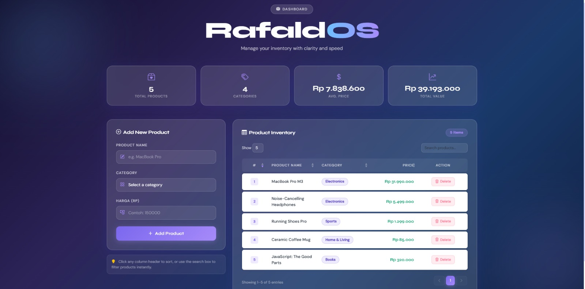
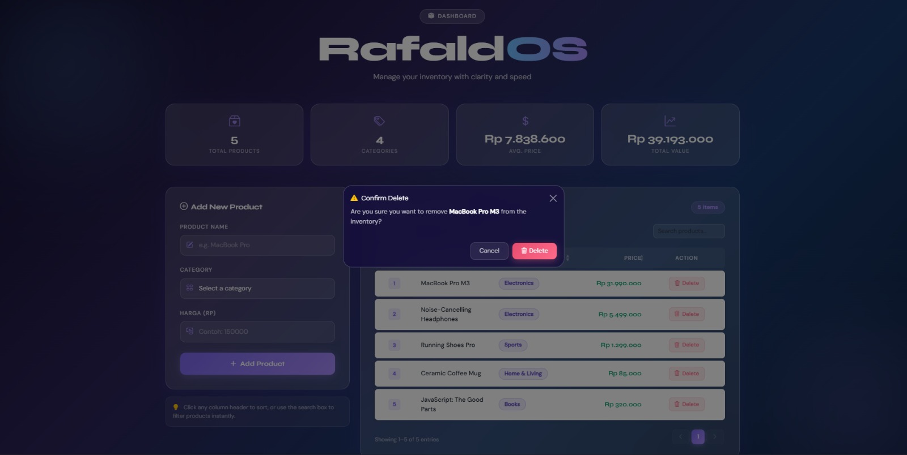
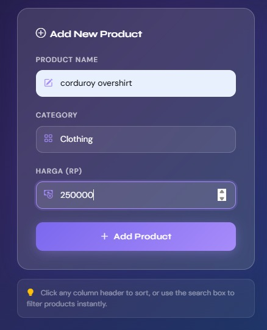
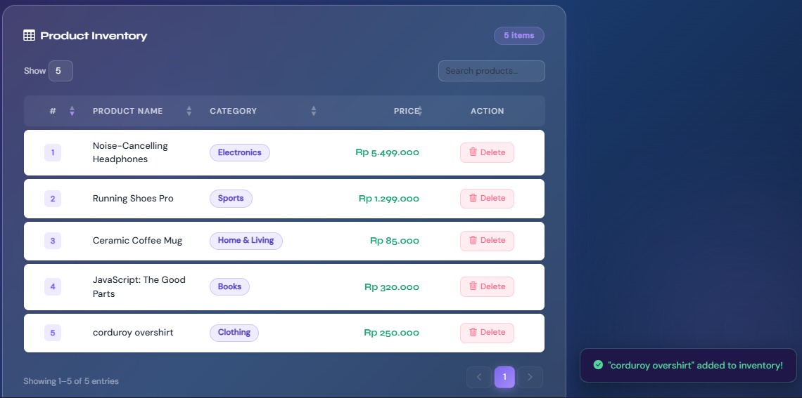
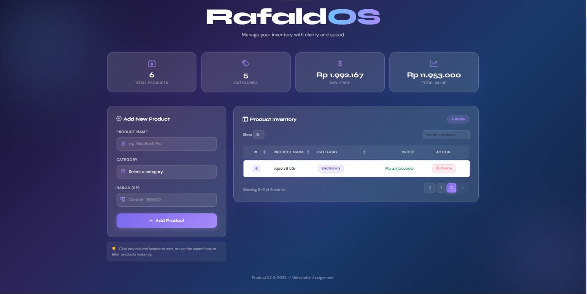

<div align="center">
  <br />
  <h1>LAPORAN PRAKTIKUM <br>APLIKASI BERBASIS PLATFORM</h1>
  <br />
  <h2>TUGAS COTS <br>DATA PRODUK</h2>
  <br />
  <br />
  
  <br />
  <br />
  <br />
  <h3>Disusun Oleh :</h3>
  <p>
    <strong>Rafaldo Al Maqdis</strong><br>
    <strong>2311102099</strong><br>
    <strong>S1 IF-11-REG 01</strong>
  </p>
  <br />
  <h3>Dosen Pengampu :</h3>
  <p>
    <strong>Dimas Fanny Hebrasianto Permadi, S.ST., M.Kom</strong>
  </p>
  <br />
  <br />
  <h4>Asisten Praktikum :</h4>
  <strong>Apri Pandu Wicaksono</strong> <br>
  <strong>Rangga Pradarrell Fathi</strong>
  <br />
  <h2>LABORATORIUM HIGH PERFORMANCE
  <br>FAKULTAS INFORMATIKA <br>UNIVERSITAS TELKOM PURWOKERTO <br>2026</h2>
</div>

---

## 1. Dasar Teori

**Konsep CRUD (Create, Read, Update, Delete)** merupakan dasar dalam proses pengelolaan data pada sebuah sistem aplikasi. Melalui empat operasi utama ini, pengguna dapat menambahkan data baru, melihat informasi yang tersimpan, memperbarui data yang sudah ada, serta menghapus data yang tidak lagi dibutuhkan. Pada pengembangan sisi *front-end*, implementasi CRUD biasanya memanfaatkan JavaScript untuk mengubah dan mengelola elemen pada halaman web melalui mekanisme **DOM (Document Object Model)** secara dinamis di browser pengguna.

**Bootstrap Framework** dimanfaatkan untuk mempermudah pembuatan tampilan antarmuka yang responsif dan menarik. Framework ini menyediakan berbagai komponen siap pakai serta sistem *grid layout* yang memudahkan pengembang dalam mengatur tata letak halaman. Dengan adanya komponen tersebut, proses desain antarmuka menjadi lebih cepat karena tidak perlu menulis seluruh aturan CSS dari awal.

**jQuery DataTables** merupakan plugin yang digunakan untuk meningkatkan fungsionalitas tabel HTML. Dengan pustaka ini, tabel dapat dilengkapi fitur seperti pencarian data (*search*), pengurutan kolom (*sorting*), serta pembagian halaman (*pagination*) secara otomatis. Hal tersebut membuat pengolahan data dalam tabel menjadi lebih efisien tanpa harus menambahkan logika pemrograman yang kompleks.

**Object Mapping dalam JavaScript** adalah metode penyimpanan data menggunakan struktur pasangan **kunci dan nilai (key-value)**. Berbeda dengan struktur *array* yang biasanya membutuhkan proses perulangan untuk menemukan data tertentu, objek memungkinkan akses data secara langsung menggunakan kunci unik seperti ID. Teknik ini sering digunakan dalam pengelolaan *state* aplikasi karena memberikan performa akses yang cepat, dengan kompleksitas waktu sekitar **O(1)** untuk proses pencarian maupun penghapusan data.

---

## 2. Unguided

Pada bagian ini dijelaskan implementasi sistem pengelolaan data produk yang menggunakan penyimpanan berbasis objek di dalam JavaScript.

# index.html
```
<!DOCTYPE html>
<html lang="en">
<head>
  <meta charset="UTF-8" />
  <meta name="viewport" content="width=device-width, initial-scale=1.0"/>
  <title>ProductOS — Product Manager</title>

  <!-- Google Fonts -->
  <link href="https://fonts.googleapis.com/css2?family=Syne:wght@400;600;700;800&family=DM+Sans:ital,wght@0,300;0,400;0,500;1,300&display=swap" rel="stylesheet"/>

  <!-- Bootstrap 5 -->
  <link href="https://cdn.jsdelivr.net/npm/bootstrap@5.3.2/dist/css/bootstrap.min.css" rel="stylesheet"/>

  <!-- DataTables Bootstrap 5 CSS -->
  <link href="https://cdn.datatables.net/1.13.7/css/dataTables.bootstrap5.min.css" rel="stylesheet"/>

  <!-- Bootstrap Icons -->
  <link href="https://cdn.jsdelivr.net/npm/bootstrap-icons@1.11.3/font/bootstrap-icons.min.css" rel="stylesheet"/>

  <link rel="stylesheet" href="style.css"/>
</head>
<body>

  <!-- Animated background orbs -->
  <div class="bg-orb orb-1"></div>
  <div class="bg-orb orb-2"></div>
  <div class="bg-orb orb-3"></div>

  <div class="container py-5">

    <!-- ── HEADER ── -->
    <header class="page-header text-center mb-5">
      <div class="header-badge mb-3">
        <i class="bi bi-box-seam-fill me-2"></i>Dashboard
      </div>
      <h1 class="display-title">Rafald<span class="accent">OS</span></h1>
      <p class="subtitle">Manage your inventory with clarity and speed</p>
    </header>

    <!-- ── STATS ROW ── -->
    <div class="row g-3 mb-5" id="statsRow">
      <div class="col-6 col-md-3">
        <div class="stat-card">
          <div class="stat-icon"><i class="bi bi-box2-heart"></i></div>
          <div class="stat-value" id="statTotal">0</div>
          <div class="stat-label">Total Products</div>
        </div>
      </div>
      <div class="col-6 col-md-3">
        <div class="stat-card">
          <div class="stat-icon"><i class="bi bi-tags"></i></div>
          <div class="stat-value" id="statCategories">0</div>
          <div class="stat-label">Categories</div>
        </div>
      </div>
      <div class="col-6 col-md-3">
        <div class="stat-card">
          <div class="stat-icon"><i class="bi bi-currency-dollar"></i></div>
          <div class="stat-value" id="statAvg">$0</div>
          <div class="stat-label">Avg. Price</div>
        </div>
      </div>
      <div class="col-6 col-md-3">
        <div class="stat-card">
          <div class="stat-icon"><i class="bi bi-graph-up-arrow"></i></div>
          <div class="stat-value" id="statTotal2">$0</div>
          <div class="stat-label">Total Value</div>
        </div>
      </div>
    </div>

    <!-- ── MAIN CONTENT ── -->
    <div class="row g-4 align-items-start">

      <!-- Form Column -->
      <div class="col-lg-4">
        <div class="glass-card form-card">
          <div class="card-label mb-4">
            <i class="bi bi-plus-circle me-2"></i>Add New Product
          </div>

          <form id="productForm" novalidate>

            <div class="mb-4">
              <label for="productName" class="form-label-custom">Product Name</label>
              <div class="input-wrapper">
                <i class="bi bi-pencil-square input-icon"></i>
                <input type="text" class="form-control custom-input" id="productName"
                       placeholder="e.g. MacBook Pro" required/>
              </div>
              <div class="invalid-feedback-custom" id="nameError">Please enter a product name.</div>
            </div>

            <div class="mb-4">
              <label for="category" class="form-label-custom">Category</label>
              <div class="input-wrapper">
                <i class="bi bi-grid input-icon"></i>
                <select class="form-control custom-input" id="category" required>
                  <option value="" disabled selected>Select a category</option>
                  <option>Electronics</option>
                  <option>Clothing</option>
                  <option>Food & Beverage</option>
                  <option>Home & Living</option>
                  <option>Sports</option>
                  <option>Books</option>
                  <option>Other</option>
                </select>
              </div>
              <div class="invalid-feedback-custom" id="categoryError">Please select a category.</div>
            </div>

            <div class="mb-4">
              <label for="price" class="form-label-custom">Harga (Rp)</label>
              <div class="input-wrapper">
                <i class="bi bi-cash-coin input-icon"></i>
                <input type="number" class="form-control custom-input" id="price"
                       placeholder="Contoh: 150000" min="0" step="1" required/>
              </div>
              <div class="invalid-feedback-custom" id="priceError">Please enter a valid price.</div>
            </div>

            <button type="submit" class="btn-add w-100">
              <i class="bi bi-plus-lg me-2"></i>Add Product
            </button>

          </form>
        </div>

        <!-- Tip card -->
        <div class="tip-card mt-3">
          <i class="bi bi-lightbulb-fill me-2 text-warning"></i>
          <span>Click any column header to sort, or use the search box to filter products instantly.</span>
        </div>
      </div>

      <!-- Table Column -->
      <div class="col-lg-8">
        <div class="glass-card table-card">
          <div class="d-flex align-items-center justify-content-between mb-4 flex-wrap gap-3">
            <div class="card-label">
              <i class="bi bi-table me-2"></i>Product Inventory
            </div>
            <div class="d-flex gap-2">
              <span class="pill-badge" id="countBadge">0 items</span>
            </div>
          </div>

          <!-- Empty state -->
          <div id="emptyState" class="empty-state">
            <div class="empty-icon"><i class="bi bi-inbox"></i></div>
            <p class="empty-title">No products yet</p>
            <p class="empty-sub">Add your first product using the form on the left.</p>
          </div>

          <!-- Table -->
          <div id="tableWrapper" style="display:none;">
            <table id="productTable" class="table table-hover w-100">
              <thead>
                <tr>
                  <th>#</th>
                  <th>Product Name</th>
                  <th>Category</th>
                  <th>Price</th>
                  <th>Action</th>
                </tr>
              </thead>
              <tbody id="tableBody"></tbody>
            </table>
          </div>
        </div>
      </div>

    </div><!-- /row -->

    <!-- Footer -->
    <footer class="text-center mt-5 footer-text">
      <span>ProductOS &copy; 2025 &mdash; University Assignment</span>
    </footer>

  </div><!-- /container -->

  <!-- Toast notification -->
  <div class="toast-container position-fixed bottom-0 end-0 p-4">
    <div id="liveToast" class="custom-toast" role="alert">
      <i class="bi bi-check-circle-fill me-2"></i>
      <span id="toastMsg">Product added!</span>
    </div>
  </div>

  <!-- Delete Confirm Modal -->
  <div class="modal fade" id="deleteModal" tabindex="-1">
    <div class="modal-dialog modal-dialog-centered">
      <div class="modal-content glass-modal">
        <div class="modal-header border-0 pb-0">
          <h5 class="modal-title"><i class="bi bi-exclamation-triangle-fill text-warning me-2"></i>Confirm Delete</h5>
          <button type="button" class="btn-close btn-close-white" data-bs-dismiss="modal"></button>
        </div>
        <div class="modal-body pt-2">
          <p class="modal-desc">Are you sure you want to remove <strong id="deleteProductName"></strong> from the inventory?</p>
        </div>
        <div class="modal-footer border-0 pt-0">
          <button type="button" class="btn-modal-cancel" data-bs-dismiss="modal">Cancel</button>
          <button type="button" class="btn-modal-delete" id="confirmDelete">
            <i class="bi bi-trash3 me-1"></i>Delete
          </button>
        </div>
      </div>
    </div>
  </div>

  <!-- Scripts -->
  <script src="https://cdn.jsdelivr.net/npm/bootstrap@5.3.2/dist/js/bootstrap.bundle.min.js"></script>
  <script src="https://code.jquery.com/jquery-3.7.1.min.js"></script>
  <script src="https://cdn.datatables.net/1.13.7/js/jquery.dataTables.min.js"></script>
  <script src="https://cdn.datatables.net/1.13.7/js/dataTables.bootstrap5.min.js"></script>
  <script src="script.js"></script>
</body>
</html>

```

# style.css
```
/* ================================================================
   ProductOS — style.css
   Glassmorphism Dashboard | Gradient Background | Modern UI
   ================================================================ */

/* ---------- CSS Variables ---------- */
:root {
  --grad-1: #6ec1ff;
  --grad-2: #7b68ee;
  --grad-3: #a78bfa;
  --glass-bg: rgba(255, 255, 255, 0.12);
  --glass-border: rgba(255, 255, 255, 0.22);
  --glass-shadow: 0 8px 40px rgba(80, 60, 200, 0.18);
  --text-primary: #ffffff;
  --text-secondary: rgba(255, 255, 255, 0.72);
  --text-muted: rgba(255, 255, 255, 0.45);
  --accent: #a78bfa;
  --danger: #ff6b8a;
  --success: #56d4a0;
  --font-display: 'Syne', sans-serif;
  --font-body: 'DM Sans', sans-serif;
  --radius-lg: 20px;
  --radius-md: 12px;
  --radius-sm: 8px;
  --transition: 0.25s cubic-bezier(0.4, 0, 0.2, 1);
}

/* ---------- Base & Background ---------- */
*, *::before, *::after { box-sizing: border-box; }

body {
  font-family: var(--font-body);
  background: linear-gradient(135deg, #0f0c29 0%, #2d2459 35%, #1a3a6b 65%, #0f1e3d 100%);
  min-height: 100vh;
  color: var(--text-primary);
  overflow-x: hidden;
  position: relative;
}

/* ---------- Floating Background Orbs ---------- */
.bg-orb {
  position: fixed;
  border-radius: 50%;
  filter: blur(90px);
  pointer-events: none;
  z-index: 0;
  animation: floatOrb 12s ease-in-out infinite alternate;
}
.orb-1 {
  width: 520px; height: 520px;
  background: radial-gradient(circle, rgba(110,193,255,0.28) 0%, transparent 70%);
  top: -140px; left: -140px;
  animation-delay: 0s;
}
.orb-2 {
  width: 480px; height: 480px;
  background: radial-gradient(circle, rgba(167,139,250,0.26) 0%, transparent 70%);
  bottom: -100px; right: -100px;
  animation-delay: -4s;
}
.orb-3 {
  width: 320px; height: 320px;
  background: radial-gradient(circle, rgba(123,104,238,0.22) 0%, transparent 70%);
  top: 45%; left: 42%;
  animation-delay: -8s;
}
@keyframes floatOrb {
  0%   { transform: translate(0, 0) scale(1); }
  100% { transform: translate(30px, 40px) scale(1.08); }
}

.container { position: relative; z-index: 1; }

/* ---------- Header ---------- */
.header-badge {
  display: inline-flex;
  align-items: center;
  background: var(--glass-bg);
  border: 1px solid var(--glass-border);
  backdrop-filter: blur(10px);
  padding: 6px 18px;
  border-radius: 50px;
  font-family: var(--font-body);
  font-size: 0.78rem;
  font-weight: 500;
  letter-spacing: 0.12em;
  text-transform: uppercase;
  color: var(--text-secondary);
}
.display-title {
  font-family: var(--font-display);
  font-size: clamp(2.8rem, 6vw, 5rem);
  font-weight: 800;
  letter-spacing: -0.03em;
  color: var(--text-primary);
  margin: 0;
  line-height: 1.05;
}
.display-title .accent {
  background: linear-gradient(90deg, var(--grad-1), var(--grad-3));
  -webkit-background-clip: text;
  -webkit-text-fill-color: transparent;
  background-clip: text;
}
.subtitle {
  font-size: 1.05rem;
  color: var(--text-secondary);
  font-weight: 300;
  margin-top: 0.5rem;
  letter-spacing: 0.01em;
}

/* ---------- Stat Cards ---------- */
.stat-card {
  background: var(--glass-bg);
  border: 1px solid var(--glass-border);
  backdrop-filter: blur(14px);
  -webkit-backdrop-filter: blur(14px);
  border-radius: var(--radius-lg);
  padding: 1.4rem 1.2rem;
  text-align: center;
  transition: transform var(--transition), box-shadow var(--transition);
  box-shadow: var(--glass-shadow);
}
.stat-card:hover {
  transform: translateY(-4px);
  box-shadow: 0 14px 50px rgba(167,139,250,0.22);
}
.stat-icon {
  font-size: 1.5rem;
  color: var(--accent);
  margin-bottom: 0.4rem;
  opacity: 0.85;
}
.stat-value {
  font-family: var(--font-display);
  font-size: 1.6rem;
  font-weight: 700;
  color: var(--text-primary);
  line-height: 1.2;
}
.stat-label {
  font-size: 0.73rem;
  color: var(--text-muted);
  text-transform: uppercase;
  letter-spacing: 0.1em;
  margin-top: 2px;
  font-weight: 500;
}

/* ---------- Glass Card ---------- */
.glass-card {
  background: var(--glass-bg);
  border: 1px solid var(--glass-border);
  backdrop-filter: blur(18px);
  -webkit-backdrop-filter: blur(18px);
  border-radius: var(--radius-lg);
  padding: 2rem;
  box-shadow: var(--glass-shadow);
}

.card-label {
  font-family: var(--font-display);
  font-size: 1.05rem;
  font-weight: 700;
  color: var(--text-primary);
  letter-spacing: -0.01em;
}

/* ---------- Form Elements ---------- */
.form-label-custom {
  display: block;
  font-size: 0.78rem;
  font-weight: 500;
  letter-spacing: 0.09em;
  text-transform: uppercase;
  color: var(--text-secondary);
  margin-bottom: 8px;
}
.input-wrapper {
  position: relative;
}
.input-icon {
  position: absolute;
  left: 14px;
  top: 50%;
  transform: translateY(-50%);
  color: var(--accent);
  font-size: 0.95rem;
  pointer-events: none;
  z-index: 2;
}
.custom-input {
  width: 100%;
  background: rgba(255,255,255,0.08) !important;
  border: 1px solid rgba(255,255,255,0.18) !important;
  border-radius: var(--radius-md) !important;
  color: var(--text-primary) !important;
  font-family: var(--font-body) !important;
  font-size: 0.92rem !important;
  padding: 0.72rem 1rem 0.72rem 2.6rem !important;
  transition: border-color var(--transition), box-shadow var(--transition), background var(--transition);
  outline: none !important;
  box-shadow: none !important;
  -webkit-appearance: none;
}
.custom-input::placeholder { color: rgba(255,255,255,0.35) !important; }
.custom-input:focus {
  background: rgba(255,255,255,0.13) !important;
  border-color: var(--accent) !important;
  box-shadow: 0 0 0 3px rgba(167,139,250,0.18) !important;
}
.custom-input option {
  background: #2d2459;
  color: white;
}
.invalid-feedback-custom {
  display: none;
  font-size: 0.78rem;
  color: var(--danger);
  margin-top: 6px;
  padding-left: 4px;
}
.custom-input.is-invalid { border-color: var(--danger) !important; }
.custom-input.is-invalid + .invalid-feedback-custom,
.invalid-feedback-custom.visible { display: block; }

/* ---------- Add Button ---------- */
.btn-add {
  background: linear-gradient(135deg, var(--grad-2), var(--grad-3));
  color: white;
  border: none;
  border-radius: var(--radius-md);
  padding: 0.85rem 1.5rem;
  font-family: var(--font-display);
  font-size: 0.95rem;
  font-weight: 600;
  letter-spacing: 0.02em;
  cursor: pointer;
  transition: transform var(--transition), box-shadow var(--transition), opacity var(--transition);
  box-shadow: 0 4px 20px rgba(167,139,250,0.35);
  position: relative;
  overflow: hidden;
}
.btn-add::after {
  content: '';
  position: absolute;
  inset: 0;
  background: linear-gradient(135deg, rgba(255,255,255,0.12), transparent);
  opacity: 0;
  transition: opacity var(--transition);
}
.btn-add:hover { transform: translateY(-2px); box-shadow: 0 8px 30px rgba(167,139,250,0.45); }
.btn-add:hover::after { opacity: 1; }
.btn-add:active { transform: translateY(0); }

/* ---------- Tip Card ---------- */
.tip-card {
  background: rgba(255,255,255,0.06);
  border: 1px solid rgba(255,255,255,0.1);
  border-radius: var(--radius-md);
  padding: 0.85rem 1rem;
  font-size: 0.8rem;
  color: var(--text-muted);
  line-height: 1.5;
}

/* ---------- Pill Badge ---------- */
.pill-badge {
  display: inline-flex;
  align-items: center;
  background: rgba(167,139,250,0.18);
  border: 1px solid rgba(167,139,250,0.3);
  color: var(--accent);
  font-size: 0.75rem;
  font-weight: 600;
  padding: 4px 14px;
  border-radius: 50px;
  letter-spacing: 0.05em;
}

/* ---------- Empty State ---------- */
.empty-state {
  text-align: center;
  padding: 4rem 2rem;
  color: var(--text-muted);
}
.empty-icon {
  font-size: 3.5rem;
  opacity: 0.4;
  margin-bottom: 1rem;
  display: block;
}
.empty-title {
  font-family: var(--font-display);
  font-size: 1.1rem;
  font-weight: 700;
  color: var(--text-secondary);
  margin-bottom: 0.4rem;
}
.empty-sub { font-size: 0.85rem; }

/* ---------- DataTables Overrides ---------- */
#tableWrapper { animation: fadeIn 0.3s ease; }
@keyframes fadeIn { from { opacity:0; transform:translateY(6px); } to { opacity:1; transform:translateY(0); } }

/* Search & Length */
div.dataTables_wrapper div.dataTables_length label,
div.dataTables_wrapper div.dataTables_filter label {
  color: var(--text-secondary);
  font-size: 0.83rem;
  font-family: var(--font-body);
}
div.dataTables_wrapper div.dataTables_length select,
div.dataTables_wrapper div.dataTables_filter input {
  background: rgba(255,255,255,0.08) !important;
  border: 1px solid rgba(255,255,255,0.16) !important;
  border-radius: 8px !important;
  color: white !important;
  font-family: var(--font-body) !important;
  font-size: 0.83rem !important;
  padding: 5px 10px !important;
  outline: none !important;
  box-shadow: none !important;
}
div.dataTables_wrapper div.dataTables_filter input:focus {
  border-color: var(--accent) !important;
  box-shadow: 0 0 0 3px rgba(167,139,250,0.15) !important;
}

/* Info & pagination text */
div.dataTables_wrapper div.dataTables_info {
  color: var(--text-muted);
  font-size: 0.8rem;
  padding-top: 0.85em;
}

/* Pagination */
div.dataTables_wrapper div.dataTables_paginate ul.pagination {
  margin: 0;
}
.page-link {
  background: rgba(255,255,255,0.07) !important;
  border: 1px solid rgba(255,255,255,0.12) !important;
  color: var(--text-secondary) !important;
  font-size: 0.82rem !important;
  border-radius: 8px !important;
  margin: 0 2px !important;
  transition: all var(--transition) !important;
}
.page-link:hover {
  background: rgba(167,139,250,0.22) !important;
  border-color: var(--accent) !important;
  color: white !important;
}
.page-item.active .page-link {
  background: linear-gradient(135deg, var(--grad-2), var(--grad-3)) !important;
  border-color: transparent !important;
  color: white !important;
  box-shadow: 0 3px 12px rgba(167,139,250,0.4) !important;
}
.page-item.disabled .page-link { opacity: 0.35 !important; }

/* Table */
table.dataTable {
  border-collapse: separate !important;
  border-spacing: 0 6px !important;
}
table.dataTable thead th {
  background: rgba(255,255,255,0.06) !important;
  border: none !important;
  color: var(--text-secondary) !important;
  font-family: var(--font-body) !important;
  font-size: 0.75rem !important;
  font-weight: 500 !important;
  text-transform: uppercase !important;
  letter-spacing: 0.1em !important;
  padding: 14px 16px !important;
}
table.dataTable thead th:first-child { border-radius: var(--radius-sm) 0 0 var(--radius-sm) !important; }
table.dataTable thead th:last-child  { border-radius: 0 var(--radius-sm) var(--radius-sm) 0 !important; }

table.dataTable thead .sorting::before,
table.dataTable thead .sorting::after,
table.dataTable thead .sorting_asc::before,
table.dataTable thead .sorting_asc::after,
table.dataTable thead .sorting_desc::before,
table.dataTable thead .sorting_desc::after {
  opacity: 0.45 !important;
}
table.dataTable thead .sorting_asc::after,
table.dataTable thead .sorting_desc::after { color: var(--accent) !important; opacity: 1 !important; }

table.dataTable tbody tr {
  background: rgba(255,255,255,0.95) !important;
  border-radius: var(--radius-sm);
  transition: background var(--transition), transform var(--transition), box-shadow var(--transition);
  box-shadow: 0 2px 8px rgba(0,0,0,0.08);
  border: 1px solid rgba(255,255,255,0.6) !important;
}
table.dataTable tbody tr:hover {
  background: rgba(255,255,255,1) !important;
  transform: translateX(2px);
  box-shadow: 0 4px 18px rgba(100,70,220,0.18) !important;
  border: 1px solid rgba(167,139,250,0.4) !important;
}
table.dataTable tbody td {
  border: none !important;
  color: #1f2937 !important;
  font-size: 0.88rem !important;
  padding: 14px 16px !important;
  vertical-align: middle !important;
}
table.dataTable tbody td:first-child { border-radius: var(--radius-sm) 0 0 var(--radius-sm) !important; }
table.dataTable tbody td:last-child  { border-radius: 0 var(--radius-sm) var(--radius-sm) 0 !important; }

/* Row number */
.row-num {
  display: inline-flex;
  width: 26px; height: 26px;
  align-items: center;
  justify-content: center;
  background: rgba(167,139,250,0.18);
  border-radius: 6px;
  font-size: 0.75rem;
  font-weight: 600;
  color: #7b68ee;
}

/* Category badge */
.cat-badge {
  display: inline-flex;
  align-items: center;
  gap: 5px;
  background: rgba(123,104,238,0.12);
  border: 1px solid rgba(123,104,238,0.28);
  padding: 3px 12px;
  border-radius: 50px;
  font-size: 0.78rem;
  font-weight: 600;
  color: #5b46c1;
}

/* Price chip */
.price-chip {
  font-family: var(--font-display);
  font-weight: 600;
  font-size: 0.9rem;
  color: #0e9f6e;
}

/* Delete button */
.btn-delete {
  display: inline-flex;
  align-items: center;
  gap: 5px;
  background: rgba(255,107,138,0.12);
  border: 1px solid rgba(255,107,138,0.22);
  color: var(--danger);
  font-size: 0.78rem;
  font-weight: 500;
  padding: 5px 12px;
  border-radius: 8px;
  cursor: pointer;
  transition: all var(--transition);
  white-space: nowrap;
}
.btn-delete:hover {
  background: rgba(255,107,138,0.25);
  border-color: var(--danger);
  color: white;
  transform: scale(1.04);
  box-shadow: 0 3px 12px rgba(255,107,138,0.28);
}
.btn-delete:active { transform: scale(0.98); }

/* ---------- Modal ---------- */
.glass-modal {
  background: rgba(20, 14, 60, 0.82) !important;
  backdrop-filter: blur(20px) !important;
  -webkit-backdrop-filter: blur(20px) !important;
  border: 1px solid var(--glass-border) !important;
  border-radius: var(--radius-lg) !important;
  color: var(--text-primary) !important;
}
.glass-modal .modal-title { font-family: var(--font-display); font-size: 1rem; }
.modal-desc { color: var(--text-secondary); font-size: 0.9rem; }
.modal-desc strong { color: white; }
.btn-modal-cancel {
  background: rgba(255,255,255,0.08);
  border: 1px solid rgba(255,255,255,0.15);
  color: var(--text-secondary);
  border-radius: 10px;
  padding: 8px 20px;
  font-size: 0.88rem;
  cursor: pointer;
  transition: all var(--transition);
}
.btn-modal-cancel:hover { background: rgba(255,255,255,0.15); color: white; }
.btn-modal-delete {
  background: linear-gradient(135deg, #e74c6f, #ff6b8a);
  border: none;
  color: white;
  border-radius: 10px;
  padding: 8px 20px;
  font-size: 0.88rem;
  font-weight: 500;
  cursor: pointer;
  transition: all var(--transition);
  box-shadow: 0 4px 16px rgba(255,107,138,0.35);
}
.btn-modal-delete:hover { transform: translateY(-1px); box-shadow: 0 6px 22px rgba(255,107,138,0.5); }

/* ---------- Toast ---------- */
.custom-toast {
  display: flex;
  align-items: center;
  background: rgba(30, 20, 70, 0.9);
  backdrop-filter: blur(12px);
  border: 1px solid rgba(86,212,160,0.3);
  border-radius: var(--radius-md);
  color: var(--success);
  padding: 14px 20px;
  font-size: 0.88rem;
  font-weight: 500;
  box-shadow: 0 8px 30px rgba(0,0,0,0.35);
  opacity: 0;
  transform: translateY(12px);
  transition: all 0.35s cubic-bezier(0.4, 0, 0.2, 1);
  pointer-events: none;
}
.custom-toast.show { opacity: 1; transform: translateY(0); }

/* ---------- Footer ---------- */
.footer-text {
  color: var(--text-muted);
  font-size: 0.78rem;
  letter-spacing: 0.06em;
}

/* ---------- Scrollbar ---------- */
::-webkit-scrollbar { width: 6px; }
::-webkit-scrollbar-track { background: transparent; }
::-webkit-scrollbar-thumb { background: rgba(167,139,250,0.3); border-radius: 3px; }
::-webkit-scrollbar-thumb:hover { background: rgba(167,139,250,0.55); }

/* ---------- Row entry animation ---------- */
@keyframes rowEntry {
  from { opacity: 0; transform: translateX(-10px); }
  to   { opacity: 1; transform: translateX(0); }
}
.row-animate { animation: rowEntry 0.3s ease forwards; }

/* ---------- Responsive tweaks ---------- */
@media (max-width: 576px) {
  .glass-card { padding: 1.4rem; }
  .display-title { font-size: 2.6rem; }
}
```

# script.js
```
/* ================================================================
   ProductOS — script.js
   CRUD Logic | DataTables Integration | UI Interactions
   ================================================================ */

$(function () {

  /* ──────────────────────────────────────────────
     DATA STORE
     Products stored as an array of objects.
     Each object: { id, name, category, price }
  ────────────────────────────────────────────── */
  let products = [];
  let idCounter = 1;
  let deleteTargetId = null;

  /* DataTable instance reference */
  let dataTable = null;

  /* Bootstrap modal instance */
  const deleteModalEl = document.getElementById('deleteModal');
  const deleteModal   = new bootstrap.Modal(deleteModalEl);


  /* ──────────────────────────────────────────────
     INITIALIZE DATATABLE
  ────────────────────────────────────────────── */
  function initDataTable () {
    dataTable = $('#productTable').DataTable({
      data: [],
      columns: [
        { data: 'rowNum',    orderable: false, className: 'text-center', width: '5%' },
        { data: 'name' },
        { data: 'category' },
        { data: 'price',     className: 'text-end' },
        { data: 'action',    orderable: false, searchable: false, className: 'text-center', width: '12%' }
      ],
      pageLength: 5,
      lengthMenu: [[5, 10, 25, -1], [5, 10, 25, 'All']],
      language: {
        search:         '_INPUT_',
        searchPlaceholder: 'Search products…',
        lengthMenu:     'Show _MENU_',
        info:           'Showing _START_–_END_ of _TOTAL_ entries',
        paginate: {
          previous: '<i class="bi bi-chevron-left"></i>',
          next:     '<i class="bi bi-chevron-right"></i>'
        },
        emptyTable:     'No products in inventory.',
        zeroRecords:    'No matching products found.'
      },
      drawCallback: function () {
        /* Re-bind delete buttons after each draw */
        bindDeleteButtons();
      },
      dom: '<"row align-items-center mb-3"<"col-sm-6"l><"col-sm-6"f>>rt<"row align-items-center mt-3"<"col-sm-5"i><"col-sm-7"p>>'
    });
  }


  /* ──────────────────────────────────────────────
     RENDER — convert products[] → DataTable rows
  ────────────────────────────────────────────── */
  function renderTable () {
    /* Toggle empty state vs table */
    if (products.length === 0) {
      $('#emptyState').show();
      $('#tableWrapper').hide();
    } else {
      $('#emptyState').hide();
      $('#tableWrapper').show();
    }

    /* Build DataTable row data */
    const rows = products.map((p, index) => ({
      rowNum:   `<span class="row-num">${index + 1}</span>`,
      name:     `<span style="font-weight:500;">${escapeHtml(p.name)}</span>`,
      category: `<span class="cat-badge">${escapeHtml(p.category)}</span>`,
      price:    `<span class="price-chip">${formatRupiah(p.price)}</span>`,
      action:   `<button class="btn-delete" data-id="${p.id}">
                    <i class="bi bi-trash3"></i> Delete
                 </button>`
    }));

    /* Clear and reload DataTable */
    if (dataTable) {
      dataTable.clear().rows.add(rows).draw();
    }

    /* Update stats */
    updateStats();
  }


  /* ──────────────────────────────────────────────
     STATS
  ────────────────────────────────────────────── */
  function updateStats () {
    const total      = products.length;
    const categories = new Set(products.map(p => p.category)).size;
    const totalVal   = products.reduce((sum, p) => sum + parseFloat(p.price || 0), 0);
    const avg        = total > 0 ? totalVal / total : 0;

    animateCount('#statTotal',      total);
    animateCount('#statCategories', categories);
    $('#statAvg').text(formatRupiah(avg));
    $('#statTotal2').text(formatRupiah(totalVal));

    /* Update pill badge */
    $('#countBadge').text(total + (total === 1 ? ' item' : ' items'));
  }

  function animateCount (selector, target) {
    const el    = $(selector);
    const start = parseInt(el.text()) || 0;
    const diff  = target - start;
    const steps = 12;
    let   step  = 0;
    const timer = setInterval(() => {
      step++;
      el.text(Math.round(start + (diff * step / steps)));
      if (step >= steps) clearInterval(timer);
    }, 18);
  }


  /* ──────────────────────────────────────────────
     ADD PRODUCT — form submit
  ────────────────────────────────────────────── */
  $('#productForm').on('submit', function (e) {
    e.preventDefault();

    const name     = $('#productName').val().trim();
    const category = $('#category').val();
    const price    = $('#price').val().trim();

    /* Validate */
    let valid = true;
    clearErrors();

    if (!name) {
      showError('productName', 'nameError');
      valid = false;
    }
    if (!category) {
      showError('category', 'categoryError');
      valid = false;
    }
    if (!price || isNaN(price) || parseFloat(price) < 0) {
      showError('price', 'priceError');
      valid = false;
    }
    if (!valid) return;

    /* Create product object */
    const product = {
      id:       idCounter++,
      name:     name,
      category: category,
      price:    parseFloat(price)
    };

    /* Push to array */
    products.push(product);

    /* Render table */
    renderTable();

    /* Reset form */
    this.reset();
    clearErrors();

    /* Show toast */
    showToast(`"${product.name}" added to inventory!`);
  });


  /* ──────────────────────────────────────────────
     DELETE PRODUCT
  ────────────────────────────────────────────── */
  function bindDeleteButtons () {
    /* Re-bind on every table draw to handle paginated rows */
    $(document).off('click', '.btn-delete').on('click', '.btn-delete', function () {
      const id = parseInt($(this).data('id'));
      const product = products.find(p => p.id === id);
      if (!product) return;

      deleteTargetId = id;
      $('#deleteProductName').text(product.name);
      deleteModal.show();
    });
  }

  $('#confirmDelete').on('click', function () {
    if (deleteTargetId === null) return;

    const product = products.find(p => p.id === deleteTargetId);
    const name    = product ? product.name : 'product';

    /* Remove from array */
    products = products.filter(p => p.id !== deleteTargetId);
    deleteTargetId = null;

    deleteModal.hide();

    /* Re-render */
    renderTable();
    showToast(`"${name}" removed from inventory.`, false);
  });

  /* Reset deleteTargetId if modal is dismissed without confirming */
  deleteModalEl.addEventListener('hidden.bs.modal', function () {
    deleteTargetId = null;
  });


  /* ──────────────────────────────────────────────
     VALIDATION HELPERS
  ────────────────────────────────────────────── */
  function showError (inputId, errorId) {
    $('#' + inputId).addClass('is-invalid');
    $('#' + errorId).addClass('visible');
  }
  function clearErrors () {
    $('.custom-input').removeClass('is-invalid');
    $('.invalid-feedback-custom').removeClass('visible');
  }

  /* Clear individual error on input */
  $('.custom-input').on('input change', function () {
    $(this).removeClass('is-invalid');
    /* Hide corresponding error */
    const id = $(this).attr('id');
    const errorMap = { productName: 'nameError', category: 'categoryError', price: 'priceError' };
    if (errorMap[id]) $('#' + errorMap[id]).removeClass('visible');
  });


  /* ──────────────────────────────────────────────
     TOAST NOTIFICATION
  ────────────────────────────────────────────── */
  let toastTimer = null;
  function showToast (message, isSuccess = true) {
    const toast = $('#liveToast');
    $('#toastMsg').text(message);

    /* Icon color */
    toast.find('i')
      .removeClass('bi-check-circle-fill bi-trash3-fill text-success text-danger')
      .addClass(isSuccess ? 'bi-check-circle-fill' : 'bi-trash3-fill')
      .css('color', isSuccess ? 'var(--success)' : 'var(--danger)');
    toast.css('border-color', isSuccess ? 'rgba(86,212,160,0.3)' : 'rgba(255,107,138,0.3)')
         .css('color',        isSuccess ? 'var(--success)'         : 'var(--danger)');

    toast.addClass('show');

    if (toastTimer) clearTimeout(toastTimer);
    toastTimer = setTimeout(() => toast.removeClass('show'), 3200);
  }


  /* ──────────────────────────────────────────────
     CURRENCY HELPER — format as Indonesian Rupiah
  ────────────────────────────────────────────── */
  function formatRupiah (amount) {
    return 'Rp ' + parseFloat(amount)
      .toFixed(0)
      .replace(/\B(?=(\d{3})+(?!\d))/g, '.');
  }


  /* ──────────────────────────────────────────────
     SECURITY HELPER — prevent XSS in table content
  ────────────────────────────────────────────── */
  function escapeHtml (str) {
    return String(str)
      .replace(/&/g,  '&amp;')
      .replace(/</g,  '&lt;')
      .replace(/>/g,  '&gt;')
      .replace(/"/g,  '&quot;')
      .replace(/'/g,  '&#039;');
  }


  /* ──────────────────────────────────────────────
     INIT
  ────────────────────────────────────────────── */
  initDataTable();
  renderTable();

  /* Seed demo data for visual context (can be removed) */
  const seed = [
    { name: 'MacBook Pro M3', category: 'Electronics', price: 31990000 },
    { name: 'Noise-Cancelling Headphones', category: 'Electronics', price: 5499000 },
    { name: 'Running Shoes Pro', category: 'Sports', price: 1299000 },
    { name: 'Ceramic Coffee Mug', category: 'Home & Living', price: 85000 },
    { name: 'JavaScript: The Good Parts', category: 'Books', price: 320000 }
  ];
  seed.forEach(item => {
    products.push({ id: idCounter++, ...item });
  });
  renderTable();

});
```

# 3. Hasil Tampilan

1. **Halaman Utama**: menampilkan halaman utama (sudah ada data dummy)

2.  menghapus 1 barang dari inventory

3.menambahkan 1 barang berdasarkan kategori

4. barang sudah masuk inventory beserta muncul notifikasi nya 

5. menambahkan 1 barang lagi


## Penjelasan code
# ProductOS — Product Management Dashboard 📦

**ProductOS** adalah aplikasi web manajemen inventaris modern dengan desain *Glassmorphism*. Aplikasi ini memungkinkan pengguna untuk melakukan operasi CRUD (Create, Read, Delete) pada data produk dengan antarmuka yang responsif, cepat, dan interaktif.


## 🚀 Fitur Utama

* **Manajemen Inventaris:** Tambah dan hapus produk secara real-time.
* **DataTables Integration:** Fitur pencarian instan, pengurutan kolom, dan paginasi otomatis.
* **Statistik Dinamis:** Panel ringkasan yang menghitung total produk, jumlah kategori, harga rata-rata, dan total nilai aset secara otomatis.
* **Desain Glassmorphism:** Antarmuka modern dengan efek transparansi, blur, dan animasi latar belakang yang halus.
* **Validasi Formulir:** Sistem validasi input untuk memastikan data yang dimasukkan akurat.
* **Notifikasi Toast:** Umpan balik visual (berhasil/hapus) menggunakan sistem *toast* kustom.

## 🛠️ Teknologi yang Digunakan

* **HTML5 & CSS3:** Struktur dan styling kustom (termasuk variabel CSS dan animasi).
* **Bootstrap 5:** Framework CSS untuk layout grid dan komponen modal.
* **jQuery 3.7.1:** Manipulasi DOM dan penanganan event.
* **DataTables.net:** Plugin untuk manajemen tabel interaktif.
* **Bootstrap Icons:** Set ikon vektor untuk UI yang bersih.

## 📂 Struktur Kode

### 1. `index.html` (Struktur)
Mengatur tata letak dashboard menjadi dua kolom utama menggunakan sistem Grid Bootstrap:
* **Sisi Kiri (col-lg-4):** Formulir input produk dengan validasi kustom.
* **Sisi Kanan (col-lg-8):** Tabel inventaris yang menggunakan DataTables dan state kosong (*empty state*).

### 2. `style.css` (Visual)
Mengimplementasikan tema **Glassmorphism** dengan:
* `backdrop-filter: blur(18px)` untuk efek kaca transparan.
* Variabel CSS (`:root`) untuk mempermudah manajemen warna tema dan radius.
* Animasi *floating orbs* di latar belakang untuk memberikan kesan kedalaman.
* Custom styling untuk DataTables agar selaras dengan tema gelap (Dark Mode).

### 3. `script.js` (Logika)
Mengelola fungsionalitas aplikasi melalui beberapa modul fungsi:
* **`initDataTable()`**: Inisialisasi plugin DataTables dengan konfigurasi bahasa Indonesia dan desain kustom.
* **`renderTable()`**: Fungsi sentral yang mengubah array JavaScript `products` menjadi baris tabel HTML.
* **`updateStats()`**: Menggunakan metode `.reduce()` dan `Set` untuk menghitung metrik statistik secara real-time dari data produk.
* **`formatRupiah()`**: Helper untuk memformat angka menjadi mata uang Rupiah secara otomatis.
* **`escapeHtml()`**: Fungsi keamanan sederhana untuk mencegah serangan XSS (*Cross-Site Scripting*).

## 💡 Cara Penggunaan

1.  Isi **Nama Produk**, pilih **Kategori**, dan masukkan **Harga**.
2.  Klik tombol **Add Product**.
3.  Produk akan muncul di tabel sebelah kanan, dan panel statistik di bagian atas akan diperbarui otomatis.
4.  Gunakan kolom **Search** untuk mencari produk tertentu.
5.  Klik ikon **Trash/Delete** untuk menghapus produk setelah melakukan konfirmasi melalui modal.

---
## reference
 [1]https://drive.google.com/file/d/1f-WJU1OaMIyZZZXtIissubHZ9fdcUO8y/view?usp=drive_link

 [2]https://drive.google.com/file/d/1YZ4-EXXFpIfaoV6P8ZpeixciZLjrFiy5/view?usp=drive_link

 [3]https://drive.google.com/file/d/1Qxsa7wNn3PNrDLYzgBKb62GZi4mPkoub/view?usp=drive_link

 [4]https://drive.google.com/file/d/1NKK3wu2ww23vudPo1DypbbiI9NM_9zwG/view?usp=drive_link
