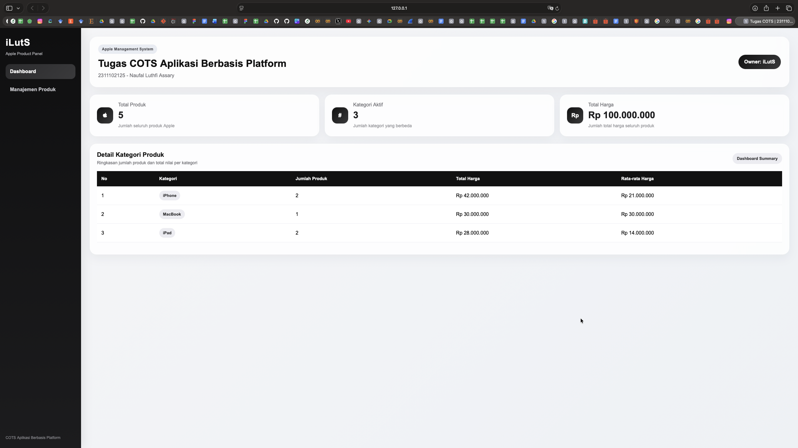
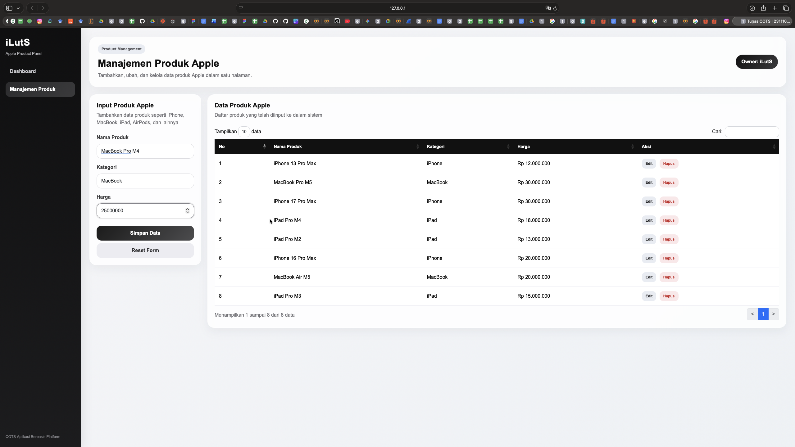
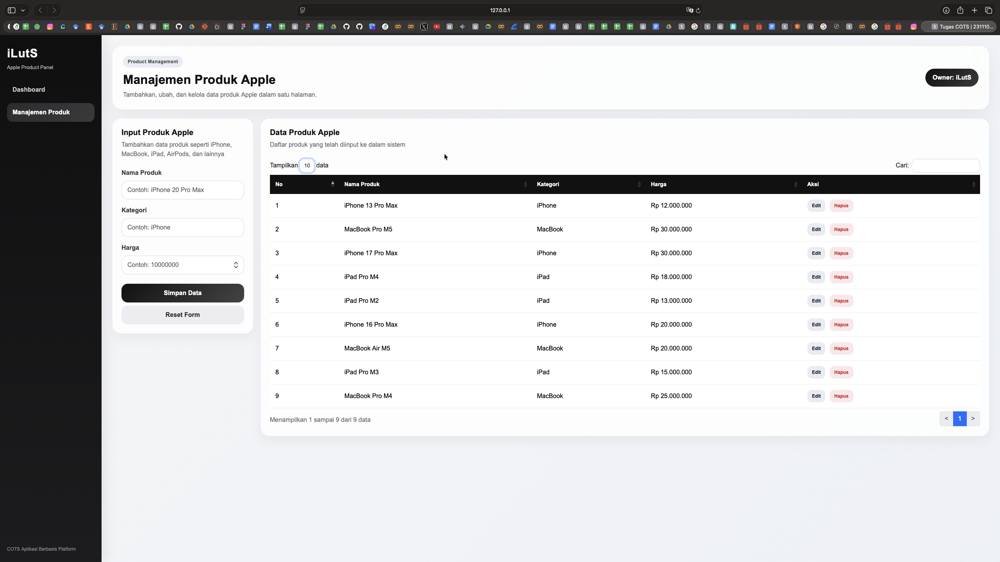
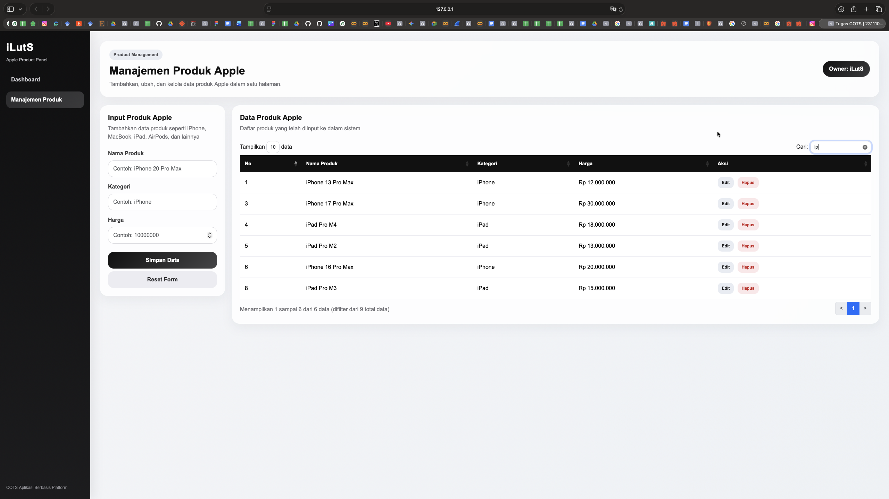
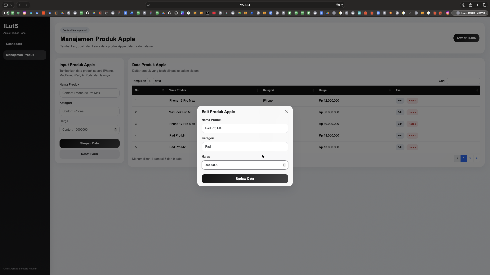
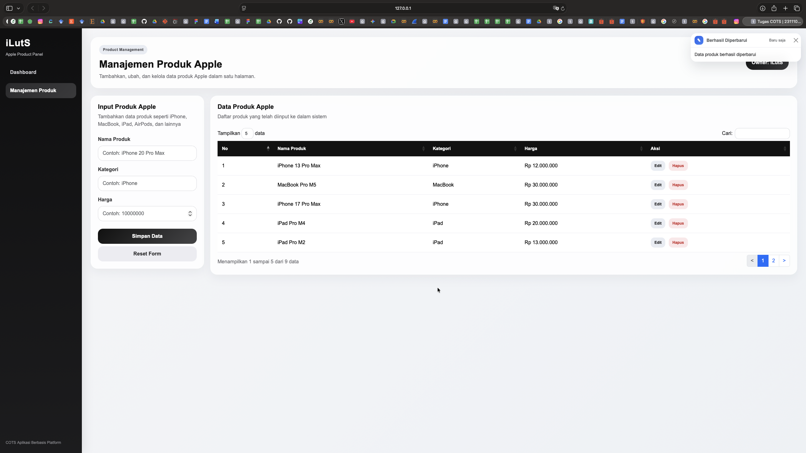
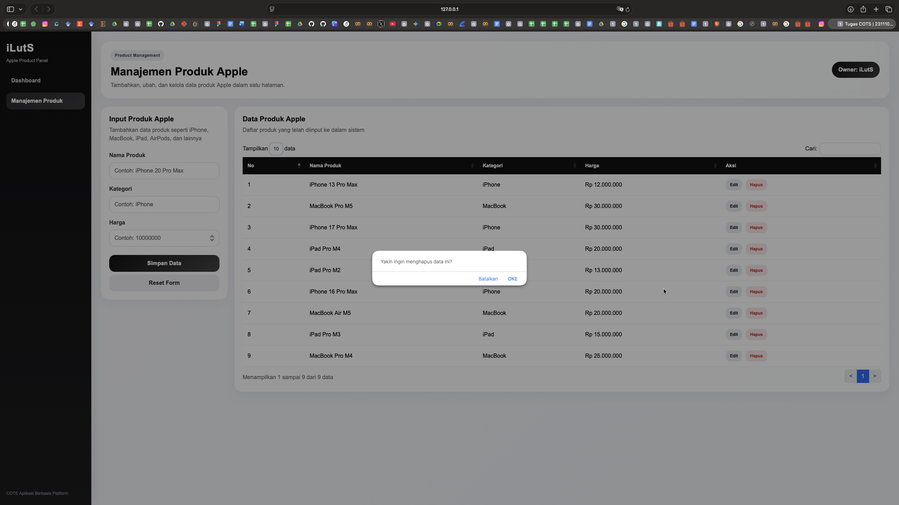
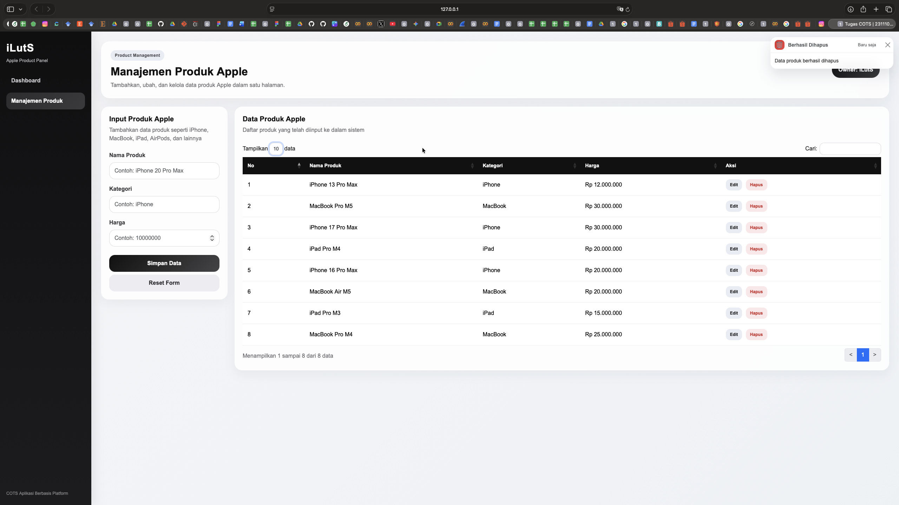

<div align="center">
  <br />
  <h1>LAPORAN PRAKTIKUM <br>APLIKASI BERBASIS PLATFORM</h1>
  <br />
  <h3>Tugas COTS <br> Manajemen Produk</h3>
  <br />
  <br />
   
  <br />
  <br />
  <br />
  <br />
  <h3>Disusun Oleh :</h3>
  <p>
    <strong>NAUFAL LUTHFI ASSARY</strong><br>
    <strong>2311102125</strong><br>
    <strong>S1 IF-11-REG01</strong>
  </p>
  <br />
  <h3>Dosen Pengampu :</h3>
  <p>
    <strong>Dimas Fanny Hebrasianto Permadi, S.ST., M.Kom</strong>
  </p>
  <br />
  <br />
    <h4>Asisten Praktikum :</h4>
    <strong> Apri Pandu Wicaksono </strong> <br>
    <strong>Rangga Pradarrell Fathi</strong>
  <br />
  <h3>LABORATORIUM HIGH PERFORMANCE
 <br>FAKULTAS INFORMATIKA <br>UNIVERSITAS TELKOM PURWOKERTO <br>2026</h3>
</div>

---

## 1. Dasar Teori

**HTML atau HyperText Markup Language** merupakan bahasa dasar yang digunakan untuk membangun halaman web. HTML berfungsi untuk menyusun elemen-elemen dasar pada sebuah website, seperti judul, paragraf, tabel, gambar, hyperlink, dan form. Dalam struktur dasarnya, dokumen HTML terdiri dari deklarasi <!DOCTYPE html>, elemen <html>, <head>, dan <body>. Bagian <body> merupakan tempat semua konten yang ditampilkan pada browser.  

Dalam HTML, sebuah elemen dibentuk oleh tag. Tag umumnya terdiri dari tag pembuka dan tag penutup, misalnya <p>...</p> atau <table>...</table>. Selain itu, HTML juga memiliki atribut, yaitu informasi tambahan yang diletakkan pada tag pembuka untuk memberikan fungsi tertentu pada elemen. Atribut dapat digunakan untuk mengatur identitas elemen, ukuran, tujuan link, maupun karakteristik tampilan dasar.  

Salah satu elemen penting dalam HTML adalah tabel. Tabel digunakan untuk menampilkan data dalam bentuk baris dan kolom sehingga informasi menjadi lebih terstruktur dan mudah dibaca. Pada HTML, tabel didefinisikan dengan tag <table>, sedangkan baris tabel ditulis dengan tag <tr>, judul kolom menggunakan tag <th>, dan isi data menggunakan tag <td>. Dengan susunan tersebut, data dapat ditampilkan secara sistematis sesuai kebutuhan pengguna.  

Selain membuat tabel dasar, HTML juga mendukung penggabungan sel menggunakan atribut colspan dan rowspan. Atribut colspan digunakan untuk menggabungkan beberapa kolom, sedangkan rowspan digunakan untuk menggabungkan beberapa baris. Fitur ini berguna ketika tabel memerlukan susunan data yang lebih kompleks. Namun, pada tugas tabel dasar, elemen yang paling utama digunakan adalah <table>, <tr>, <th>, dan <td>.  

Untuk menempatkan tampilan di bagian tengah halaman tanpa menggunakan CSS, HTML dapat menggunakan tag <center>. Pada modul praktikum, tag ini dicontohkan untuk meletakkan form di bagian tengah halaman. Dengan demikian, pada pembuatan tabel dasar tanpa bantuan CSS maupun styling lainnya, tabel dapat dibungkus menggunakan tag <center> agar tampil di tengah secara horizontal pada halaman web.

---

## 2. Penjelasan Kode 

Berikut merupakan implementasi Tabel dengan menggunakan HTML.

### Kode HTML (`index.html`)

```html
<!DOCTYPE html>
<html lang="id">
  <head>
    <meta charset="UTF-8" />
    <meta name="viewport" content="width=device-width, initial-scale=1.0" />
    <title>Tugas COTS | 2311102125 - Naufal Luthfi Assary</title>

    <link
      rel="stylesheet"
      href="https://cdn.jsdelivr.net/npm/bootstrap@5.3.3/dist/css/bootstrap.min.css"
    />
    <link
      rel="stylesheet"
      href="https://cdn.datatables.net/1.13.8/css/dataTables.bootstrap5.min.css"
    />
    <link rel="stylesheet" href="style.css" />
  </head>
  <body>
    <div class="app-shell">
      <aside class="sidebar">
        <div>
          <div class="brand">iLutS</div>
          <div class="brand-subtitle">Apple Product Panel</div>

          <nav class="sidebar-menu mt-4">
            <a href="#" class="menu-item active" data-page="dashboardPage"
              >Dashboard</a
            >
            <a href="#" class="menu-item" data-page="productPage"
              >Manajemen Produk</a
            >
          </nav>
        </div>

        <div class="sidebar-footer">COTS Aplikasi Berbasis Platform</div>
      </aside>

      <main class="main-content">
        <!-- PAGE 1: DASHBOARD -->
        <section id="dashboardPage" class="page-section active-page">
          <div class="topbar">
            <div>
              <span class="topbar-label">Apple Management System</span>
              <h1 class="page-title">Tugas COTS Aplikasi Berbasis Platform</h1>
              <p class="page-subtitle">2311102125 - Naufal Luthfi Assary</p>
            </div>
            <div class="owner-pill">Owner: iLutS</div>
          </div>

          <div class="dashboard-layout">
            <div class="dashboard-main">
              <div class="stats-grid">
                <div class="stats-card">
                  <div class="stats-icon"></div>
                  <div>
                    <h6>Total Produk</h6>
                    <h3 id="totalProduk">0</h3>
                    <p>Jumlah seluruh produk Apple</p>
                  </div>
                </div>

                <div class="stats-card">
                  <div class="stats-icon">#</div>
                  <div>
                    <h6>Kategori Aktif</h6>
                    <h3 id="totalKategori">0</h3>
                    <p>Jumlah kategori yang berbeda</p>
                  </div>
                </div>

                <div class="stats-card">
                  <div class="stats-icon">Rp</div>
                  <div>
                    <h6>Total Harga</h6>
                    <h3 id="totalHarga">Rp 0</h3>
                    <p>Jumlah total harga seluruh produk</p>
                  </div>
                </div>
              </div>

              <div class="content-card mt-4">
                <div
                  class="d-flex justify-content-between align-items-center flex-wrap gap-2 mb-3"
                >
                  <div>
                    <h5 class="mb-1">Detail Kategori Produk</h5>
                    <p class="section-subtitle mb-0">
                      Ringkasan jumlah produk dan total nilai per kategori
                    </p>
                  </div>
                  <div class="table-badge-pill">Dashboard Summary</div>
                </div>

                <div class="table-responsive">
                  <table
                    class="table custom-table align-middle w-100"
                    id="kategoriTable"
                  >
                    <thead>
                      <tr>
                        <th>No</th>
                        <th>Kategori</th>
                        <th>Jumlah Produk</th>
                        <th>Total Harga</th>
                        <th>Rata-rata Harga</th>
                      </tr>
                    </thead>
                    <tbody id="kategoriTableBody"></tbody>
                  </table>
                </div>
              </div>
            </div>
          </div>
        </section>

        <!-- PAGE 2: MANAJEMEN PRODUK -->
        <section id="productPage" class="page-section">
          <div class="topbar">
            <div>
              <span class="topbar-label">Product Management</span>
              <h1 class="page-title">Manajemen Produk Apple</h1>
              <p class="page-subtitle">
                Tambahkan, ubah, dan kelola data produk Apple dalam satu
                halaman.
              </p>
            </div>
            <div class="owner-pill">Owner: iLutS</div>
          </div>

          <div class="product-layout">
            <div class="product-form-card content-card">
              <h5 class="mb-2">Input Produk Apple</h5>
              <p class="page-subtitle mb-4">
                Tambahkan data produk seperti iPhone, MacBook, iPad, AirPods,
                dan lainnya
              </p>

              <form id="productForm">
                <div class="mb-3">
                  <label class="form-label">Nama Produk</label>
                  <input
                    type="text"
                    id="namaProduk"
                    class="form-control custom-input"
                    placeholder="Contoh: iPhone 20 Pro Max"
                    required
                  />
                </div>

                <div class="mb-3">
                  <label class="form-label">Kategori</label>
                  <input
                    type="text"
                    id="kategori"
                    class="form-control custom-input"
                    placeholder="Contoh: iPhone"
                    required
                  />
                </div>

                <div class="mb-4">
                  <label class="form-label">Harga</label>
                  <input
                    type="number"
                    id="harga"
                    class="form-control custom-input"
                    placeholder="Contoh: 10000000"
                    min="0"
                    required
                  />
                </div>

                <div class="d-grid gap-2">
                  <button type="submit" class="btn btn-save" id="btnSimpan">
                    Simpan Data
                  </button>
                  <button type="reset" class="btn btn-reset" id="btnReset">
                    Reset Form
                  </button>
                </div>
              </form>
            </div>

            <div class="product-table-card content-card">
              <div
                class="d-flex justify-content-between align-items-center flex-wrap gap-2 mb-4"
              >
                <div>
                  <h5 class="mb-1">Data Produk Apple</h5>
                  <p class="page-subtitle mb-0">
                    Daftar produk yang telah diinput ke dalam sistem
                  </p>
                </div>
              </div>

              <table
                id="productTable"
                class="table custom-table align-middle w-100"
              >
                <thead>
                  <tr>
                    <th>No</th>
                    <th>Nama Produk</th>
                    <th>Kategori</th>
                    <th>Harga</th>
                    <th>Aksi</th>
                  </tr>
                </thead>
                <tbody></tbody>
              </table>
            </div>
          </div>
        </section>
      </main>
    </div>

    <!-- MODAL EDIT PRODUK -->
    <div
      class="modal fade"
      id="editProductModal"
      tabindex="-1"
      aria-labelledby="editProductModalLabel"
      aria-hidden="true"
    >
      <div class="modal-dialog modal-dialog-centered">
        <div class="modal-content modal-apple">
          <div class="modal-header border-0 pb-0">
            <h5 class="modal-title fw-bold" id="editProductModalLabel">
              Edit Produk Apple
            </h5>
            <button
              type="button"
              class="btn-close"
              data-bs-dismiss="modal"
              aria-label="Close"
            ></button>
          </div>

          <div class="modal-body pt-3">
            <form id="editProductForm">
              <input type="hidden" id="editProductId" />

              <div class="mb-3">
                <label for="editNamaProduk" class="form-label"
                  >Nama Produk</label
                >
                <input
                  type="text"
                  class="form-control custom-input"
                  id="editNamaProduk"
                  placeholder="Contoh: iPhone 13 Pro Max"
                  required
                />
              </div>

              <div class="mb-3">
                <label for="editKategori" class="form-label">Kategori</label>
                <input
                  type="text"
                  class="form-control custom-input"
                  id="editKategori"
                  placeholder="Contoh: iPhone"
                  required
                />
              </div>

              <div class="mb-4">
                <label for="editHarga" class="form-label">Harga</label>
                <input
                  type="number"
                  class="form-control custom-input"
                  id="editHarga"
                  placeholder="Contoh: 12000000"
                  min="0"
                  required
                />
              </div>

              <div class="d-grid">
                <button type="submit" class="btn btn-save">Update Data</button>
              </div>
            </form>
          </div>
        </div>
      </div>
    </div>
    <div class="toast-container position-fixed top-0 end-0 p-3">
      <div
        id="liveToast"
        class="toast custom-toast border-0"
        role="alert"
        aria-live="assertive"
        aria-atomic="true"
      >
        <div class="toast-header">
          <div class="toast-icon" id="toastIcon">✓</div>
          <strong class="me-auto" id="toastTitle">Notifikasi Sistem</strong>
          <small>Baru saja</small>
          <button
            type="button"
            class="btn-close"
            data-bs-dismiss="toast"
            aria-label="Close"
          ></button>
        </div>
        <div class="toast-body" id="toastMessage">Data berhasil diproses.</div>
      </div>
    </div>

    <script src="https://code.jquery.com/jquery-3.7.1.min.js"></script>
    <script src="https://cdn.jsdelivr.net/npm/bootstrap@5.3.3/dist/js/bootstrap.bundle.min.js"></script>
    <script src="https://cdn.datatables.net/1.13.8/js/jquery.dataTables.min.js"></script>
    <script src="https://cdn.datatables.net/1.13.8/js/dataTables.bootstrap5.min.js"></script>
    <script src="script.js"></script>
  </body>
</html>

```

### Kode JavaScript (`script.js`)

```js
let products = JSON.parse(localStorage.getItem("products")) || [
  {
    id: 1,
    namaProduk: "iPhone 20 Pro Max",
    kategori: "iPhone",
    harga: 10000000
  },
  {
    id: 2,
    namaProduk: "iPad Pro M2",
    kategori: "iPad",
    harga: 13000000
  }
];

function saveToLocalStorage() {
  localStorage.setItem("products", JSON.stringify(products));
}

function formatRupiah(angka) {
  return "Rp " + Number(angka).toLocaleString("id-ID");
}

function showToast(message, type = "success") {
  $("#toastMessage").text(message);

  const toastIcon = $("#toastIcon");
  const toastTitle = $("#toastTitle");

  toastIcon.removeClass("toast-success toast-edit toast-delete");

  if (type === "success") {
    toastIcon.text("✓");
    toastIcon.addClass("toast-success");
    toastTitle.text("Berhasil Ditambahkan");
  } else if (type === "edit") {
    toastIcon.text("✎");
    toastIcon.addClass("toast-edit");
    toastTitle.text("Berhasil Diperbarui");
  } else if (type === "delete") {
    toastIcon.text("🗑");
    toastIcon.addClass("toast-delete");
    toastTitle.text("Berhasil Dihapus");
  } else {
    toastIcon.text("✓");
    toastTitle.text("Notifikasi Sistem");
  }

  const toastElement = document.getElementById("liveToast");
  const toast = new bootstrap.Toast(toastElement);
  toast.show();
}

function resetForm() {
  $("#namaProduk").val("");
  $("#kategori").val("");
  $("#harga").val("");
}

function showPage(pageId) {
  $(".page-section").removeClass("active-page");
  $("#" + pageId).addClass("active-page");

  $(".sidebar-menu .menu-item").removeClass("active");
  $(`.sidebar-menu .menu-item[data-page="${pageId}"]`).addClass("active");

  if (pageId === "dashboardPage") {
    updateDashboard();
  }

  if (pageId === "productPage") {
    renderTable();
  }
}

function updateDashboard() {
  $("#totalProduk").text(products.length);

  const kategoriUnik = [...new Set(products.map((item) => item.kategori.toLowerCase()))];
  $("#totalKategori").text(kategoriUnik.length);

  const totalHarga = products.reduce((total, item) => total + Number(item.harga), 0);
  $("#totalHarga").text(formatRupiah(totalHarga));

  const kategoriMap = {};

  products.forEach((item) => {
    const kategoriAsli = item.kategori.trim();
    const key = kategoriAsli.toLowerCase();

    if (!kategoriMap[key]) {
      kategoriMap[key] = {
        nama: kategoriAsli,
        jumlah: 0,
        totalHarga: 0
      };
    }

    kategoriMap[key].jumlah += 1;
    kategoriMap[key].totalHarga += Number(item.harga);
  });

  const tbody = $("#kategoriTableBody");
  tbody.empty();

  const kategoriArray = Object.values(kategoriMap);

  if (kategoriArray.length === 0) {
    tbody.append(`
      <tr>
        <td colspan="5" class="text-center text-muted">Belum ada data kategori</td>
      </tr>
    `);
    return;
  }

  kategoriArray.forEach((item, index) => {
    const rataRata = item.totalHarga / item.jumlah;

    tbody.append(`
      <tr>
        <td>${index + 1}</td>
        <td><span class="category-chip">${item.nama}</span></td>
        <td>${item.jumlah}</td>
        <td>${formatRupiah(item.totalHarga)}</td>
        <td>${formatRupiah(rataRata)}</td>
      </tr>
    `);
  });
}

function renderTable() {
  if (!$("#productTable").length) return;

  if ($.fn.DataTable.isDataTable("#productTable")) {
    $("#productTable").DataTable().destroy();
  }

  const tbody = $("#productTable tbody");
  tbody.empty();

  products.forEach((product, index) => {
    tbody.append(`
      <tr>
        <td>${index + 1}</td>
        <td>${product.namaProduk}</td>
        <td>${product.kategori}</td>
        <td>${formatRupiah(product.harga)}</td>
        <td>
          <button class="btn-aksi btn-edit" onclick="editProduct(${product.id})">Edit</button>
          <button class="btn-aksi btn-hapus" onclick="deleteProduct(${product.id})">Hapus</button>
        </td>
      </tr>
    `);
  });

  $("#productTable").DataTable({
    pageLength: 5,
    lengthMenu: [[5, 10, 25, 50], [5, 10, 25, 50]],
    language: {
      search: "Cari:",
      lengthMenu: "Tampilkan _MENU_ data",
      info: "Menampilkan _START_ sampai _END_ dari _TOTAL_ data",
      zeroRecords: "Data tidak ditemukan",
      infoEmpty: "Belum ada data",
      infoFiltered: "(difilter dari _MAX_ total data)",
      paginate: {
        first: "Awal",
        last: "Akhir",
        next: ">",
        previous: "<"
      }
    }
  });
}

function addProduct(namaProduk, kategori, harga) {
  products.push({
    id: Date.now(),
    namaProduk,
    kategori,
    harga: Number(harga)
  });

  saveToLocalStorage();
}

function editProduct(id) {
  const product = products.find((item) => item.id === id);
  if (!product) return;

  $("#editProductId").val(product.id);
  $("#editNamaProduk").val(product.namaProduk);
  $("#editKategori").val(product.kategori);
  $("#editHarga").val(product.harga);

  const modal = new bootstrap.Modal(document.getElementById("editProductModal"));
  modal.show();
}

function deleteProduct(id) {
  if (!confirm("Yakin ingin menghapus data ini?")) return;

  products = products.filter((item) => item.id !== id);
  saveToLocalStorage();
  renderTable();
  updateDashboard();
  showToast("Data produk berhasil dihapus", "delete");
}

$(document).ready(function () {
  saveToLocalStorage();
  updateDashboard();
  renderTable();

  $(".sidebar-menu .menu-item").on("click", function (e) {
    e.preventDefault();
    const pageId = $(this).data("page");
    showPage(pageId);
  });

  $("#productForm").on("submit", function (e) {
    e.preventDefault();

    const namaProduk = $("#namaProduk").val().trim();
    const kategori = $("#kategori").val().trim();
    const harga = $("#harga").val().trim();

    if (!namaProduk || !kategori || !harga) {
      alert("Semua field wajib diisi.");
      return;
    }

    addProduct(namaProduk, kategori, harga);
    resetForm();
    updateDashboard();
    showPage("productPage");
    showToast("Data produk berhasil ditambahkan", "success");
  });

  $("#editProductForm").on("submit", function (e) {
    e.preventDefault();

    const id = Number($("#editProductId").val());
    const namaProduk = $("#editNamaProduk").val().trim();
    const kategori = $("#editKategori").val().trim();
    const harga = $("#editHarga").val().trim();

    if (!namaProduk || !kategori || !harga) {
      alert("Semua field wajib diisi.");
      return;
    }

    const index = products.findIndex((item) => item.id === id);

    if (index !== -1) {
      products[index] = {
        id,
        namaProduk,
        kategori,
        harga: Number(harga)
      };

      saveToLocalStorage();
      renderTable();
      updateDashboard();

      const modalElement = document.getElementById("editProductModal");
      const modalInstance = bootstrap.Modal.getInstance(modalElement);
      modalInstance.hide();

      showToast("Data produk berhasil diperbarui", "edit");
    }
  });

  $("#btnReset").on("click", function () {
    resetForm();
  });
});

```

### Kode CSS (`style.css`)

```css
* {
  box-sizing: border-box;
}

body {
  margin: 0;
  font-family: "SF Pro Display", "Segoe UI", Arial, sans-serif;
  background: linear-gradient(135deg, #f5f5f7, #eef1f5);
  color: #1d1d1f;
}

.app-shell {
  display: flex;
  min-height: 100vh;
}

.sidebar {
  width: 260px;
  background: linear-gradient(180deg, #0f0f10, #1c1c1e);
  color: #ffffff;
  padding: 24px 18px;
  display: flex;
  flex-direction: column;
  justify-content: space-between;
  box-shadow: 8px 0 30px rgba(0, 0, 0, 0.08);
}

.brand {
  font-size: 30px;
  font-weight: 800;
  letter-spacing: 1px;
  color: #ffffff;
}

.brand-subtitle {
  font-size: 13px;
  color: #b8b8bd;
  margin-top: 4px;
}

.sidebar-menu {
  display: flex;
  flex-direction: column;
  gap: 10px;
}

.menu-item {
  text-decoration: none;
  padding: 12px 14px;
  border-radius: 14px;
  color: #c7c7cc;
  font-weight: 600;
  transition: 0.2s ease;
}

.menu-item:hover,
.menu-item.active {
  background: linear-gradient(135deg, #2c2c2e, #3a3a3c);
  color: #ffffff;
}

.sidebar-footer {
  font-size: 12px;
  color: #8e8e93;
}

.main-content {
  flex: 1;
  padding: 28px;
}

.page-section {
  display: none;
}

.active-page {
  display: block;
}

.topbar {
  background: rgba(255, 255, 255, 0.8);
  backdrop-filter: blur(14px);
  border: 1px solid rgba(255, 255, 255, 0.75);
  border-radius: 24px;
  padding: 24px 26px;
  box-shadow: 0 18px 40px rgba(15, 23, 42, 0.06);
  display: flex;
  justify-content: space-between;
  align-items: center;
  gap: 18px;
  margin-bottom: 24px;
}

.topbar-label {
  display: inline-block;
  padding: 6px 12px;
  border-radius: 999px;
  background: #e8ecf3;
  color: #4a4a4f;
  font-size: 12px;
  font-weight: 700;
  letter-spacing: 0.4px;
  margin-bottom: 12px;
}

.page-title {
  margin: 0;
  font-size: 32px;
  font-weight: 800;
  color: #111111;
}

.page-subtitle {
  color: #6e6e73;
  margin-top: 8px;
  margin-bottom: 0;
}

.owner-pill {
  background: linear-gradient(135deg, #111111, #3a3a3c);
  color: #ffffff;
  padding: 11px 18px;
  border-radius: 999px;
  font-weight: 700;
  white-space: nowrap;
}

.dashboard-layout {
  display: flex;
  flex-direction: column;
  gap: 20px;
}

.dashboard-main {
  width: 100%;
}

.stats-grid {
  display: grid;
  grid-template-columns: repeat(3, 1fr);
  gap: 18px;
}

.stats-card,
.content-card {
  background: rgba(255, 255, 255, 0.84);
  backdrop-filter: blur(12px);
  border: 1px solid rgba(255, 255, 255, 0.7);
  border-radius: 22px;
  padding: 22px;
  box-shadow: 0 12px 30px rgba(15, 23, 42, 0.05);
}

.stats-card {
  display: flex;
  align-items: center;
  gap: 16px;
  min-height: 120px;
}

.stats-icon {
  width: 52px;
  height: 52px;
  display: inline-flex;
  align-items: center;
  justify-content: center;
  border-radius: 16px;
  background: linear-gradient(135deg, #111111, #3a3a3c);
  color: #ffffff;
  font-size: 18px;
  font-weight: 800;
  flex-shrink: 0;
}

.stats-card h6 {
  color: #6e6e73;
  margin: 0 0 6px;
}

.stats-card h3 {
  margin: 0;
  font-size: 30px;
  font-weight: 800;
}

.stats-card p {
  margin: 6px 0 0;
  color: #8e8e93;
  font-size: 14px;
}

.content-card h5 {
  font-weight: 800;
  color: #111111;
}

.section-subtitle {
  color: #6e6e73;
  font-size: 14px;
}

.category-chip {
  display: inline-block;
  padding: 6px 12px;
  border-radius: 999px;
  background: #ececf1;
  color: #2c2c2e;
  font-size: 13px;
  font-weight: 700;
}

.custom-input {
  height: 48px;
  border-radius: 16px;
  border: 1px solid #d9d9de;
  background: #ffffff;
  box-shadow: none;
  padding-left: 14px;
}

.custom-input:focus {
  border-color: #7d7d84;
  box-shadow: 0 0 0 0.2rem rgba(90, 90, 95, 0.12);
}

.form-label {
  font-weight: 600;
  color: #3a3a3c;
}

.btn-save,
.btn-update,
.btn-reset {
  border-radius: 16px;
  padding: 12px 18px;
  font-weight: 700;
  border: none;
  width: 100%;
}

.btn-save {
  background: linear-gradient(135deg, #111111, #444446);
  color: #ffffff;
}

.btn-save:hover {
  color: #ffffff;
  opacity: 0.96;
}

.btn-update {
  background: linear-gradient(135deg, #8e8e93, #636366);
  color: #ffffff;
}

.btn-update:hover {
  color: #ffffff;
  opacity: 0.96;
}

.btn-reset {
  background: #ececf1;
  color: #2c2c2e;
}

.btn-reset:hover {
  background: #e1e1e7;
  color: #111111;
}

.custom-table thead th {
  background: #111111;
  color: #ffffff;
  border: none;
  padding: 14px;
  font-size: 14px;
}

.custom-table tbody td {
  padding: 14px;
  border-color: #ececf1;
}

.custom-table tbody tr:hover {
  background: #fafafa;
}

.btn-aksi {
  border: none;
  padding: 7px 12px;
  border-radius: 12px;
  font-size: 12px;
  font-weight: 700;
  margin-right: 6px;
}

.btn-edit {
  background: #e8ecf3;
  color: #1d1d1f;
}

.btn-hapus {
  background: #fbe7e9;
  color: #c62828;
}

.table-badge-pill {
  background: #ececf1;
  color: #2c2c2e;
  padding: 8px 14px;
  border-radius: 999px;
  font-size: 13px;
  font-weight: 700;
  white-space: nowrap;
}

.product-layout {
  display: grid;
  grid-template-columns: 360px 1fr;
  gap: 20px;
  align-items: start;
}

.product-form-card {
  position: sticky;
  top: 28px;
}

.dataTables_wrapper .dataTables_filter input,
.dataTables_wrapper .dataTables_length select {
  border-radius: 12px;
  border: 1px solid #d5d7dc;
  padding: 6px 10px;
  background: #ffffff;
}

.dataTables_wrapper .dataTables_info {
  color: #6e6e73;
  padding-top: 12px !important;
}

.modal-apple {
  border: none;
  border-radius: 24px;
  background: rgba(255, 255, 255, 0.95);
  backdrop-filter: blur(12px);
  box-shadow: 0 20px 50px rgba(15, 23, 42, 0.12);
}

.modal-apple .modal-body,
.modal-apple .modal-header {
  padding-left: 24px;
  padding-right: 24px;
}

@media (max-width: 1100px) {
  .stats-grid {
    grid-template-columns: 1fr;
  }

  .product-layout {
    grid-template-columns: 1fr;
  }

  .product-form-card {
    position: static;
  }
}

@media (max-width: 992px) {
  .app-shell {
    flex-direction: column;
  }

  .sidebar {
    width: 100%;
  }

  .topbar {
    flex-direction: column;
    align-items: flex-start;
  }
}

.custom-toast {
  border-radius: 18px;
  background: rgba(255, 255, 255, 0.96);
  backdrop-filter: blur(12px);
  box-shadow: 0 18px 40px rgba(15, 23, 42, 0.12);
  min-width: 320px;
}

.custom-toast .toast-header {
  border-bottom: 1px solid #ececf1;
  border-top-left-radius: 18px;
  border-top-right-radius: 18px;
  background: #ffffff;
}

.custom-toast .toast-body {
  color: #2c2c2e;
  font-weight: 500;
}

.toast-header {
  display: flex;
  align-items: center;
  gap: 10px;
}

.toast-icon {
  width: 28px;
  height: 28px;
  border-radius: 10px;
  display: inline-flex;
  align-items: center;
  justify-content: center;
  font-size: 14px;
  font-weight: 800;
  color: #ffffff;
  background: linear-gradient(135deg, #111111, #3a3a3c);
  flex-shrink: 0;
}

.toast-icon.toast-success {
  background: linear-gradient(135deg, #16a34a, #22c55e);
}

.toast-icon.toast-edit {
  background: linear-gradient(135deg, #2563eb, #3b82f6);
}

.toast-icon.toast-delete {
  background: linear-gradient(135deg, #dc2626, #ef4444);
}

```

## Hasil Tampilan (Screenshot)

### 1. Tampilan Awal Halaman


### 2. Input Data & Data berhasil ditambahkan



### 3. Fitur Pencarian


### 4. Edit Data



### 5. Hapus Data



### Penjelasan Code:

Project ini merupakan aplikasi web sederhana untuk menampilkan dan mengelola data produk Apple.  
Aplikasi dibuat menggunakan **HTML, CSS, JavaScript, Bootstrap, jQuery, dan DataTables**.

- Program memiliki dua halaman utama dalam satu file:
  - **Dashboard**
  - **Manajemen Produk**

- Fitur
  - Form input produk
  - Menampilkan data produk ke tabel
  - Menggunakan **Bootstrap** untuk tampilan
  - Menggunakan **jQuery DataTables**
  - Fitur **search**
  - Fitur **pagination**
  - Tombol **edit** dan **hapus**
  - Edit data menggunakan **modal popup**
  - Notifikasi menggunakan **toast**
  - Penyimpanan data menggunakan **array object** dan **localStorage**

- Field Input
Form input terdiri dari:
  - Nama Produk
  - Kategori
  - Harga

- Teknologi yang Digunakan
  - HTML5
  - CSS3
  - JavaScript
  - Bootstrap 5
  - jQuery
  - DataTables

- Konsep CRUD
Program ini menerapkan CRUD sederhana:
  - **Create** : menambah data produk
  - **Read** : menampilkan data ke tabel dan dashboard
  - **Update** : mengedit data melalui modal
  - **Delete** : menghapus data dari tabel

- Penyimpanan Data
Data produk disimpan menggunakan:
  - **Array of Object**
  - **localStorage**

- Struktur File
```text
├── index.html
├── style.css
└── script.js
```

## Refrensi
- [HTML](https://developer.mozilla.org/en-US/docs/Web/HTML)
- [CSS](https://developer.mozilla.org/en-US/docs/Web/CSS)
- [Bootstrap 5](https://getbootstrap.com/docs/5.3/getting-started/introduction/)
- [jQuery](https://datatables.net/manual/)
- [JavaScript](https://developer.mozilla.org/en-US/docs/Web/JavaScript)
