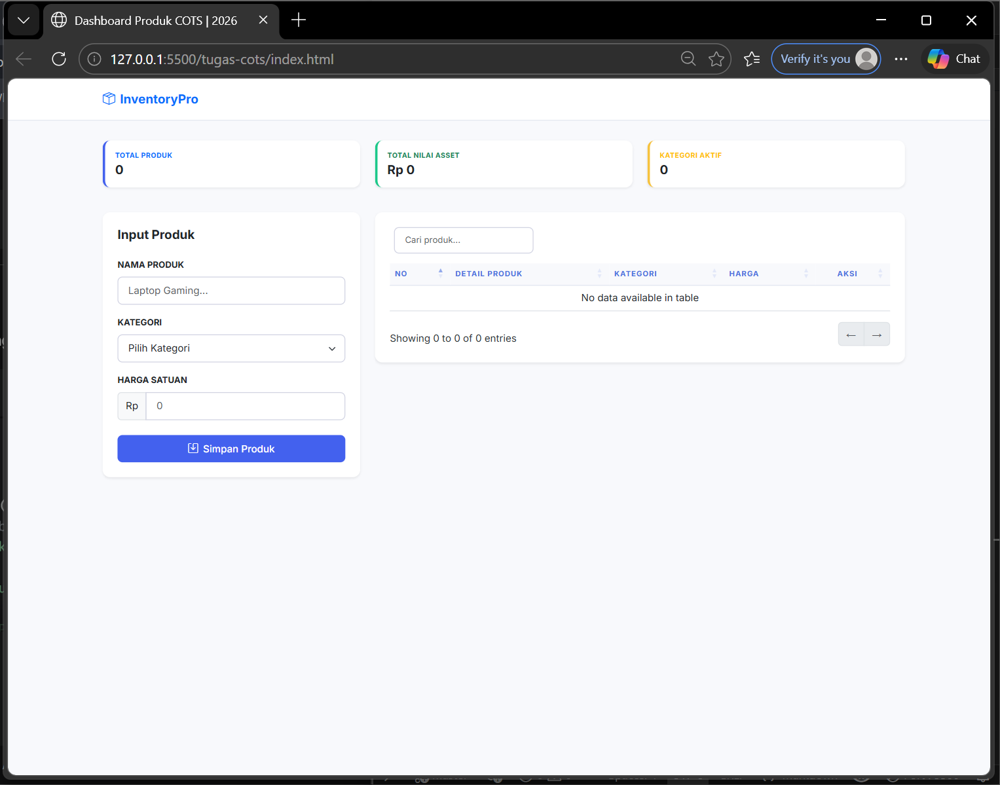
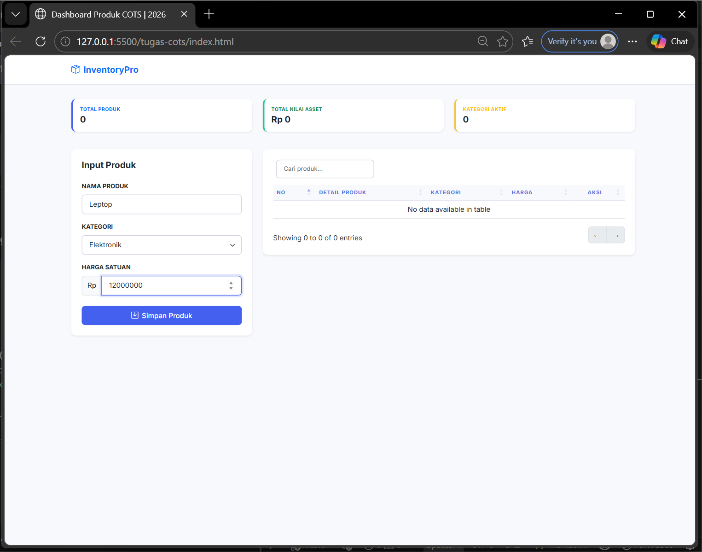
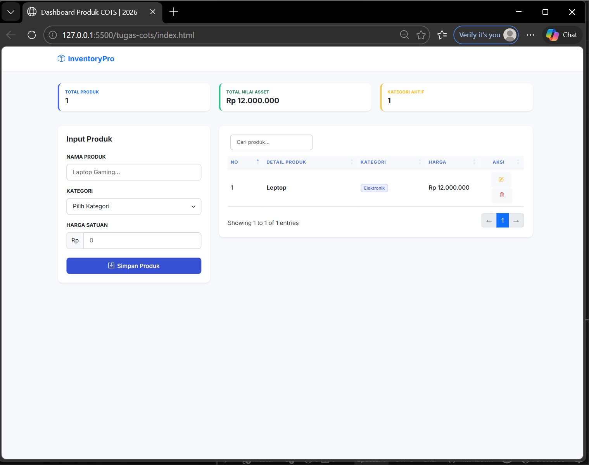
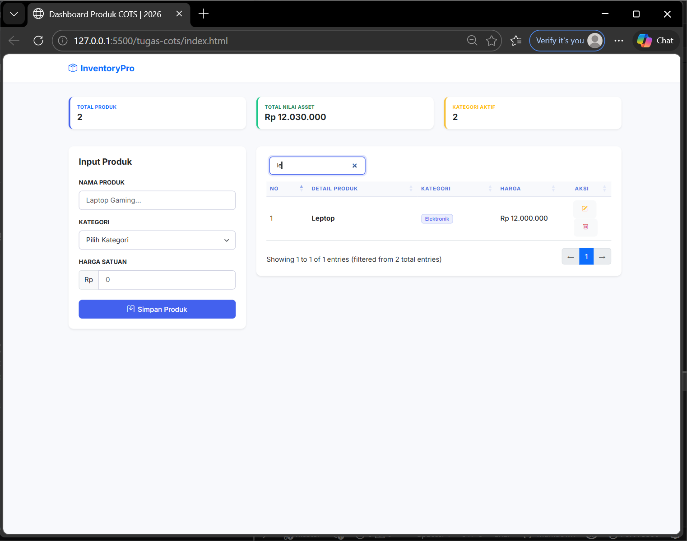
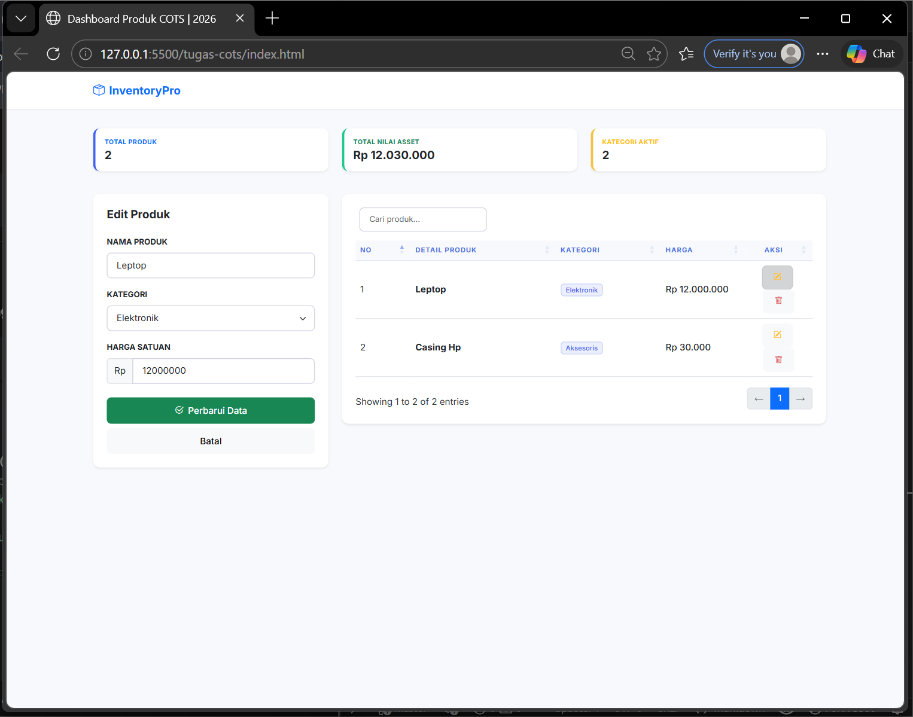
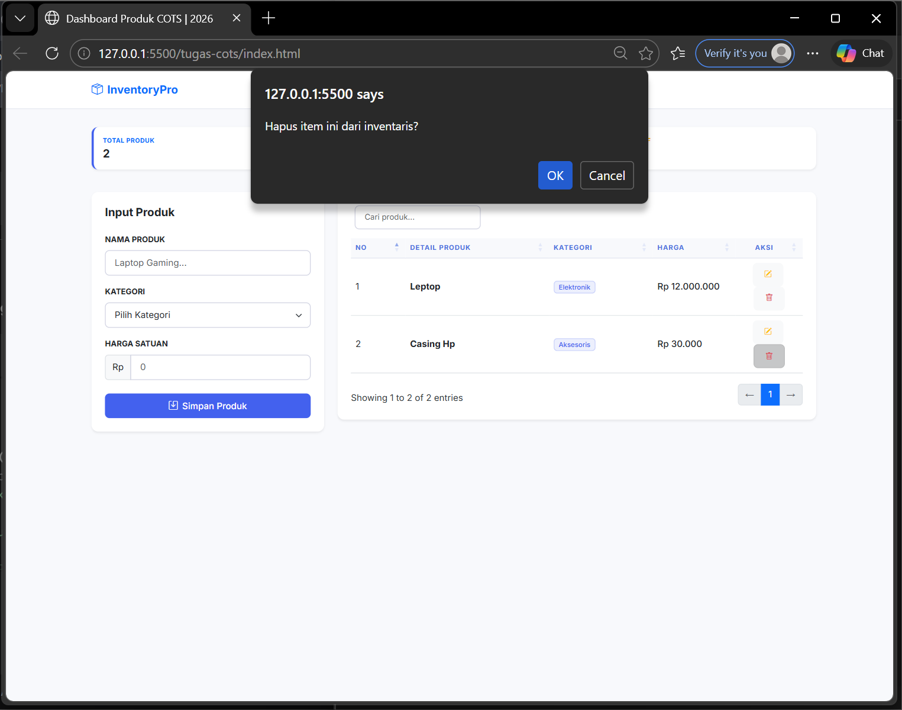

<div align="center">
  <br />
  <h1>LAPORAN PRAKTIKUM <br>APLIKASI BERBASIS PLATFORM</h1>
  <br />
  <h3>DATA PRODUK <br> Bootstrap, jQuery DataTables & JavaScript</h3>
  <br />
  <br />
  
  <br />
  <br />
  <h3>Disusun Oleh :</h3>
  <p>
    <strong>Agnes Refilina Fiska</strong><br>
    <strong>2311102126</strong><br>
    <strong>S1 IF-11-01</strong>
  </p>
  <br />
  <br />
  <h3>Dosen Pengampu :</h3>
  <p>
    <strong>Dimas Fanny Hebrasianto Permadi, S.ST., M.Kom</strong>
  </p>
  <br />
  <br />
  <h4>Asisten Praktikum :</h4>
  <strong>Apri Pandu Wicaksono</strong> <br>
  <strong>Rangga Pradarrell Fathi</strong>
  <br />
  <h3>LABORATORIUM HIGH PERFORMANCE
 <br>FAKULTAS INFORMATIKA <br>UNIVERSITAS TELKOM PURWOKERTO <br>2026</h3>
</div>

---

## 1. Dasar Teori

**Operasi CRUD (Create, Read, Update, Delete)** adalah fondasi utama dalam manajemen data aplikasi. Konsep ini mencakup empat fungsi krusial: pembuatan, pembacaan, penyuntingan, dan penghapusan informasi. Dalam konteks aplikasi web dinamis, JavaScript memungkinkan eksekusi operasional ini di sisi klien (client-side), memberikan pengalaman pengguna yang lebih cepat karena manipulasi data terjadi langsung di peramban tanpa jeda sinkronisasi server yang terus-menerus.

**Bootstrap**  merupakan pustaka desain berbasis CSS yang mempercepat pembangunan antarmuka pengguna (UI). Melalui sistem grid yang adaptif dan komponen siap pakai—seperti tombol, formulir, dan jendela modal—Bootstrap memastikan bahwa tampilan aplikasi tetap konsisten, profesional, dan responsif di berbagai ukuran perangkat, mulai dari ponsel hingga desktop.

**jQuery DataTables** adalah ekstensi kuat yang mentransformasi tabel HTML standar menjadi alat pengolah data yang canggih. Hanya dengan inisialisasi singkat, tabel akan secara otomatis memiliki fitur pencarian (filtering), pengurutan (sorting), dan penomoran halaman (pagination), sehingga data dalam jumlah besar tetap mudah untuk dikelola dan dinavigasi oleh pengguna.

**Object Mapping** merupakan teknik pengorganisasian data dalam JavaScript yang menggunakan format pasangan kunci-nilai (key-value pairs). Dengan memberikan identitas unik sebagai kunci (seperti ID produk), pengembang dapat mengakses atau memodifikasi data secara instan tanpa perlu melakukan pencarian berulang melalui seluruh daftar. Pendekatan ini sangat efisien karena menawarkan kompleksitas waktu $O(1)$, yang berarti kecepatan akses data tetap stabil tidak peduli seberapa banyak jumlah data yang disimpan.
---

## 2. Penjelasan Kode HTML, CSS, dan JS


---

### Kode HTML (`index.html`)

```html
<!DOCTYPE html>
<html lang="id">
<head>
    <meta charset="UTF-8">
    <meta name="viewport" content="width=device-width, initial-scale=1.0">
    <title>Dashboard Produk COTS | 2026</title>
    
    <link href="https://fonts.googleapis.com/css2?family=Inter:wght@400;500;600;700&display=swap" rel="stylesheet">
    <link rel="stylesheet" href="https://cdn.jsdelivr.net/npm/bootstrap-icons@1.11.1/font/bootstrap-icons.css">
    
    <link href="https://cdn.jsdelivr.net/npm/bootstrap@5.3.0/dist/css/bootstrap.min.css" rel="stylesheet">
    <link href="https://cdn.datatables.net/1.13.6/css/dataTables.bootstrap5.min.css" rel="stylesheet">
    
    <link rel="stylesheet" href="style.css">
</head>
<body>

<nav class="navbar navbar-custom py-3">
    <div class="container">
        <span class="navbar-brand mb-0 h1 fw-bold text-primary">
            <i class="bi bi-box-seam me-2"></i>InventoryPro
        </span>
    </div>
</nav>

<div class="container">
    <div class="row mb-4">
        <div class="col-md-4">
            <div class="card stat-card p-3 mb-3">
                <div class="small-title text-primary uppercase mb-1">Total Produk</div>
                <div class="h5 mb-0 fw-bold" id="statTotal">0</div>
            </div>
        </div>
        <div class="col-md-4">
            <div class="card stat-card p-3 mb-3 border-success-custom">
                <div class="small-title text-success uppercase mb-1">Total Nilai Asset</div>
                <div class="h5 mb-0 fw-bold" id="statAsset">Rp 0</div>
            </div>
        </div>
        <div class="col-md-4">
            <div class="card stat-card p-3 mb-3 border-warning-custom">
                <div class="small-title text-warning uppercase mb-1">Kategori Aktif</div>
                <div class="h5 mb-0 fw-bold" id="statKategori">0</div>
            </div>
        </div>
    </div>

    <div class="row">
        <div class="col-xl-4 col-lg-5">
            <div class="card p-4 mb-4">
                <h5 class="fw-bold mb-4" id="formHeader">Input Produk</h5>
                <form id="formProduk">
                    <input type="hidden" id="produkId">
                    <div class="mb-3">
                        <label class="form-label small fw-bold">NAMA PRODUK</label>
                        <input type="text" id="namaProduk" class="form-control" placeholder="Laptop Gaming..." required>
                    </div>
                    <div class="mb-3">
                        <label class="form-label small fw-bold">KATEGORI</label>
                        <select id="kategori" class="form-select" required>
                            <option value="">Pilih Kategori</option>
                            <option value="Elektronik">Elektronik</option>
                            <option value="Perabot">Perabot</option>
                            <option value="Aksesoris">Aksesoris</option>
                            <option value="Lainnya">Lainnya</option>
                        </select>
                    </div>
                    <div class="mb-4">
                        <label class="form-label small fw-bold">HARGA SATUAN</label>
                        <div class="input-group">
                            <span class="input-group-text bg-light">Rp</span>
                            <input type="number" id="harga" class="form-control" placeholder="0" required>
                        </div>
                    </div>
                    <div class="d-grid gap-2">
                        <button type="submit" id="btnSimpan" class="btn btn-primary">
                            <i class="bi bi-save me-2"></i>Simpan Produk
                        </button>
                        <button type="button" id="btnBatal" class="btn btn-light d-none" onclick="resetForm()">Batal</button>
                    </div>
                </form>
            </div>
        </div>

        <div class="col-xl-8 col-lg-7">
            <div class="table-container shadow-sm">
                <table id="tabelProduk" class="table align-middle w-100">
                    <thead>
                        <tr>
                            <th>No</th>
                            <th>Detail Produk</th>
                            <th>Kategori</th>
                            <th>Harga</th>
                            <th class="text-center">Aksi</th>
                        </tr>
                    </thead>
                    <tbody id="isiTabel"></tbody>
                </table>
            </div>
        </div>
    </div>
</div>

<script src="https://code.jquery.com/jquery-3.7.0.min.js"></script>
<script src="https://cdn.jsdelivr.net/npm/bootstrap@5.3.0/dist/js/bootstrap.bundle.min.js"></script>
<script src="https://cdn.datatables.net/1.13.6/js/jquery.dataTables.min.js"></script>
<script src="https://cdn.datatables.net/1.13.6/js/dataTables.bootstrap5.min.js"></script>

<script src="script.js"></script>
</body>
</html>
```

---

### Kode CSS (`style.css`)

```css
:root {
    --primary-color: #4361ee;
    --success-color: #1cc88a;
    --warning-color: #f6c23e;
    --bg-body: #f8f9fc;
}

body { 
    background-color: var(--bg-body); 
    font-family: 'Inter', sans-serif;
    color: #2d3436;
}

.navbar-custom {
    background: white;
    border-bottom: 1px solid #e3e6f0;
    margin-bottom: 2rem;
}

.card {
    border: none;
    border-radius: 12px;
    box-shadow: 0 0.125rem 0.25rem rgba(0, 0, 0, 0.075);
}

.stat-card { border-left: 4px solid var(--primary-color); }
.border-success-custom { border-left-color: var(--success-color); }
.border-warning-custom { border-left-color: var(--warning-color); }

.small-title {
    font-size: 0.7rem;
    font-weight: 700;
    text-transform: uppercase;
    letter-spacing: 0.5px;
}

.form-control, .form-select {
    border-radius: 8px;
    padding: 0.6rem 1rem;
    border: 1px solid #d1d3e2;
}

.form-control:focus {
    box-shadow: 0 0 0 0.25rem rgba(67, 97, 238, 0.15);
    border-color: var(--primary-color);
}

.btn {
    border-radius: 8px;
    padding: 0.6rem 1.2rem;
    font-weight: 500;
}

.btn-primary { background-color: var(--primary-color); border: none; }
.btn-primary:hover { background-color: #3751d4; }

.table-container {
    background: white;
    border-radius: 12px;
    padding: 1.5rem;
}

table.dataTable thead th {
    background-color: #f8f9fc;
    text-transform: uppercase;
    font-size: 0.75rem;
    letter-spacing: 1px;
    color: #4e73df;
    border-bottom: 1px solid #e3e6f0;
}

.badge-kategori {
    background-color: rgba(67, 97, 238, 0.1);
    color: var(--primary-color);
    border: 1px solid rgba(67, 97, 238, 0.2);
    font-weight: 500;
}
```

---

### Kode JavaScript (`script.js`)

```javascript
let dbProduk = {};
let table;

$(document).ready(function() {
    // Inisialisasi DataTables
    table = $('#tabelProduk').DataTable({
        "pageLength": 5,
        "dom": '<"d-flex justify-content-between align-items-center mb-3"f>rt<"d-flex justify-content-between align-items-center mt-3"ip>',
        "language": {
            "search": "_INPUT_",
            "searchPlaceholder": "Cari produk...",
            "paginate": { "next": "→", "previous": "←" }
        }
    });

    // Handle Submit Form
    $('#formProduk').on('submit', function(e) {
        e.preventDefault();
        
        // Mapping Object logic
        const id = $('#produkId').val() || "ID-" + Date.now();
        
        dbProduk[id] = {
            id: id,
            nama: $('#namaProduk').val(),
            kategori: $('#kategori').val(),
            harga: parseFloat($('#harga').val())
        };

        refreshUI();
        resetForm();
    });
});

// Fungsi untuk update Tabel dan Widget Statistik
function refreshUI() {
    table.clear();
    let totalAsset = 0;
    let categories = new Set();
    let count = 1;

    Object.values(dbProduk).forEach(p => {
        totalAsset += p.harga;
        categories.add(p.kategori);

        const rp = new Intl.NumberFormat('id-ID', { 
            style: 'currency', 
            currency: 'IDR', 
            minimumFractionDigits: 0 
        }).format(p.harga);

        table.row.add([
            count++,
            `<span class="fw-bold">${p.nama}</span>`,
            `<span class="badge badge-kategori">${p.kategori}</span>`,
            `<span class="text-dark fw-medium">${rp}</span>`,
            `<div class="text-center">
                <button class="btn btn-sm btn-light text-warning me-1" onclick="editData('${p.id}')" title="Edit"><i class="bi bi-pencil-square"></i></button>
                <button class="btn btn-sm btn-light text-danger" onclick="hapusData('${p.id}')" title="Hapus"><i class="bi bi-trash"></i></button>
            </div>`
        ]);
    });

    table.draw();
    
    // Update Statistik Widgets
    $('#statTotal').text(Object.keys(dbProduk).length);
    $('#statKategori').text(categories.size);
    $('#statAsset').text(new Intl.NumberFormat('id-ID', { style: 'currency', currency: 'IDR', minimumFractionDigits: 0 }).format(totalAsset));
}

// Fungsi Hapus
function hapusData(id) {
    if(confirm('Hapus item ini dari inventaris?')) {
        delete dbProduk[id];
        refreshUI();
    }
}

// Fungsi Edit
function editData(id) {
    const p = dbProduk[id];
    $('#produkId').val(p.id);
    $('#namaProduk').val(p.nama);
    $('#kategori').val(p.kategori);
    $('#harga').val(p.harga);

    $('#formHeader').text('Edit Produk');
    $('#btnSimpan').html('<i class="bi bi-check2-circle me-2"></i>Perbarui Data').removeClass('btn-primary').addClass('btn-success');
    $('#btnBatal').removeClass('d-none');
}

// Fungsi Reset
function resetForm() {
    $('#formProduk')[0].reset();
    $('#produkId').val('');
    $('#formHeader').text('Input Produk');
    $('#btnSimpan').html('<i class="bi bi-save me-2"></i>Simpan Produk').removeClass('btn-success').addClass('btn-primary');
    $('#btnBatal').addClass('d-none');
}
```

---

### Hasil Tampilan (Screenshot)

#### 1. Tampilan Awal Halaman



#### 2. Input Data & Data Berhasil Ditambahkan





#### 3. Fitur Pencarian (Search)



#### 4. Edit Data



#### 5. Hapus Data



---

### Penjelasan Kode

#### 1. HTML (`index.html`)
HTML berfungsi sebagai kerangka dasar aplikasi. Kamu menggunakan Bootstrap 5 untuk tata letak yang responsif.

- **Metadata & Library**: Halaman mengimpor font 'Inter' dari Google, ikon dari Bootstrap Icons, serta library penting seperti jQuery, Bootstrap CSS/JS, dan DataTables.

- **Navbar**: Header sederhana sebagai identitas aplikasi dengan nama "InventoryPro".

- **Widget Statistik**: Terbagi menjadi 3 kolom yang menampilkan angka ringkasan (Total Produk, Nilai Aset, dan Kategori). Data di sini bersifat dinamis dan akan berubah melalui JavaScript.

- **Sistem Dua Kolom (Grid)**:
* Kolom Kiri (4 unit): Berisi kartu formulir input. Terdapat input type="hidden" untuk menyimpan ID produk, yang sangat berguna saat proses edit agar sistem tahu produk mana yang sedang diperbarui.

* Kolom Kanan (8 unit): Berisi wadah tabel. Tabel ini diberi ID tabelProduk yang nantinya akan dikendalikan oleh plugin DataTables.

---

#### 2. CSS (`style.css`)
File style.css memberikan sentuhan profesional pada aplikasi agar tidak terlihat seperti tabel HTML standar.

- **Variabel CSS** (:root): Kamu mendefinisikan warna utama seperti biru (--primary-color), hijau, dan kuning. Ini memudahkan modifikasi tema di masa depan hanya dengan mengubah satu baris kode.

- **Stat-Cards**: Memberikan aksen garis berwarna pada sisi kiri kartu (border-left) untuk memberikan penanda visual kategori statistik (misal: biru untuk total, kuning untuk peringatan/kategori).

- **Kustomisasi DataTables**: Header tabel diubah menjadi huruf besar (uppercase) dengan ukuran kecil dan jarak antar huruf (letter-spacing) agar terlihat modern seperti dasbor admin premium.

- **Interaktivitas Form**: Memberikan efek shadow (bayangan) halus berwarna biru saat kolom input diklik (:focus), memberikan umpan balik visual yang baik bagi pengguna.

---

#### 3. JavaScript (`script.js`)
File script.js adalah "otak" dari aplikasi ini yang mengatur alur data.

- **Object Mapping** (dbProduk): Data tidak disimpan dalam array biasa, melainkan dalam objek. ID produk digunakan sebagai key. Strategi ini membuat akses data menjadi sangat cepat ($O(1)$) saat ingin menghapus atau mengedit data tertentu.

- **Inisialisasi DataTables**: Mengubah tabel statis menjadi interaktif dengan fitur pencarian dan navigasi halaman (pagination).

- **Alur CRUD:**
* Create/Update: Saat tombol simpan diklik, sistem mengecek ID. Jika baru, sistem membuat ID unik menggunakan Date.now().
* RefreshUI: Fungsi ini akan menghapus isi tabel lama, menghitung ulang total aset menggunakan perulangan forEach, memformat angka ke mata uang Rupiah (Intl.NumberFormat), dan menggambar ulang tabel.
* Edit: Fungsi ini akan "melempar" kembali data dari tabel ke dalam formulir input sehingga pengguna bisa mengubahnya.
* Hapus: Menghapus data dari objek dbProduk menggunakan perintah delete berdasarkan ID yang dipilih.

- **Set & Statistik**: Menggunakan Set() untuk menghitung jumlah kategori secara otomatis. Karena Set hanya menyimpan nilai unik, kategori yang sama tidak akan dihitung dua kali.

---

## 3. Referensi

- [Bootstrap 5 Documentation](https://getbootstrap.com/docs/5.3/)
- [jQuery DataTables Documentation](https://datatables.net/manual/)
- [Bootstrap Icons](https://icons.getbootstrap.com/)
- [MDN Web Docs — JavaScript Array & Object Methods](https://developer.mozilla.org/en-US/docs/Web/JavaScript)
- [Google Fonts — Plus Jakarta Sans](https://fonts.google.com/specimen/Plus+Jakarta+Sans)