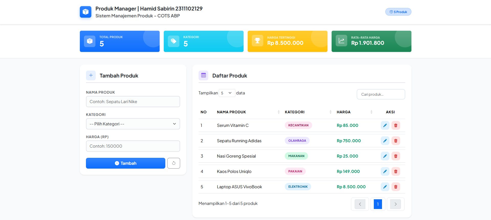
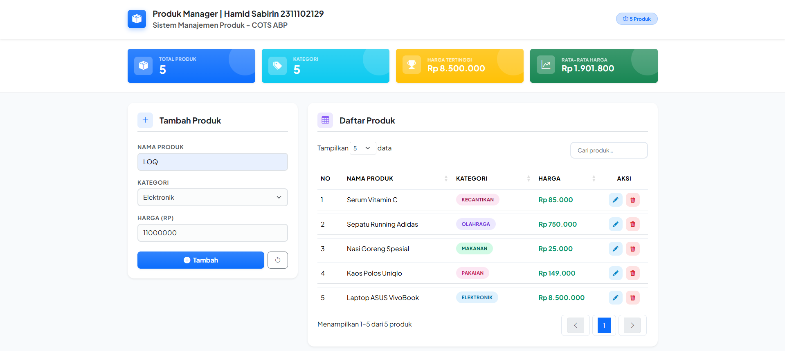
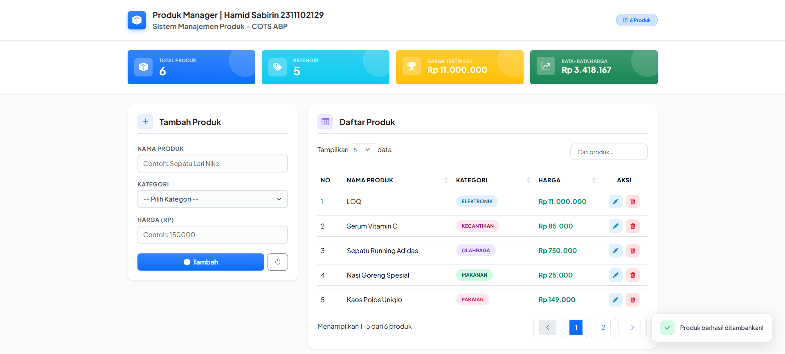
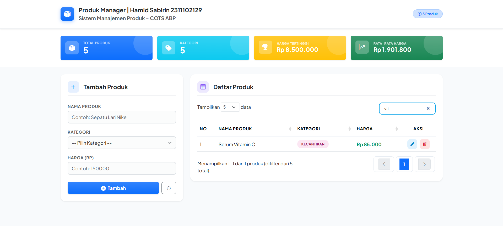
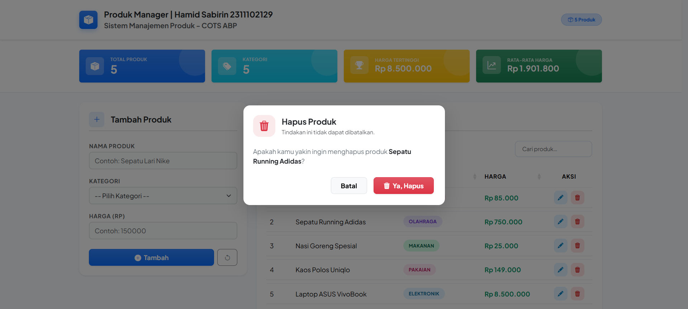
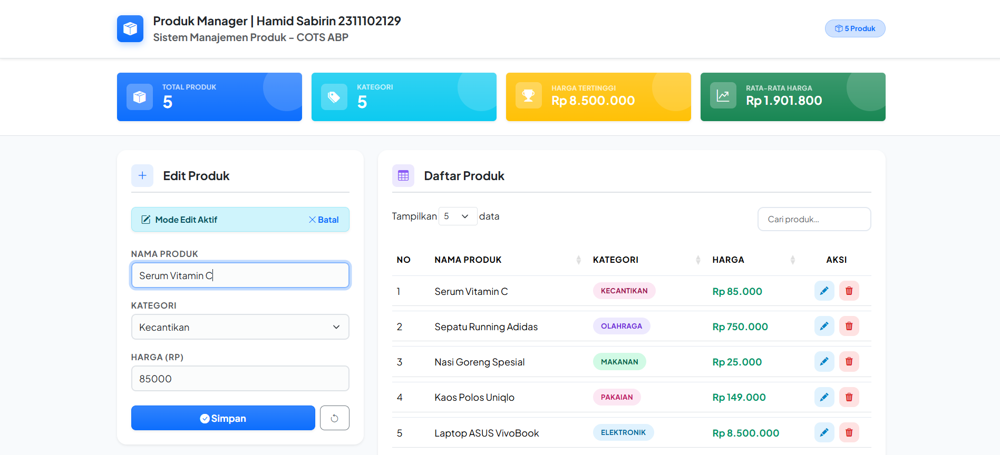

<div align="center">
  <br />
  <h1>LAPORAN PRAKTIKUM <br>APLIKASI BERBASIS PLATFORM</h1>
  <br />
  <h3>COTS DATA PRODUK <br> Bootstrap, jQuery DataTables & JavaScript</h3>
  <br />
  <br />
  <br />
  <br />
  <h3>Disusun Oleh :</h3>
  <p>
    <strong>HAMID SABIRIN</strong><br>
    <strong>2311102129</strong><br>
    <strong>S1 IF-11-REG01</strong>
  </p>
  <br />
  <br />
  <h3>Dosen Pengampu :</h3>
  <p>
    <strong>Dimas Fanny Hebrasianto Permadi, S.ST., M.Kom</strong>
  </p>
  <br />
  <br />
  <h4>Asisten Praktikum :</h4>
  <strong>Apri Pandu Wicaksono</strong> <br>
  <strong>Rangga Pradarrell Fathi</strong>
  <br />
  <h3>LABORATORIUM HIGH PERFORMANCE
 <br>FAKULTAS INFORMATIKA <br>UNIVERSITAS TELKOM PURWOKERTO <br>2026</h3>
</div>

---

## 1. Dasar Teori

**CRUD (Create, Read, Update, Delete)** adalah empat operasi dasar yang digunakan dalam pengelolaan data pada sebuah aplikasi. Dalam konteks pengembangan web, CRUD diimplementasikan untuk memungkinkan pengguna menambah, menampilkan, memperbarui, dan menghapus data secara dinamis di sisi klien (*client-side*) menggunakan JavaScript tanpa perlu komunikasi ke server.

**Bootstrap** adalah framework CSS open-source yang menyediakan komponen antarmuka siap pakai seperti form, tombol, modal, dan sistem grid responsif. Proyek ini memaksimalkan penggunaan kelas-kelas utilitas Bootstrap untuk membangun antarmuka yang modern dan konsisten dengan minim kode CSS kustom.

**jQuery DataTables** adalah plugin berbasis jQuery yang mengubah elemen `<table>` HTML biasa menjadi tabel data yang kaya fitur. Fitur utama yang digunakan adalah pencarian (*search*), pengurutan (*sorting*), dan pembagian halaman (*pagination*) secara otomatis yang terintegrasi dengan gaya visual Bootstrap 5.

**Flexbox & Grid System** digunakan untuk menyusun layout yang responsif. Dengan sistem grid Bootstrap, halaman dibagi menjadi 12 kolom virtual yang memungkinkan penyusunan kartu statistik dan pembagian ruang antara form input dan tabel daftar produk secara proporsional.

---

## 2. Implementasi Kode

Berikut adalah kode lengkap yang digunakan dalam proyek Manajemen Produk ini.

### Kode HTML (`index.html`)

```html
<!DOCTYPE html>
<html lang="id">
<head>
  <meta charset="UTF-8" />
  <meta name="viewport" content="width=device-width, initial-scale=1.0" />
  <title>Manajemen Produk | COTS</title>
  <meta name="description" content="Halaman manajemen data produk dengan fitur CRUD, pencarian, dan pagination." />

  <!-- Google Fonts -->
  <link href="https://fonts.googleapis.com/css2?family=Plus+Jakarta+Sans:wght@300;400;500;600;700;800&display=swap" rel="stylesheet" />

  <!-- Bootstrap 5 -->
  <link href="https://cdn.jsdelivr.net/npm/bootstrap@5.3.3/dist/css/bootstrap.min.css" rel="stylesheet" />

  <!-- Bootstrap Icons -->
  <link href="https://cdn.jsdelivr.net/npm/bootstrap-icons@1.11.3/font/bootstrap-icons.min.css" rel="stylesheet" />

  <!-- DataTables CSS -->
  <link href="https://cdn.datatables.net/1.13.8/css/dataTables.bootstrap5.min.css" rel="stylesheet" />
  <link href="https://cdn.datatables.net/responsive/2.5.0/css/responsive.bootstrap5.min.css" rel="stylesheet" />

  <!-- Custom CSS -->
  <link href="style.css" rel="stylesheet" />
</head>
<body>

<!-- ══════════ NAVBAR ══════════ -->
<nav class="navbar navbar-expand-lg navbar-light bg-white border-bottom shadow-sm py-3">
  <div class="container d-flex align-items-center justify-content-between">
    <a href="#" class="navbar-brand d-flex align-items-center gap-3 fw-bold text-dark text-decoration-none">
      <div class="brand-icon bg-primary bg-gradient rounded-3 place-items-center text-white" style="width:45px;height:45px;box-shadow: 0 4px 12px rgba(13, 110, 253, 0.3);">
        <i class="bi bi-box-seam-fill" style="font-size: 1.4rem;"></i>
      </div>
      <div>
        <div class="fs-5">Produk Manager | Hamid Sabirin 2311102129</div>
        <div class="small text-muted">Sistem Manajemen Produk - COTS ABP</div>
      </div>
    </a>
    <span class="badge rounded-pill bg-primary-subtle text-primary border border-primary-subtle px-3 py-2 fw-bold" id="navBadge">
      <i class="bi bi-box-seam me-1"></i>0 Produk
    </span>
  </div>
</nav>

<!-- ══════════ STATS (2 kolom × 2 baris) ══════════ -->
<section class="bg-white border-bottom py-4 mb-4">
  <div class="container">
    <div class="row g-3">
      <div class="col-6 col-md-3">
        <div class="card border-0 shadow-sm h-100 bg-primary bg-gradient text-white position-relative overflow-hidden p-3 stat-card-hover">
          <div class="d-flex align-items-center gap-3">
            <div class="bg-white bg-opacity-25 rounded-3 place-items-center text-white" style="width:45px;height:45px;font-size:1.3rem;">
              <i class="bi bi-box-seam-fill"></i>
            </div>
            <div>
              <div class="small fw-semibold text-uppercase opacity-75" style="letter-spacing: 0.05em; font-size: 0.7rem;">Total Produk</div>
              <div class="h3 fw-bold mb-0" id="statTotal">0</div>
            </div>
          </div>
        </div>
      </div>
      <div class="col-6 col-md-3">
        <div class="card border-0 shadow-sm h-100 bg-info bg-gradient text-white position-relative overflow-hidden p-3 stat-card-hover">
          <div class="d-flex align-items-center gap-3">
            <div class="bg-white bg-opacity-25 rounded-3 place-items-center text-white" style="width:45px;height:45px;font-size:1.3rem;">
              <i class="bi bi-tags-fill"></i>
            </div>
            <div>
              <div class="small fw-semibold text-uppercase opacity-75" style="letter-spacing: 0.05em; font-size: 0.7rem;">Kategori</div>
              <div class="h3 fw-bold mb-0" id="statKategori">0</div>
            </div>
          </div>
        </div>
      </div>
      <div class="col-6 col-md-3">
        <div class="card border-0 shadow-sm h-100 bg-warning bg-gradient text-white position-relative overflow-hidden p-3 stat-card-hover">
          <div class="d-flex align-items-center gap-3">
            <div class="bg-white bg-opacity-25 rounded-3 place-items-center text-white" style="width:45px;height:45px;font-size:1.3rem;">
              <i class="bi bi-trophy-fill"></i>
            </div>
            <div>
              <div class="small fw-semibold text-uppercase opacity-75" style="letter-spacing: 0.05em; font-size: 0.7rem;">Harga Tertinggi</div>
              <div class="h5 fw-bold mb-0" id="statMax">Rp 0</div>
            </div>
          </div>
        </div>
      </div>
      <div class="col-6 col-md-3">
        <div class="card border-0 shadow-sm h-100 bg-success bg-gradient text-white position-relative overflow-hidden p-3 stat-card-hover">
          <div class="d-flex align-items-center gap-3">
            <div class="bg-white bg-opacity-25 rounded-3 d-grid place-items-center text-white" style="width:45px;height:45px;font-size:1.3rem;">
              <i class="bi bi-graph-up-arrow"></i>
            </div>
            <div>
              <div class="small fw-semibold text-uppercase opacity-75" style="letter-spacing: 0.05em; font-size: 0.7rem;">Rata-rata Harga</div>
              <div class="h5 fw-bold mb-0" id="statAvg">Rp 0</div>
            </div>
          </div>
        </div>
      </div>
    </div>
  </div>
</section>

<!-- ══════════ MAIN CONTENT ══════════ -->
<main class="main-area">
  <div class="container">
    <div class="row g-4 align-items-start">

      <!-- ── FORM INPUT (Kiri) ── -->
      <div class="col-lg-4">
        <div class="card border-0 shadow-sm rounded-4 p-4 mb-4">
          <div class="d-flex align-items-center gap-3 mb-4 pb-2 border-bottom border-2">
            <div class="bg-primary bg-opacity-10 text-primary rounded-3 place-items-center" style="width:38px;height:38px; font-size: 1.1rem;">
              <i class="bi bi-plus-lg"></i>
            </div>
            <h5 class="mb-0 fw-bold" id="formTitle">Tambah Produk</h5>
          </div>

          <!-- Edit Mode Banner -->
          <div class="alert alert-info d-none align-items-center gap-2 py-2 px-3 mb-4 rounded-3 border-info-subtle shadow-sm" id="editBanner">
            <i class="bi bi-pencil-square"></i>
            <span class="small fw-bold">Mode Edit Aktif</span>
            <button type="button" class="btn btn-sm btn-link text-decoration-none ms-auto p-0 small fw-bold" onclick="cancelEdit()">
              <i class="bi bi-x-lg"></i> Batal
            </button>
          </div>

          <form id="productForm" novalidate>
            <input type="hidden" id="editId" />

            <div class="mb-3">
              <label class="form-label small fw-bold text-muted text-uppercase mb-1" for="namaProduk" style="letter-spacing: 0.05em;">Nama Produk</label>
              <input type="text" id="namaProduk" class="form-control border-2 bg-light bg-opacity-50 py-2 rounded-3"
                placeholder="Contoh: Sepatu Lari Nike" />
              <div class="invalid-feedback d-none" id="errNama">
                <i class="bi bi-exclamation-circle me-1"></i>Nama produk tidak boleh kosong.
              </div>
            </div>

            <div class="mb-3">
              <label class="form-label small fw-bold text-muted text-uppercase mb-1" for="kategori" style="letter-spacing: 0.05em;">Kategori</label>
              <select id="kategori" class="form-select border-2 bg-light bg-opacity-50 py-2 rounded-3">
                <option value="" disabled selected>-- Pilih Kategori --</option>
                <option value="Elektronik">Elektronik</option>
                <option value="Pakaian">Pakaian</option>
                <option value="Makanan">Makanan</option>
                <option value="Minuman">Minuman</option>
                <option value="Olahraga">Olahraga</option>
                <option value="Kecantikan">Kecantikan</option>
                <option value="Lainnya">Lainnya</option>
              </select>
              <div class="invalid-feedback d-none" id="errKategori">
                <i class="bi bi-exclamation-circle me-1"></i>Pilih kategori terlebih dahulu.
              </div>
            </div>

            <div class="mb-4">
              <label class="form-label small fw-bold text-muted text-uppercase mb-1" for="harga" style="letter-spacing: 0.05em;">Harga (Rp)</label>
              <input type="number" id="harga" class="form-control border-2 bg-light bg-opacity-50 py-2 rounded-3"
                placeholder="Contoh: 150000" min="0" />
              <div class="invalid-feedback d-none" id="errHarga">
                <i class="bi bi-exclamation-circle me-1"></i>Masukkan harga yang valid (≥ 0).
              </div>
            </div>

            <div class="d-flex gap-2">
              <button type="submit" class="btn btn-primary bg-gradient w-100 py-2 rounded-3 fw-bold shadow-sm" id="btnSubmit">
                <i class="bi bi-plus-circle-fill me-1"></i> Tambah
              </button>
              <button type="button" class="btn btn-outline-secondary px-3 py-2 rounded-3 fw-bold" onclick="resetForm()" title="Reset Form">
                <i class="bi bi-arrow-counterclockwise"></i>
              </button>
            </div>
          </form>
        </div>
      </div>

      <!-- ── TABEL PRODUK (Kanan) ── -->
      <div class="col-lg-8">
        <div class="card border-0 shadow-sm rounded-4 p-4">
          <div class="d-flex align-items-center gap-3 mb-4 pb-2 border-bottom border-2">
            <div class="bg-violet-light text-violet rounded-3 place-items-center" style="width:38px;height:38px; font-size: 1.1rem;">
              <i class="bi bi-table"></i>
            </div>
            <h5 class="mb-0 fw-bold">Daftar Produk</h5>
          </div>

          <div class="table-responsive">
            <table id="produkTable" class="table table-hover align-middle w-100" style="border-collapse:separate; border-spacing: 0 8px;">
              <thead class="text-secondary small fw-bold text-uppercase" style="letter-spacing: 0.05em;">
                <tr>
                  <th class="border-0">No</th>
                  <th class="border-0">Nama Produk</th>
                  <th class="border-0">Kategori</th>
                  <th class="border-0">Harga</th>
                  <th class="border-0 text-center">Aksi</th>
                </tr>
              </thead>
              <tbody id="produkBody"></tbody>
            </table>
          </div>
        </div>
      </div>

    </div>
  </div>
</main>

<!-- ══════════ MODAL HAPUS ══════════ -->
<div class="modal fade" id="deleteModal" tabindex="-1" aria-hidden="true">
  <div class="modal-dialog modal-dialog-centered">
    <div class="modal-content border-0 shadow-lg rounded-4">
      <div class="modal-header border-0 pb-0 pt-4 px-4">
        <div class="d-flex align-items-center gap-3">
          <div class="bg-danger bg-opacity-10 text-danger rounded-4 place-items-center" style="width:55px;height:55px;font-size:1.6rem;">
            <i class="bi bi-trash3-fill"></i>
          </div>
          <div>
            <h5 class="modal-title fw-bold text-dark">Hapus Produk</h5>
            <p class="small text-muted mb-0">Tindakan ini tidak dapat dibatalkan.</p>
          </div>
        </div>
      </div>
      <div class="modal-body px-4 py-4 text-secondary">
        Apakah kamu yakin ingin menghapus produk
        <strong id="deleteProductName" class="text-dark"></strong>?
      </div>
      <div class="modal-footer border-0 pt-0 pb-4 px-4 gap-2">
        <button type="button" class="btn btn-light fw-bold px-4 py-2 rounded-3 border" data-bs-dismiss="modal">Batal</button>
        <button type="button" id="confirmDelete" class="btn btn-danger bg-gradient fw-bold px-4 py-2 rounded-3 shadow-sm">
          <i class="bi bi-trash3-fill me-1"></i> Ya, Hapus
        </button>
      </div>
    </div>
  </div>
</div>

<!-- ══════════ TOAST STACK ══════════ -->
<div class="toast-stack" id="toastStack"></div>

<!-- ══════════ SCRIPTS ══════════ -->
<!-- jQuery -->
<script src="https://code.jquery.com/jquery-3.7.1.min.js"></script>
<!-- Bootstrap Bundle -->
<script src="https://cdn.jsdelivr.net/npm/bootstrap@5.3.3/dist/js/bootstrap.bundle.min.js"></script>
<!-- DataTables -->
<script src="https://cdn.datatables.net/1.13.8/js/jquery.dataTables.min.js"></script>
<script src="https://cdn.datatables.net/1.13.8/js/dataTables.bootstrap5.min.js"></script>
<script src="https://cdn.datatables.net/responsive/2.5.0/js/dataTables.responsive.min.js"></script>
<script src="https://cdn.datatables.net/responsive/2.5.0/js/responsive.bootstrap5.min.js"></script>
<!-- Custom JS -->
<script src="script.js"></script>

</body>
</html>
```

### Kode CSS (`style.css`)

```css
:root {
  --primary:       #0ea5e9;
  --secondary:     #8b5cf6;
  --bg:            #f8fafc;
  --text-main:     #1e293b;
  --text-muted:    #64748b;
  --border:        #e2e8f0;
  --shadow-sm:     0 1px 3px rgba(0,0,0,.08), 0 4px 16px rgba(0,0,0,.06);
  --shadow-lg:     0 8px 32px rgba(0,0,0,.12);
}

.bg-violet { background-color: var(--secondary) !important; }
.text-violet { color: var(--secondary) !important; }
.bg-violet-light { background-color: #ede9fe !important; }

/* ── Centering Helper ── */
.place-items-center {
  display: flex !important;
  align-items: center !important;
  justify-content: center !important;
}

.place-items-center i {
  line-height: 1;
}
body {
  font-family: 'Plus Jakarta Sans', sans-serif;
  background: var(--bg);
  color: var(--text-main);
  min-height: 100vh;
}

/* ── Enhancement: Stat Card Hover ── */
.stat-card-hover {
  transition: transform 0.3s ease, box-shadow 0.3s ease;
  cursor: default;
}
.stat-card-hover:hover {
  transform: translateY(-5px);
  box-shadow: 0 10px 25px rgba(0,0,0,0.1) !important;
}
.stat-card-hover::after {
  content: '';
  position: absolute;
  right: -15px;
  top: -15px;
  width: 80px;
  height: 80px;
  border-radius: 50%;
  background: rgba(255,255,255,0.15);
}

/* ── Enhancement: Table Styling ── */
#produkTable tr {
  background: #fff;
  transition: all 0.2s ease;
}
#produkTable tbody tr:hover {
  background: #f1f5f9;
  transform: scale(1.005);
}
#produkTable td {
  border-top: 1px solid var(--border);
}

/* ── Badges ── */
.badge-kategori {
  font-size: .73rem;
  font-weight: 700;
  padding: .35rem .85rem;
  border-radius: 999px;
  display: inline-block;
  text-transform: uppercase;
  letter-spacing: 0.03em;
}
.badge-elektronik { background: #e0f2fe; color: #0369a1; }
.badge-pakaian    { background: #fce7f3; color: #be185d; }
.badge-makanan    { background: #d1fae5; color: #065f46; }
.badge-minuman    { background: #fef3c7; color: #92400e; }
.badge-olahraga   { background: #ede9fe; color: #6d28d9; }
.badge-kecantikan { background: #fce7f3; color: #9d174d; }
.badge-lainnya    { background: #f1f5f9; color: #475569; }

/* ── Action Buttons ── */
.btn-action {
  width: 34px; height: 34px;
  border-radius: 10px;
  border: none;
  display: flex;
  align-items: center;
  justify-content: center;
  font-size: .9rem;
  cursor: pointer;
  transition: all 0.2s;
  background: #f1f5f9;
}
.btn-edit-row { color: #0284c7; background: #e0f2fe; }
.btn-edit-row:hover { background: #0ea5e9; color: #fff; transform: translateY(-2px); }
.btn-delete-row { color: #dc2626; background: #fee2e2; }
.btn-delete-row:hover { background: #ef4444; color: #fff; transform: translateY(-2px); }

/* (Lanjutan toast & datatables overrides...) */
```

### Kode JavaScript (`script.js`)

```javascript
const store    = {};
let nextId     = 1;
let editingId  = null;
let deletingId = null;

let dt;

$(document).ready(function () {
  dt = $('#produkTable').DataTable({
    responsive: true,
    language: {
      search:            '_INPUT_',
      searchPlaceholder: 'Cari produk…',
      // ... (Konfigurasi bahasa lainnya)
    },
    columns: [
      { data: 'rowNum',   orderable: false, width: '48px' },
      { data: 'nama' },
      { data: 'kategori' },
      { data: 'hargaFmt' },
      { data: 'aksi',    orderable: false, className: 'text-center', width: '100px' },
      { data: 'seq',     visible: false }
    ],
    order: [[5, 'desc']], // Mengurutkan berdasarkan seq secara descending (terbaru di atas)
    // ...
  });

  // Contoh data awal
  addProduct('Laptop ASUS VivoBook',  'Elektronik', 8500000);
  addProduct('Kaos Polos Uniqlo',     'Pakaian',    149000);
});

// ... (Helpers: formatRupiah, badgeClass)

function buildRow(p, idx) {
  return {
    id:       p.id,
    rowNum:   idx,
    nama:     p.nama,
    seq:      p.seq,
    kategori: `<span class="badge-kategori ${badgeClass(p.kategori)}">${p.kategori}</span>`,
    hargaFmt: `<span style="font-weight:700;color:#059669;">${formatRupiah(p.harga)}</span>`,
    aksi:
      `<div class="d-flex justify-content-center gap-2">` +
      `<button class="btn-action btn-edit-row" onclick="startEdit('${p.id}')"><i class="bi bi-pencil-fill"></i></button>` +
      `<button class="btn-action btn-delete-row" onclick="promptDelete('${p.id}')"><i class="bi bi-trash3-fill"></i></button>` +
      `</div>`
  };
}

function addProduct(nama, kategori, harga) {
  const seq = nextId++;
  const id  = 'p' + seq;
  store[id] = { id, nama, kategori, harga, seq };
  dt.row.add(buildRow(store[id], 0)).draw(); // Data baru langsung muncul di atas
  refreshStats();
}

function updateProduct(id, nama, kategori, harga) {
  const seq = nextId++; // Perbarui seq agar produk naik ke atas setelah di-edit
  store[id] = { id, nama, kategori, harga, seq };
  dt.rows().every(function () {
    if (this.data().id === id) this.data(buildRow(store[id], 0)).invalidate();
  });
  dt.draw(); // Refresh urutan tabel
  refreshStats();
}

// ... (Logic Form Submit, Edit Mode, Delete Mode, Toast)
```

---

## 3. Penjelasan Kode

### Penjelasan Kode HTML (`index.html`)

- **Baris 1–24**: Bagian `head` yang berisi definisi metadata, judul halaman, serta pemanggilan semua sumber daya eksternal seperti *Google Fonts*, *Bootstrap 5 CSS*, *Bootstrap Icons*, dan stylesheet khusus `style.css`.
- **Baris 28–43**: Sektor **Navbar** yang menggunakan standar `navbar` Bootstrap. Di sini terdapat logo brand dan badge dinamis (`id="navBadge"`) yang menampilkan jumlah total produk secara *real-time*.
- **Baris 46–103**: Bagian **Stats Section** yang menampilkan 4 kartu statistik. Setiap kartu memiliki ID unik agar dapat diperbarui isinya melalui JavaScript. Gunakan kelas `bg-gradient` untuk estetika visual.
- **Baris 111–177**: Struktur **Form Input**. Menggunakan kartu (`card`) dengan sudut membulat (`rounded-4`). Terdapat alert `editBanner` yang tersembunyi (`d-none`) dan hanya muncul saat mode edit aktif.
- **Baris 180–204**: Bagian **Daftar Produk** yang berisi tabel responsif. Struktur tabel menggunakan kelas `table-hover` dan CSS khusus agar antar baris memiliki jarak yang rapi.
- **Baris 211–237**: Struktur **Modal Konfirmasi Hapus**. Menggunakan komponen Modal Bootstrap 5 untuk memvalidasi tindakan penghapusan produk.
- **Baris 243–254**: Pengaturan pemuatan skrip eksternal (jQuery, Bootstrap JS, DataTables) dan skrip logika kustom `script.js` di akhir body.

### Penjelasan Kode CSS (`style.css`)

- **Baris 1–10**: Pendeklarasian variabel global (`:root`) untuk warna tema, border, dan bayangan agar konsisten di seluruh elemen.
- **Baris 12–14**: Definisi kelas utilitas khusus warna violet (`.bg-violet-light`) yang tidak tersedia default di Bootstrap.
- **Baris 16–25**: Penambahan helper `.place-items-center`. Fungsi ini memastikan semua ikon di dalam kontainer bundar berada tepat di titik tengah.
- **Baris 33–51**: Logika desain kartu statistik, termasuk efek hover (`transform: translateY`) agar kartu terasa interaktif saat kursor diarahkan.
- **Baris 53–64**: Kustomisasi tabel produk, memberikan efek interaksi visual saat baris tabel di-hover.
- **Baris 66–82**: Pemberian warna khusus untuk setiap kategori produk menggunakan desain *pill badge* yang kontras.
- **Baris 84–100**: Pengaturan tombol aksi (Edit & Hapus) dalam tabel, memastikan ikon di dalamnya sejajar dan tombol merespon hover dengan baik.
- **Baris 102–146**: Sistem notifikasi *Toast* yang muncul dari pojok kanan bawah dengan animasi `slideIn`.

### Penjelasan Kode JavaScript (`script.js`)

- **Baris 1–4**: Inisialisasi variabel global untuk penyimpanan data (`store`), penghitung ID (`nextId`), dan penanda status data (`editingId`).
- **Baris 9–57**: Inisialisasi **jQuery DataTables**. Pengaturan `order: [[5, 'desc']]` memastikan tabel selalu diurutkan berdasarkan kolom ke-5 (`seq`) dari yang terbesar, sehingga data terbaru berada di atas.
- **Baris 78–92**: Fungsi `buildRow()`. Merakit data mentah menjadi format HTML untuk tabel. Tombol aksi dibungkus ke dalam `d-flex justify-content-center gap-2` agar posisi tombol edit dan hapus selalu berdampingan secara horizontal.
- **Baris 101–116**: Fungsi `refreshStats()`. Menghitung statistik (total, kategori, harga tertinggi, rata-rata) secara dinamis setiap kali data berubah.
- **Baris 121–127**: Fungsi `addProduct()`. Menambahkan produk baru ke `store`. Nilai `seq` yang terus bertambah memastikan baris baru ini mendapat posisi paling atas saat tabel di-*draw*.
- **Baris 132–140**: Fungsi `updateProduct()`. Saat data diubah, nilai `seq` diperbarui ke nilai terbaru. Tujuannya adalah agar produk yang baru saja di-edit "naik" ke posisi paling atas tabel sebagai indikasi aktivitas terbaru.
- **Baris 144–175**: Logika **Form Submit**. Mengatur transisi antara mode tambah dan mode simpan (edit). Menggunakan kelas utilitas Bootstrap `d-none` dan `d-block` untuk menampilkan atau menyembunyikan pesan error.
- **Baris 180–202**: Fungsi **Edit Mode**. Mengisi form dengan data lama dan menampilkan banner biru sebagai tanda pengguna sedang dalam mode penyuntingan.
- **Baris 245–259**: Fungsi `showToast()`. Menciptakan notifikasi animasi yang memberikan umpan balik instan kepada pengguna setelah operasi CRUD dilakukan.

---

## 4. Hasil Tampilan (Screenshot)

#### 1. Tampilan Awal Halaman



#### 2. Input Data & Data Berhasil Ditambahkan (Urutan Terbaru di Atas)




#### 3. Fitur Pencarian (Search)



#### 4. Hapus Data



#### 5. Edit Data (Data Naik ke Atas Setelah Diperbarui)



---

## 5. Referensi

- [Bootstrap 5 Documentation](https://getbootstrap.com/docs/5.3/)
- [jQuery DataTables Documentation](https://datatables.net/manual/)
- [Bootstrap Icons](https://icons.getbootstrap.com/)
- [MDN Web Docs — JavaScript Array &amp; Object Methods](https://developer.mozilla.org/en-US/docs/Web/JavaScript)
