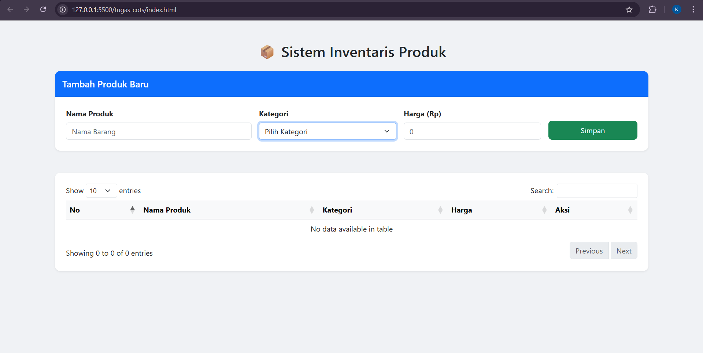
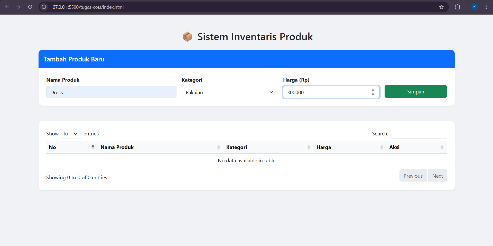
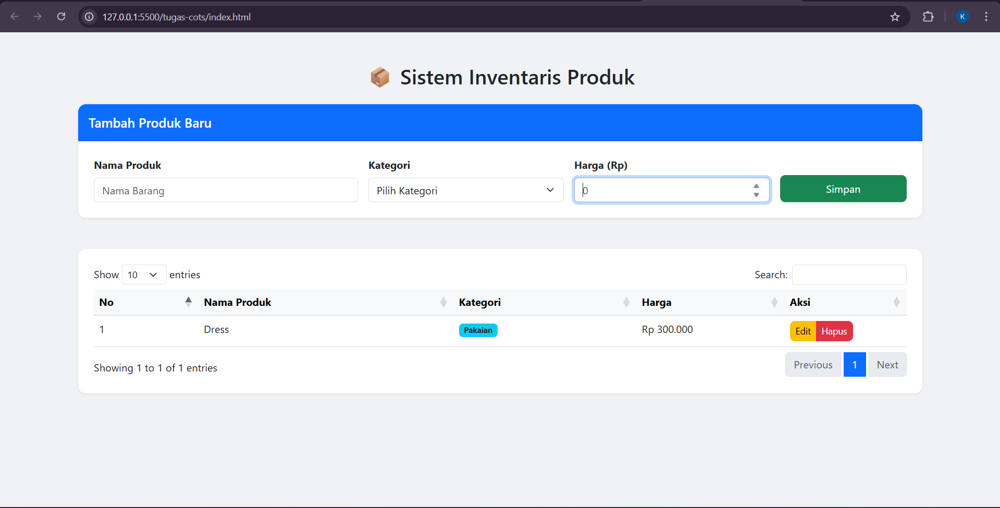
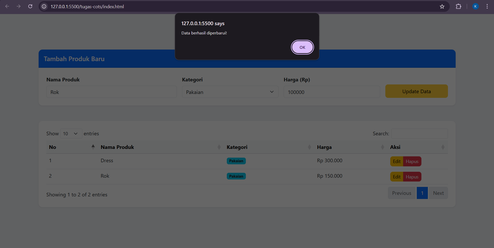
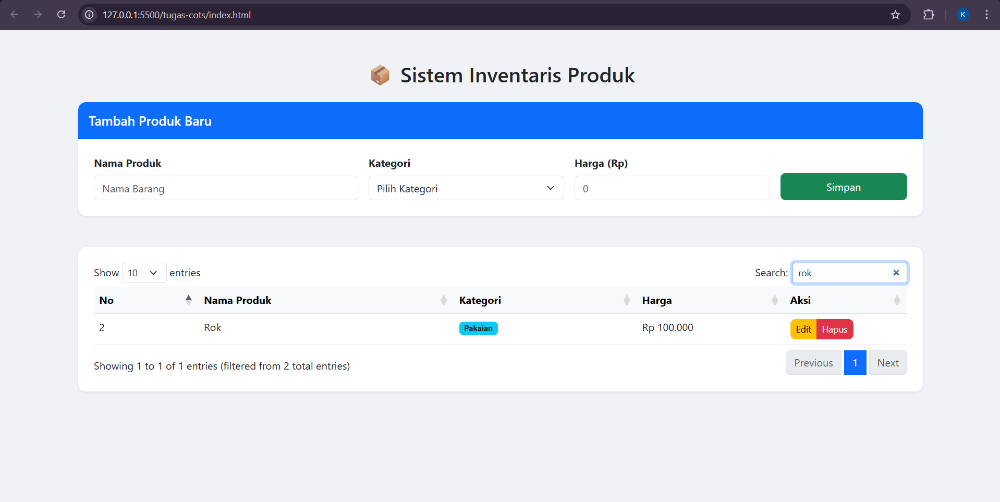
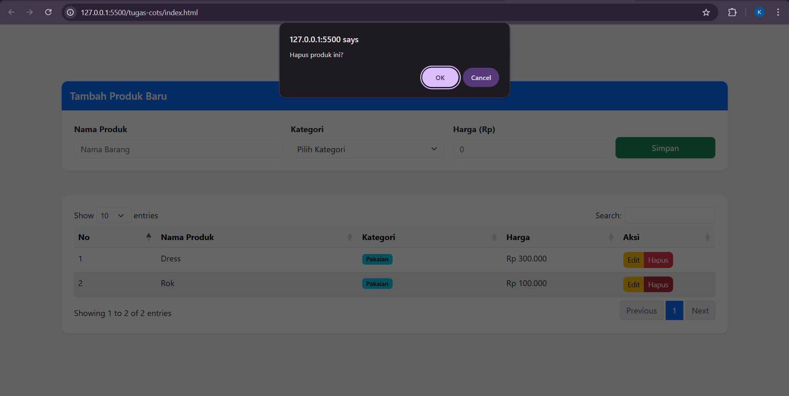

<div align="center">
  <br />
  <h1>LAPORAN PRAKTIKUM <br> APLIKASI BERBASIS PLATFORM</h1>
  <br />

  <h3>DATA PRODUK <br> Bootstrap, jQuery DataTables & JavaScript</h3>
  <br /><br />

  
  <br /><br />

  <h3>Disusun Oleh :</h3>
  <p>
    <strong>Kanasya Abdi Aziz</strong><br>
    <strong>2311102140</strong><br>
    <strong>S1 IF-11-01</strong>
  </p>

  <br /><br />

  <h3>Dosen Pengampu :</h3>
  <p>
    <strong>Dimas Fanny Hebrasianto Permadi, S.ST., M.Kom</strong>
  </p>

  <br /><br />

  <h4>Asisten Praktikum :</h4>
  <strong>Apri Pandu Wicaksono</strong><br>
  <strong>Rangga Pradarrell Fathi</strong>

  <br /><br />

  <h3>
  LABORATORIUM HIGH PERFORMANCE <br>
  FAKULTAS INFORMATIKA <br>
  UNIVERSITAS TELKOM PURWOKERTO <br>
  2026
  </h3>
</div>

---

# 1. Dasar Teori

### CRUD (Create, Read, Update, Delete)

CRUD merupakan empat operasi dasar yang digunakan untuk mengelola data dalam sebuah aplikasi. Dalam pengembangan aplikasi web, pengguna dapat menambahkan data baru (*create*), menampilkan data (*read*), memperbarui data (*update*), serta menghapus data (*delete*).

Dengan bantuan **JavaScript**, proses CRUD dapat dilakukan langsung pada sisi klien (*client-side*) tanpa harus selalu berkomunikasi dengan server. Hal ini membuat aplikasi web menjadi lebih responsif dan interaktif.

---

### Bootstrap

**Bootstrap** merupakan framework CSS open-source yang menyediakan berbagai komponen antarmuka siap pakai seperti form, tombol, modal, tabel, dan sistem grid responsif.

Dengan menggunakan Bootstrap, pengembang dapat membuat desain antarmuka aplikasi web dengan lebih cepat karena telah tersedia berbagai **kelas utilitas** yang terstandarisasi.

---

### jQuery DataTables

**jQuery DataTables** adalah plugin berbasis jQuery yang digunakan untuk meningkatkan fitur tabel HTML.

Plugin ini memungkinkan tabel memiliki berbagai fitur tambahan seperti:

- Pencarian data (*search*)
- Pengurutan data berdasarkan kolom (*sorting*)
- Pembagian halaman (*pagination*)

Semua fitur tersebut dapat diaktifkan hanya dengan **satu baris inisialisasi JavaScript**, sehingga sangat mempermudah pengelolaan tabel data dalam aplikasi web.

---

### Object Mapping

**Object Mapping** merupakan metode penyimpanan data pada JavaScript yang menggunakan struktur objek.

Pada metode ini, setiap data disimpan sebagai **pasangan key dan value**, di mana key berfungsi sebagai identitas unik dari data tersebut.

Contoh struktur object mapping:

```
{
  "p1": { id, nama, kategori, harga }
}
```

Metode ini memungkinkan proses **akses, pembaruan, dan penghapusan data** dilakukan dengan lebih cepat, bahkan dengan kompleksitas waktu **O(1)**.

---

# 2. Penjelasan Kode HTML, CSS, dan JavaScript

---

## Kode HTML (`index.html`)

```html
<!DOCTYPE html>
<html lang="id">
<head>
    <meta charset="UTF-8">
    <meta name="viewport" content="width=device-width, initial-scale=1.0">
    <title>Manajemen Data Produk - CRUD</title>
    
    <link href="https://cdn.jsdelivr.net/npm/bootstrap@5.3.0/dist/css/bootstrap.min.css" rel="stylesheet">
    <link href="https://cdn.datatables.net/1.13.4/css/dataTables.bootstrap5.min.css" rel="stylesheet">
    <link rel="stylesheet" href="style.css">
</head>
<body>

<div class="container py-5">
    <h2 class="text-center mb-4">📦 Sistem Inventaris Produk</h2>

    <div class="card mb-5 border-0 shadow-sm">
        <div class="card-header bg-primary text-white py-3">
            <h5 class="mb-0" id="formTitle">Tambah Produk Baru</h5>
        </div>
        <div class="card-body p-4">
            <form id="productForm">
                <input type="hidden" id="productId">

                <div class="row g-3">
                    <div class="col-md-4">
                        <label class="form-label fw-bold">Nama Produk</label>
                        <input type="text" id="nama" class="form-control" placeholder="Nama Barang" required>
                    </div>
                    <div class="col-md-3">
                        <label class="form-label fw-bold">Kategori</label>
                        <select id="kategori" class="form-select" required>
                            <option value="">Pilih Kategori</option>
                            <option value="Elektronik">Elektronik</option>
                            <option value="Pakaian">Pakaian</option>
                            <option value="Makanan">Makanan</option>
                            <option value="Lainnya">Lainnya</option>
                        </select>
                    </div>
                    <div class="col-md-3">
                        <label class="form-label fw-bold">Harga (Rp)</label>
                        <input type="number" id="harga" class="form-control" placeholder="0" required>
                    </div>
                    <div class="col-md-2 d-flex align-items-end">
                        <button type="submit" id="submitBtn" class="btn btn-success w-100 py-2">Simpan</button>
                    </div>
                </div>
            </form>
        </div>
    </div>

    <div class="card border-0 shadow-sm">
        <div class="card-body p-4">
            <table id="productTable" class="table table-hover w-100">
                <thead class="table-light">
                    <tr>
                        <th>No</th>
                        <th>Nama Produk</th>
                        <th>Kategori</th>
                        <th>Harga</th>
                        <th>Aksi</th>
                    </tr>
                </thead>
                <tbody id="productData">
                    </tbody>
            </table>
        </div>
    </div>
</div>

<script src="https://code.jquery.com/jquery-3.6.0.min.js"></script>
<script src="https://cdn.datatables.net/1.13.4/js/jquery.dataTables.min.js"></script>
<script src="https://cdn.datatables.net/1.13.4/js/dataTables.bootstrap5.min.js"></script>
<script src="script.js"></script>

</body>
</html>
```

---

## Kode CSS (`style.css`)

```css
body {
    background-color: #f0f2f5;
    font-family: 'Segoe UI', Tahoma, Geneva, Verdana, sans-serif;
}

.card {
    border-radius: 12px;
}

.card-header {
    border-radius: 12px 12px 0 0 !important;
}

.btn {
    border-radius: 8px;
    transition: all 0.3s ease;
}

.btn-success:hover {
    transform: translateY(-2px);
    box-shadow: 0 4px 12px rgba(40, 167, 69, 0.2);
}

/* Kustomisasi DataTables agar lebih bersih */
.dataTables_wrapper .dataTables_paginate .paginate_button {
    padding: 0;
    margin-left: 5px;
}

table.dataTable thead th {
    border-bottom: 2px solid #dee2e6;
}
```


---

## Kode JavaScript (`script.js`)

```javascript
$(document).ready(function() {
    // 1. Inisialisasi DataTable
    let table = $('#productTable').DataTable({
        language: { url: '//cdn.datatables.net/plug-ins/1.13.4/i18n/id.json' }
    });

    // 2. Database Sederhana (Mapping Object)
    let productDatabase = {};

    // 3. Fungsi Render Tabel
    function updateTable() {
        table.clear();
        let counter = 1;

        for (let id in productDatabase) {
            let item = productDatabase[id];
            let formattedHarga = new Intl.NumberFormat('id-ID').format(item.harga);

            table.row.add([
                counter++,
                item.nama,
                `<span class="badge bg-info text-dark">${item.kategori}</span>`,
                `Rp ${formattedHarga}`,
                `<div class="btn-group">
                    <button class="btn btn-warning btn-sm" onclick="editProduct('${id}')">Edit</button>
                    <button class="btn btn-danger btn-sm" onclick="deleteProduct('${id}')">Hapus</button>
                </div>`
            ]).draw(false);
        }
    }

    // 4. Handle Simpan (Create & Update)
    $('#productForm').on('submit', function(e) {
        e.preventDefault();

        const id = $('#productId').val(); // Ambil ID hidden
        const nama = $('#nama').val();
        const kategori = $('#kategori').val();
        const harga = $('#harga').val();

        if (id) {
            // MODE UPDATE: Jika ID ada, timpa data lama
            productDatabase[id] = { nama, kategori, harga };
            alert("Data berhasil diperbarui!");
        } else {
            // MODE CREATE: Jika ID kosong, buat ID baru
            const newId = 'PROD-' + Date.now();
            productDatabase[newId] = { nama, kategori, harga };
        }

        // Reset Form & Tombol
        resetForm();
        updateTable();
    });

    // 5. Fungsi Ambil Data ke Form (Edit)
    window.editProduct = function(id) {
        const item = productDatabase[id];
        
        // Isi form dengan data lama
        $('#productId').val(id);
        $('#nama').val(item.nama);
        $('#kategori').val(item.kategori);
        $('#harga').val(item.harga);

        // Ubah tampilan tombol
        $('#submitBtn').text('Update Data').removeClass('btn-success').addClass('btn-warning');
        $('#nama').focus();
    };

    // 6. Fungsi Hapus (Delete)
    window.deleteProduct = function(id) {
        if (confirm("Hapus produk ini?")) {
            delete productDatabase[id];
            updateTable();
        }
    };

    // Fungsi Reset Form
    function resetForm() {
        $('#productForm')[0].reset();
        $('#productId').val(''); // Kosongkan ID hidden
        $('#submitBtn').text('Simpan').removeClass('btn-warning').addClass('btn-success');
    }
});

```


---

# Hasil Tampilan (Screenshot)

### 1. Tampilan Awal Halaman



### 2. Input Data & Data Berhasil Ditambahkan





### 3. Edit Data



### 4. Fitur Pencarian (Search)



### 5. Hapus Data



---

# 3. Penjelasan Kode

## 1. HTML (`index.html`)

File HTML berfungsi sebagai struktur utama dari aplikasi web. Pada bagian ini juga dilakukan pemanggilan berbagai **library eksternal** yang dibutuhkan oleh aplikasi.

### Pemanggilan Library (CDN)

Library seperti **Bootstrap** dan **DataTables** dipanggil menggunakan CDN (*Content Delivery Network*). Urutan pemanggilan sangat penting, di mana:

- File **CSS** ditempatkan pada bagian `<head>`
- File **JavaScript** ditempatkan di bagian bawah `<body>`

Hal ini bertujuan agar proses pemuatan halaman tidak terhambat.

### Hidden Input

Bagian penting dalam form adalah:

```
<input type="hidden" id="productId">
```

Input ini digunakan untuk menyimpan **ID produk secara tersembunyi**. Jika nilai input kosong berarti pengguna sedang **menambah data baru**, sedangkan jika memiliki nilai berarti pengguna sedang **mengedit data yang sudah ada**.

### Struktur Tabel

Tabel menggunakan class Bootstrap seperti:

```
table table-hover
```

Class ini memberikan efek visual saat kursor berada di atas baris tabel sehingga meningkatkan **user experience (UX)**.

---

## 2. CSS (`style.css`)

CSS digunakan untuk memperindah tampilan aplikasi agar terlihat lebih profesional.

### Desain Card

Elemen form dan tabel dibungkus dalam komponen **card** dengan properti:

- `border-radius`
- `box-shadow`

Hal ini menciptakan hierarki visual yang jelas antara form input dan tabel data.

### Efek Hover pada Tombol

Properti berikut memberikan efek animasi pada tombol:

```
transition: all 0.3s ease;
```

Efek ini membuat tombol terasa lebih interaktif ketika disentuh atau diarahkan oleh kursor.

### Kustomisasi DataTables

Beberapa bagian CSS digunakan untuk menyesuaikan tampilan DataTables agar lebih selaras dengan desain Bootstrap 5.

---

## 3. JavaScript (`script.js`)

Bagian JavaScript merupakan inti dari sistem CRUD yang mengatur logika aplikasi.

### Object Mapping sebagai Database

Data produk disimpan dalam sebuah objek JavaScript:

```
let productDatabase = {};
```

Metode ini memungkinkan akses data dilakukan secara langsung menggunakan **key unik**, sehingga lebih efisien dibandingkan menggunakan array yang membutuhkan proses pencarian dengan perulangan.

---

### Integrasi dengan DataTables

Untuk menampilkan data pada tabel digunakan API dari DataTables seperti:

```
table.row.add()
table.draw()
```

Dengan menggunakan metode ini, fitur seperti **search, sorting, dan pagination** dapat bekerja secara otomatis tanpa perlu membuat fungsi tambahan.

---

### Logika Form (Create & Update)

Form memiliki dua mode operasi yaitu:

- **Create (Tambah Data)**  
  Jika input `productId` kosong maka sistem akan membuat data baru.

- **Update (Edit Data)**  
  Jika input `productId` memiliki nilai maka sistem akan memperbarui data yang sudah ada.

---

### Internationalization (Format Angka)

Kode berikut digunakan untuk memformat angka harga sesuai standar Indonesia:

```
new Intl.NumberFormat('id-ID')
```

Dengan fitur ini angka seperti:

```
1000000
```

akan ditampilkan menjadi:

```
Rp 1.000.000
```

---

# 3. Referensi

- https://getbootstrap.com/docs/5.3/
- https://datatables.net/manual/
- https://icons.getbootstrap.com/
- https://fonts.google.com/specimen/Plus+Jakarta+Sans