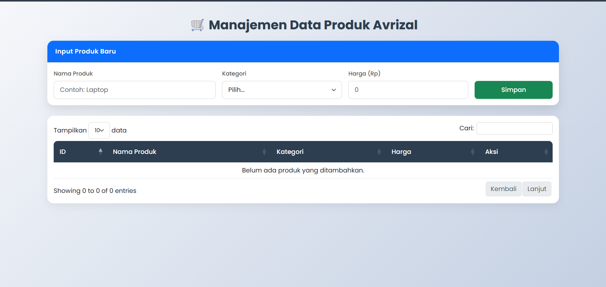
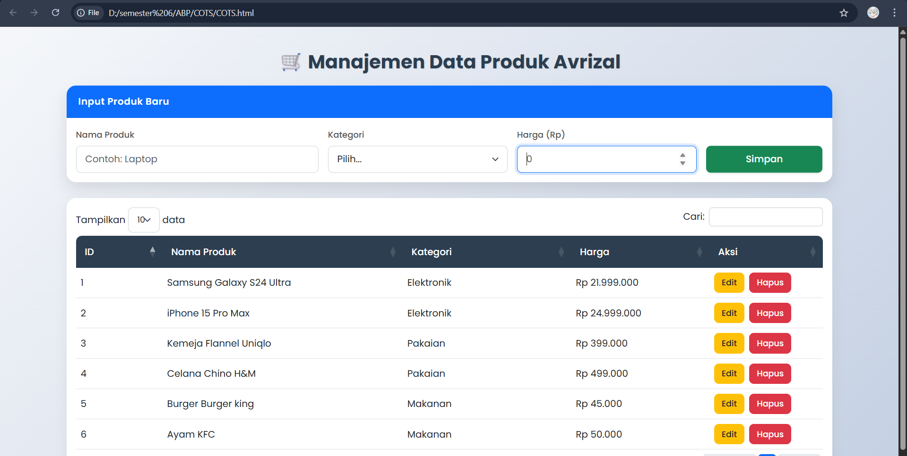
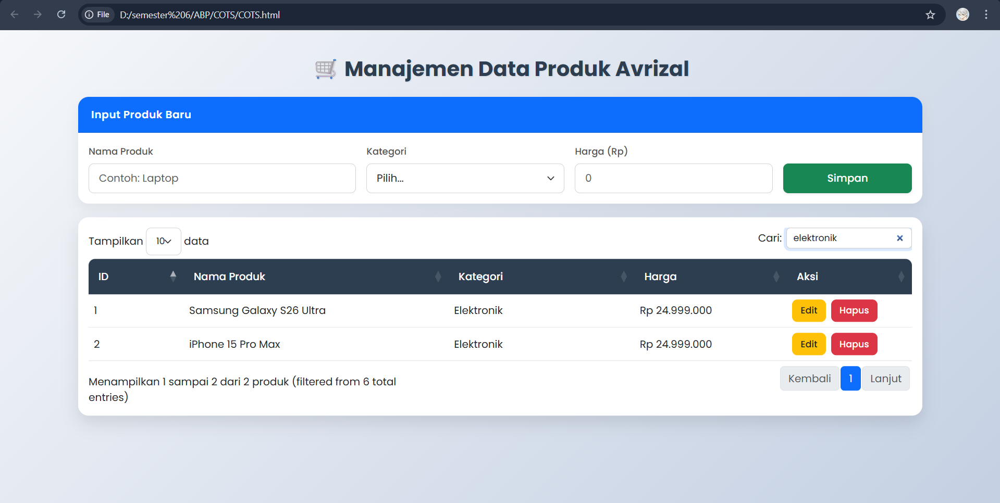
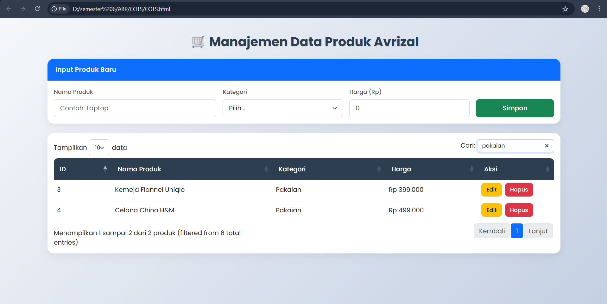
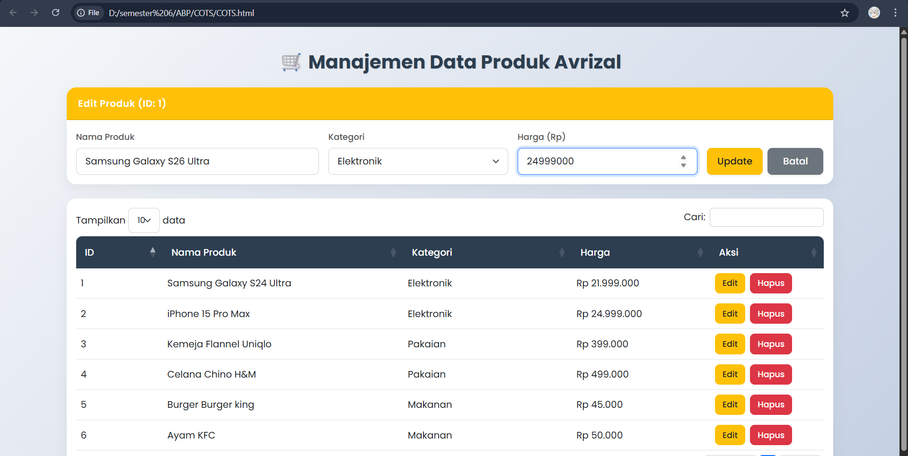
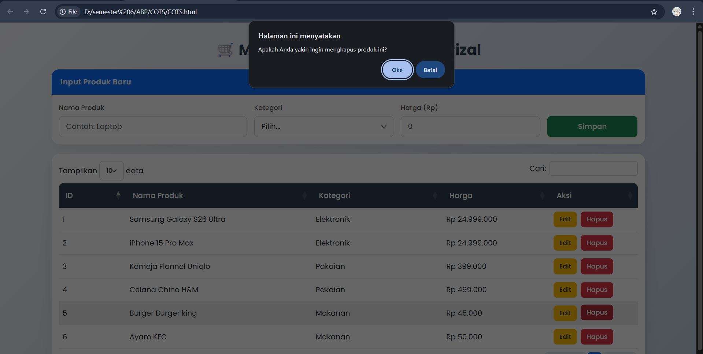
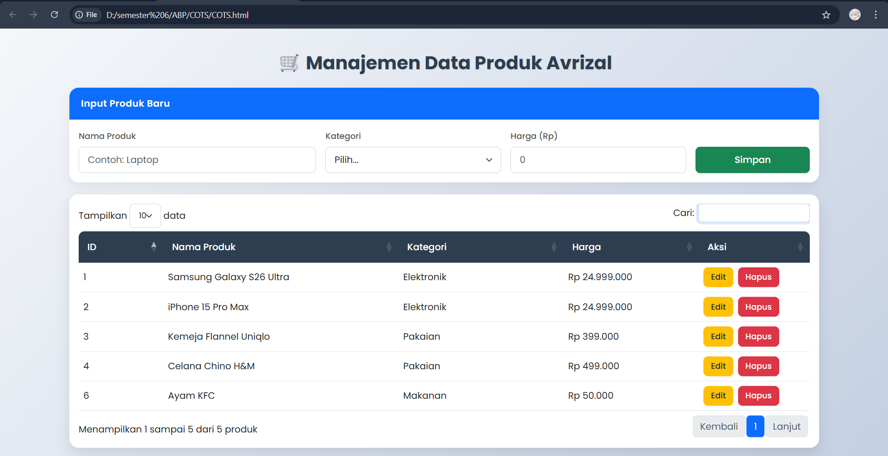

<div align="center">
  <br />
  <h1>LAPORAN PRAKTIKUM <br>APLIKASI BERBASIS PLATFORM</h1>
  <br />
  <h3>DATA PRODUK <br> Bootstrap, jQuery DataTables & JavaScript</h3>
  <br />
  <br />
  
  <br />
  <br />
  <h3>Disusun Oleh :</h3>
  <p>
    <strong>Avrizal Setyo Aji Nugroho</strong><br>
    <strong>2311102145</strong><br>
    <strong>S1 IF-11-01</strong>
  </p>
  <br />
  <br />
  <h3>Dosen Pengampu :</h3>
  <p>
    <strong>Dimas Fanny Hebrasianto Permadi, S.ST., M.Kom</strong>
  </p>
  <br />
  <br />
  <h4>Asisten Praktikum :</h4>
  <strong>Apri Pandu Wicaksono</strong> <br>
  <strong>Rangga Pradarrell Fathi</strong>
  <br />
  <h3>LABORATORIUM HIGH PERFORMANCE
 <br>FAKULTAS INFORMATIKA <br>UNIVERSITAS TELKOM PURWOKERTO <br>2026</h3>
</div>

---

## 1. Dasar Teori

Aplikasi ini dibangun menggunakan beberapa konsep dan teknologi inti berikut:

- **CRUD (Create, Read, Update, Delete)**
  Merupakan empat operasi pilar dalam manajemen data. Pada proyek ini, seluruh proses manipulasi data dieksekusi secara mandiri di sisi klien (_client-side_) menggunakan JavaScript. Hal ini memungkinkan aplikasi untuk menambah, membaca, memperbarui, dan menghapus data secara instan tanpa memerlukan komunikasi berulang dengan _server_ atau _database_ eksternal.

- **Bootstrap**
  _Framework_ CSS _open-source_ yang digunakan untuk mempercepat pengembangan antarmuka pengguna (UI). Dengan memanfaatkan komponen bawaan seperti sistem _grid_, form, dan tombol, tampilan aplikasi menjadi lebih rapi, modern, serta responsif secara otomatis di berbagai ukuran perangkat.

- **jQuery DataTables**
  _Plugin_ JavaScript andalan untuk memanipulasi tabel HTML statis menjadi tabel data tingkat lanjut. Implementasi _plugin_ ini secara otomatis menyematkan fitur pencarian (_search_), pengurutan kolom (_sorting_), dan penomoran halaman (_pagination_) hanya dengan konfigurasi singkat.

- **Object Mapping (In-Memory Storage)**
  Teknik pengelolaan data menggunakan struktur objek JavaScript (berbasis _key-value pair_). Data produk disimpan menggunakan ID sebagai _key_ (contoh: `{ "1": { id, nama, kategori, harga } }`). Pendekatan ini sangat efisien dengan kompleksitas waktu **O(1)**, di mana pencarian, pembaruan, dan penghapusan data dapat dilakukan seketika dengan merujuk langsung pada ID-nya tanpa harus menelusuri keseluruhan array data.

---

## 2. Penjelasan Kode HTML, CSS, dan JS

---

### Kode HTML (`COTS.html`)

```html
<!DOCTYPE html>
<html lang="id">
  <head>
    <meta charset="UTF-8" />
    <meta name="viewport" content="width=device-width, initial-scale=1.0" />
    <title>Manajemen Produk - COTS</title>

    <link
      href="https://cdn.jsdelivr.net/npm/bootstrap@5.3.0/dist/css/bootstrap.min.css"
      rel="stylesheet"
    />
    <link
      href="https://cdn.datatables.net/1.13.6/css/dataTables.bootstrap5.min.css"
      rel="stylesheet"
    />

    <link rel="stylesheet" href="style.css" />
  </head>

  <body>
    <div class="container main-wrapper">
      <h2 class="text-center page-title mb-4">
        🛒 Manajemen Data Produk Avrizal
      </h2>

      <div class="card mb-4">
        <div class="card-header bg-primary text-white" id="formTitle">
          Input Produk Baru
        </div>
        <div class="card-body">
          <form id="formProduk" class="row g-3">
            <input type="hidden" id="editId" />

            <div class="col-md-4">
              <label class="form-label">Nama Produk</label>
              <input
                type="text"
                id="namaProduk"
                class="form-control"
                placeholder="Contoh: Laptop"
                required
              />
            </div>
            <div class="col-md-3">
              <label class="form-label">Kategori</label>
              <select id="kategori" class="form-select" required>
                <option value="">Pilih...</option>
                <option value="Elektronik">Elektronik</option>
                <option value="Pakaian">Pakaian</option>
                <option value="Makanan">Makanan</option>
              </select>
            </div>
            <div class="col-md-3">
              <label class="form-label">Harga (Rp)</label>
              <input
                type="number"
                id="harga"
                class="form-control"
                placeholder="0"
                required
              />
            </div>
            <div class="col-md-2 d-flex align-items-end gap-2">
              <button
                type="submit"
                id="btnSubmit"
                class="btn btn-success w-100 shadow-sm"
              >
                Simpan
              </button>
              <button
                type="button"
                id="btnCancel"
                class="btn btn-secondary w-100 shadow-sm d-none"
                onclick="batalEdit()"
              >
                Batal
              </button>
            </div>
          </form>
        </div>
      </div>

      <div class="card table-container">
        <div class="card-body">
          <div class="table-responsive">
            <table
              id="tabelProduk"
              class="table table-hover w-100 align-middle"
            >
              <thead>
                <tr>
                  <th>ID</th>
                  <th>Nama Produk</th>
                  <th>Kategori</th>
                  <th>Harga</th>
                  <th>Aksi</th>
                </tr>
              </thead>
              <tbody id="isiTabel"></tbody>
            </table>
          </div>
        </div>
      </div>
    </div>

    <script src="https://code.jquery.com/jquery-3.7.0.min.js"></script>
    <script src="https://cdn.datatables.net/1.13.6/js/jquery.dataTables.min.js"></script>
    <script src="https://cdn.datatables.net/1.13.6/js/dataTables.bootstrap5.min.js"></script>

    <script src="COTS.js"></script>
  </body>
</html>
```

---

### Kode CSS (`style.css`)

```css
@import url("https://fonts.googleapis.com/css2?family=Poppins:wght@300;400;500;600;700&display=swap");

body {
  background: linear-gradient(135deg, #f5f7fa 0%, #c3cfe2 100%);
  min-height: 100vh;
  font-family: "Poppins", sans-serif;
  color: #333;
}

.main-wrapper {
  padding-top: 40px;
  padding-bottom: 40px;
}

.page-title {
  font-weight: 700;
  color: #2c3e50;
  text-shadow: 1px 1px 2px rgba(0, 0, 0, 0.1);
}

.card {
  border: none;
  border-radius: 16px;
  box-shadow: 0 8px 20px rgba(0, 0, 0, 0.06);
  transition:
    transform 0.3s ease,
    box-shadow 0.3s ease;
}

.card:hover {
  transform: translateY(-3px);
  box-shadow: 0 12px 25px rgba(0, 0, 0, 0.1);
}

.card-header {
  border-top-left-radius: 16px !important;
  border-top-right-radius: 16px !important;
  font-weight: 600;
  letter-spacing: 0.5px;
  padding: 15px 20px;
}

.form-label {
  font-weight: 500;
  font-size: 0.9rem;
  color: #555;
}

.form-control,
.form-select {
  border-radius: 8px;
  padding: 10px 15px;
  border: 1px solid #ced4da;
  transition: all 0.3s ease;
}

.form-control:focus,
.form-select:focus {
  border-color: #0d6efd;
  box-shadow: 0 0 0 0.25rem rgba(13, 110, 253, 0.15);
}

.btn {
  border-radius: 8px;
  font-weight: 500;
  padding: 10px 15px;
  transition: all 0.2s;
}

.btn:hover {
  transform: translateY(-2px);
}

.btn-sm {
  padding: 6px 12px;
}

.table-container {
  margin-top: 20px;
}

#tabelProduk thead th {
  background-color: #2c3e50;
  color: #ffffff;
  font-weight: 500;
  border-bottom: none;
  padding: 15px;
}

#tabelProduk thead th:first-child {
  border-top-left-radius: 10px;
}

#tabelProduk thead th:last-child {
  border-top-right-radius: 10px;
}

.dataTables_wrapper .dataTables_filter input {
  border-radius: 6px;
  padding: 5px 10px;
  border: 1px solid #ccc;
  margin-left: 10px;
}

.page-item.active .page-link {
  background-color: #0d6efd;
  border-color: #0d6efd;
  border-radius: 6px;
}

.page-link {
  border-radius: 6px;
  margin: 0 3px;
  color: #2c3e50;
  box-shadow: none !important;
}
```

---

### Kode JavaScript (`COTS.js`)

```javascript
$(document).ready(function () {
  let table = $("#tabelProduk").DataTable({
    language: {
      search: "Cari:",
      lengthMenu: "Tampilkan _MENU_ data",
      info: "Menampilkan _START_ sampai _END_ dari _TOTAL_ produk",
      paginate: { next: "Lanjut", previous: "Kembali" },
      emptyTable: "Belum ada produk yang ditambahkan.",
    },
  });

  let produkMap = {};
  let counter = 1;

  $("#formProduk").on("submit", function (e) {
    e.preventDefault();

    let editId = $("#editId").val();
    let nama = $("#namaProduk").val();
    let kategori = $("#kategori").val();
    let harga = $("#harga").val();
    let hargaFormat = `Rp ${parseInt(harga).toLocaleString("id-ID")}`;

    let aksiButtons = function (idTarget) {
      return `
            <button type="button" class="btn btn-warning btn-sm me-1 text-dark" onclick="editProduk(${idTarget})">Edit</button>
            <button type="button" class="btn btn-danger btn-sm" onclick="hapusProduk(${idTarget}, this)">Hapus</button>
        `;
    };

    if (editId === "") {
      let id = counter++;
      produkMap[id] = { id, nama, kategori, harga };

      let rowNode = table.row
        .add([id, nama, kategori, hargaFormat, aksiButtons(id)])
        .draw(false)
        .node();
      $(rowNode).attr("id", "row-" + id);
    } else {
      produkMap[editId] = { id: parseInt(editId), nama, kategori, harga };

      table
        .row("#row-" + editId)
        .data([editId, nama, kategori, hargaFormat, aksiButtons(editId)])
        .draw(false);

      batalEdit();
      alert("Data berhasil diperbarui!");
    }

    if (editId === "") this.reset();
  });

  window.editProduk = function (id) {
    let data = produkMap[id];

    $("#editId").val(data.id);
    $("#namaProduk").val(data.nama);
    $("#kategori").val(data.kategori);
    $("#harga").val(data.harga);

    $("#formTitle")
      .text("Edit Produk (ID: " + data.id + ")")
      .removeClass("bg-primary")
      .addClass("bg-warning text-dark");
    $("#btnSubmit")
      .text("Update")
      .removeClass("btn-success")
      .addClass("btn-warning text-dark");
    $("#btnCancel").removeClass("d-none");

    window.scrollTo({ top: 0, behavior: "smooth" });
  };

  window.batalEdit = function () {
    $("#formProduk")[0].reset();
    $("#editId").val("");
    $("#formTitle")
      .text("Input Produk Baru")
      .removeClass("bg-warning text-dark")
      .addClass("bg-primary text-white");
    $("#btnSubmit")
      .text("Simpan")
      .removeClass("btn-warning text-dark")
      .addClass("btn-success");
    $("#btnCancel").addClass("d-none");
  };

  window.hapusProduk = function (id, btn) {
    if (confirm("Apakah Anda yakin ingin menghapus produk ini?")) {
      delete produkMap[id];
      table.row($(btn).parents("tr")).remove().draw();
      if ($("#editId").val() == id) batalEdit();
    }
  };
});
```

---

### Hasil Tampilan (Screenshot)

#### 1. Tampilan Awal Halaman



#### 2. Input Data & Data Berhasil Ditambahkan



#### 3. Fitur Pencarian (Search)




#### 4. Edit Data

Mengedit Samsung S24 ke Samsung S26 beserta harganya


#### 5. Hapus Data

Menghapus Burger Burger king



---

### Penjelasan Kode

# Penjelasan Kode: Sistem Manajemen Data Produk Avrizal

Aplikasi ini adalah sistem manajemen produk berbasis web sederhana (Single Page Application) untuk mendata stok barang. Aplikasi ini sudah dilengkapi fitur CRUD (Create, Read, Update, Delete) yang berjalan secara _in-memory_ di sisi klien (browser) menggunakan HTML, CSS, JavaScript (jQuery), dan DataTables.

## 1. Struktur Halaman (`COTS.html`)

Bagian ini mendefinisikan kerangka utama dari antarmuka pengguna.

- **Layout & Framework:** Menggunakan framework Bootstrap 5 untuk memastikan tampilan responsif dan rapi.
- **Formulir Input (Inline):** Menggunakan elemen Card dari Bootstrap untuk membungkus form input di bagian atas halaman (tidak menggunakan pop-up/modal). Formulir ini mencakup isian untuk Nama Produk, Kategori (Elektronik, Pakaian, Makanan), Harga, dan satu input tersembunyi (`editId`) untuk melacak proses _Edit_.
- **Tabel Interaktif:** Terdapat struktur tabel HTML dasar yang sengaja dibiarkan kosong pada bagian badannya (`<tbody id="isiTabel"></tbody>`). Data akan diisi dan dikelola secara dinamis melalui JavaScript dan DataTables.

---

## 2. Tampilan Visual (`style.css`)

Bagian ini mempercantik tampilan bawaan HTML dan Bootstrap.

- **Tema Terang & Modern:** Menggunakan latar belakang gradien cerah (`#f5f7fa` ke `#c3cfe2`) dan _font_ kustom **Poppins** dari Google Fonts agar terlihat lebih modern.
- **Efek Interaktif (Hover):** Elemen _card_ (kartu) diberikan efek bayangan (`box-shadow`) yang akan sedikit terangkat saat kursor diarahkan ke atasnya (`hover`), memberikan kesan dinamis.
- **Kustomisasi Tabel & DataTables:** Mengubah warna _header_ tabel menjadi biru gelap (`#2c3e50`) dengan teks putih. Tampilan form pencarian (Search) dan penomoran halaman (Pagination) bawaan DataTables juga dimodifikasi agar sudutnya lebih membulat (`border-radius`) dan serasi dengan desain keseluruhan.

---

## 3. Logika Program (`COTS.js`)

Ini adalah "otak" dari aplikasi yang mengendalikan semua interaksi data.

### A. Penyimpanan Data Awal

- **In-Memory Storage:** Data disimpan sementara di dalam browser menggunakan _Mapping Object_ bernama `produkMap`. Tidak ada data awal (tabel kosong saat halaman pertama kali dimuat). Aplikasi juga menggunakan variabel `counter` (dimulai dari 1) untuk memberikan ID unik secara berurutan pada setiap produk baru.

### B. Menampilkan Data (Read)

- **Inisialisasi DataTables:** Memanggil `$('#tabelProduk').DataTable(...)` untuk menyulap tabel biasa menjadi tabel dinamis dengan fitur pencarian dan _pagination_. Teks antarmuka DataTables juga telah diatur ke bahasa Indonesia (seperti "Cari:", "Lanjut", "Kembali").

### C. Menambah & Mengedit Data (Create & Update)

Semua proses simpan di- _handle_ oleh satu _event listener_ `$('#formProduk').on('submit')` yang mencegah _refresh_ halaman (`e.preventDefault()`).

- **Tambah Data Baru (Create):** Jika input `editId` kosong, sistem akan mengambil nilai dari `counter`, memasukkan data ke dalam `produkMap`, lalu menambahkan baris baru ke DataTables menggunakan fungsi `table.row.add()`. Baris tersebut juga diberi ID HTML khusus (misal: `row-1`) agar mudah dicari nanti.
- **Mode Edit:** Saat tombol "Edit" di tabel diklik, fungsi `editProduk(id)` dipanggil. Sistem akan mengambil data dari `produkMap` berdasarkan ID, lalu mengisinya ke dalam form. Tampilan form akan berubah (header menjadi kuning/warning) untuk menandakan mode Edit sedang aktif.
- **Simpan Perubahan (Update):** Jika form disubmit dalam keadaan mode Edit (nilai `editId` ada isinya), sistem akan memperbarui data di dalam `produkMap`, kemudian langsung mengganti isi baris di DataTables yang relevan menggunakan fungsi `table.row('#row-' + editId).data(...)` tanpa menambah baris baru. Form kemudian di- _reset_ ke mode awal.

### D. Menghapus Data (Delete)

- Saat tombol "Hapus" diklik, program akan memunculkan peringatan bawaan browser (`confirm()`).
- Jika dikonfirmasi, fungsi `hapusProduk(id)` akan menghapus data tersebut dari `produkMap` dan menghapus barisnya dari DataTables menggunakan `table.row().remove().draw()`. Jika data yang dihapus kebetulan sedang berada dalam mode Edit di form, form akan otomatis dibatalkan/di-reset.

---

## 3. Referensi

- [MDN Web Docs - HTML](https://developer.mozilla.org/en-US/docs/Web/HTML)
- [MDN Web Docs - CSS](https://developer.mozilla.org/en-US/docs/Web/CSS)
- [Bootstrap 5 Documentation](https://getbootstrap.com/docs/5.3/)
- [jQuery DataTables Documentation](https://datatables.net/manual/)
- [jQuery API Documentation](https://api.jquery.com/)
- [MDN Web Docs — JavaScript Array & Object Methods](https://developer.mozilla.org/en-US/docs/Web/JavaScript)
