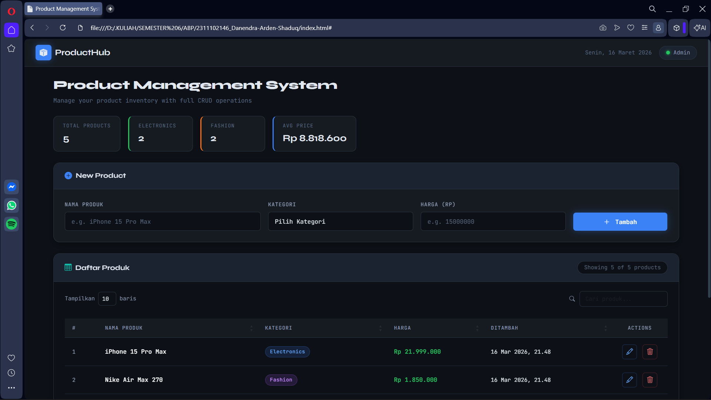
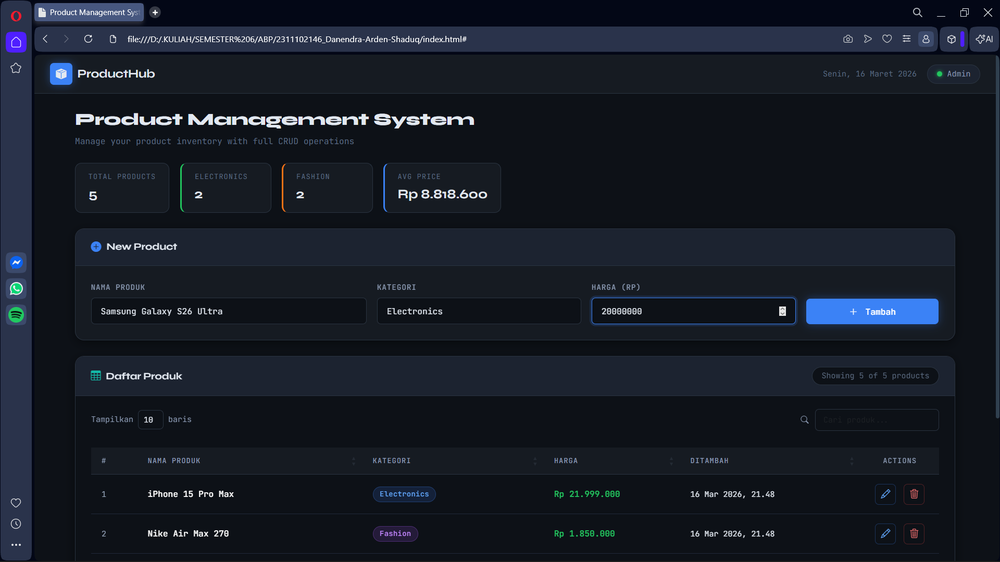
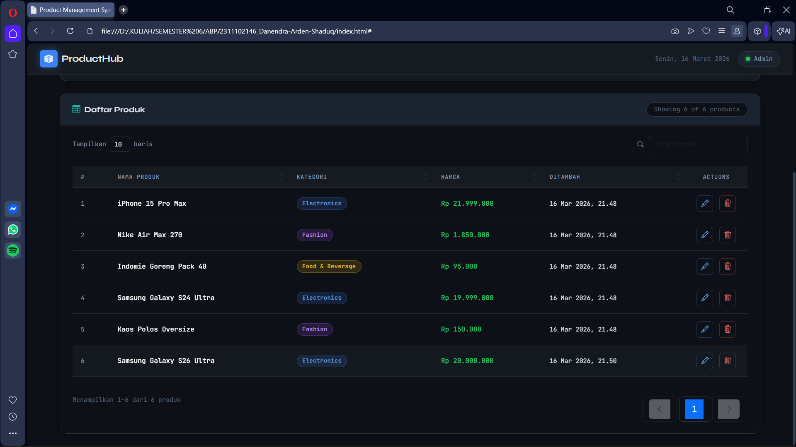
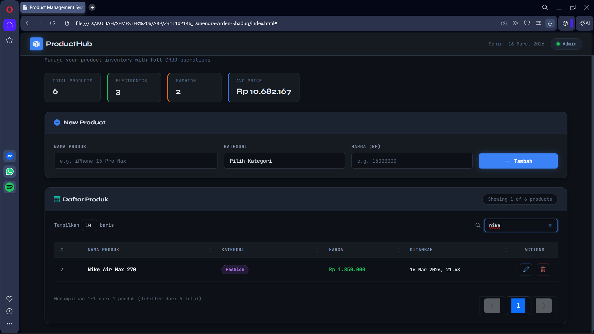
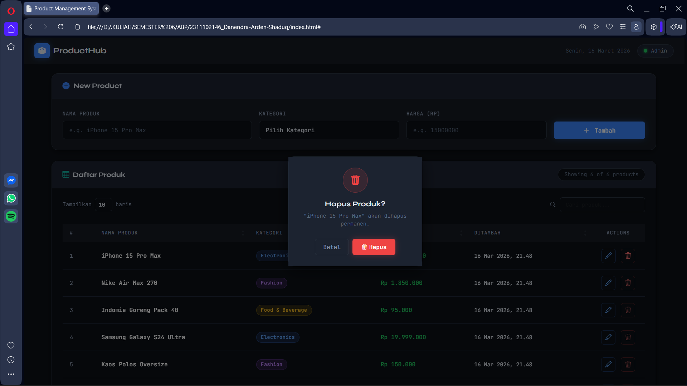
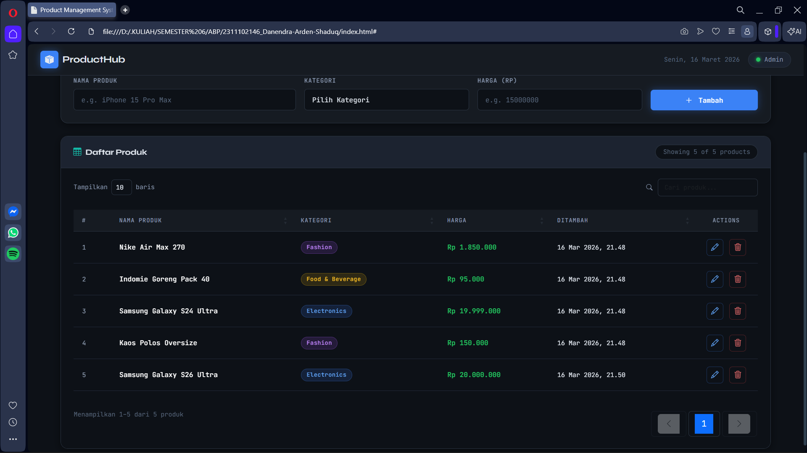
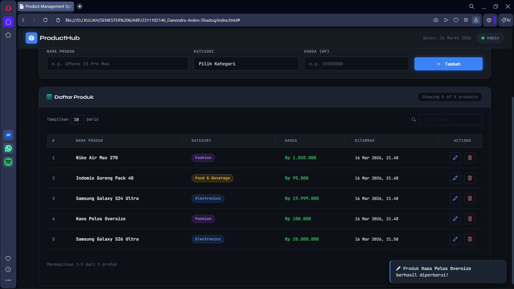

<div align="center">
  <br />
  <h1>LAPORAN PRAKTIKUM <br>APLIKASI BERBASIS PLATFORM</h1>
  <br />
  <h3> TUGAS COTS <br> MANAJEMEN PRODUK </h3>
  <br />
   
  <br />
  <br />
  <br />
  <h3>Disusun Oleh :</h3>
  <p>
    <strong>Danendra Arden Shaduq</strong><br>
    <strong>2311102146</strong><br>
    <strong>S1 IF-11-01</strong>
  </p>
  <br />
  <h3>Dosen Pengampu :</h3>
  <p>
    <strong>Dimas Fanny Hebrasianto Permadi, S.ST., M.Kom</strong>
  </p>
  <br />
  <br />
    <h4>Asisten Praktikum :</h4>
    <strong> Apri Pandu Wicaksono </strong> <br>
    <strong>Rangga Pradarrell Fathi</strong>
  <br />
  <h3>LABORATORIUM HIGH PERFORMANCE
 <br>FAKULTAS INFORMATIKA <br>UNIVERSITAS TELKOM PURWOKERTO <br>2026</h3>
</div>

---

## 1. Dasar Teori

HTML (HyperText Markup Language) merupakan fondasi utama dalam perancangan situs web. Perannya adalah menyusun kerangka dan elemen dasar sebuah halaman. Proses pengembangannya dimulai dengan pembentukan struktur dokumen standar, yang kemudian dilengkapi dengan berbagai komponen seperti teks, citra, serta tautan navigasi untuk menciptakan antarmuka yang utuh.

Bootstrap hadir sebagai kerangka kerja (framework) front-end yang bersifat terbuka (open-source) untuk mempercepat serta menyederhanakan proses desain antarmuka. Diciptakan oleh Mark Otto dan Jacob Thornton dari Twitter, keunggulan utama Bootstrap terletak pada fitur responsivitasnya. Hal ini memungkinkan tampilan web beradaptasi secara otomatis sehingga tetap optimal saat diakses melalui berbagai perangkat, baik ponsel pintar maupun komputer desktop.

Cascading Style Sheets (CSS) berfungsi sebagai bahasa dekoratif yang mempercantik elemen visual pada struktur HTML. CSS mengatur bagaimana setiap elemen ditampilkan di dalam peramban (browser). Secara teknis, CSS bekerja menggunakan selector untuk menentukan target elemen, diikuti oleh blok deklarasi di dalam kurung kurawal yang berisi pasangan properti dan nilai (value). Pengaturan beberapa properti sekaligus dapat dilakukan dengan memisahkannya menggunakan tanda titik koma.

DataTables adalah sebuah plugin berbasis jQuery yang dirancang khusus untuk memperluas kemampuan tabel HTML konvensional. Melalui alat ini, tabel menjadi lebih dinamis dan interaktif karena dilengkapi dengan fitur-fitur canggih seperti sistem pencarian otomatis, pembagian halaman (pagination), pengurutan data (sorting), serta tata letak yang responsif. Integrasi DataTables sangat membantu pengguna dalam mengelola dan menavigasi data dalam jumlah besar dengan lebih mudah.

## 2. Sourcecode
### Kode HTML (`index.html`)
``` HTML
<!DOCTYPE html>
<html lang="id">
<head>
  <meta charset="UTF-8" />
  <meta name="viewport" content="width=device-width, initial-scale=1.0"/>
  <title>Product Management System</title>

  <link href="https://cdn.jsdelivr.net/npm/bootstrap@5.3.2/dist/css/bootstrap.min.css" rel="stylesheet"/>
  <link href="https://cdn.datatables.net/1.13.7/css/dataTables.bootstrap5.min.css" rel="stylesheet"/>
  <link href="https://cdn.jsdelivr.net/npm/bootstrap-icons@1.11.3/font/bootstrap-icons.min.css" rel="stylesheet"/>
  <link href="https://fonts.googleapis.com/css2?family=JetBrains+Mono:wght@400;500;600&family=Syne:wght@400;500;600;700;800&display=swap" rel="stylesheet"/>
  <link rel="stylesheet" href="style.css"/>
</head>
<body>

  <div class="app-wrapper">

    <nav class="top-nav d-flex align-items-center justify-content-between px-4">
      <div class="nav-brand d-flex align-items-center gap-2">
        <span class="brand-icon"><i class="bi bi-box-seam-fill"></i></span>
        <span class="brand-name">ProductHub</span>
      </div>
      <div class="nav-meta d-flex align-items-center gap-3">
        <span class="nav-date" id="navDate"></span>
        <div class="avatar-pill d-flex align-items-center gap-2">
          <div class="avatar-dot"></div>
          <span>Admin</span>
        </div>
      </div>
    </nav>

    <main class="main-content px-4 py-4">

      <div class="page-header mb-4">
        <h1 class="page-title">Product Management System</h1>
        <p class="page-subtitle">Manage your product inventory with full CRUD operations</p>
      </div>

      <div class="stats-bar d-flex gap-3 mb-4 flex-wrap">
        <div class="stat-card">
          <span class="stat-label">Total Products</span>
          <span class="stat-value" id="statTotal">0</span>
        </div>
        <div class="stat-card stat-green">
          <span class="stat-label">Electronics</span>
          <span class="stat-value" id="statElec">0</span>
        </div>
        <div class="stat-card stat-orange">
          <span class="stat-label">Fashion</span>
          <span class="stat-value" id="statFashion">0</span>
        </div>
        <div class="stat-card stat-blue">
          <span class="stat-label">Avg Price</span>
          <span class="stat-value" id="statAvg">Rp 0</span>
        </div>
      </div>

      <div class="form-card mb-4">
        <div class="form-card-header d-flex align-items-center justify-content-between">
          <div class="d-flex align-items-center gap-2">
            <span class="form-card-icon"><i class="bi bi-plus-circle-fill"></i></span>
            <span class="form-card-title" id="formTitle">New Product</span>
          </div>
          <button class="btn-reset-form" id="btnCancelEdit" style="display:none;" onclick="cancelEdit()">
            <i class="bi bi-x-circle"></i> Cancel Edit
          </button>
        </div>

        <div class="form-card-body">
          <div class="row g-3">
            <div class="col-md-4">
              <label class="form-label-custom" for="inputNama">Nama Produk</label>
              <input type="text" class="input-custom" id="inputNama" placeholder="e.g. iPhone 15 Pro Max"/>
            </div>
            <div class="col-md-3">
              <label class="form-label-custom" for="inputKategori">Kategori</label>
              <select class="input-custom" id="inputKategori">
                <option value="" disabled selected>Pilih Kategori</option>
                <option value="Electronics">Electronics</option>
                <option value="Fashion">Fashion</option>
                <option value="Food & Beverage">Food & Beverage</option>
                <option value="Home & Living">Home & Living</option>
                <option value="Sports">Sports</option>
                <option value="Beauty">Beauty</option>
                <option value="Automotive">Automotive</option>
                <option value="Books">Books</option>
              </select>
            </div>
            <div class="col-md-3">
              <label class="form-label-custom" for="inputHarga">Harga (Rp)</label>
              <input type="number" class="input-custom" id="inputHarga" placeholder="e.g. 15000000" min="0"/>
            </div>
            <div class="col-md-2 d-flex align-items-end">
              <button class="btn-submit w-100" id="btnSubmit" onclick="submitProduct()">
                <i class="bi bi-plus-lg me-1"></i> Tambah
              </button>
            </div>
          </div>
          <div id="formAlert" class="form-alert" style="display:none;"></div>
        </div>
      </div>

      <div class="table-card">
        <div class="table-card-header d-flex align-items-center justify-content-between flex-wrap gap-2">
          <div class="d-flex align-items-center gap-2">
            <span class="table-card-icon"><i class="bi bi-table"></i></span>
            <span class="table-card-title">Daftar Produk</span>
          </div>
          <div class="table-meta" id="tableCount">Showing 0 products</div>
        </div>

        <div class="table-card-body">
          <div class="table-responsive">
            <table id="productTable" class="table table-hover align-middle w-100">
              <thead>
                <tr>
                  <th>#</th>
                  <th>Nama Produk</th>
                  <th>Kategori</th>
                  <th>Harga</th>
                  <th>Tanggal Ditambah</th>
                  <th class="text-center">Actions</th>
                </tr>
              </thead>
              <tbody id="tableBody">
              </tbody>
            </table>
          </div>
        </div>
      </div>

    </main>
  </div>

  <div class="modal fade" id="editModal" tabindex="-1" aria-hidden="true">
    <div class="modal-dialog modal-dialog-centered">
      <div class="modal-content modal-custom">
        <div class="modal-header modal-header-custom">
          <h5 class="modal-title-custom"><i class="bi bi-pencil-square me-2"></i>Edit Produk</h5>
          <button type="button" class="btn-close-custom" data-bs-dismiss="modal"><i class="bi bi-x-lg"></i></button>
        </div>
        <div class="modal-body modal-body-custom">
          <input type="hidden" id="editId"/>
          <div class="mb-3">
            <label class="form-label-custom" for="editNama">Nama Produk</label>
            <input type="text" class="input-custom" id="editNama"/>
          </div>
          <div class="mb-3">
            <label class="form-label-custom" for="editKategori">Kategori</label>
            <select class="input-custom" id="editKategori">
              <option value="Electronics">Electronics</option>
              <option value="Fashion">Fashion</option>
              <option value="Food & Beverage">Food & Beverage</option>
              <option value="Home & Living">Home & Living</option>
              <option value="Sports">Sports</option>
              <option value="Beauty">Beauty</option>
              <option value="Automotive">Automotive</option>
              <option value="Books">Books</option>
            </select>
          </div>
          <div class="mb-3">
            <label class="form-label-custom" for="editHarga">Harga (Rp)</label>
            <input type="number" class="input-custom" id="editHarga" min="0"/>
          </div>
        </div>
        <div class="modal-footer modal-footer-custom">
          <button class="btn-cancel-modal" data-bs-dismiss="modal">Batal</button>
          <button class="btn-save-modal" onclick="saveEdit()"><i class="bi bi-check-lg me-1"></i>Simpan Perubahan</button>
        </div>
      </div>
    </div>
  </div>

  <div class="modal fade" id="deleteModal" tabindex="-1" aria-hidden="true">
    <div class="modal-dialog modal-dialog-centered modal-sm">
      <div class="modal-content modal-custom">
        <div class="modal-body modal-body-custom text-center py-4">
          <div class="delete-icon-wrap mb-3"><i class="bi bi-trash3-fill"></i></div>
          <h5 class="modal-delete-title">Hapus Produk?</h5>
          <p class="modal-delete-sub" id="deleteProductName">Tindakan ini tidak dapat dibatalkan.</p>
          <input type="hidden" id="deleteId"/>
          <div class="d-flex gap-2 justify-content-center mt-4">
            <button class="btn-cancel-modal" data-bs-dismiss="modal">Batal</button>
            <button class="btn-delete-confirm" onclick="confirmDelete()"><i class="bi bi-trash3 me-1"></i>Hapus</button>
          </div>
        </div>
      </div>
    </div>
  </div>

  <div class="toast-container position-fixed bottom-0 end-0 p-3">
    <div id="appToast" class="toast toast-custom align-items-center" role="alert" aria-live="assertive" aria-atomic="true">
      <div class="d-flex">
        <div class="toast-body" id="toastBody">
          <i class="bi bi-check-circle-fill me-2"></i> Berhasil!
        </div>
        <button type="button" class="btn-close btn-close-custom ms-auto me-2" data-bs-dismiss="toast" aria-label="Close"></button>
      </div>
    </div>
  </div>

  <script src="https://code.jquery.com/jquery-3.7.1.min.js"></script>
  <script src="https://cdn.jsdelivr.net/npm/bootstrap@5.3.2/dist/js/bootstrap.bundle.min.js"></script>
  <script src="https://cdn.datatables.net/1.13.7/js/jquery.dataTables.min.js"></script>
  <script src="https://cdn.datatables.net/1.13.7/js/dataTables.bootstrap5.min.js"></script>
  <script src="script.js"></script>
</body>
</html>
```
### Kode CSS (`style.css`)

```css
:root {
  --bg-base: #0d1117;
  --bg-surface: #161b22;
  --bg-elevated: #1c2330;
  --bg-hover: #21293a;
  --border: #2a3441;
  --border-light: #30404f;
  --text-primary: #e2e8f0;
  --text-secondary: #8b9ab3;
  --text-muted: #5a6a80;
  --accent-blue: #3b82f6;
  --accent-blue-dim: #1d4ed8;
  --accent-green: #22c55e;
  --accent-orange: #f97316;
  --accent-red: #ef4444;
  --accent-yellow: #eab308;
  --accent-purple: #a855f7;
  --accent-teal: #14b8a6;
  --radius-sm: 6px;
  --radius-md: 10px;
  --radius-lg: 14px;
  --radius-xl: 20px;
  --font-heading: 'Syne', sans-serif;
  --font-mono: 'JetBrains Mono', monospace;
  --shadow-sm: 0 1px 3px rgba(0,0,0,0.4);
  --shadow-md: 0 4px 16px rgba(0,0,0,0.45);
  --shadow-lg: 0 8px 32px rgba(0,0,0,0.55);
}

*, *::before, *::after { box-sizing: border-box; margin: 0; padding: 0; }

html { scroll-behavior: smooth; }

body {
  background: var(--bg-base);
  color: var(--text-primary);
  font-family: var(--font-mono);
  font-size: 13.5px;
  min-height: 100vh;
  -webkit-font-smoothing: antialiased;
}

.top-nav {
  background: var(--bg-surface);
  border-bottom: 1px solid var(--border);
  height: 60px;
  position: sticky;
  top: 0;
  z-index: 100;
  backdrop-filter: blur(8px);
}

.brand-icon {
  display: inline-flex;
  align-items: center;
  justify-content: center;
  width: 34px; height: 34px;
  background: var(--accent-blue);
  border-radius: var(--radius-sm);
  font-size: 16px;
  box-shadow: 0 0 14px rgba(59,130,246,0.4);
}

.brand-name {
  font-family: var(--font-heading);
  font-size: 18px;
  font-weight: 700;
  color: var(--text-primary);
  letter-spacing: -0.3px;
}

.nav-date {
  font-size: 12px;
  color: var(--text-muted);
}

.avatar-pill {
  background: var(--bg-elevated);
  border: 1px solid var(--border);
  border-radius: 999px;
  padding: 5px 14px;
  font-size: 12px;
  color: var(--text-secondary);
}

.avatar-dot {
  width: 8px; height: 8px;
  border-radius: 50%;
  background: var(--accent-green);
  box-shadow: 0 0 6px var(--accent-green);
}

.app-wrapper { display: flex; flex-direction: column; min-height: 100vh; }
.main-content { flex: 1; max-width: 1400px; width: 100%; margin: 0 auto; }

.page-title {
  font-family: var(--font-heading);
  font-size: 26px;
  font-weight: 800;
  color: var(--text-primary);
  letter-spacing: -0.5px;
}

.page-subtitle {
  color: var(--text-muted);
  font-size: 13px;
  margin-top: 4px;
}

.stat-card {
  background: var(--bg-surface);
  border: 1px solid var(--border);
  border-radius: var(--radius-md);
  padding: 12px 20px;
  display: flex;
  flex-direction: column;
  gap: 4px;
  min-width: 140px;
  transition: border-color 0.2s, transform 0.2s;
}

.stat-card:hover {
  border-color: var(--accent-blue);
  transform: translateY(-2px);
}

.stat-card.stat-green  { border-left: 3px solid var(--accent-green); }
.stat-card.stat-orange { border-left: 3px solid var(--accent-orange); }
.stat-card.stat-blue   { border-left: 3px solid var(--accent-blue); }

.stat-label {
  font-size: 11px;
  color: var(--text-muted);
  text-transform: uppercase;
  letter-spacing: 0.8px;
}

.stat-value {
  font-family: var(--font-heading);
  font-size: 20px;
  font-weight: 700;
  color: var(--text-primary);
}

.form-card {
  background: var(--bg-surface);
  border: 1px solid var(--border);
  border-radius: var(--radius-lg);
  overflow: hidden;
  box-shadow: var(--shadow-md);
}

.form-card-header {
  padding: 16px 24px;
  border-bottom: 1px solid var(--border);
  background: var(--bg-elevated);
}

.form-card-icon {
  color: var(--accent-blue);
  font-size: 16px;
}

.form-card-title {
  font-family: var(--font-heading);
  font-size: 15px;
  font-weight: 700;
  color: var(--text-primary);
}

.form-card-body {
  padding: 24px;
}

.form-label-custom {
  display: block;
  font-size: 11.5px;
  font-weight: 500;
  color: var(--text-secondary);
  text-transform: uppercase;
  letter-spacing: 0.7px;
  margin-bottom: 8px;
}

.input-custom {
  width: 100%;
  background: var(--bg-base);
  border: 1px solid var(--border);
  border-radius: var(--radius-sm);
  color: var(--text-primary);
  font-family: var(--font-mono);
  font-size: 13px;
  padding: 10px 14px;
  outline: none;
  transition: border-color 0.2s, box-shadow 0.2s;
  appearance: none;
}

.input-custom:focus {
  border-color: var(--accent-blue);
  box-shadow: 0 0 0 3px rgba(59,130,246,0.18);
}

.input-custom::placeholder { color: var(--text-muted); }

.input-custom option {
  background: var(--bg-elevated);
  color: var(--text-primary);
}

.btn-submit {
  background: var(--accent-blue);
  border: none;
  border-radius: var(--radius-sm);
  color: #fff;
  font-family: var(--font-mono);
  font-size: 13px;
  font-weight: 600;
  padding: 10px 20px;
  cursor: pointer;
  transition: background 0.2s, transform 0.15s, box-shadow 0.2s;
  box-shadow: 0 0 14px rgba(59,130,246,0.35);
}

.btn-submit:hover {
  background: #2563eb;
  transform: translateY(-1px);
  box-shadow: 0 0 20px rgba(59,130,246,0.5);
}

.btn-submit:active { transform: translateY(0); }

.btn-reset-form {
  background: transparent;
  border: 1px solid var(--border);
  border-radius: var(--radius-sm);
  color: var(--text-muted);
  font-family: var(--font-mono);
  font-size: 12px;
  padding: 6px 14px;
  cursor: pointer;
  transition: all 0.2s;
}

.btn-reset-form:hover {
  border-color: var(--accent-orange);
  color: var(--accent-orange);
}

.form-alert {
  margin-top: 14px;
  padding: 10px 16px;
  border-radius: var(--radius-sm);
  font-size: 13px;
  border-left: 3px solid var(--accent-red);
  background: rgba(239,68,68,0.08);
  color: #fca5a5;
}

.table-card {
  background: #0d1117;
  border: 1px solid var(--border);
  border-radius: var(--radius-lg);
  overflow: hidden;
  box-shadow: var(--shadow-md);
}

.table-card-header {
  padding: 16px 24px;
  border-bottom: 1px solid var(--border);
  background: var(--bg-elevated);
}

.table-card-icon { color: var(--accent-teal); font-size: 15px; }

.table-card-title {
  font-family: var(--font-heading);
  font-size: 15px;
  font-weight: 700;
  color: var(--text-primary);
}

.table-meta {
  font-size: 12px;
  color: var(--text-muted);
  background: var(--bg-base);
  border: 1px solid var(--border);
  border-radius: 999px;
  padding: 4px 14px;
}

.table-card-body { padding: 0; background: #0d1117; }

#productTable {
  border-collapse: separate;
  border-spacing: 0;
  width: 100% !important;
}

#productTable thead tr th {
  background: #161b22 !important;
  border-bottom: 1px solid var(--border) !important;
  border-top: none !important;
  color: #8b9ab3;
  font-family: var(--font-mono);
  font-size: 11px;
  font-weight: 500;
  text-transform: uppercase;
  letter-spacing: 0.8px;
  padding: 12px 16px;
  white-space: nowrap;
}

#productTable tbody tr {
  background: #0d1117 !important;
  border-bottom: 1px solid #21293a !important;
  transition: background 0.15s;
}

#productTable tbody tr:hover {
  background: #161b22 !important;
}

#productTable tbody tr:last-child { border-bottom: none !important; }

#productTable tbody td {
  background: transparent !important;
  border-top: none !important;
  border-bottom: 1px solid #21293a !important;
  color: #e2e8f0 !important;
  font-size: 13px;
  padding: 14px 16px;
  vertical-align: middle;
}

#productTable, .table, .table > :not(caption) > * > * {
  background-color: transparent !important;
  --bs-table-bg: transparent !important;
  --bs-table-striped-bg: transparent !important;
  --bs-table-hover-bg: #161b22 !important;
  --bs-table-color: #e2e8f0 !important;
}

.row-num {
  color: #94a3b8;
  font-size: 12px;
}

.prod-name {
  font-weight: 500;
  color: #ffffff;
}

.cat-badge {
  display: inline-block;
  padding: 3px 10px;
  border-radius: 999px;
  font-size: 11px;
  font-weight: 500;
  letter-spacing: 0.3px;
}

.cat-Electronics   { background: rgba(59,130,246,0.15);  color: #60a5fa; border: 1px solid rgba(59,130,246,0.3); }
.cat-Fashion       { background: rgba(168,85,247,0.15);  color: #c084fc; border: 1px solid rgba(168,85,247,0.3); }
.cat-Food          { background: rgba(234,179,8,0.15);   color: #fbbf24; border: 1px solid rgba(234,179,8,0.3); }
.cat-Home          { background: rgba(20,184,166,0.15);  color: #2dd4bf; border: 1px solid rgba(20,184,166,0.3); }
.cat-Sports        { background: rgba(34,197,94,0.15);   color: #4ade80; border: 1px solid rgba(34,197,94,0.3); }
.cat-Beauty        { background: rgba(244,114,182,0.15); color: #f472b6; border: 1px solid rgba(244,114,182,0.3); }
.cat-Automotive    { background: rgba(249,115,22,0.15);  color: #fb923c; border: 1px solid rgba(249,115,22,0.3); }
.cat-Books         { background: rgba(148,163,184,0.12); color: #94a3b8; border: 1px solid rgba(148,163,184,0.25); }

.price-val {
  font-weight: 600;
  color: var(--accent-green);
  font-size: 13px;
}

.date-val {
  color: #e2e8f0;
  font-size: 12px;
}

.btn-action {
  display: inline-flex;
  align-items: center;
  justify-content: center;
  width: 32px; height: 32px;
  border-radius: var(--radius-sm);
  border: 1px solid transparent;
  cursor: pointer;
  font-size: 14px;
  transition: all 0.18s;
  background: transparent;
}

.btn-edit {
  color: #60a5fa;
  border-color: rgba(59,130,246,0.3);
}

.btn-edit:hover {
  background: rgba(59,130,246,0.15);
  border-color: var(--accent-blue);
  color: #93c5fd;
}

.btn-delete {
  color: #f87171;
  border-color: rgba(239,68,68,0.3);
}

.btn-delete:hover {
  background: rgba(239,68,68,0.15);
  border-color: var(--accent-red);
  color: #fca5a5;
}

.empty-state {
  text-align: center;
  padding: 60px 20px;
  color: var(--text-muted);
}

.empty-state i { font-size: 40px; margin-bottom: 12px; display: block; }
.empty-state p { font-size: 13px; }

.dataTables_wrapper {
  background: #0d1117;
  padding: 20px 24px;
}

.dataTables_wrapper .row:first-child {
  background: #0d1117;
  padding-bottom: 4px;
}

.dataTables_wrapper .dataTables_filter input {
  background: var(--bg-base) !important;
  border: 1px solid var(--border) !important;
  border-radius: var(--radius-sm) !important;
  color: var(--text-primary) !important;
  font-family: var(--font-mono) !important;
  font-size: 12px !important;
  padding: 7px 12px !important;
  outline: none !important;
  transition: border-color 0.2s !important;
}

.dataTables_wrapper .dataTables_filter input:focus {
  border-color: var(--accent-blue) !important;
  box-shadow: 0 0 0 3px rgba(59,130,246,0.15) !important;
}

.dataTables_wrapper .dataTables_filter label {
  color: var(--text-secondary) !important;
  font-size: 12px !important;
}

.dataTables_wrapper .dataTables_length select {
  background: var(--bg-base) !important;
  border: 1px solid var(--border) !important;
  border-radius: var(--radius-sm) !important;
  color: var(--text-primary) !important;
  font-family: var(--font-mono) !important;
  font-size: 12px !important;
  padding: 5px 8px !important;
  outline: none !important;
}

.dataTables_wrapper .dataTables_length label {
  color: var(--text-secondary) !important;
  font-size: 12px !important;
}

.dataTables_wrapper .dataTables_info {
  color: var(--text-muted) !important;
  font-size: 12px !important;
  padding-top: 14px !important;
}

.dataTables_wrapper .dataTables_paginate { padding-top: 14px !important; }

.dataTables_wrapper .dataTables_paginate .paginate_button {
  background: transparent !important;
  border: 1px solid var(--border) !important;
  border-radius: var(--radius-sm) !important;
  color: var(--text-secondary) !important;
  font-family: var(--font-mono) !important;
  font-size: 12px !important;
  margin: 0 2px !important;
  padding: 5px 12px !important;
  cursor: pointer !important;
  transition: all 0.18s !important;
}

.dataTables_wrapper .dataTables_paginate .paginate_button:hover {
  background: var(--bg-hover) !important;
  border-color: var(--accent-blue) !important;
  color: var(--text-primary) !important;
}

.dataTables_wrapper .dataTables_paginate .paginate_button.current,
.dataTables_wrapper .dataTables_paginate .paginate_button.current:hover {
  background: var(--accent-blue) !important;
  border-color: var(--accent-blue) !important;
  color: #fff !important;
  box-shadow: 0 0 10px rgba(59,130,246,0.35) !important;
}

.dataTables_wrapper .dataTables_paginate .paginate_button.disabled,
.dataTables_wrapper .dataTables_paginate .paginate_button.disabled:hover {
  opacity: 0.35 !important;
  cursor: not-allowed !important;
}

.modal-custom {
  background: var(--bg-elevated);
  border: 1px solid var(--border-light);
  border-radius: var(--radius-lg);
  box-shadow: var(--shadow-lg);
}

.modal-header-custom {
  padding: 18px 24px;
  border-bottom: 1px solid var(--border);
  display: flex;
  align-items: center;
  justify-content: space-between;
}

.modal-title-custom {
  font-family: var(--font-heading);
  font-size: 15px;
  font-weight: 700;
  color: var(--text-primary);
  margin: 0;
}

.btn-close-custom {
  background: transparent;
  border: none;
  color: var(--text-muted);
  font-size: 14px;
  cursor: pointer;
  padding: 4px;
  transition: color 0.2s;
}

.btn-close-custom:hover { color: var(--text-primary); }

.modal-body-custom {
  padding: 24px;
  background: var(--bg-elevated);
}

.modal-footer-custom {
  padding: 16px 24px;
  border-top: 1px solid var(--border);
  background: var(--bg-elevated);
  display: flex;
  gap: 10px;
  justify-content: flex-end;
}

.btn-cancel-modal {
  background: transparent;
  border: 1px solid var(--border);
  border-radius: var(--radius-sm);
  color: var(--text-secondary);
  font-family: var(--font-mono);
  font-size: 13px;
  padding: 8px 18px;
  cursor: pointer;
  transition: all 0.2s;
}

.btn-cancel-modal:hover {
  border-color: var(--text-secondary);
  color: var(--text-primary);
}

.btn-save-modal {
  background: var(--accent-blue);
  border: none;
  border-radius: var(--radius-sm);
  color: #fff;
  font-family: var(--font-mono);
  font-size: 13px;
  font-weight: 600;
  padding: 8px 20px;
  cursor: pointer;
  transition: all 0.2s;
  box-shadow: 0 0 12px rgba(59,130,246,0.35);
}

.btn-save-modal:hover { background: #2563eb; }

.delete-icon-wrap {
  display: inline-flex;
  align-items: center;
  justify-content: center;
  width: 56px; height: 56px;
  background: rgba(239,68,68,0.12);
  border: 1px solid rgba(239,68,68,0.3);
  border-radius: 50%;
  font-size: 22px;
  color: var(--accent-red);
  margin: 0 auto;
}

.modal-delete-title {
  font-family: var(--font-heading);
  font-size: 16px;
  font-weight: 700;
  color: var(--text-primary);
}

.modal-delete-sub {
  font-size: 12px;
  color: var(--text-muted);
  margin: 6px 0 0;
}

.btn-delete-confirm {
  background: var(--accent-red);
  border: none;
  border-radius: var(--radius-sm);
  color: #fff;
  font-family: var(--font-mono);
  font-size: 13px;
  font-weight: 600;
  padding: 8px 20px;
  cursor: pointer;
  transition: all 0.2s;
  box-shadow: 0 0 12px rgba(239,68,68,0.35);
}

.btn-delete-confirm:hover { background: #dc2626; }

.toast-custom {
  background: var(--bg-elevated);
  border: 1px solid var(--border-light);
  border-radius: var(--radius-md);
  box-shadow: var(--shadow-lg);
  min-width: 280px;
}

.toast-custom .toast-body {
  color: var(--text-primary);
  font-size: 13px;
  padding: 14px 18px;
}

.toast-custom .btn-close {
  filter: invert(0.6);
}

.toast-success { border-left: 3px solid var(--accent-green); }
.toast-error   { border-left: 3px solid var(--accent-red); }
.toast-info    { border-left: 3px solid var(--accent-blue); }

::-webkit-scrollbar { width: 6px; height: 6px; }
::-webkit-scrollbar-track { background: var(--bg-base); }
::-webkit-scrollbar-thumb { background: var(--border-light); border-radius: 3px; }
::-webkit-scrollbar-thumb:hover { background: var(--text-muted); }

@keyframes fadeInUp {
  from { opacity: 0; transform: translateY(10px); }
  to   { opacity: 1; transform: translateY(0); }
}

.form-card, .table-card, .stat-card {
  animation: fadeInUp 0.4s ease both;
}

.form-card  { animation-delay: 0.05s; }
.table-card { animation-delay: 0.12s; }

@media (max-width: 768px) {
  .page-title { font-size: 20px; }
  .table-card-body { padding: 12px; }
  .form-card-body  { padding: 16px; }
  .stats-bar { gap: 10px; }
  .stat-card { min-width: 110px; }
}
```

### Kode JavaScript (`script.js`)

```javascript
"use strict";

const ProductStore = {
  _data: {},
  _nextId: 1,

  _genId() {
    return `PRD-${String(this._nextId++).padStart(4, "0")}`;
  },

  create(nama, kategori, harga) {
    const id = this._genId();
    const product = {
      id,
      nama: nama.trim(),
      kategori,
      harga: parseFloat(harga),
      createdAt: new Date(),
    };
    this._data[id] = product;
    return product;
  },

  getAll() {
    return Object.values(this._data);
  },

  getById(id) {
    return this._data[id] || null;
  },

  update(id, nama, kategori, harga) {
    if (!this._data[id]) return null;
    this._data[id] = {
      ...this._data[id],
      nama: nama.trim(),
      kategori,
      harga: parseFloat(harga),
      updatedAt: new Date(),
    };
    return this._data[id];
  },

  remove(id) {
    if (!this._data[id]) return false;
    delete this._data[id];
    return true;
  },

  count() { return Object.keys(this._data).length; },
};

let dtInstance = null;

$(document).ready(function () {
  updateNavDate();
  seedSampleData();
  initDataTable();
  renderTable();
  updateStats();
});

function seedSampleData() {
  const samples = [
    { nama: "iPhone 15 Pro Max",     kategori: "Electronics", harga: 21999000 },
    { nama: "Nike Air Max 270",      kategori: "Fashion",     harga: 1850000  },
    { nama: "Indomie Goreng Pack 40",kategori: "Food & Beverage", harga: 95000 },
    { nama: "Samsung Galaxy S24 Ultra", kategori: "Electronics", harga: 19999000 },
    { nama: "Kaos Polos Oversize",   kategori: "Fashion",     harga: 150000  },
  ];
  samples.forEach(s => ProductStore.create(s.nama, s.kategori, s.harga));
}

function initDataTable() {
  dtInstance = $("#productTable").DataTable({
    data: [],
    columns: [
      { title: "#",          data: "rowNum",   orderable: false, width: "40px" },
      { title: "Nama Produk",data: "nama"    },
      { title: "Kategori",   data: "kategori" },
      { title: "Harga",      data: "harga"   },
      { title: "Ditambah",   data: "date"    },
      { title: "Actions",    data: "actions", orderable: false, className: "text-center", width: "90px" },
    ],
    order: [],
    language: {
      emptyTable:     buildEmptyState(),
      zeroRecords:    buildEmptyState("Tidak ada hasil ditemukan"),
      info:           "Menampilkan _START_–_END_ dari _TOTAL_ produk",
      infoEmpty:      "Menampilkan 0 produk",
      infoFiltered:   "(difilter dari _MAX_ total)",
      search:         '<i class="bi bi-search me-1"></i>',
      searchPlaceholder: "Cari produk...",
      lengthMenu:     "Tampilkan _MENU_ baris",
      paginate: {
        previous: '<i class="bi bi-chevron-left"></i>',
        next:     '<i class="bi bi-chevron-right"></i>',
      },
    },
    dom:
      "<'row mb-3'<'col-sm-6 d-flex align-items-center'l><'col-sm-6 d-flex justify-content-end'f>>" +
      "<'row'<'col-sm-12'tr>>" +
      "<'row mt-3'<'col-sm-5'i><'col-sm-7 d-flex justify-content-end'p>>",
    pageLength: 10,
    responsive: true,
    drawCallback: function () {
      updateTableCount();
    },
  });
}

function renderTable() {
  if (!dtInstance) return;

  const products = ProductStore.getAll();
  const rows = products.map((p, idx) => ({
    id:       p.id,
    rowNum:   `<span class="row-num">${idx + 1}</span>`,
    nama:     `<span class="prod-name">${escHtml(p.nama)}</span>`,
    kategori: buildCatBadge(p.kategori),
    harga:    `<span class="price-val">${formatRupiah(p.harga)}</span>`,
    date:     `<span class="date-val">${formatDate(p.createdAt)}</span>`,
    actions:  buildActions(p.id, p.nama),
  }));

  dtInstance.clear();
  dtInstance.rows.add(rows);
  dtInstance.draw();

  updateStats();
}

function buildCatBadge(cat) {
  const slug = cat.replace(/[\s&]/g, "").replace(/\//g, "");
  const map = {
    "Electronics": "Electronics",
    "Fashion":     "Fashion",
    "FoodBeverage":"Food",
    "HomeLiving":  "Home",
    "Sports":      "Sports",
    "Beauty":      "Beauty",
    "Automotive":  "Automotive",
    "Books":       "Books",
  };
  const cls = map[slug] || "Books";
  return `<span class="cat-badge cat-${cls}">${escHtml(cat)}</span>`;
}

function buildActions(id, nama) {
  return `
    <button class="btn-action btn-edit me-1" title="Edit" onclick="openEdit('${id}')">
      <i class="bi bi-pencil"></i>
    </button>
    <button class="btn-action btn-delete" title="Hapus" onclick="openDelete('${id}','${escHtml(nama)}')">
      <i class="bi bi-trash3"></i>
    </button>`;
}

function buildEmptyState(msg = "Belum ada produk. Tambahkan produk baru!") {
  return `<div class="empty-state">
    <i class="bi bi-inbox"></i>
    <p>${msg}</p>
  </div>`;
}

function submitProduct() {
  const nama     = $("#inputNama").val().trim();
  const kategori = $("#inputKategori").val();
  const harga    = $("#inputHarga").val();

  if (!validateForm(nama, kategori, harga)) return;

  ProductStore.create(nama, kategori, harga);
  resetForm();
  renderTable();
  showToast(`<i class="bi bi-check-circle-fill me-2"></i>Produk <strong>${escHtml(nama)}</strong> berhasil ditambahkan!`, "success");
}

function validateForm(nama, kategori, harga, prefix = "") {
  const alertEl = prefix ? $("#editAlert") : $("#formAlert");

  if (!nama) {
    showAlert(alertEl, "Nama produk tidak boleh kosong.");
    return false;
  }
  if (nama.length < 2) {
    showAlert(alertEl, "Nama produk minimal 2 karakter.");
    return false;
  }
  if (!kategori) {
    showAlert(alertEl, "Pilih kategori terlebih dahulu.");
    return false;
  }
  if (!harga || isNaN(harga) || parseFloat(harga) < 0) {
    showAlert(alertEl, "Harga harus berupa angka yang valid.");
    return false;
  }

  alertEl.hide();
  return true;
}

function showAlert(el, msg) {
  el.html(`<i class="bi bi-exclamation-triangle-fill me-2"></i>${msg}`).show();
  setTimeout(() => el.fadeOut(), 3500);
}

function openEdit(id) {
  const product = ProductStore.getById(id);
  if (!product) return;

  $("#editId").val(id);
  $("#editNama").val(product.nama);
  $("#editKategori").val(product.kategori);
  $("#editHarga").val(product.harga);

  const modal = new bootstrap.Modal(document.getElementById("editModal"));
  modal.show();
}

function saveEdit() {
  const id       = $("#editId").val();
  const nama     = $("#editNama").val().trim();
  const kategori = $("#editKategori").val();
  const harga    = $("#editHarga").val();

  if (!validateForm(nama, kategori, harga, "edit")) return;

  ProductStore.update(id, nama, kategori, harga);

  bootstrap.Modal.getInstance(document.getElementById("editModal")).hide();
  renderTable();
  showToast(`<i class="bi bi-pencil-fill me-2"></i>Produk <strong>${escHtml(nama)}</strong> berhasil diperbarui!`, "info");
}

function cancelEdit() {
  resetForm();
}

function openDelete(id, nama) {
  $("#deleteId").val(id);
  $("#deleteProductName").text(`"${nama}" akan dihapus permanen.`);
  const modal = new bootstrap.Modal(document.getElementById("deleteModal"));
  modal.show();
}

function confirmDelete() {
  const id = $("#deleteId").val();
  const product = ProductStore.getById(id);
  const namaBackup = product ? product.nama : "Produk";

  ProductStore.remove(id);

  bootstrap.Modal.getInstance(document.getElementById("deleteModal")).hide();
  renderTable();
  showToast(`<i class="bi bi-trash3-fill me-2"></i><strong>${escHtml(namaBackup)}</strong> berhasil dihapus.`, "error");
}

function resetForm() {
  $("#inputNama").val("");
  $("#inputKategori").val("");
  $("#inputHarga").val("");
  $("#formAlert").hide();
  $("#btnCancelEdit").hide();
  $("#formTitle").text("New Product");
  $("#btnSubmit").html('<i class="bi bi-plus-lg me-1"></i> Tambah');
}

function updateStats() {
  const all = ProductStore.getAll();
  const total = all.length;
  const elec  = all.filter(p => p.kategori === "Electronics").length;
  const fash  = all.filter(p => p.kategori === "Fashion").length;
  const avg   = total > 0 ? all.reduce((s, p) => s + p.harga, 0) / total : 0;

  animateCount("#statTotal",   total);
  animateCount("#statElec",    elec);
  animateCount("#statFashion", fash);
  $("#statAvg").text(formatRupiah(Math.round(avg)));
}

function animateCount(selector, target) {
  const el = $(selector);
  const current = parseInt(el.text()) || 0;
  if (current === target) return;
  $({ val: current }).animate({ val: target }, {
    duration: 400,
    step(now) { el.text(Math.ceil(now)); },
    complete() { el.text(target); },
  });
}

function updateTableCount() {
  const info = dtInstance ? dtInstance.page.info() : null;
  if (info) {
    $("#tableCount").text(`Showing ${info.recordsDisplay} of ${info.recordsTotal} products`);
  }
}

function showToast(msg, type = "success") {
  const toast = $("#appToast");
  toast.removeClass("toast-success toast-error toast-info");
  toast.addClass(`toast-${type}`);
  $("#toastBody").html(msg);

  const bsToast = bootstrap.Toast.getOrCreateInstance(toast[0], { delay: 3000 });
  bsToast.show();
}

function formatRupiah(num) {
  return "Rp " + Number(num).toLocaleString("id-ID");
}

function formatDate(date) {
  if (!date) return "-";
  return new Intl.DateTimeFormat("id-ID", {
    day:   "2-digit",
    month: "short",
    year:  "numeric",
    hour:  "2-digit",
    minute:"2-digit",
  }).format(new Date(date));
}

function escHtml(str) {
  return String(str)
    .replace(/&/g, "&amp;")
    .replace(/</g, "&lt;")
    .replace(/>/g, "&gt;")
    .replace(/"/g, "&quot;")
    .replace(/'/g, "&#39;");
}

function updateNavDate() {
  const now = new Date();
  const options = { weekday: "long", year: "numeric", month: "long", day: "numeric" };
  $("#navDate").text(now.toLocaleDateString("id-ID", options));
}

$(document).on("keydown", "#inputNama, #inputKategori, #inputHarga", function (e) {
  if (e.key === "Enter") submitProduct();
});
```
## 3. Penjelasan Kode

### Penjelasan Kode HTML (`index.html`)

* **Baris 1–19**: Bagian `head` yang mendefinisikan metadata, judul halaman, serta pemanggilan sumber daya eksternal. Ini mencakup **Bootstrap 5** untuk tata letak, **DataTables** untuk fungsionalitas tabel, **Bootstrap Icons**, **Google Fonts** (Syne & JetBrains Mono), dan file gaya kustom `style.css`.
* **Baris 22–37**: Bagian **Top Navbar** yang berfungsi sebagai kepala aplikasi. Di dalamnya terdapat logo brand "ProductHub" di sisi kiri, serta informasi tanggal dinamis (`id="navDate"`) dan profil "Admin" di sisi kanan menggunakan komponen *avatar-pill*.
* **Baris 42–45**: Sektor **Page Header** yang berisi judul utama aplikasi dan sub-deskripsi fungsi sistem untuk memberikan konteks kepada pengguna saat pertama kali membuka halaman.
* **Baris 48–65**: Bagian **Stats Bar** yang menampilkan empat kartu statistik ringkasan produk. Setiap kartu (Total, Electronics, Fashion, dan Average Price) memiliki ID unik agar nilainya dapat diperbarui secara dinamis oleh JavaScript berdasarkan data yang ada.
* **Baris 68–101**: Struktur **Form Card** untuk menambahkan produk baru. Menggunakan grid Bootstrap agar input nama, kategori, dan harga tersusun rapi secara horizontal. Terdapat juga tombol "Cancel Edit" yang secara default tersembunyi dan akan muncul saat pengguna sedang dalam mode pembaruan data.
* **Baris 104–126**: Bagian **Table Card** yang membungkus daftar produk. Menggunakan plugin **DataTables** pada elemen `table id="productTable"` untuk menyediakan fitur pencarian, pengurutan, dan paginasi secara otomatis agar manajemen data lebih efisien.
* **Baris 131–164**: Struktur **Edit Modal**. Sebuah jendela *pop-up* (dialog centered) yang muncul saat tombol edit di baris tabel diklik. Modal ini berisi form yang sama dengan input utama untuk memperbarui detail produk tertentu.
* **Baris 167–182**: Bagian **Delete Confirm Modal**. Modal berukuran kecil (`modal-sm`) yang berfungsi sebagai langkah validasi keamanan guna mencegah penghapusan produk secara tidak sengaja.
* **Baris 185–194**: Komponen **Toast Notification**. Elemen notifikasi melayang di pojok kanan bawah yang memberikan umpan balik visual instan (seperti pesan sukses atau error) setiap kali pengguna melakukan aksi CRUD.
* **Baris 197–203**: Penempatan **Skrip Eksternal**. Memuat pustaka jQuery, Bootstrap JS, dan DataTables di akhir dokumen sebelum penutup tag `body`, diikuti oleh file logika utama `script.js` untuk memastikan semua elemen DOM telah dimuat sebelum script dijalankan.

### Penjelasan Kode CSS (`style.css`)

* **Baris 1–30**: **Definisi Root Variables**. Mengatur palet warna (tema gelap), sistem radius, font keluarga (Syne dan JetBrains Mono), serta efek bayangan (*box-shadow*). Penggunaan variabel ini memastikan konsistensi desain di seluruh elemen aplikasi.
* **Baris 32–46**: **Reset & Global Styles**. Menghapus margin/padding bawaan, mengatur *box-sizing*, dan menentukan gaya dasar untuk `body` seperti warna teks primer, latar belakang gelap, serta fungsionalitas *smooth scroll*.
* **Baris 48–87**: **Navigasi Atas (Top Nav)**. Mengatur navbar agar tetap menempel di atas (*sticky*) dengan efek *backdrop-filter* (blur) yang modern. Termasuk gaya untuk logo brand, tanggal dinamis, dan pil avatar admin dengan indikator status *online* hijau.
* **Baris 92–119**: **Kartu Statistik (Stat Cards)**. Mengatur tata letak kartu ringkasan data. Menggunakan transisi *hover* yang memberikan efek angkat (*transform*) dan perubahan warna border sesuai kategori (hijau, oranye, biru).
* **Baris 121–186**: **Gaya Form Input**. Mendesain kartu form dengan sudut membulat dan *overflow hidden*. Elemen input kustom memiliki efek fokus dengan *ring glow* berwarna biru untuk meningkatkan pengalaman pengguna saat mengisi data.
* **Baris 188–255**: **Gaya Tabel Kustom**. Mengatur fungsionalitas tabel agar tetap bersih di latar belakang gelap. Termasuk desain untuk *header* tabel yang transparan, efek *hover* pada baris, dan penyesuaian warna teks agar kontras tetap terjaga.
* **Baris 257–275**: **Sistem Badge Kategori**. Mengatur pewarnaan otomatis untuk setiap kategori produk (misal: biru untuk Electronics, ungu untuk Fashion) dengan latar belakang transparan (*rgba*) dan border tipis agar mudah dibedakan secara visual.
* **Baris 285–312**: **Tombol Aksi (Action Buttons)**. Mendesain tombol edit (biru) dan hapus (merah) dengan gaya minimalis berbasis ikon. Menggunakan efek transisi halus saat kursor diarahkan ke tombol tersebut.
* **Baris 318–366**: **Kustomisasi DataTables**. Bagian ini menimpa gaya bawaan plugin DataTables agar selaras dengan tema gelap aplikasi, mulai dari kotak pencarian, pilihan jumlah data, hingga tombol navigasi halaman (*pagination*).
* **Baris 368–434**: **Gaya Modal & Dialog**. Mengatur tampilan jendela pop-up untuk edit dan konfirmasi hapus. Modal hapus dilengkapi dengan *icon wrapper* berwarna merah untuk memberikan penekanan visual pada tindakan destruktif.
* **Baris 436–456**: **Toast & Scrollbar**. Mengatur desain notifikasi *toast* di pojok layar dan mempercantik tampilan *scrollbar* browser agar sesuai dengan estetika aplikasi yang gelap dan modern.
* **Baris 458–475**: **Animasi & Responsivitas**. Menambahkan animasi `fadeInUp` saat halaman dimuat agar elemen muncul secara elegan. Dilengkapi dengan *media query* untuk memastikan tampilan tetap proporsional pada perangkat seluler.

### Penjelasan Kode JavaScript (`script.js`)

* **Baris 3–50**: **Manajemen Data (`ProductStore`)**. Objek ini berfungsi sebagai basis data sementara di memori (*in-memory storage*). Di dalamnya terdapat logika inti CRUD: `create` untuk menambah data dengan ID otomatis (format PRD-XXXX), `getAll` untuk mengambil semua produk, `update` untuk memperbarui data berdasarkan ID, dan `remove` untuk menghapus data.
* **Baris 54–61**: **Inisialisasi Aplikasi**. Menggunakan fungsi `$(document).ready()` untuk memastikan skrip dijalankan setelah elemen HTML siap. Tahapan yang dilakukan meliputi pembaruan tanggal di navbar, pengisian data contoh (*seeding*), inisialisasi DataTables, serta pembaruan statistik awal.
* **Baris 73–105**: **Konfigurasi DataTables**. Mengatur fungsionalitas tabel interaktif. Di sini ditentukan definisi kolom, pengurutan, dan lokalisasi bahasa (seperti mengubah teks "Search" menjadi ikon dan placeholder bahasa Indonesia). Pengaturan `dom` digunakan untuk menyusun posisi kotak pencarian dan paginasi agar sesuai dengan desain kustom.
* **Baris 107–125**: **Fungsi Rendering Tabel**. Fungsi `renderTable` bertugas mengubah data mentah dari `ProductStore` menjadi format baris yang siap ditampilkan oleh DataTables. Di sini juga dilakukan pemrosesan elemen visual seperti pembuatan *badge* kategori dan tombol aksi (edit/hapus).
* **Baris 127–142**: **Logika Visual Kategori**. Fungsi `buildCatBadge` memetakan nama kategori ke kelas CSS tertentu agar setiap kategori produk memiliki warna label yang berbeda dan konsisten secara otomatis.
* **Baris 156–170**: **Logika Penambahan Produk**. Fungsi `submitProduct` mengambil nilai dari form input, melakukan validasi, lalu menyimpannya ke `ProductStore`. Jika berhasil, form akan dikosongkan dan notifikasi sukses (*toast*) akan muncul.
* **Baris 172–195**: **Sistem Validasi**. Memastikan data yang dimasukkan pengguna sudah benar (nama tidak kosong, minimal 2 karakter, kategori dipilih, dan harga berupa angka positif). Jika tidak valid, akan muncul peringatan (*alert*) yang akan hilang otomatis dalam 3,5 detik.
* **Baris 197–233**: **Fungsi Edit & Update**. Mengatur pembukaan modal edit yang datanya otomatis terisi sesuai produk yang dipilih. Setelah pengguna mengubah data dan menekan simpan, fungsi `saveEdit` akan memperbarui data di penyimpanan dan memperbarui tampilan tabel.
* **Baris 239–253**: **Fungsi Penghapusan**. Mengelola konfirmasi penghapusan melalui modal. Ini adalah langkah keamanan untuk memastikan produk benar-benar ingin dihapus sebelum `ProductStore.remove()` dipanggil.
* **Baris 266–289**: **Statistik Dinamis & Animasi**. Fungsi `updateStats` menghitung total produk, jumlah kategori tertentu, dan rata-rata harga secara *real-time*. Hasilnya ditampilkan dengan efek animasi angka berjalan (`animateCount`) untuk memberikan kesan interaktif.
* **Baris 301–347**: **Helper & Formatter**. Berisi fungsi-fungsi pembantu seperti `showToast` untuk notifikasi, `formatRupiah` untuk konversi mata uang, `formatDate` untuk mempercantik tampilan tanggal, dan `escHtml` untuk mencegah serangan keamanan *Cross-Site Scripting* (XSS) dengan membersihkan karakter khusus HTML.

---

## 4. Hasil Tampilan (Screenshot)

#### 1. Tampilan Awal Halaman



#### 2. Input Data & Data Berhasil Ditambahkan




#### 3. Fitur Pencarian (Search)



#### 4. Hapus Data




#### 5. Edit Data


Mengubah harga Kaos Polos Oversize


---

## 5. Referensi

- [Bootstrap 5 Documentation](https://getbootstrap.com/docs/5.3/)
- [jQuery DataTables Documentation](https://datatables.net/manual/)
- [Bootstrap Icons](https://icons.getbootstrap.com/)
- [MDN Web Docs — JavaScript Array &amp; Object Methods](https://developer.mozilla.org/en-US/docs/Web/JavaScript)