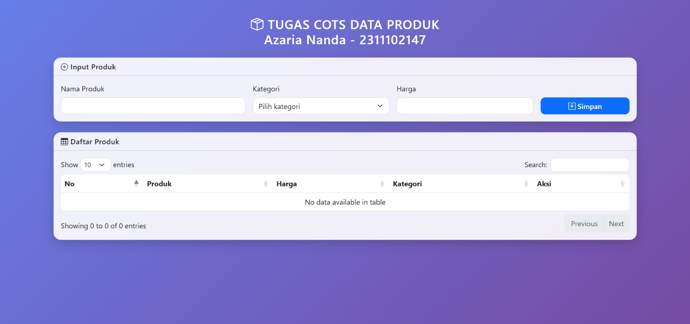
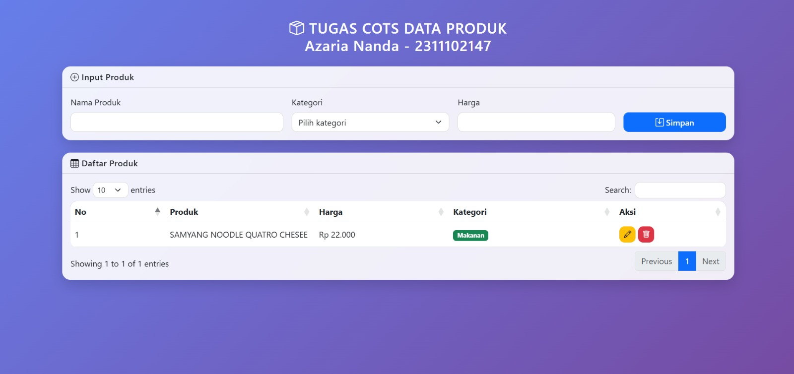
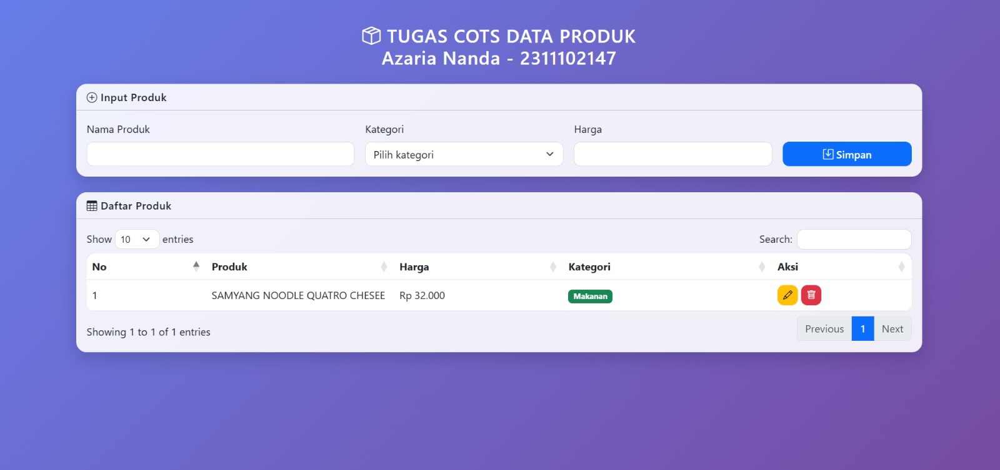
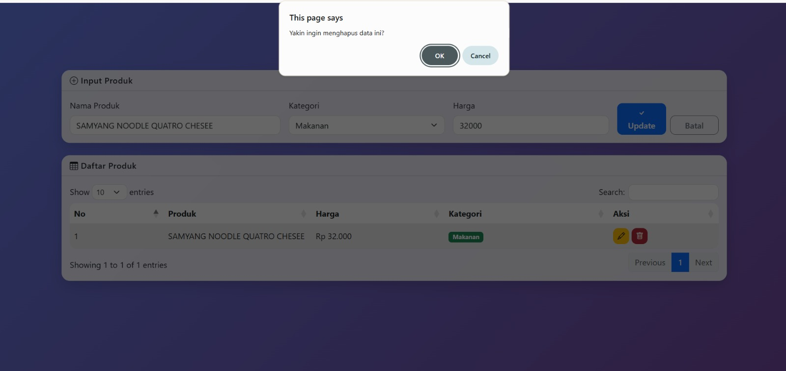

<div align="center">
  <br />
  <h1>LAPORAN PRAKTIKUM <br>APLIKASI BERBASIS PLATFORM</h1>
  <br />
  <h2> TUGAS COTS <br> DATA PRODUK </h2>
  <br />
  <br />
   
  <br />
  <br />
  <br />
  <h3>Disusun Oleh :</h3>
  <p>
    <strong>Azaria Nanda Putri</strong><br>
    <strong>2311102147</strong><br>
    <strong>S1 IF-11-REG 01</strong>
  </p>
  <br />
  <h3>Dosen Pengampu :</h3>
  <p>
    <strong>Dimas Fanny Hebrasianto Permadi, S.ST., M.Kom</strong>
  </p>
  <br />
  <br />
    <h4>Asisten Praktikum :</h4>
    <strong> Apri Pandu Wicaksono </strong> <br>
    <strong>Rangga Pradarrell Fathi</strong>
  <br />
  <h2>LABORATORIUM HIGH PERFORMANCE
 <br>FAKULTAS INFORMATIKA <br>UNIVERSITAS TELKOM PURWOKERTO <br>2026</h2>
</div>

---

# 1. Dasar Teori

    CRUD (Create, Read, Update, Delete) merupakan konsep dasar dalam pengelolaan data pada sebuah aplikasi. Operasi ini memungkinkan pengguna untuk menambahkan data baru, menampilkan data yang sudah tersimpan, memperbarui informasi yang ada, serta menghapus data yang tidak lagi diperlukan. Pada aplikasi berbasis front-end, operasi CRUD dapat dijalankan menggunakan JavaScript dengan memanipulasi elemen HTML melalui Document Object Model (DOM) sehingga perubahan data dapat langsung terlihat tanpa perlu memuat ulang halaman.

    Bootstrap adalah framework CSS yang banyak digunakan untuk membangun tampilan antarmuka yang responsif dan konsisten. Dengan memanfaatkan sistem grid, komponen UI siap pakai, serta utilitas styling yang tersedia, pengembang dapat merancang tampilan web secara lebih cepat tanpa harus menulis banyak kode CSS dari awal.

    DataTables merupakan pustaka berbasis jQuery yang digunakan untuk meningkatkan fungsi tabel HTML biasa menjadi lebih interaktif. Dengan DataTables, tabel dapat memiliki fitur pencarian (search), pengurutan data (sorting), dan pembagian halaman (pagination) secara otomatis sehingga memudahkan pengguna dalam melihat dan mengelola data yang jumlahnya banyak.

    JavaScript Object adalah struktur data yang menyimpan informasi dalam bentuk pasangan key-value. Dalam pengembangan aplikasi sederhana, objek dapat digunakan sebagai penyimpanan data sementara di sisi klien. Dengan pendekatan ini, data dapat diakses dengan cepat menggunakan kunci tertentu, sehingga memudahkan proses manipulasi data seperti penambahan, pengeditan, maupun penghapusan


---

# 2. Unguided

Laporan ini fokus pada implementasi sistem manajemen produk dengan penyimpanan berbasis objek.
```html
<!DOCTYPE html>
<html lang="id">
<head>
<meta charset="UTF-8">
<meta name="viewport" content="width=device-width, initial-scale=1.0">

<title>COTS Data Produk</title>

<link href="https://cdn.jsdelivr.net/npm/bootstrap@5.3.0/dist/css/bootstrap.min.css" rel="stylesheet">
<link href="https://cdn.jsdelivr.net/npm/bootstrap-icons@1.10.5/font/bootstrap-icons.css" rel="stylesheet">
<link href="https://cdn.datatables.net/1.13.4/css/dataTables.bootstrap5.min.css" rel="stylesheet">

<style>

body{
background:linear-gradient(135deg,#667eea,#764ba2);
min-height:100vh;
padding:40px;
font-family: 'Segoe UI',sans-serif;
}

.dashboard-title{
color:white;
font-weight:600;
letter-spacing:1px;
}

.glass-card{
background:rgba(255,255,255,0.9);
backdrop-filter:blur(10px);
border-radius:16px;
box-shadow:0 10px 25px rgba(0,0,0,0.15);
border:none;
}

.card-header{
font-weight:600;
letter-spacing:0.5px;
}

.form-control,
.form-select{
border-radius:10px;
border:1px solid #ddd;
transition:0.2s;
}

.form-control:focus,
.form-select:focus{
border-color:#6c63ff;
box-shadow:0 0 0 0.15rem rgba(108,99,255,0.25);
}

.btn{
border-radius:10px;
font-weight:500;
}

.table{
border-radius:12px;
overflow:hidden;
}

.table thead{
background:#6c63ff;
color:white;
}

.table-hover tbody tr:hover{
background:#f1f3ff;
}

</style>

</head>

<body>

<div class="container">

<h3 class="text-center mb-4 dashboard-title">
<i class="bi bi-box-seam"></i>
TUGAS COTS DATA PRODUK <br>
Azaria Nanda - 2311102147
</h3>


<div class="card glass-card mb-4">

<div class="card-header bg-transparent">
<i class="bi bi-plus-circle"></i> Input Produk
</div>

<div class="card-body">

<form id="formData">

<input type="hidden" id="produkId">

<div class="row g-3">

<div class="col-md-4">
<label class="form-label">Nama Produk</label>
<input type="text" id="namaProduk" class="form-control" required>
</div>

<div class="col-md-3">
<label class="form-label">Kategori</label>
<select id="kategoriProduk" class="form-select" required>
<option value="">Pilih kategori</option>
<option value="Elektronik">Elektronik</option>
<option value="Fashion">Fashion</option>
<option value="Makanan">Makanan</option>
</select>
</div>

<div class="col-md-3">
<label class="form-label">Harga</label>
<input type="number" id="hargaProduk" class="form-control" required>
</div>

<div class="col-md-2 d-flex align-items-end">

<button class="btn btn-primary w-100" id="btnSimpan">
<i class="bi bi-save"></i> Simpan
</button>

<button type="button" id="btnBatal" class="btn btn-outline-secondary w-100 ms-2" style="display:none">
Batal
</button>

</div>

</div>

</form>

</div>

</div>


<div class="card glass-card">

<div class="card-header bg-transparent">
<i class="bi bi-table"></i> Daftar Produk
</div>

<div class="card-body">

<table id="produkTable" class="table table-hover align-middle">

<thead>
<tr>
<th>No</th>
<th>Produk</th>
<th>Harga</th>
<th>Kategori</th>
<th>Aksi</th>
</tr>
</thead>

<tbody></tbody>

</table>

</div>

</div>

</div>


<script src="https://code.jquery.com/jquery-3.6.0.min.js"></script>
<script src="https://cdn.datatables.net/1.13.4/js/jquery.dataTables.min.js"></script>
<script src="https://cdn.datatables.net/1.13.4/js/dataTables.bootstrap5.min.js"></script>

<script>

let daftarProduk = {}
let nomorId = 1
let tabel
let modeEdit = false

$(document).ready(function(){

tabel = $('#produkTable').DataTable()

$('#formData').submit(function(e){

e.preventDefault()

let nama = $('#namaProduk').val()
let kategori = $('#kategoriProduk').val()
let harga = $('#hargaProduk').val()

let hargaFormat = new Intl.NumberFormat('id-ID').format(harga)

if(modeEdit){

let id = $('#produkId').val()

daftarProduk[id] = {id,nama,kategori,harga:hargaFormat}

renderProduk()

resetForm()

}else{

let id = nomorId++

daftarProduk[id] = {id,nama,kategori,harga:hargaFormat}

renderProduk()

this.reset()

}

})

$('#btnBatal').click(function(){

resetForm()

})

})


function renderProduk(){

tabel.clear()

let no = 1

Object.values(daftarProduk).forEach(item=>{

let badge

if(item.kategori=="Elektronik"){
badge='<span class="badge bg-info">Elektronik</span>'
}

else if(item.kategori=="Fashion"){
badge='<span class="badge bg-warning text-dark">Fashion</span>'
}

else{
badge='<span class="badge bg-success">Makanan</span>'
}

let tombol = `
<button class="btn btn-sm btn-warning" onclick="editProduk(${item.id})">
<i class="bi bi-pencil"></i>
</button>

<button class="btn btn-sm btn-danger" onclick="hapusProduk(${item.id})">
<i class="bi bi-trash"></i>
</button>
`

tabel.row.add([
no++,
item.nama,
"Rp "+item.harga,
badge,
tombol
])

})

tabel.draw()

}


window.editProduk = function(id){

let data = daftarProduk[id]

$('#produkId').val(data.id)
$('#namaProduk').val(data.nama)
$('#kategoriProduk').val(data.kategori)
$('#hargaProduk').val(data.harga.replace(/\./g,''))

modeEdit=true

$('#btnSimpan').html('<i class="bi bi-check"></i> Update')
$('#btnBatal').show()

}


window.hapusProduk = function(id){

if(confirm("Yakin ingin menghapus data ini?")){

delete daftarProduk[id]

renderProduk()

}

}


function resetForm(){

modeEdit=false

$('#formData')[0].reset()

$('#btnSimpan').html('<i class="bi bi-save"></i> Simpan')

$('#btnBatal').hide()

}

</script>

</body>
</html>
```

# 3. Hasil Tampilan

1. **Halaman Utama**: Menampilkan form kosong dan tabel DataTables.

2. **Tambah Data**: Mengisi form dan menekan tombol "Tambah" akan memperbarui tabel.


3. **Edit Data**: Menekan tombol "Edit" akan mengembalikan data ke form untuk diubah.


4. **Hapus Data**: Menampilkan dialog konfirmasi sebelum menghapus baris data.



---

# 4. Penjelasan

## A. Struktur Antarmuka (HTML)
    - Struktur halaman terdiri dari beberapa komponen utama yang membentuk antarmuka aplikasi.
    
    Pertama adalah bagian judul halaman yang menampilkan informasi tugas serta identitas pembuat laporan. Judul ini diletakkan di dalam elemen <h3> dengan tambahan ikon dari Bootstrap Icons agar tampilan lebih menarik.
    
    Selanjutnya terdapat komponen form input produk yang dibungkus menggunakan komponen card Bootstrap. Form ini berfungsi untuk memasukkan data produk yang terdiri dari nama produk, kategori, dan harga. Selain itu terdapat juga input tersembunyi dengan ID produkId yang digunakan untuk menyimpan identitas produk ketika proses pengeditan dilakukan.
    
    Bagian berikutnya adalah tabel daftar produk yang digunakan untuk menampilkan data yang telah dimasukkan oleh pengguna. Tabel ini memiliki kolom nomor, nama produk, harga, kategori, serta aksi. Data pada tabel tidak dituliskan secara langsung di dalam HTML, melainkan akan dihasilkan secara dinamis melalui JavaScript.

## B. Logika Pemrograman (JavaScript)
    - **Penyimpanan Data (Mapping)**: Variabel `let ogika utama aplikasi berada pada bagian JavaScript yang bertugas mengelola proses CRUD.

    Data produk disimpan dalam sebuah objek bernama daftarProduk. Setiap produk memiliki properti seperti id, nama, kategori, dan harga. Variabel nomorId digunakan untuk menghasilkan ID produk secara otomatis setiap kali pengguna menambahkan data baru.

    Fungsi renderProduk() digunakan untuk menampilkan seluruh data produk yang tersimpan di dalam objek ke dalam tabel. Fungsi ini akan mengosongkan isi tabel terlebih dahulu, kemudian menambahkan kembali setiap data produk menggunakan metode table.row.add() dari pustaka DataTables.

    Selain itu, fungsi ini juga membuat tampilan kategori produk dalam bentuk badge berwarna berbeda agar lebih mudah dikenali. Misalnya kategori elektronik menggunakan warna biru, fashion menggunakan warna kuning, dan makanan menggunakan warna hijau.

    Fungsi editProduk(id) digunakan ketika pengguna menekan tombol edit pada salah satu baris tabel. Fungsi ini akan mengambil data produk berdasarkan ID yang dipilih, kemudian mengisi kembali nilai tersebut ke dalam form input sehingga pengguna dapat melakukan perubahan data.

    Sedangkan fungsi hapusProduk(id) digunakan untuk menghapus data produk dari objek penyimpanan. Sebelum data dihapus, sistem akan menampilkan kotak dialog konfirmasi untuk memastikan bahwa pengguna benar-benar ingin menghapus data tersebut.

    Terakhir terdapat fungsi resetForm() yang berfungsi untuk mengembalikan form ke kondisi awal setelah proses tambah atau edit selesai dilakukan. Fungsi ini juga akan menyembunyikan tombol batal.
---

# 5. Referensi

- *Bootstrap 5 Official Documentation.* [https://getbootstrap.com/docs/5.3/](https://getbootstrap.com/docs/5.3/)
- *DataTables Manual & API Reference.* [https://datatables.net/](https://datatables.net/)
- *MDN Web Docs: Working with Objects in JavaScript.* [https://developer.mozilla.org/en-US/docs/Web/JavaScript/Guide/Working_with_Objects](https://developer.mozilla.org/en-US/docs/Web/JavaScript/Guide/Working_with_Objects)
- *jQuery API Documentation.* [https://api.jquery.com/](https://api.jquery.com/)