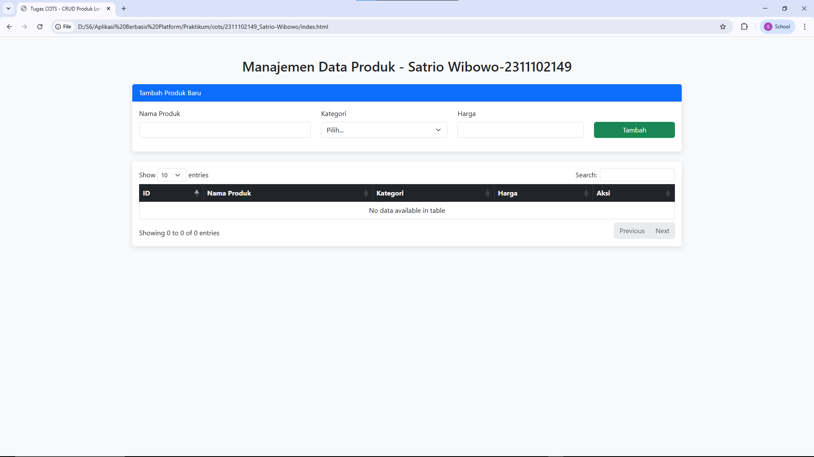
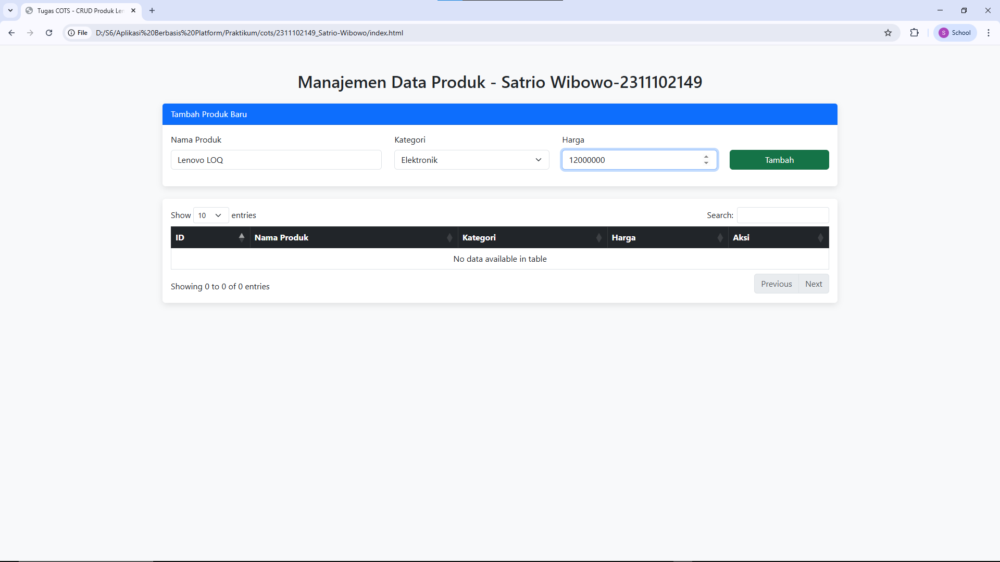
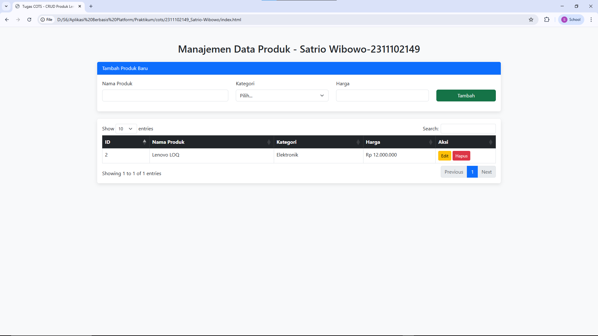
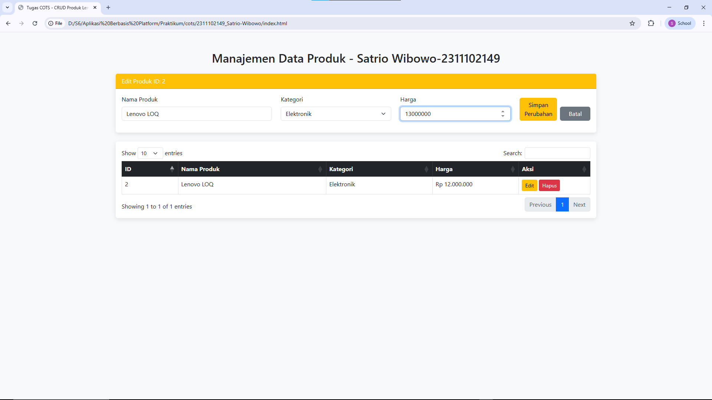
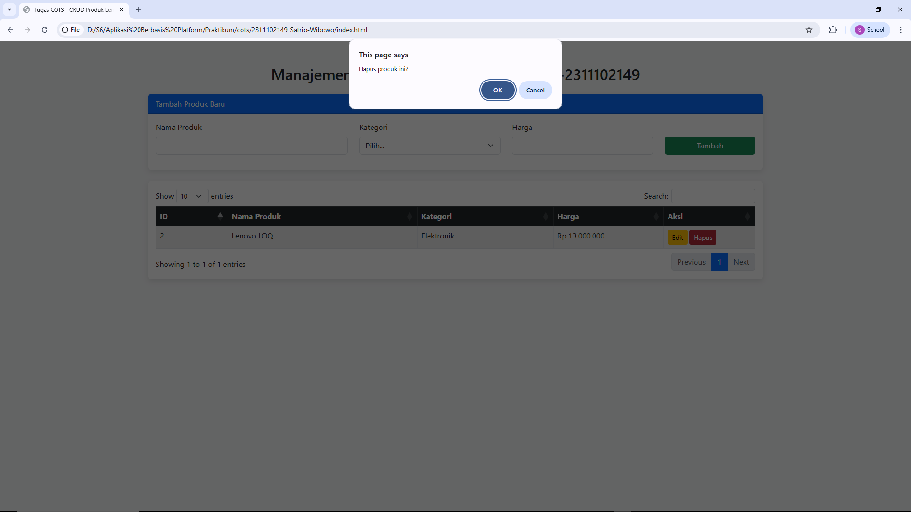

<div align="center">
  <br />
  <h1>LAPORAN PRAKTIKUM <br>APLIKASI BERBASIS PLATFORM</h1>
  <br />
  <h2> TUGAS COTS <br> DATA PRODUK </h2>
  <br />
  <br />
   
  <br />
  <br />
  <br />
  <h3>Disusun Oleh :</h3>
  <p>
    <strong>Satrio Wibowo</strong><br>
    <strong>2311102149</strong><br>
    <strong>S1 IF-11-REG 01</strong>
  </p>
  <br />
  <h3>Dosen Pengampu :</h3>
  <p>
    <strong>Dimas Fanny Hebrasianto Permadi, S.ST., M.Kom</strong>
  </p>
  <br />
  <br />
    <h4>Asisten Praktikum :</h4>
    <strong> Apri Pandu Wicaksono </strong> <br>
    <strong>Rangga Pradarrell Fathi</strong>
  <br />
  <h2>LABORATORIUM HIGH PERFORMANCE
 <br>FAKULTAS INFORMATIKA <br>UNIVERSITAS TELKOM PURWOKERTO <br>2026</h2>
</div>

---

# 1. Dasar Teori

**Sistem CRUD (Create, Read, Update, Delete)** adalah pilar utama dalam pengelolaan data di aplikasi perangkat lunak. Operasi ini memungkinkan pengguna untuk membuat entri baru, membaca atau menampilkan data, melakukan perubahan (sunting), hingga menghapus data yang tidak diperlukan. Dalam pengembangan *front-end*, CRUD dapat diimplementasikan menggunakan JavaScript untuk memanipulasi DOM (*Document Object Model*) secara dinamis di sisi klien.

**Framework Bootstrap** digunakan untuk membangun antarmuka yang responsif dan estetis secara efisien. Dengan sistem *grid* dan komponen UI yang sudah terintegrasi, Bootstrap meminimalkan penulisan CSS manual sehingga pengembang dapat fokus pada logika fungsionalitas aplikasi.

**jQuery DataTables** merupakan pustaka pendukung yang memberikan fitur tingkat lanjut pada tabel HTML statis. Pustaka ini secara otomatis menyediakan fungsi pencarian (*searching*), pembagian halaman (*pagination*), dan pengurutan (*sorting*) tanpa perlu menulis logika kompleks dari awal.

**JavaScript Object Mapping** adalah teknik pengorganisasian data menggunakan struktur pasangan kunci-nilai (*key-value pairs*). Berbeda dengan *Array* yang memerlukan iterasi (looping) untuk mencari data, *Object Mapping* memungkinkan akses data secara instan melalui kunci unik (ID). Metode ini sangat efisien dalam manajemen *state* aplikasi karena memiliki kompleksitas waktu $O(1)$ untuk operasi pencarian dan penghapusan.


---

# 2. Unguided

Laporan ini fokus pada implementasi sistem manajemen produk dengan penyimpanan berbasis objek.
```html
<!DOCTYPE html>
<html lang="en">
<head>
    <meta charset="UTF-8">
    <meta name="viewport" content="width=device-width, initial-scale=1.0">
    <title>Tugas COTS - CRUD Produk Lengkap</title>
    
    <link href="https://cdn.jsdelivr.net/npm/bootstrap@5.3.0/dist/css/bootstrap.min.css" rel="stylesheet">
    <link href="https://cdn.datatables.net/1.13.4/css/dataTables.bootstrap5.min.css" rel="stylesheet">
    
    <style>
        body { background-color: #f8f9fa; padding: 50px 0; }
        .card { border: none; box-shadow: 0 4px 12px rgba(0,0,0,0.1); }
        .btn-update { display: none; } /* Sembunyikan tombol update di awal */
    </style>
</head>
<body>

<div class="container">
    <h2 class="text-center mb-4">Manajemen Data Produk - Satrio Wibowo-2311102149</h2>

    <div class="card mb-4">
        <div id="formHeader" class="card-header bg-primary text-white">Tambah Produk Baru</div>
        <div class="card-body">
            <form id="productForm">
                <input type="hidden" id="editId"> <div class="row">
                    <div class="col-md-4 mb-3">
                        <label class="form-label">Nama Produk</label>
                        <input type="text" id="nama" class="form-control" required>
                    </div>
                    <div class="col-md-3 mb-3">
                        <label class="form-label">Kategori</label>
                        <select id="kategori" class="form-select" required>
                            <option value="">Pilih...</option>
                            <option value="Elektronik">Elektronik</option>
                            <option value="Pakaian">Pakaian</option>
                            <option value="Makanan">Makanan</option>
                        </select>
                    </div>
                    <div class="col-md-3 mb-3">
                        <label class="form-label">Harga</label>
                        <input type="number" id="harga" class="form-control" required>
                    </div>
                    <div class="col-md-2 mb-3 d-flex align-items-end">
                        <button type="submit" id="btnSubmit" class="btn btn-success w-100">Tambah</button>
                        <button type="button" id="btnCancel" class="btn btn-secondary w-100 ms-2" style="display:none;">Batal</button>
                    </div>
                </div>
            </form>
        </div>
    </div>

    <div class="card">
        <div class="card-body">
            <table id="productTable" class="table table-hover table-bordered w-100">
                <thead class="table-dark">
                    <tr>
                        <th>ID</th>
                        <th>Nama Produk</th>
                        <th>Kategori</th>
                        <th>Harga</th>
                        <th>Aksi</th>
                    </tr>
                </thead>
                <tbody></tbody>
            </table>
        </div>
    </div>
</div>

<script src="https://code.jquery.com/jquery-3.6.0.min.js"></script>
<script src="https://cdn.datatables.net/1.13.4/js/jquery.dataTables.min.js"></script>
<script src="https://cdn.datatables.net/1.13.4/js/dataTables.bootstrap5.min.js"></script>

<script>
    // Penampung Data (Mapping Object)
    let products = {}; 
    let nextId = 1;
    let table;
    let isEditing = false;

    $(document).ready(function() {
        // Inisialisasi DataTable
        table = $('#productTable').DataTable();

        // Handle Form Submit (Tambah & Update)
        $('#productForm').on('submit', function(e) {
            e.preventDefault();

            const nama = $('#nama').val();
            const kategori = $('#kategori').val();
            const harga = parseInt($('#harga').val()).toLocaleString('id-ID');

            if (isEditing) {
                // LOGIKA UPDATE (U)
                const id = $('#editId').val();
                products[id] = { id, nama, kategori, harga };
                
                // Refresh Tabel
                renderTable();
                resetForm();
            } else {
                // LOGIKA CREATE (C)
                const id = nextId++;
                products[id] = { id, nama, kategori, harga };
                
                renderTable();
                this.reset();
            }
        });

        // Batal Edit
        $('#btnCancel').on('click', function() {
            resetForm();
        });
    });

    // Render Ulang Tabel dari Object products (Read)
    function renderTable() {
        table.clear(); // Bersihkan baris lama
        
        Object.values(products).forEach(data => {
            const buttons = `
                <button class="btn btn-warning btn-sm" onclick="editProduct(${data.id})">Edit</button>
                <button class="btn btn-danger btn-sm" onclick="deleteProduct(${data.id})">Hapus</button>
            `;
            
            table.row.add([
                data.id,
                data.nama,
                data.kategori,
                `Rp ${data.harga}`,
                buttons
            ]);
        });
        
        table.draw();
    }

    // Fungsi Ambil Data ke Form (Persiapan Update)
    window.editProduct = function(id) {
        const item = products[id];
        
        $('#editId').val(item.id);
        $('#nama').val(item.nama);
        $('#kategori').val(item.kategori);
        // Hapus titik ribuan untuk input type number
        $('#harga').val(item.harga.replace(/\./g, ''));

        // Ubah UI Form
        isEditing = true;
        $('#formHeader').text('Edit Produk ID: ' + id).removeClass('bg-primary').addClass('bg-warning text-dark');
        $('#btnSubmit').text('Simpan Perubahan').removeClass('btn-success').addClass('btn-warning');
        $('#btnCancel').show();
    };

    // Fungsi Hapus (Delete)
    window.deleteProduct = function(id) {
        if(confirm('Hapus produk ini?')) {
            delete products[id];
            renderTable();
            if(isEditing && $('#editId').val() == id) resetForm();
        }
    };

    function resetForm() {
        isEditing = false;
        $('#productForm')[0].reset();
        $('#formHeader').text('Tambah Produk Baru').removeClass('bg-warning text-dark').addClass('bg-primary text-white');
        $('#btnSubmit').text('Tambah').removeClass('btn-warning').addClass('btn-success');
        $('#btnCancel').hide();
    }
</script>

</body>
</html>

```

# 3. Hasil Tampilan

1. **Halaman Utama**: Menampilkan form kosong dan tabel DataTables.

2. **Tambah Data**: Mengisi form dan menekan tombol "Tambah" akan memperbarui tabel.


3. **Edit Data**: Menekan tombol "Edit" akan mengembalikan data ke form untuk diubah.


4. **Hapus Data**: Menampilkan dialog konfirmasi sebelum menghapus baris data.



---

# 4. Penjelasan

## A. Struktur Antarmuka (HTML)
- **Form Input**: Menggunakan komponen *Card* Bootstrap untuk membungkus form. Terdapat *hidden input* `<input type="hidden" id="editId">` yang berfungsi menyimpan ID produk saat aplikasi beralih ke mode "Edit".
- **Tabel Dinamis**: Tabel didefinisikan dengan ID `#productTable`. Bagian `<tbody>` dikosongkan karena akan diisi secara otomatis oleh JavaScript melalui metode `renderTable()`.

## B. Logika Pemrograman (JavaScript)
- **Penyimpanan Data (Mapping)**: Variabel `let products = {};` digunakan sebagai basis data sementara. Setiap produk baru disimpan dengan ID unik sebagai *key*, misalnya `products[1] = { ...data }`.
- **Fungsi Tambah & Update**: Sistem mendeteksi status melalui variabel `isEditing`. Jika `false`, maka fungsi akan menambah properti baru ke objek. Jika `true`, fungsi akan menimpa nilai pada *key* ID yang sudah ada.
- **Integrasi DataTables**: Penggunaan `table.row.add().draw()` memungkinkan penambahan baris baru ke dalam tabel tanpa perlu memuat ulang seluruh halaman (*page refresh*).
- **Fungsi Hapus**: Perintah `delete products[id]` digunakan untuk menghapus data langsung dari objek mapping berdasarkan ID yang dikirimkan melalui parameter tombol aksi.
---

# 5. Referensi

- *Bootstrap 5 Official Documentation.* [https://getbootstrap.com/docs/5.3/](https://getbootstrap.com/docs/5.3/)
- *DataTables Manual & API Reference.* [https://datatables.net/](https://datatables.net/)
- *MDN Web Docs: Working with Objects in JavaScript.* [https://developer.mozilla.org/en-US/docs/Web/JavaScript/Guide/Working_with_Objects](https://developer.mozilla.org/en-US/docs/Web/JavaScript/Guide/Working_with_Objects)
- *jQuery API Documentation.* [https://api.jquery.com/](https://api.jquery.com/)