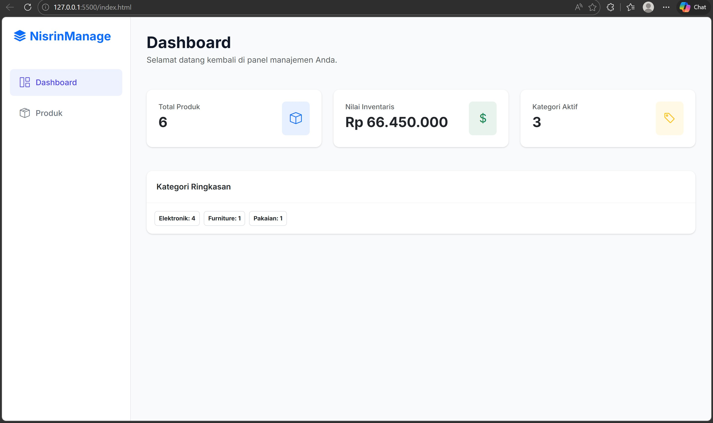
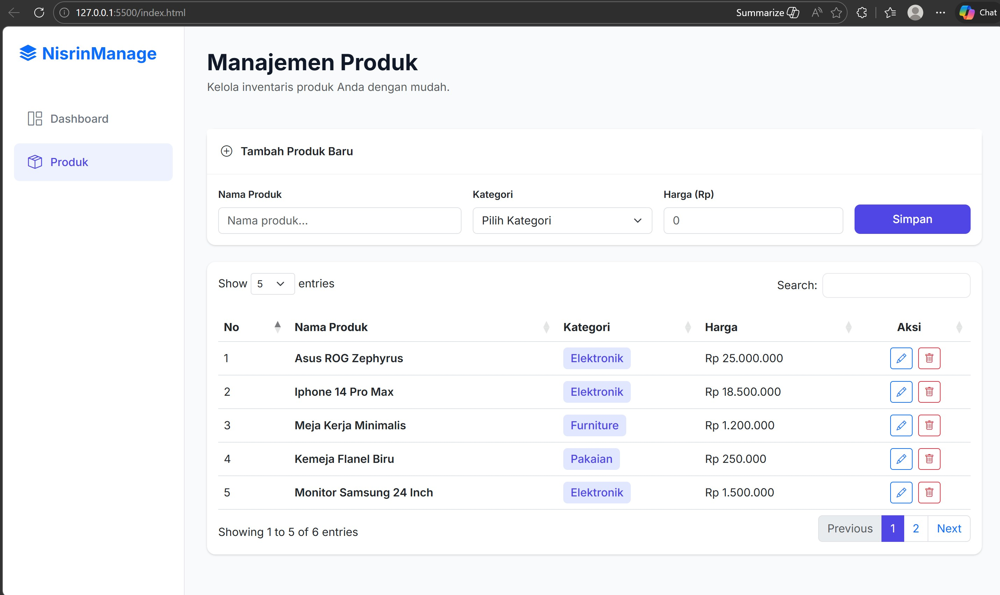
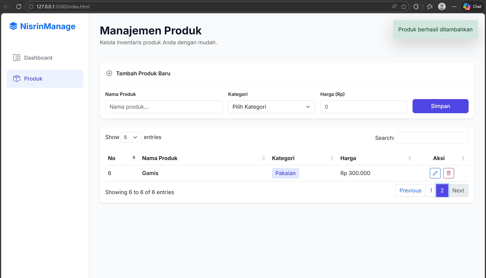
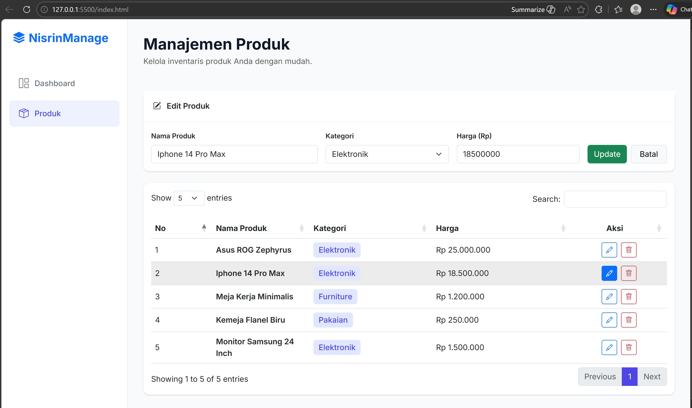
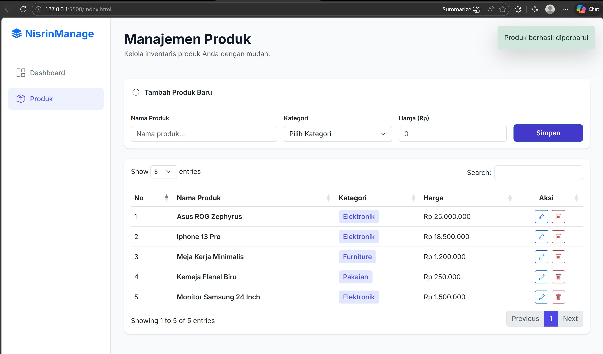
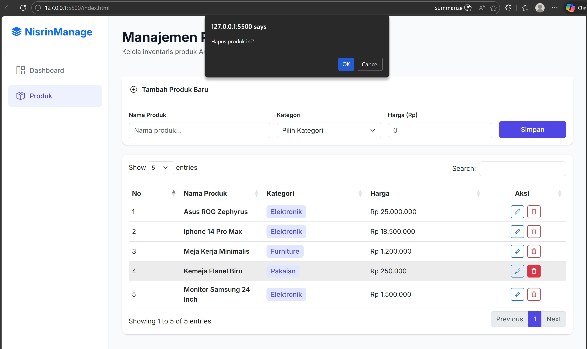
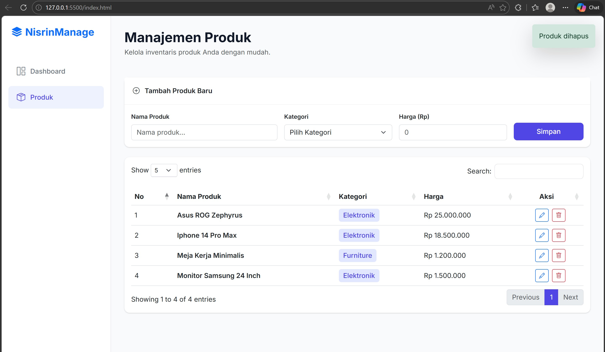
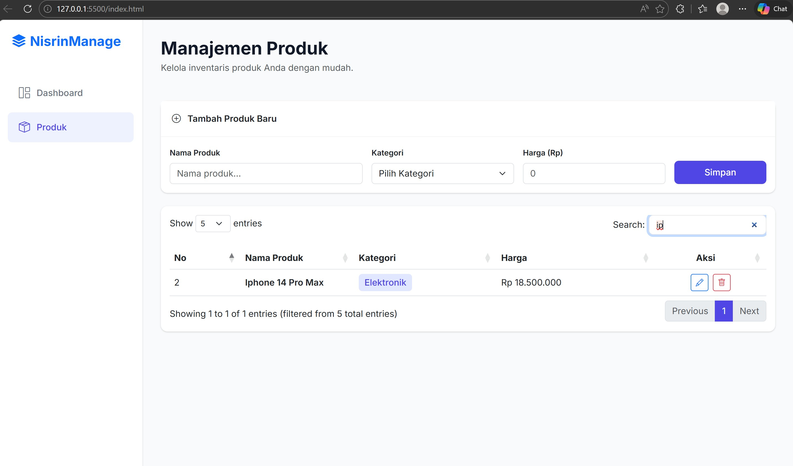

<div align="center">
  <br />
  <h1>LAPORAN PRAKTIKUM <br>APLIKASI BERBASIS PLATFORM</h1>
  <br />
  <h3> TUGAS COTS <br> MANAJEMEN PRODUK </h3>
  <br />
   
  <br />
  <br />
  <br />
  <h3>Disusun Oleh :</h3>
  <p>
    <strong>Nisrina Amalia Iffatunnisa</strong><br>
    <strong>2311102156</strong><br>
    <strong>S1 IF-11-01</strong>
  </p>
  <br />
  <h3>Dosen Pengampu :</h3>
  <p>
    <strong>Dimas Fanny Hebrasianto Permadi, S.ST., M.Kom</strong>
  </p>
  <br />
  <br />
    <h4>Asisten Praktikum :</h4>
    <strong> Apri Pandu Wicaksono </strong> <br>
    <strong>Rangga Pradarrell Fathi</strong>
  <br />
  <h3>LABORATORIUM HIGH PERFORMANCE
 <br>FAKULTAS INFORMATIKA <br>UNIVERSITAS TELKOM PURWOKERTO <br>2026</h3>
</div>

---

## 1. Dasar Teori

HTML atau HyperText Markup Language merupakan bahasa dasar yang digunakan untuk membangun sebuah web dimana HTML menangani elemen-elemen dasar pada pembangunan sebuah website. Langkah-langkah yang dilakukan meliputi pembuatan dokumen HTML dengan struktur dasar, kemudian menambahkan berbagai elemen pada halaman web seperti teks, gambar, serta tautan untuk membangun tampilan dan navigasi halaman.

Bootstrap merupakan sebuah front-end framework gratis untuk pengembangan antar muka web yang lebih cepat dan lebih mudah. Dikembangkan oleh Mark Otto dan Jacom Thornton di Twitter dan dirilis sebagai produk open source pada Agustus 2011 di GitHub. Bootstrap memiliki kemampuan untuk membuat desain responsif yang secara otomatis menyesuaikan diri agar terlihat baik di segala perangkat, mulai dari perangkat ponsel hingga desktop pc.

Cascading Style Sheets (CSS) merupakan bahasa yang membantu memperindah tampilan dari laman web yang telah dibangun dengan HTML. CSS mendeskripsikan bagaimana bentuk tampilan elemen HTML seharusnya saat ditampilkan pada laman browser. Selector merupakan elemen HTML yang akan ditambahkan CSS kemudian diikuti dengan declaration block yang terdiri dari property elemen yang akan dirubah beserta value dari property-nya. Setiap deklarasi selector dapat merubah banyak nilai property sekaligus dengan dipisahkan dengan titik koma dan untuk semua declaration block dari satu selector berada di antara kurung kurawal.

DataTables merupakan plugin jQuery yang digunakan untuk meningkatkan fungsionalitas tabel HTML. Plugin ini menyediakan berbagai fitur tambahan seperti: Pencarian data (search), Pagination (pembagian halaman), Sorting (pengurutan data), Responsivitas tabel. Dengan menggunakan DataTables, pengelolaan data dalam tabel menjadi lebih interaktif dan mudah digunakan oleh pengguna. 

## 2. Sourcecode
``` HTML
<!DOCTYPE html>
<html lang="id">
<head>
    <meta charset="UTF-8">
    <meta name="viewport" content="width=device-width, initial-scale=1.0">
    <title>COTS Nisrin - Dashboard Minimalis</title>
    <!-- Bootstrap 5 CSS -->
    <link href="https://cdn.jsdelivr.net/npm/bootstrap@5.3.0/dist/css/bootstrap.min.css" rel="stylesheet">
    <!-- Bootstrap Icons -->
    <link rel="stylesheet" href="https://cdn.jsdelivr.net/npm/bootstrap-icons@1.11.0/font/bootstrap-icons.css">
    <!-- DataTables CSS -->
    <link rel="stylesheet" href="https://cdn.datatables.net/1.13.7/css/dataTables.bootstrap5.min.css">
    <!-- Google Fonts -->
    <link href="https://fonts.googleapis.com/css2?family=Inter:wght@300;400;500;600;700&display=swap" rel="stylesheet">
    <style>
        :root {
            --primary-color: #4f46e5;
            --bg-light: #f9fafb;
            --text-main: #111827;
            --text-muted: #6b7280;
            --card-shadow: 0 1px 3px 0 rgba(0, 0, 0, 0.1), 0 1px 2px 0 rgba(0, 0, 0, 0.06);
        }

        body {
            font-family: 'Inter', sans-serif;
            background-color: var(--bg-light);
            color: var(--text-main);
            overflow-x: hidden;
        }

        /* Sidebar Styling */
        .sidebar {
            height: 100vh;
            width: 260px;
            position: fixed;
            top: 0;
            left: 0;
            background-color: white;
            border-right: 1px solid #e5e7eb;
            z-index: 1000;
            transition: all 0.3s;
        }

        .main-content {
            margin-left: 260px;
            padding: 2rem;
            transition: all 0.3s;
        }

        .nav-link {
            color: var(--text-muted);
            padding: 0.75rem 1.25rem;
            border-radius: 0.5rem;
            margin: 0.25rem 1rem;
            display: flex;
            align-items: center;
            font-weight: 500;
            cursor: pointer;
            text-decoration: none;
        }

        .nav-link i {
            font-size: 1.25rem;
            margin-right: 0.75rem;
        }

        .nav-link:hover, .nav-link.active {
            background-color: #f3f4f6;
            color: var(--primary-color);
        }

        .nav-link.active {
            background-color: #eef2ff;
        }

        /* Card Styling */
        .card {
            border: none;
            border-radius: 0.75rem;
            box-shadow: var(--card-shadow);
            margin-bottom: 1.5rem;
        }

        .card-header {
            background-color: transparent;
            border-bottom: 1px solid #f3f4f6;
            padding: 1.25rem;
            font-weight: 600;
        }

        /* Badge Styling */
        .badge-category {
            background-color: #e0e7ff;
            color: var(--primary-color);
            font-weight: 500;
            padding: 0.35em 0.65em;
            border-radius: 0.375rem;
        }

        /* Buttons */
        .btn-primary {
            background-color: var(--primary-color);
            border-color: var(--primary-color);
            padding: 0.5rem 1.25rem;
            font-weight: 500;
            border-radius: 0.5rem;
        }

        .btn-primary:hover {
            background-color: #4338ca;
        }

        /* Custom DataTable tweaks */
        .dataTables_wrapper .dataTables_filter {
            margin-bottom: 1rem;
        }
        .dataTables_wrapper .dataTables_filter input {
            border-radius: 0.5rem;
            border: 1px solid #e5e7eb;
            padding: 0.4rem 0.8rem;
        }
        .page-item.active .page-link {
            background-color: var(--primary-color);
            border-color: var(--primary-color);
        }

        /* Mobile Adjustments */
        @media (max-width: 992px) {
            .sidebar {
                left: -260px;
            }
            .sidebar.active {
                left: 0;
            }
            .main-content {
                margin-left: 0;
            }
        }

        .page-section {
            display: none;
        }

        .page-section.active {
            display: block;
        }

        #notification {
            position: fixed;
            top: 20px;
            right: 20px;
            z-index: 2000;
            display: none;
        }
    </style>
</head>
<body>

    <!-- Notification Container -->
    <div id="notification" class="alert alert-success shadow-lg border-0" role="alert">
        Berhasil diperbarui!
    </div>

    <!-- Sidebar -->
    <aside class="sidebar" id="sidebar">
        <div class="p-4 mb-4">
            <h4 class="fw-bold text-primary m-0"><i class="bi bi-stack me-2"></i>NisrinManage</h4>
        </div>
        <nav class="nav flex-column">
            <a class="nav-link active" onclick="switchPage('dashboard', this)">
                <i class="bi bi-grid-1x2"></i> Dashboard
            </a>
            <a class="nav-link" onclick="switchPage('products', this)">
                <i class="bi bi-box-seam"></i> Produk
            </a>
        </nav>
    </aside>

    <!-- Main Content -->
    <main class="main-content">
        <!-- Top Bar -->
        <header class="d-flex justify-content-between align-items-center mb-5">
            <div>
                <h2 class="fw-bold mb-1" id="page-title">Dashboard</h2>
                <p class="text-muted mb-0" id="page-subtitle">Selamat datang kembali di panel manajemen Anda.</p>
            </div>
            <div class="d-flex gap-2">
                <button class="btn btn-outline-secondary d-lg-none" onclick="toggleSidebar()">
                    <i class="bi bi-list"></i>
                </button>
            </div>
        </header>

        <!-- PAGE 1: DASHBOARD -->
        <section id="dashboard" class="page-section active">
            <div class="row g-4 mb-4">
                <div class="col-md-4">
                    <div class="card p-4">
                        <div class="d-flex justify-content-between">
                            <div>
                                <p class="text-muted small fw-medium mb-1">Total Produk</p>
                                <h3 class="fw-bold mb-0" id="stat-total-products">0</h3>
                            </div>
                            <div class="bg-primary bg-opacity-10 text-primary p-3 rounded-3">
                                <i class="bi bi-box fs-4"></i>
                            </div>
                        </div>
                    </div>
                </div>
                <div class="col-md-4">
                    <div class="card p-4">
                        <div class="d-flex justify-content-between">
                            <div>
                                <p class="text-muted small fw-medium mb-1">Nilai Inventaris</p>
                                <h3 class="fw-bold mb-0" id="stat-total-value">Rp 0</h3>
                            </div>
                            <div class="bg-success bg-opacity-10 text-success p-3 rounded-3">
                                <i class="bi bi-currency-dollar fs-4"></i>
                            </div>
                        </div>
                    </div>
                </div>
                <div class="col-md-4">
                    <div class="card p-4">
                        <div class="d-flex justify-content-between">
                            <div>
                                <p class="text-muted small fw-medium mb-1">Kategori Aktif</p>
                                <h3 class="fw-bold mb-0" id="stat-total-categories">0</h3>
                            </div>
                            <div class="bg-warning bg-opacity-10 text-warning p-3 rounded-3">
                                <i class="bi bi-tag fs-4"></i>
                            </div>
                        </div>
                    </div>
                </div>
            </div>

            <div class="row">
                <div class="col-lg-12">
                    <div class="card">
                        <div class="card-header">Kategori Ringkasan</div>
                        <div class="card-body">
                            <div id="category-summary-badges" class="d-flex flex-wrap gap-2">
                                <!-- Dynamic List -->
                            </div>
                        </div>
                    </div>
                </div>
            </div>
        </section>

        <!-- PAGE 2: MANAJEMEN PRODUK -->
        <section id="products" class="page-section">
            <!-- Form Card -->
            <div class="card border-0 mb-4">
                <div class="card-header bg-white">
                    <span id="form-action-text"><i class="bi bi-plus-circle me-2"></i> Tambah Produk Baru</span>
                </div>
                <div class="card-body">
                    <form id="productForm" class="row g-3">
                        <div class="col-md-4">
                            <label class="form-label small fw-semibold">Nama Produk</label>
                            <input type="text" id="prodName" class="form-control" placeholder="Nama produk..." required>
                        </div>
                        <div class="col-md-3">
                            <label class="form-label small fw-semibold">Kategori</label>
                            <select id="prodCategory" class="form-select" required>
                                <option value="" selected disabled>Pilih Kategori</option>
                                <option value="Elektronik">Elektronik</option>
                                <option value="Pakaian">Pakaian</option>
                                <option value="Makanan">Makanan</option>
                                <option value="Furniture">Furniture</option>
                            </select>
                        </div>
                        <div class="col-md-3">
                            <label class="form-label small fw-semibold">Harga (Rp)</label>
                            <input type="number" id="prodPrice" class="form-control" placeholder="0" required>
                        </div>
                        <div class="col-md-2 d-flex align-items-end gap-2">
                            <button type="submit" class="btn btn-primary w-100" id="submitBtn">
                                Simpan
                            </button>
                            <button type="button" class="btn btn-light border w-100 d-none" id="cancelEditBtn" onclick="resetForm()">
                                Batal
                            </button>
                        </div>
                    </form>
                </div>
            </div>

            <!-- Table Card -->
            <div class="card">
                <div class="card-body">
                    <div class="table-responsive">
                        <table class="table table-hover align-middle w-100" id="productTable">
                            <thead>
                                <tr>
                                    <th>No</th>
                                    <th>Nama Produk</th>
                                    <th>Kategori</th>
                                    <th>Harga</th>
                                    <th class="text-center">Aksi</th>
                                </tr>
                            </thead>
                            <tbody id="productTableBody">
                                <!-- Rows will be rendered by DataTables -->
                            </tbody>
                        </table>
                    </div>
                </div>
            </div>
        </section>
    </main>

    <!-- Dependencies: jQuery, Bootstrap, DataTables -->
    <script src="https://code.jquery.com/jquery-3.7.0.min.js"></script>
    <script src="https://cdn.jsdelivr.net/npm/bootstrap@5.3.0/dist/js/bootstrap.bundle.min.js"></script>
    <script src="https://cdn.datatables.net/1.13.7/js/jquery.dataTables.min.js"></script>
    <script src="https://cdn.datatables.net/1.13.7/js/dataTables.bootstrap5.min.js"></script>

    <script>
        // --- Data State (Mapping Objects) ---
        let products = [
            { id: 1, name: "Asus ROG Zephyrus", category: "Elektronik", price: 25000000 },
            { id: 2, name: "Iphone 14 Pro Max", category: "Elektronik", price: 18500000 },
            { id: 3, name: "Meja Kerja Minimalis", category: "Furniture", price: 1200000 },
            { id: 4, name: "Kemeja Flanel Biru", category: "Pakaian", price: 250000 },
            { id: 5, name: "Monitor Samsung 24 Inch", category: "Elektronik", price: 1500000 }
        ];

        let dataTableInstance = null;
        let editMode = false;
        let currentEditId = null;

        $(document).ready(function() {
            initDataTable();
            updateStats();
        });

        function initDataTable() {
            // Destroy existing if any
            if (dataTableInstance) {
                dataTableInstance.destroy();
            }

            const tableBody = $('#productTableBody');
            tableBody.empty();

            products.forEach((p, index) => {
                tableBody.append(`
                    <tr>
                        <td>${index + 1}</td>
                        <td class="fw-semibold">${p.name}</td>
                        <td><span class="badge-category">${p.category}</span></td>
                        <td>${formatRupiah(p.price)}</td>
                        <td>
                            <div class="d-flex justify-content-center gap-2">
                                <button class="btn btn-outline-primary btn-sm" onclick="editProduct(${p.id})">
                                    <i class="bi bi-pencil"></i>
                                </button>
                                <button class="btn btn-outline-danger btn-sm" onclick="deleteProduct(${p.id})">
                                    <i class="bi bi-trash"></i>
                                </button>
                            </div>
                        </td>
                    </tr>
                `);
            });

            // Initialize DataTables
            dataTableInstance = $('#productTable').DataTable({
                language: {
                    url: '//cdn.datatables.net/plug-ins/1.13.7/i18n/id.json',
                },
                pageLength: 5,
                lengthMenu: [5, 10, 25, 50],
                responsive: true
            });
        }

        function updateStats() {
            $('#stat-total-products').text(products.length);
            
            const totalValue = products.reduce((sum, p) => sum + parseInt(p.price), 0);
            $('#stat-total-value').text(formatRupiah(totalValue));

            const categories = [...new Set(products.map(p => p.category))];
            $('#stat-total-categories').text(categories.length);

            // Dashboard Badges
            const summaryDiv = $('#category-summary-badges');
            summaryDiv.empty();
            categories.forEach(cat => {
                const count = products.filter(p => p.category === cat).length;
                summaryDiv.append(`<span class="badge bg-white border text-dark p-2">${cat}: <strong>${count}</strong></span>`);
            });
        }

        $('#productForm').on('submit', function(e) {
            e.preventDefault();
            
            const name = $('#prodName').val();
            const category = $('#prodCategory').val();
            const price = $('#prodPrice').val();

            if (editMode) {
                const index = products.findIndex(p => p.id === currentEditId);
                products[index] = { ...products[index], name, category, price: parseInt(price) };
                showNotification('Produk berhasil diperbarui');
                resetForm();
            } else {
                const newObj = {
                    id: Date.now(),
                    name,
                    category,
                    price: parseInt(price)
                };
                products.push(newObj);
                showNotification('Produk berhasil ditambahkan');
            }

            this.reset();
            initDataTable();
            updateStats();
        });

        window.deleteProduct = function(id) {
            if (confirm('Hapus produk ini?')) {
                products = products.filter(p => p.id !== id);
                initDataTable();
                updateStats();
                showNotification('Produk dihapus');
            }
        };

        window.editProduct = function(id) {
            const product = products.find(p => p.id === id);
            if (!product) return;

            $('#prodName').val(product.name);
            $('#prodCategory').val(product.category);
            $('#prodPrice').val(product.price);

            editMode = true;
            currentEditId = id;
            
            $('#form-action-text').html('<i class="bi bi-pencil-square me-2"></i> Edit Produk');
            $('#submitBtn').text('Update').removeClass('btn-primary').addClass('btn-success');
            $('#cancelEditBtn').removeClass('d-none');
            
            window.scrollTo({ top: 0, behavior: 'smooth' });
        };

        window.resetForm = function() {
            editMode = false;
            currentEditId = null;
            $('#productForm')[0].reset();
            $('#form-action-text').html('<i class="bi bi-plus-circle me-2"></i> Tambah Produk Baru');
            $('#submitBtn').text('Simpan').removeClass('btn-success').addClass('btn-primary');
            $('#cancelEditBtn').addClass('d-none');
        };

        window.switchPage = function(pageId, element) {
            const titles = {
                'dashboard': ['Dashboard', 'Selamat datang kembali di panel manajemen Anda.'],
                'products': ['Manajemen Produk', 'Kelola inventaris produk Anda dengan mudah.']
            };

            $('#page-title').text(titles[pageId][0]);
            $('#page-subtitle').text(titles[pageId][1]);

            $('.nav-link').removeClass('active');
            $(element).addClass('active');

            $('.page-section').removeClass('active');
            $('#' + pageId).addClass('active');

            if(pageId === 'dashboard') updateStats();
            $('#sidebar').removeClass('active');
        };

        window.toggleSidebar = function() {
            $('#sidebar').toggleClass('active');
        };

        function formatRupiah(number) {
            return new Intl.NumberFormat('id-ID', {
                style: 'currency',
                currency: 'IDR',
                minimumFractionDigits: 0
            }).format(number);
        }

        function showNotification(msg) {
            const notif = $('#notification');
            notif.text(msg).fadeIn();
            setTimeout(() => notif.fadeOut(), 3000);
        }
    </script>
</body>
</html>

```

## 3. Penjelasan Implementasi Sistem Manajemen Produk
Pada praktikum ini dibuat sebuah aplikasi web lokal sederhana untuk melakukan manajemen data produk menggunakan konsep CRUD (Create, Read, Update, Delete). Aplikasi ini dibangun menggunakan HTML, CSS, JavaScript, serta memanfaatkan Bootstrap untuk tampilan antarmuka dan jQuery DataTables untuk pengelolaan tabel data.

a. Penggunaan Bootstrap untuk Tampilan Antarmuka: Framework Bootstrap digunakan untuk mempermudah pembuatan tampilan antarmuka yang responsif dan rapi.




b. Pembuatan Form Input Produk: Form input digunakan untuk memasukkan data produk yang akan disimpan ke dalam sistem. Form ini terdiri dari tiga komponen utama sesuai dengan ketentuan praktikum, yaitu:
- Nama Produk: Digunakan untuk memasukkan nama produk yang akan ditambahkan.
- Kategori: Digunakan untuk menentukan kategori produk, misalnya Elektronik, Pakaian, Makanan, dan Furniture.
- Harga: Digunakan untuk memasukkan harga produk dalam bentuk angka.

Implementasi Operasi CRUD

Tambah Produk (Create): Menambahkan produk baru melalui form input. Data yang dimasukkan akan disimpan sebagai objek baru dan ditambahkan ke dalam array products. Seluruh data produk yang tersimpan akan ditampilkan dalam bentuk tabel menggunakan DataTables.


Update/Edit Produk: Mengedit data produk dengan menekan tombol edit pada baris tabel. Data yang dipilih akan dimasukkan kembali ke dalam form, kemudian dapat diperbarui.



Hapus Produk: Memungkinkan pengguna menghapus produk tertentu.



Cari Produk: Memungkinkan pengguna mencari dan menemukan produk tertentu.


c. Penyimpanan Data Menggunakan Mapping Object: Data produk disimpan menggunakan mapping object dalam bentuk array of objects pada JavaScript. Setiap produk direpresentasikan sebagai sebuah objek yang memiliki beberapa properti, yaitu: id, name, category, price

Contoh struktur data yang digunakan:
``` JS
{
 id: 1,
 name: "Asus ROG Zephyrus",
 category: "Elektronik",
 price: 25000000
}
```
Dengan menggunakan struktur ini, setiap data produk dapat diakses, ditambah, diubah, maupun dihapus dengan mudah.

d. Menampilkan Data Produk pada Tabel: Data produk yang tersimpan dalam array akan ditampilkan pada tabel menggunakan proses rendering dinamis melalui JavaScript. Setiap objek produk akan diubah menjadi baris tabel yang berisi informasi: Nomor, Nama produk, Kategori, Harga, Tombol aksi

e. Penggunaan jQuery DataTables: Tabel produk menggunakan plugin jQuery DataTables untuk meningkatkan fungsionalitas tabel. Dengan menggunakan DataTables, tabel secara otomatis memiliki beberapa fitur tambahan, antara lain:
- Search (Pencarian Data): pengguna mencari produk berdasarkan kata kunci tertentu.
- Pagination: membagi data menjadi beberapa halaman agar lebih mudah dibaca ketika jumlah data banyak.
- Sorting: mengurutkan data berdasarkan kolom tertentu.

## Kesimpulan
Praktikum ini berhasil memenuhi seluruh ketentuan praktikum. Aplikasi ini dapat digunakan untuk mengelola data produk secara sederhana dan memberikan pengalaman pengguna yang lebih baik melalui fitur pencarian, pagination, serta tampilan antarmuka yang responsif.

## Referensi
[1] Mardiansyah, A., Kasah, B. N., Zamzami, H. R., Arabu, M. Y., Nasro, M. A., Kristanto, N., ... & Wulandari, Y. (2025). Pengenalan dasar HTML dan CSS: Langkah pertama dalam pengembangan web. Abdi Jurnal Publikasi, 3(3), 165-170. </br>
[2] [Materi Modul 4 CSS](https://drive.google.com/file/d/1YZ4-EXXFpIfaoV6P8ZpeixciZLjrFiy5/view) </br>
[3] [Materi Modul 5 Praktikum Bootstrap](https://drive.google.com/file/d/1Qxsa7wNn3PNrDLYzgBKb62GZi4mPkoub/view) <br>
[4] [Materi Modul 6](https://drive.google.com/file/d/1J27NhEO2MbOF9DetZmOtEGAcPkczzm1r/view?usp=sharing) </br>
