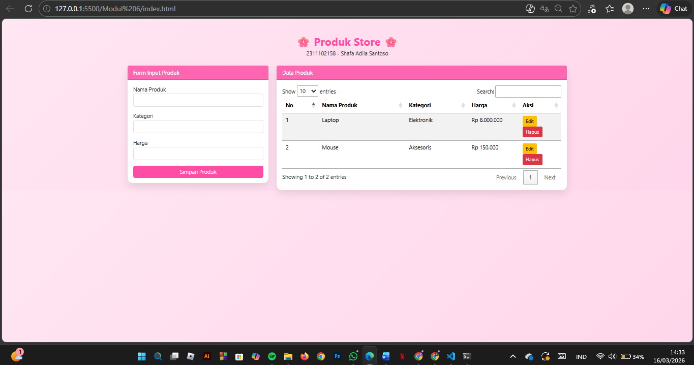
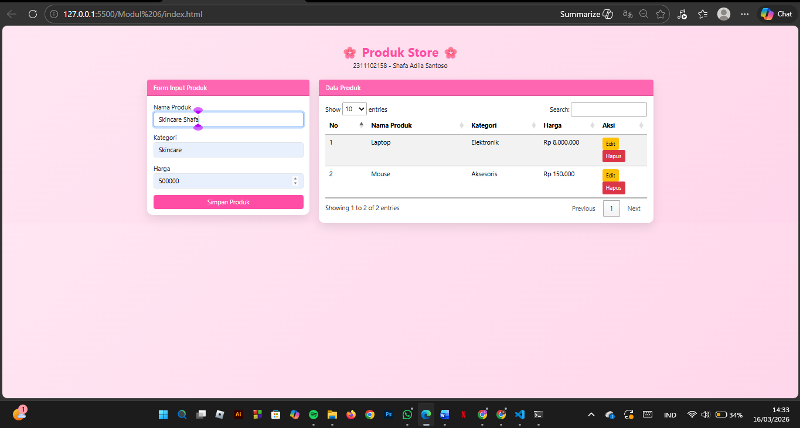
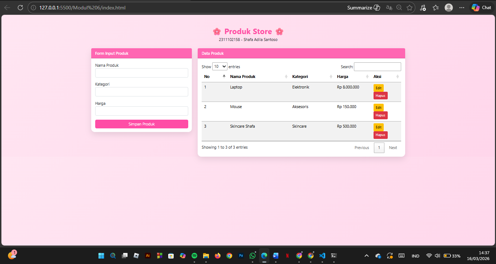
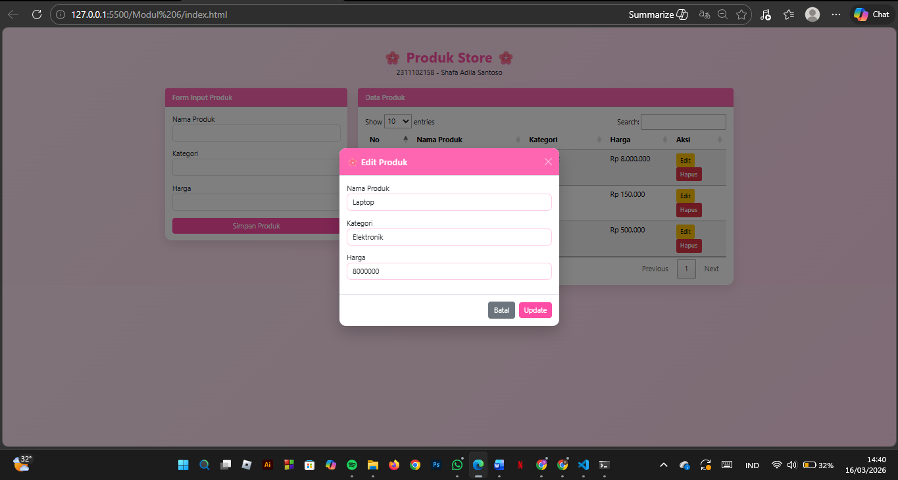
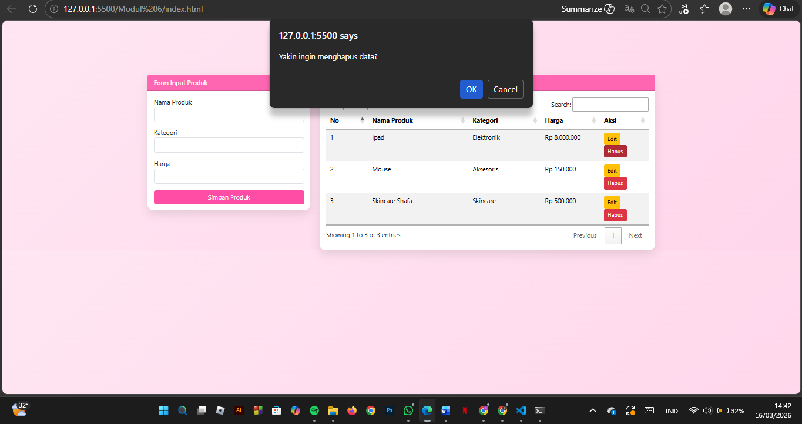
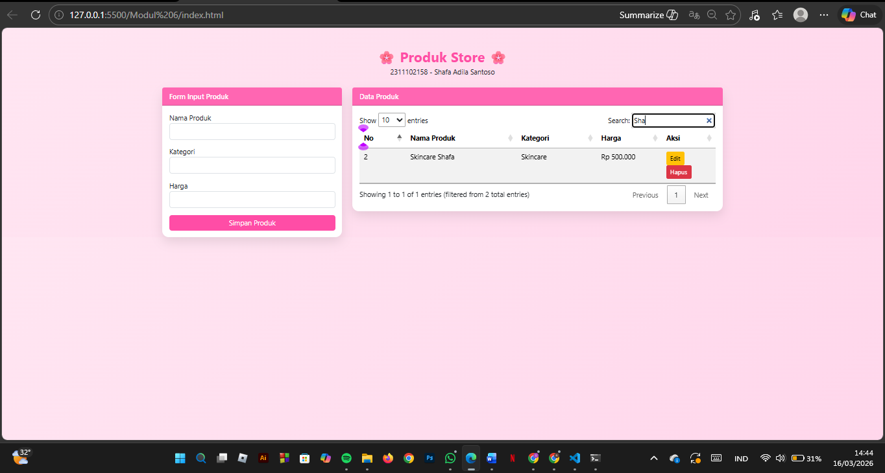

<div align="center">

# LAPORAN PRAKTIKUM  
# APLIKASI BERBASIS PLATFORM

## TUGAS
## CODING ON THE SPOT 1


### Disusun Oleh
**Shafa Adila Santoso**  
2311102158  
S1 IF-11-REG01

### Dosen Pengampu
**Dimas Fanny Hebrasianto Permadi, S.ST., M.Kom**

### Asisten Praktikum
Apri Pandu Wicaksono  
Rangga Pradarrell Fathi  

### LABORATORIUM HIGH PERFORMANCE  
FAKULTAS INFORMATIKA  
UNIVERSITAS TELKOM PURWOKERTO  
2026

</div>

---

<div align="justify">

# 1. Dasar Teori

Pemrograman web merupakan proses pembuatan aplikasi berbasis web yang dapat diakses melalui browser menggunakan berbagai teknologi seperti HTML, CSS, JavaScript, serta framework pendukung. Dalam pengembangan web modern, penggunaan framework sangat membantu dalam mempercepat proses pembangunan aplikasi karena menyediakan struktur, komponen, dan fungsi yang sudah siap digunakan.

Framework seperti Bootstrap digunakan untuk mempermudah pembuatan tampilan antarmuka (user interface) yang responsif dan menarik. Selain itu, jQuery sering digunakan untuk mempermudah manipulasi elemen HTML, pengolahan event, serta integrasi plugin seperti datatable untuk menampilkan data secara dinamis. Penggunaan JSON juga sering diterapkan untuk menyimpan dan mengirim data antara client dan server secara terstruktur.

Pada modul ini mahasiswa diminta untuk merancang aplikasi web dari suatu studi kasus dengan memanfaatkan beberapa komponen seperti form, tabel, dan operasi CRUD (Create, Read, Update, Delete). Tujuan dari kegiatan ini adalah agar mahasiswa mampu memahami arsitektur pemrograman web, mengelola data pada aplikasi, serta mengintegrasikan berbagai teknologi web seperti framework, plugin, dan data JSON dalam pengembangan aplikasi berbasis web.

---

**Code HTML**

```html
<!DOCTYPE html>
<html lang="id">
<head>
<meta charset="UTF-8">
<title>Produk Store</title>

<link href="https://cdn.jsdelivr.net/npm/bootstrap@5.3.2/dist/css/bootstrap.min.css" rel="stylesheet">
<link rel="stylesheet" href="https://cdn.datatables.net/1.13.6/css/jquery.dataTables.min.css">

<style>

body{
background: linear-gradient(135deg,#ffe6f2,#ffd6eb);
font-family: 'Segoe UI', sans-serif;
}

/* TITLE */
.page-title{
color:#ff4da6;
font-weight:700;
}

/* CARD */
.card{
border:none;
border-radius:15px;
box-shadow:0 10px 25px rgba(0,0,0,0.1);
}

.card-header{
background:#ff66b2;
color:white;
font-weight:600;
border-radius:15px 15px 0 0;
}

/* BUTTON */
.btn-pink{
background:#ff4da6;
color:white;
border:none;
}

.btn-delete{
background:#ff1a75;
color:white;
}

/* MODAL DESIGN */

.modal-content{
border-radius:15px;
border:none;
box-shadow:0 15px 35px rgba(0,0,0,0.2);
}

.modal-header{
background:#ff66b2;
color:white;
border-radius:15px 15px 0 0;
}

.modal-body input{
border-radius:10px;
border:1px solid #ffcce6;
}

.modal-body input:focus{
border-color:#ff4da6;
box-shadow:0 0 5px rgba(255,77,166,0.5);
}

.modal-footer .btn-success{
background:#ff4da6;
border:none;
}

.modal-footer .btn-success:hover{
background:#e60073;
}

</style>

</head>

<body>

<div class="container mt-5">

<h2 class="text-center page-title mb-1">
🌸 Produk Store 🌸
</h2>

<p class="text-center text-dark mb-4">
2311102158 - Shafa Adila Santoso
</p>

<div class="row">

<div class="col-md-4">

<div class="card">

<div class="card-header">
Form Input Produk
</div>

<div class="card-body">

<form id="formProduk">

<div class="mb-3">
<label>Nama Produk</label>
<input type="text" id="namaProduk" class="form-control" required>
</div>

<div class="mb-3">
<label>Kategori</label>
<input type="text" id="kategori" class="form-control" required>
</div>

<div class="mb-3">
<label>Harga</label>
<input type="number" id="harga" class="form-control" required>
</div>

<button type="submit" class="btn btn-pink w-100">
Simpan Produk
</button>

</form>

</div>
</div>

</div>


<div class="col-md-8">

<div class="card">

<div class="card-header">
Data Produk
</div>

<div class="card-body">

<table id="tabelProduk" class="table table-striped">

<thead>
<tr>
<th>No</th>
<th>Nama Produk</th>
<th>Kategori</th>
<th>Harga</th>
<th>Aksi</th>
</tr>
</thead>

<tbody></tbody>

</table>

</div>
</div>

</div>

</div>

</div>


<!-- MODAL EDIT -->

<div class="modal fade" id="editModal" tabindex="-1">
<div class="modal-dialog modal-dialog-centered">

<div class="modal-content">

<div class="modal-header">
<h5 class="modal-title">🌸 Edit Produk</h5>
<button class="btn-close btn-close-white" data-bs-dismiss="modal"></button>
</div>

<div class="modal-body">

<div class="mb-3">
<label>Nama Produk</label>
<input type="text" id="editNama" class="form-control">
</div>

<div class="mb-3">
<label>Kategori</label>
<input type="text" id="editKategori" class="form-control">
</div>

<div class="mb-3">
<label>Harga</label>
<input type="number" id="editHarga" class="form-control">
</div>

</div>

<div class="modal-footer">
<button class="btn btn-secondary" data-bs-dismiss="modal">Batal</button>
<button class="btn btn-success" onclick="updateProduk()">Update</button>
</div>

</div>
</div>
</div>


<script src="https://code.jquery.com/jquery-3.7.1.min.js"></script>
<script src="https://cdn.jsdelivr.net/npm/bootstrap@5.3.2/dist/js/bootstrap.bundle.min.js"></script>
<script src="https://cdn.datatables.net/1.13.6/js/jquery.dataTables.min.js"></script>

<script src="script.js"></script>

</body>
</html>
```
***Struktur Dasar HTML***

- `<!DOCTYPE html>`
Menandakan bahwa dokumen menggunakan standar HTML5.
- `<html lang="id">`
Menentukan bahasa yang digunakan pada halaman adalah Bahasa Indonesia.
- `<head>`
Berisi metadata halaman, judul halaman, serta pemanggilan library eksternal.
- `<meta charset="UTF-8">`
Mengatur encoding karakter agar teks dapat ditampilkan dengan benar.
- `<title>`
Menentukan judul halaman yang muncul pada tab browser.

***Library yang digunakan***

- Bootstrap CSS
https://cdn.jsdelivr.net/npm/bootstrap@5.3.2/dist/css/bootstrap.min.css.
Digunakan untuk membuat tampilan web lebih responsif dan rapi.
- DataTable CSS
https://cdn.datatables.net/1.13.6/css/jquery.dataTables.min.css.
Digunakan untuk membuat tabel interaktif seperti pencarian dan sorting data.
- jQuery, digunakan untuk mempermudah manipulasi elemen HTML dan pengolahan event.
- Bootstrap JS, digunakan agar komponen Bootstrap seperti modal dapat berfungsi.
- DataTables JS, digunakan untuk mengaktifkan fitur tabel dinamis.

***CSS Internal***

CSS pada bagian `<style>` digunakan untuk mengatur tampilan visual halaman web agar terlihat lebih menarik. Pada bagian **body**, diberikan latar belakang dengan warna gradasi pink serta pengaturan jenis font menggunakan *Segoe UI*. Selain itu terdapat pengaturan pada elemen **judul halaman (.page-title)** agar memiliki warna pink dan tampilan yang lebih tebal sehingga terlihat menonjol.

Selanjutnya CSS juga digunakan untuk mempercantik tampilan **card** yang digunakan sebagai wadah form input dan tabel data produk. Card diberi sudut membulat (*border-radius*), bayangan (*box-shadow*), serta warna header yang berbeda agar tampilan lebih modern dan rapi.

Selain itu terdapat pengaturan pada **tombol dan modal**. Tombol dibuat dengan warna pink agar sesuai dengan tema halaman, sedangkan modal digunakan sebagai jendela popup untuk proses edit data produk. Pada bagian modal juga ditambahkan efek fokus pada input agar pengguna lebih mudah melihat field yang sedang diisi.

***JavaScript***

File JavaScript eksternal dipanggil menggunakan kode `<script src="script.js"></script>`. File ini berfungsi untuk menjalankan logika utama dari aplikasi, seperti memproses data yang dimasukkan melalui form dan menampilkannya ke dalam tabel produk. Dengan adanya JavaScript, halaman web tidak hanya menampilkan tampilan statis tetapi juga dapat berinteraksi dengan pengguna.

Selain itu, JavaScript juga digunakan untuk mengelola operasi pada data produk seperti **menambahkan, mengedit, dan menghapus data**. Saat pengguna mengisi form dan menekan tombol simpan, data akan diproses oleh JavaScript kemudian ditambahkan ke dalam tabel secara otomatis tanpa perlu memuat ulang halaman.

JavaScript juga digunakan untuk mengintegrasikan tabel dengan **plugin DataTables** sehingga tabel memiliki fitur tambahan seperti pencarian data, pengurutan kolom, serta tampilan tabel yang lebih interaktif. Hal ini membuat pengelolaan data produk menjadi lebih mudah dan nyaman bagi pengguna.


**Code JS**

```js
let produkList = JSON.parse(localStorage.getItem("produkList")) || [
{
nama:"Laptop",
kategori:"Elektronik",
harga:8000000
},
{
nama:"Mouse",
kategori:"Aksesoris",
harga:150000
}
];

let editIndex = -1;

let table = $('#tabelProduk').DataTable();

renderTable();

function simpanLocal(){

localStorage.setItem("produkList", JSON.stringify(produkList));

}

$("#formProduk").submit(function(e){

e.preventDefault();

let produk = {
nama:$("#namaProduk").val(),
kategori:$("#kategori").val(),
harga:$("#harga").val()
};

produkList.push(produk);

simpanLocal();

renderTable();

$("#formProduk")[0].reset();

});

function renderTable(){

table.clear();

produkList.forEach((p,index)=>{

table.row.add([
index+1,
p.nama,
p.kategori,
"Rp "+Number(p.harga).toLocaleString(),
`
<button class="btn btn-warning btn-sm" onclick="editData(${index})">Edit</button>
<button class="btn btn-danger btn-sm" onclick="hapusData(${index})">Hapus</button>
`
]).draw(false);

});

}

function editData(index){

editIndex = index;

let produk = produkList[index];

$("#editNama").val(produk.nama);
$("#editKategori").val(produk.kategori);
$("#editHarga").val(produk.harga);

let modal = new bootstrap.Modal(document.getElementById('editModal'));
modal.show();

}

function updateProduk(){

produkList[editIndex] = {
nama:$("#editNama").val(),
kategori:$("#editKategori").val(),
harga:$("#editHarga").val()
};

simpanLocal();

renderTable();

bootstrap.Modal.getInstance(document.getElementById('editModal')).hide();

}

function hapusData(index){

if(confirm("Yakin ingin menghapus data?")){

produkList.splice(index,1);

simpanLocal();

renderTable();

}

}
```
Kode JavaScript tersebut digunakan untuk **mengelola data produk pada halaman web secara dinamis** menggunakan jQuery, DataTables, dan localStorage. Pada bagian awal, data produk diambil dari **localStorage** agar data tetap tersimpan di browser, dan jika belum ada data maka akan digunakan data awal seperti Laptop dan Mouse. Selanjutnya dibuat variabel `editIndex` untuk menyimpan posisi data yang sedang diedit serta inisialisasi **DataTables** untuk membuat tabel lebih interaktif. Program memiliki beberapa fungsi utama yaitu **menyimpan data ke localStorage (simpanLocal)**, **menambahkan produk baru melalui form**, **menampilkan data ke tabel (renderTable)**, **mengedit data melalui modal (editData dan updateProduk)**, serta **menghapus data produk (hapusData)**. Dengan fungsi-fungsi tersebut, pengguna dapat melakukan operasi **CRUD (Create, Read, Update, Delete)** pada data produk tanpa perlu memuat ulang halaman, sehingga aplikasi menjadi lebih interaktif dan mudah digunakan.


**Output:**

<p align="center">  </p> 
<p align="center"> </b> Tampilan awal form input produk</p>

<p align="center">  </p> 
<p align="center"> </b> Tampilan tambah produk</p>

<p align="center">  </p> 
<p align="center"> </b> Tampilan produk berhasil ditambah</p>

<p align="center">  </p> 
<p align="center"> </b> Tampilan edit produk</p>

<p align="center">  </p> 
<p align="center"> </b> Tampilan hapus produk</p>

<p align="center">  </p> 
<p align="center"> </b> Tampilan search produk</p>


# 2. Referensi
- [Materi Modul 6](https://drive.google.com/file/d/1jg6RH3fx_sxZP3Jp1BtE7E6ypgvK0Uu4/view?usp=sharing)

