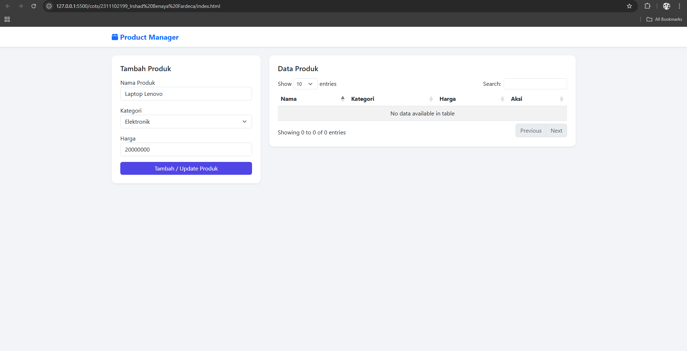
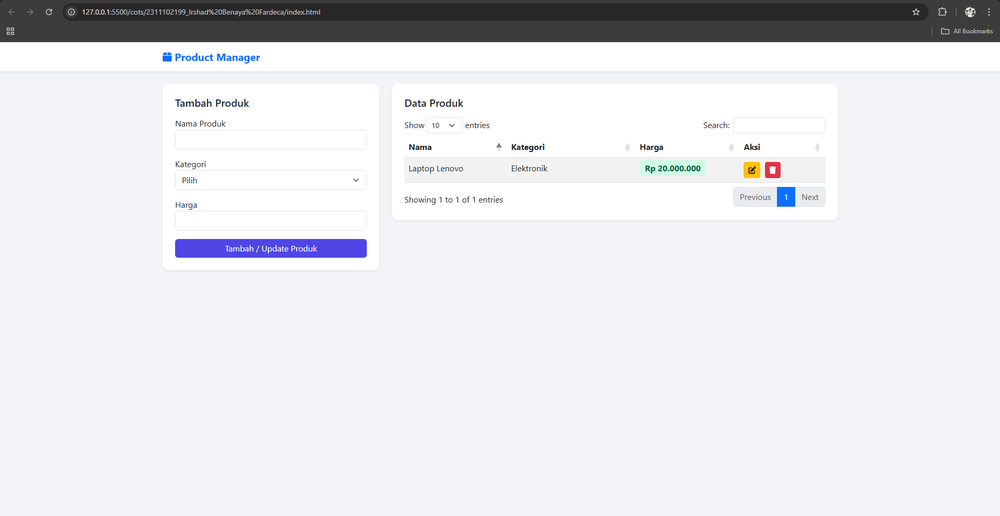
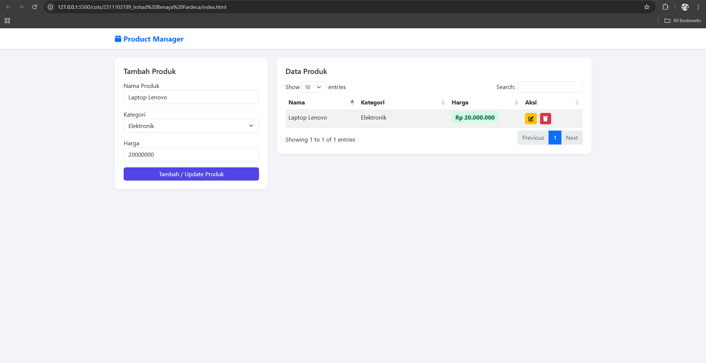
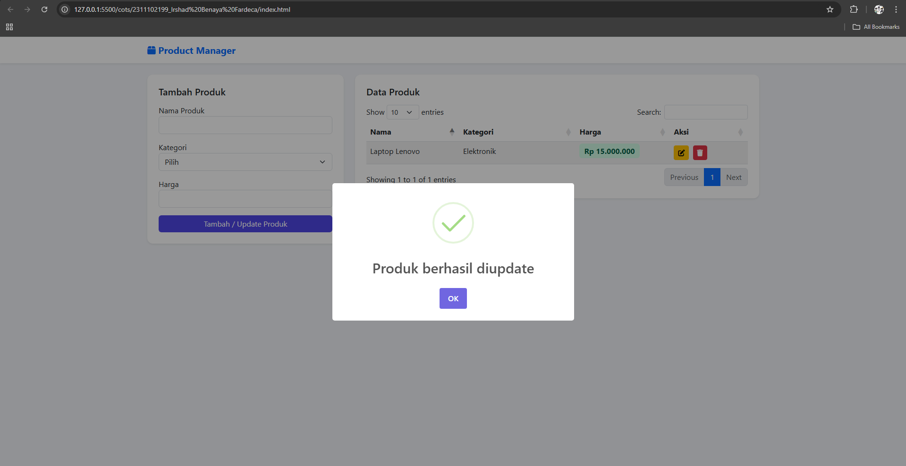
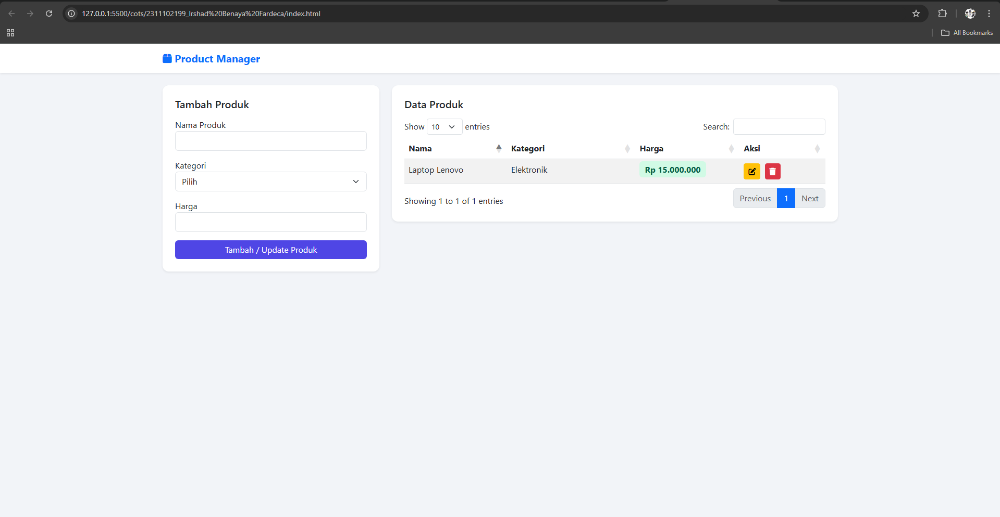
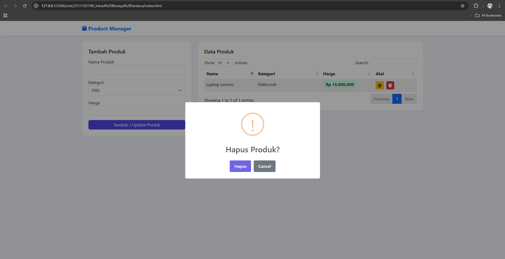

<div align="center">
  <br>

  <h1>LAPORAN PRAKTIKUM <br>
  APLIKASI BERBASIS PLATFORM
  </h1>

  <br>

  <h3>CODING ON THE SPOT</h3>

  <br>

  


  <br>
  <br>
  <br>

  <h3>Disusun Oleh :</h3>

  <p>
    <strong>Irshad Benaya Fardeca</strong><br>
    <strong>2311102199</strong><br>
    <strong>S1 IF-11-REG01</strong>
  </p>

  <br>

  <h3>Dosen Pengampu :</h3>

  <p>
    <strong>Dimas Fanny Hebrasianto Permadi, S.ST., M.Kom</strong>
  </p>
  
  <br>
  <br>
    <h4>Asisten Praktikum :</h4>
    <strong>Apri Pandu Wicaksono </strong> <br>
    <strong>Rangga Pradarrell Fathi</strong>
  <br>

  <h3>LABORATORIUM HIGH PERFORMANCE
 <br>FAKULTAS INFORMATIKA <br>UNIVERSITAS TELKOM PURWOKERTO <br>2026</h3>
</div>
<hr>

# Tugas COTS
Buatlah sebuah halaman web sederhana untuk menampilkan data produk. Pada halaman tersebut terdapat form input dan tabel data produk.

Ketentuan:
1. Gunakan Bootstrap untuk tampilan halaman.
2. Buat form input dengan data:
  * Nama Produk
  * Kategori
  * Harga
6. Data yang diinput dari form harus ditampilkan pada tabel.
7. Gunakan JQuery Datatable pada tabel.
8. Tambahkan tombol hapus pada setiap data di tabel.
9. Pastikan tabel memiliki fitur search dan pagination.
10. Bikin crud sederhana dengan sistem penyimpanan dengan mapping object

Output:
* Halaman memiliki form input produk
* Data yang dimasukkan muncul di tabel
* Tabel menggunakan Datatable
* Tampilan menggunakan Bootstrap

# Source Code
```html
<!-- Irshad Benaya Fardeca -->
<!-- 2311102199 -->
<!-- S1IF-11-01 -->

<!DOCTYPE html>
<html lang="id">

<head>
    <meta charset="UTF-8">
    <meta name="viewport" content="width=device-width, initial-scale=1.0">

    <title>Product Manager</title>

    <link href="https://cdn.jsdelivr.net/npm/bootstrap@5.3.0/dist/css/bootstrap.min.css" rel="stylesheet">

    <link href="https://cdn.datatables.net/1.13.6/css/dataTables.bootstrap5.min.css" rel="stylesheet">

    <link rel="stylesheet" href="https://cdnjs.cloudflare.com/ajax/libs/font-awesome/6.4.0/css/all.min.css">

    <script src="https://cdn.jsdelivr.net/npm/sweetalert2@11"></script>

    <style>
        body {
            background: #f2f4f8;
            font-family: Segoe UI, sans-serif;
        }

        .card {
            border-radius: 12px;
            border: none;
        }

        .btn-primary {
            background: #4f46e5;
            border: none;
        }

        .badge-price {
            background: #d1fae5;
            color: #065f46;
            padding: 5px 10px;
            border-radius: 6px;
            font-weight: bold;
        }
    </style>

</head>

<body>

    <nav class="navbar bg-white shadow-sm mb-4">
        <div class="container">
            <span class="navbar-brand fw-bold text-primary">
                <i class="fa-solid fa-box"></i> Product Manager
            </span>
        </div>
    </nav>

    <div class="container">

        <div class="row">

            <div class="col-lg-4">

                <div class="card p-4 shadow-sm">

                    <h5 class="mb-3">Tambah Produk</h5>

                    <form id="productForm">

                        <div class="mb-3">

                            <label>Nama Produk</label>

                            <input type="text" id="pName" class="form-control" required>

                        </div>

                        <div class="mb-3">

                            <label>Kategori</label>

                            <select id="pCategory" class="form-select" required>

                                <option value="">Pilih</option>
                                <option value="Elektronik">Elektronik</option>
                                <option value="Pakaian">Pakaian</option>
                                <option value="Makanan">Makanan</option>

                            </select>

                        </div>

                        <div class="mb-3">

                            <label>Harga</label>

                            <input type="number" id="pPrice" class="form-control" required>

                        </div>

                        <button class="btn btn-primary w-100">

                            Tambah / Update Produk

                        </button>

                    </form>

                </div>

            </div>

            <div class="col-lg-8">

                <div class="card p-4 shadow-sm">

                    <h5 class="mb-3">Data Produk</h5>

                    <table id="productTable" class="table table-striped">

                        <thead>

                            <tr>
                                <th>Nama</th>
                                <th>Kategori</th>
                                <th>Harga</th>
                                <th>Aksi</th>
                            </tr>

                        </thead>

                        <tbody>

                        </tbody>

                    </table>

                </div>

            </div>

        </div>

    </div>

    <script src="https://code.jquery.com/jquery-3.7.0.min.js"></script>

    <script src="https://cdn.datatables.net/1.13.6/js/jquery.dataTables.min.js"></script>

    <script src="https://cdn.datatables.net/1.13.6/js/dataTables.bootstrap5.min.js"></script>

    <script>

        let productData = []
        let table
        let editId = null

        function saveData() {

            localStorage.setItem("products", JSON.stringify(productData))

        }

        function loadData() {

            let data = localStorage.getItem("products")

            if (data) {

                productData = JSON.parse(data)

            }

        }

        function updateTable() {

            table.clear()

            productData.forEach(product => {

                table.row.add([

                    product.name,

                    product.category,

                    `<span class="badge-price">Rp ${product.price.toLocaleString('id-ID')}</span>`,

                    `<button class="btn btn-warning btn-sm me-1" onclick="editProduct(${product.id})">
<i class="fa fa-edit"></i>
</button>

<button class="btn btn-danger btn-sm" onclick="deleteProduct(${product.id})">
<i class="fa fa-trash"></i>
</button>`

                ])

            })

            table.draw()

        }

        function editProduct(id) {

            let product = productData.find(p => p.id === id)

            $("#pName").val(product.name)
            $("#pCategory").val(product.category)
            $("#pPrice").val(product.price)

            editId = id

        }

        function deleteProduct(id) {

            Swal.fire({

                title: "Hapus Produk?",
                icon: "warning",
                showCancelButton: true,
                confirmButtonText: "Hapus"

            }).then(result => {

                if (result.isConfirmed) {

                    productData = productData.filter(p => p.id !== id)

                    saveData()

                    updateTable()

                    Swal.fire("Data terhapus", "", "success")

                }

            })

        }

        $(document).ready(function () {

            table = $("#productTable").DataTable()

            loadData()

            updateTable()

            $("#productForm").submit(function (e) {

                e.preventDefault()

                let name = $("#pName").val()
                let category = $("#pCategory").val()
                let price = parseInt($("#pPrice").val())

                if (price <= 0) {

                    Swal.fire({

                        icon: "error",
                        title: "Harga harus lebih dari 0"

                    })

                    return

                }

                if (editId) {

                    let index = productData.findIndex(p => p.id === editId)

                    productData[index].name = name
                    productData[index].category = category
                    productData[index].price = price

                    editId = null

                    Swal.fire("Produk berhasil diupdate", "", "success")

                }

                else {

                    let item = {

                        id: Date.now(),
                        name: name,
                        category: category,
                        price: price

                    }

                    productData.push(item)

                    Swal.fire("Produk berhasil ditambahkan", "", "success")

                }

                saveData()

                updateTable()

                $("#productForm")[0].reset()

            })

        })

    </script>

</body>

</html>
```

# Product Manager
---

# Deskripsi Program

Program ini merupakan halaman web sederhana untuk mengelola data produk. Halaman ini memiliki **form input produk** dan **tabel data produk**. Data yang dimasukkan melalui form akan ditampilkan pada tabel menggunakan **JQuery DataTable** sehingga memiliki fitur **search, pagination, dan sorting**.

Program ini juga menerapkan **CRUD sederhana (Create, Read, Update, Delete)** serta menggunakan **LocalStorage** sebagai media penyimpanan data di browser.

---

# 1. Penggunaan Bootstrap

Tampilan halaman menggunakan **Bootstrap 5** untuk mempermudah pembuatan layout dan styling komponen.

Bootstrap digunakan untuk:

* Navbar
* Layout grid
* Card container
* Form input
* Tombol
* Tabel

Contoh penggunaan Bootstrap pada navbar:

```html
<nav class="navbar bg-white shadow-sm mb-4">
```

Kelas yang digunakan:

* `navbar` → membuat komponen navbar
* `bg-white` → memberikan warna background putih
* `shadow-sm` → memberikan efek bayangan
* `mb-4` → memberi jarak bawah

Layout halaman menggunakan sistem grid Bootstrap:

```html
<div class="row">
<div class="col-lg-4">
<div class="col-lg-8">
```

Artinya:

* **Form input** berada di sisi kiri (4 kolom)
* **Tabel produk** berada di sisi kanan (8 kolom)

---

# 2. Form Input Produk

Form digunakan untuk memasukkan data produk.

```html
<form id="productForm">
```

Form memiliki tiga input utama:

## Nama Produk

```html
<input type="text" id="pName" class="form-control" required>
```

Digunakan untuk memasukkan nama produk.

---

## Kategori Produk

```html
<select id="pCategory" class="form-select" required>
```

Kategori yang tersedia:

* Elektronik
* Pakaian
* Makanan

---

## Harga Produk

```html
<input type="number" id="pPrice" class="form-control" required>
```

Digunakan untuk memasukkan harga produk.

---

# 3. Tabel Data Produk

Data produk yang dimasukkan melalui form akan ditampilkan pada tabel.

```html
<table id="productTable" class="table table-striped">
```

Kolom tabel terdiri dari:

| Kolom    | Fungsi                      |
| -------- | --------------------------- |
| Nama     | Menampilkan nama produk     |
| Kategori | Menampilkan kategori produk |
| Harga    | Menampilkan harga produk    |
| Aksi     | Tombol edit dan hapus       |

---

# 4. Penggunaan JQuery DataTable

Tabel menggunakan **JQuery DataTable** untuk memberikan fitur tambahan seperti:

* Search data
* Pagination
* Sorting
* Tampilan tabel yang lebih interaktif

Library DataTable dipanggil melalui CDN:

```html
<script src="https://cdn.datatables.net/1.13.6/js/jquery.dataTables.min.js"></script>
```

Kemudian diaktifkan dengan kode:

```javascript
table = $("#productTable").DataTable()
```

---

# 5. Tombol Aksi (Edit dan Hapus)

Setiap baris data memiliki tombol aksi:

* Tombol **Edit**
* Tombol **Hapus**

Contoh kode tombol aksi:

```javascript
<button class="btn btn-warning btn-sm me-1" onclick="editProduct(${product.id})">
<i class="fa fa-edit"></i>
</button>

<button class="btn btn-danger btn-sm" onclick="deleteProduct(${product.id})">
<i class="fa fa-trash"></i>
</button>
```

---

# 6. Implementasi CRUD

Program ini menerapkan operasi **CRUD (Create, Read, Update, Delete)**.

## Create (Tambah Data)

Saat form disubmit, data produk akan diambil dari input form dan dimasukkan ke dalam array.

```javascript
let item = {
 id: Date.now(),
 name: name,
 category: category,
 price: price
}
```

Data kemudian dimasukkan ke dalam array:

```javascript
productData.push(item)
```

---

## Read (Menampilkan Data)

Data yang tersimpan akan ditampilkan ke tabel menggunakan fungsi:

```javascript
updateTable()
```

Fungsi ini melakukan perulangan pada array produk dan menambahkan setiap produk ke tabel.

---

## Update (Edit Data)

Ketika tombol edit ditekan:

```javascript
editProduct(id)
```

Data produk akan dimasukkan kembali ke dalam form untuk diedit.

Jika form disubmit saat mode edit, maka data produk akan diperbarui.

---

## Delete (Hapus Data)

Tombol hapus akan memanggil fungsi:

```javascript
deleteProduct(id)
```

Sebelum menghapus data, program akan menampilkan konfirmasi menggunakan **SweetAlert**.

Jika pengguna menekan tombol konfirmasi, maka data akan dihapus dari array produk.

---

# 7. Penyimpanan Data dengan Mapping Object

Data produk disimpan dalam bentuk **array of object**.

```javascript
let productData = []
```

Struktur object produk:

```javascript
{
 id: Date.now(),
 name: name,
 category: category,
 price: price
}
```

Setiap produk memiliki beberapa properti:

| Properti | Keterangan      |
| -------- | --------------- |
| id       | ID unik produk  |
| name     | Nama produk     |
| category | Kategori produk |
| price    | Harga produk    |

---

# 8. Penyimpanan Data Menggunakan LocalStorage

Agar data tidak hilang ketika halaman direfresh, program menggunakan **LocalStorage**.

## Menyimpan data

```javascript
localStorage.setItem("products", JSON.stringify(productData))
```

---

## Mengambil data

```javascript
let data = localStorage.getItem("products")
productData = JSON.parse(data)
```

Dengan cara ini data produk tetap tersimpan di browser.

---

# 9. Validasi Input Harga

Program memiliki validasi agar harga tidak boleh bernilai 0 atau negatif.

```javascript
if (price <= 0)
```

Jika harga tidak valid maka akan muncul pesan error menggunakan **SweetAlert**.

---

# 10. Format Harga Rupiah

Harga produk ditampilkan dalam format Rupiah menggunakan fungsi:

```javascript
product.price.toLocaleString('id-ID')
```

Contoh hasil tampilan:

```
Rp 10.000
Rp 25.000
Rp 100.000
```

---

# Output
### Create




### Update




### Delete


