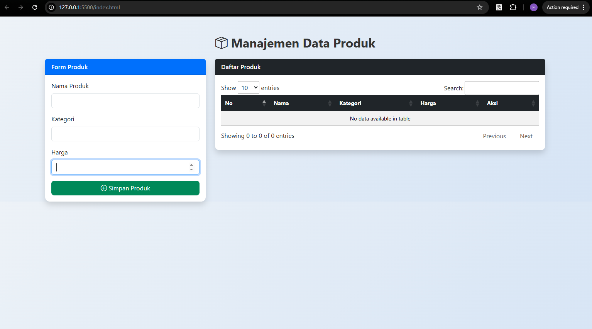
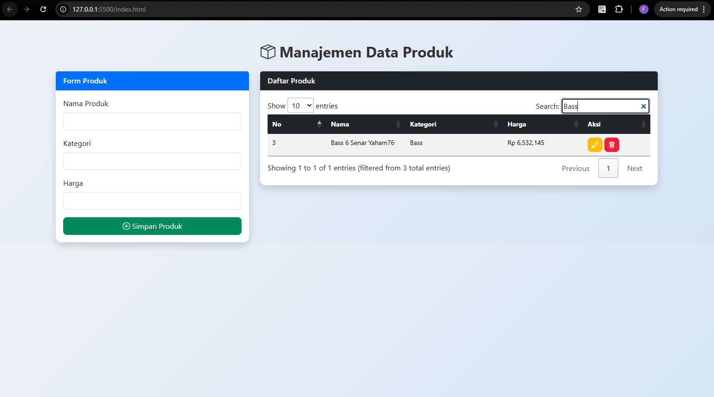
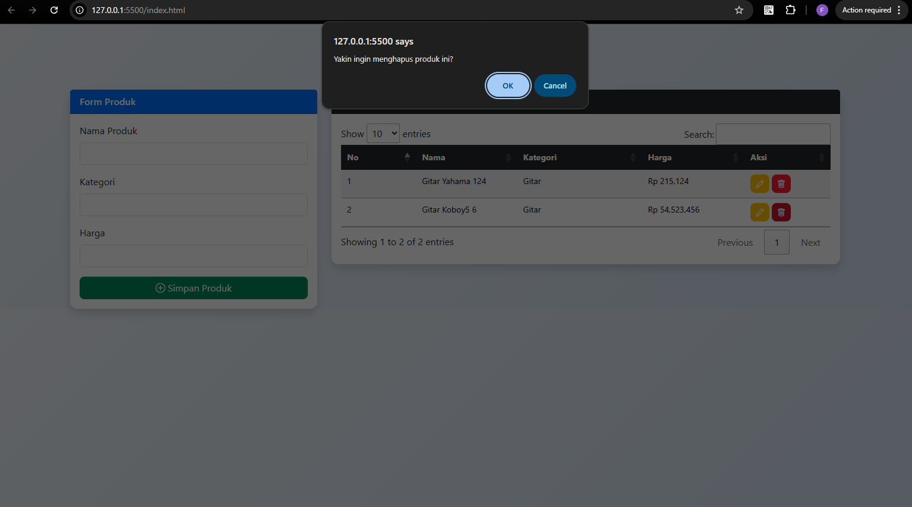

<div align="center">

<br>

<h1>
LAPORAN PRAKTIKUM<br>
APLIKASI BERBASIS PLATFORM
</h1>

<br>

<h3>
DATA PRODUK<br>
Bootstrap, jQuery DataTables & JavaScript
</h3>

<br><br>


<br><br><br>

<h3>Disusun Oleh</h3>

<strong>M. Faleno Albar Firjatulloh</strong><br>
<strong>2311102297</strong><br>
<strong>S1 IF-11-01</strong>

<br><br>

<h3>Dosen Pengampu</h3>

<strong>Dimas Fanny Hebrasianto Permadi, S.ST., M.Kom</strong>

<br><br>

<h3>Asisten Praktikum</h3>

<strong>Apri Pandu Wicaksono</strong><br>
<strong>Rangga Pradarrell Fathi</strong>

<br><br><br>

<h3>
LABORATORIUM HIGH PERFORMANCE<br>
FAKULTAS INFORMATIKA<br>
UNIVERSITAS TELKOM PURWOKERTO<br>
2026
</h3>

</div>

# 1. Dasar Teori

Pengembangan aplikasi web dinamis bergantung pada implementasi konsep CRUD (Create, Read, Update, Delete) yang memungkinkan manipulasi data secara real-time di sisi klien menggunakan JavaScript tanpa selalu membebani server. Untuk mendukung fungsionalitas ini, aspek visual dan kemudahan navigasi diperkuat dengan penggunaan Bootstrap sebagai framework CSS penyedia komponen antarmuka responsif, serta plugin jQuery DataTables yang secara otomatis mengoptimalkan penyajian data tabel melalui fitur pencarian, pengurutan, dan navigasi halaman. 

Sementara itu, di balik layar, efisiensi pengelolaan data dicapai melalui metode Object Mapping, di mana penyimpanan data berbasis kunci unik (key-value) memungkinkan proses akses dan pembaruan informasi dilakukan secara cepat dengan kompleksitas waktu \(O(1)\).

---

# 2. Penjelasan Kode HTML, CSS, dan JavaScript

## Kode HTML (`index.html`)
```html
<!DOCTYPE html>
<html lang="id">
<head>
    <meta charset="UTF-8">
    <meta name="viewport" content="width=device-width, initial-scale=1.0">
    <title>Manajemen Produk</title>

    <link href="https://cdn.jsdelivr.net/npm/bootstrap@5.3.2/dist/css/bootstrap.min.css" rel="stylesheet">
    <link rel="stylesheet" href="https://cdn.jsdelivr.net/npm/bootstrap-icons@1.11.1/font/bootstrap-icons.css">
    <link rel="stylesheet" href="https://cdn.datatables.net/1.13.6/css/jquery.dataTables.min.css">
    
    <link rel="stylesheet" href="style.css">
</head>

<body>
    <div class="container mt-5">
        <header class="text-center mb-5">
            <h2 class="fw-bold">
                <i class="bi bi-box-seam text-primary"></i> Manajemen Data Produk
            </h2>
            <p class="text-muted">Kelola inventaris barang dengan cepat dan mudah</p>
        </header>

        <div class="row g-4">
            <div class="col-md-4">
                <div class="card border-0 shadow-sm">
                    <div class="card-header bg-primary text-white py-3">
                        <h5 class="card-title mb-0">Form Produk</h5>
                    </div>
                    <div class="card-body p-4">
                        <form id="formProduk">
                            <input type="hidden" id="indexEdit">

                            <div class="mb-3">
                                <label for="namaProduk" class="form-label">Nama Produk</label>
                                <input type="text" id="namaProduk" class="form-control" placeholder="Contoh: Laptop" required>
                            </div>

                            <div class="mb-3">
                                <label for="kategori" class="form-label">Kategori</label>
                                <input type="text" id="kategori" class="form-control" placeholder="Contoh: Elektronik" required>
                            </div>

                            <div class="mb-3">
                                <label for="harga" class="form-label">Harga</label>
                                <div class="input-group">
                                    <span class="input-group-text">Rp</span>
                                    <input type="number" id="harga" class="form-control" placeholder="0" required>
                                </div>
                            </div>

                            <hr>
                            <button type="submit" class="btn btn-success w-100 py-2">
                                <i class="bi bi-save"></i> Simpan Produk
                            </button>
                        </form>
                    </div>
                </div>
            </div>

            <div class="col-md-8">
                <div class="card border-0 shadow-sm">
                    <div class="card-header bg-dark text-white py-3">
                        <h5 class="card-title mb-0">Daftar Produk Terdaftar</h5>
                    </div>
                    <div class="card-body p-4">
                        <div class="table-responsive">
                            <table id="tabelProduk" class="table table-hover w-100">
                                <thead class="table-light">
                                    <tr>
                                        <th width="5%">No</th>
                                        <th>Nama</th>
                                        <th>Kategori</th>
                                        <th>Harga</th>
                                        <th width="20%">Aksi</th>
                                    </tr>
                                </thead>
                                <tbody>
                                    </tbody>
                            </table>
                        </div>
                    </div>
                </div>
            </div>
        </div> </div> <script src="https://code.jquery.com/jquery-3.7.1.min.js"></script>
    <script src="https://cdn.jsdelivr.net/npm/bootstrap@5.3.2/dist/js/bootstrap.bundle.min.js"></script>
    <script src="https://cdn.datatables.net/1.13.6/js/jquery.dataTables.min.js"></script>

    <script src="script.js"></script>
</body>
</html>
```
## Kode CSS (`style.css`)
```css
/* --- Global Styles --- */
body {
    background: linear-gradient(135deg, #eef2f7, #d9e4f5);
    font-family: 'Segoe UI', Tahoma, Geneva, Verdana, sans-serif;
    min-height: 100vh;
    color: #333;
}

h2 {
    font-weight: 700;
    color: #2c3e50;
    letter-spacing: -0.5px;
}

/* --- Card Components --- */
.card {
    border: none;
    border-radius: 12px;
    transition: transform 0.2s ease-in-out;
}

.card-header {
    font-weight: 600;
    border-top-left-radius: 12px !important;
    border-top-right-radius: 12px !important;
    text-transform: uppercase;
    font-size: 0.85rem;
    letter-spacing: 1px;
}

/* --- Table & DataTables Customization --- */
.table {
    font-size: 14px;
    vertical-align: middle;
}

.dataTables_wrapper .dataTables_filter input {
    border-radius: 6px;
    border: 1px solid #dee2e6;
    padding: 6px 12px;
    margin-left: 10px;
    outline: none;
}

.dataTables_wrapper .dataTables_filter input:focus {
    border-color: #80bdff;
    box-shadow: 0 0 0 0.2rem rgba(0, 123, 255, 0.25);
}

/* --- Buttons --- */
.btn {
    border-radius: 8px;
    font-weight: 500;
    padding: 8px 16px;
    transition: all 0.3s ease;
}

.btn-warning {
    color: white;
}

.btn-warning:hover {
    color: white;
    filter: brightness(90%);
}

/* --- Form Elements --- */
.form-control {
    border-radius: 8px;
    padding: 10px;
}

.form-control:focus {
    box-shadow: none;
    border-color: #0d6efd;
}
```
## Kode JavaScript (`script.js`)
```js
/**
 * Variabel Global
 * Menggunakan Array untuk menampung data produk
 */
let produkList = [];
let table;

$(document).ready(function () {
    // Inisialisasi DataTables
    table = $('#tabelProduk').DataTable({
        language: {
            search: "Cari Produk:",
            lengthMenu: "Tampilkan _MENU_ data",
            zeroRecords: "Data tidak ditemukan",
            info: "Menampilkan halaman _PAGE_ dari _PAGES_",
        }
    });

    // Event Handler: Submit Form
    $("#formProduk").on("submit", function (e) {
        e.preventDefault();

        const indexEdit = $("#indexEdit").val();
        const produk = {
            nama: $("#namaProduk").val(),
            kategori: $("#kategori").val(),
            harga: parseInt($("#harga").val())
        };

        if (indexEdit === "") {
            // Mode: Tambah Data Baru
            produkList.push(produk);
        } else {
            // Mode: Update Data
            produkList[indexEdit] = produk;
            resetForm();
        }

        renderTable();
        this.reset();
    });
});

/**
 * Fungsi untuk merender ulang isi tabel
 */
function renderTable() {
    table.clear();

    produkList.forEach((p, index) => {
        const aksiButtons = `
            <div class="d-flex gap-1">
                <button class="btn btn-warning btn-sm" onclick="editProduk(${index})">
                    <i class="bi bi-pencil-square"></i>
                </button>
                <button class="btn btn-danger btn-sm" onclick="hapusProduk(${index})">
                    <i class="bi bi-trash"></i>
                </button>
            </div>
        `;

        table.row.add([
            index + 1,
            p.nama,
            p.kategori,
            "Rp " + p.harga.toLocaleString('id-ID'),
            aksiButtons
        ]);
    });

    table.draw();
}

/**
 * Fungsi untuk mengambil data ke form saat tombol edit ditekan
 */
function editProduk(index) {
    const produk = produkList[index];

    $("#namaProduk").val(produk.nama);
    $("#kategori").val(produk.kategori);
    $("#harga").val(produk.harga);
    $("#indexEdit").val(index);

    // Ubah teks tombol simpan agar user tahu sedang dalam mode edit
    $("button[type='submit']").html('<i class="bi bi-check-circle"></i> Perbarui Produk').addClass("btn-info").removeClass("btn-success");
}

/**
 * Fungsi untuk menghapus data dari array
 */
function hapusProduk(index) {
    if (confirm("Apakah Anda yakin ingin menghapus produk ini?")) {
        produkList.splice(index, 1);
        renderTable();
        
        // Jika sedang mengedit data yang dihapus, reset formnya
        if ($("#indexEdit").val() == index) {
            resetForm();
        }
    }
}

/**
 * Helper: Reset Form ke kondisi awal
 */
function resetForm() {
    $("#indexEdit").val("");
    $("#formProduk")[0].reset();
    $("button[type='submit']").html('<i class="bi bi-plus-circle"></i> Simpan Produk').addClass("btn-success").removeClass("btn-info");
}
```

---

# Hasil Tampilan (Screenshot)

### 1. Tampilan Awal Halaman



### 2. Input Data & Data Berhasil Diinput


.PNG)

### 3. Fitur Pencarian



### 4. Hapus Data



---

# Penjelasan Kode

Pada bagian awal kode dimasukkan beberapa library seperti Bootstrap untuk mengatur tampilan agar lebih rapi dan responsif, Bootstrap Icons untuk menambahkan ikon pada tombol, jQuery untuk mempermudah manipulasi elemen HTML, serta DataTables yang digunakan untuk memberikan fitur tambahan pada tabel seperti search, pagination, dan sorting.

Struktur halaman terdiri dari sebuah container Bootstrap yang berisi dua bagian utama yaitu form input produk dan tabel data produk. Form digunakan untuk memasukkan data produk yang terdiri dari nama produk, kategori, dan harga. Di dalam form juga terdapat sebuah hidden input bernama `indexEdit` yang berfungsi untuk menyimpan index data ketika pengguna sedang mengedit produk.

Tabel produk digunakan untuk menampilkan seluruh data yang dimasukkan melalui form. Tabel memiliki beberapa kolom yaitu No, Nama Produk, Kategori, Harga, dan Aksi. Pada kolom aksi terdapat tombol edit dan hapus yang memungkinkan pengguna untuk memperbarui atau menghapus data produk.

Pada bagian JavaScript dibuat sebuah variabel array bernama `produkList` yang berfungsi untuk menyimpan data produk dalam bentuk object. Setiap produk disimpan dengan struktur data yang berisi nama, kategori, dan harga.

Ketika pengguna menekan tombol **Simpan Produk**, sistem menjalankan event submit pada form. Fungsi `preventDefault()` digunakan agar halaman tidak melakukan reload. Nilai dari setiap input kemudian diambil menggunakan jQuery dan dimasukkan ke dalam sebuah object produk. Jika tidak dalam kondisi edit maka data ditambahkan menggunakan `push()`, sedangkan jika sedang edit maka data diperbarui berdasarkan index yang tersimpan.

Setelah data diperbarui atau ditambahkan, fungsi `renderTable()` dipanggil untuk menampilkan kembali seluruh data pada tabel. Fungsi ini akan mengosongkan isi tabel terlebih dahulu menggunakan `table.clear()` kemudian mengisi ulang tabel dengan data dari array `produkList`.

Fungsi `editProduk()` digunakan untuk mengambil data berdasarkan index lalu menampilkannya kembali ke dalam form agar dapat diubah. Sedangkan fungsi `hapusProduk()` digunakan untuk menghapus data produk menggunakan `splice()` lalu memperbarui tabel dengan memanggil kembali `renderTable()`.

Dengan kombinasi Bootstrap dan CSS tambahan, tampilan halaman menjadi lebih rapi dan nyaman digunakan. Data disimpan sementara menggunakan array object pada JavaScript, sementara tampilan tabel dibuat lebih interaktif dengan bantuan plugin jQuery DataTables.

---

# 3. Referensi

- https://getbootstrap.com/docs/5.3/  
- https://datatables.net/manual/  
- https://icons.getbootstrap.com/  
- https://developer.mozilla.org/en-US/docs/Web/JavaScript  
- https://fonts.google.com/specimen/Plus+Jakarta+Sans
