<div align="center">

<br>

<h1>
LAPORAN PRAKTIKUM <br>
APLIKASI BERBASIS PLATFORM
</h1>

<br>

<h3>
TUGAS COTS <br>
</h3>

<br>


<br><br><br>

<h3>Disusun Oleh :</h3>

<strong>Boutefhika Nuha Ziyadatul Khair</strong><br>
<strong>2311102316</strong><br>
<strong>S1 IF-11-01</strong>

<br><br>

<h3>Dosen Pengampu :</h3>

<strong>Dimas Fanny Hebrasianto Permadi, S.ST., M.Kom</strong>

<br><br>

<h4>Asisten Praktikum :</h4>

Apri Pandu Wicaksono <br>
Rangga Pradarrell Fathi

<br><br>

<h3>
LABORATORIUM HIGH PERFORMANCE <br>
FAKULTAS INFORMATIKA <br>
UNIVERSITAS TELKOM PURWOKERTO <br>
2026
</h3>

</div>

<hr>


# Deskripsi Tugas
Buatlah sebuah halaman web sederhana untuk menampilkan data produk. Pada halaman tersebut terdapat form input dan tabel data produk.
Ketentuan:
1. Gunakan Bootstrap untuk tampilan halaman.
2. Buat form input dengan data:
   * Nama Produk
   * Kategori
   * Harga
3. Data yang diinput dari form harus ditampilkan pada tabel.
4. Gunakan JQuery Datatable pada tabel.
5. Tambahkan tombol hapus pada setiap data di tabel.
6. Pastikan tabel memiliki fitur search dan pagination.
7. Bikin crud sederhana dengan sistem penyimpanan dengan mapping object.
Output:
* Halaman memiliki form input produk
* Data yang dimasukkan muncul di tabel
* Tabel menggunakan Datatable
* Tampilan menggunakan Bootstrap

# Program & Penjelasan

## 1.1 Implementasi Bootstrap
Website **GlowCare – Skincare Store** dibangun menggunakan framework CSS **Bootstrap** untuk mempermudah pembuatan tampilan antarmuka yang responsif dan modern.
Bootstrap digunakan untuk beberapa komponen utama seperti:
- Grid layout (`row`, `col-md-*`)
- Form input (`form-control`, `form-select`)
- Komponen tombol
- Responsive layout
Contoh penggunaan Bootstrap pada kode:
```
<link href="https://cdn.jsdelivr.net/npm/bootstrap@5.3.6/dist/css/bootstrap.min.css" rel="stylesheet">
```

## 1.2 Form Input Produk
Pada bagian Tambah Produk Baru, terdapat form yang digunakan untuk memasukkan data produk skincare.
Form ini terdiri dari beberapa field input:
| Field       | Tipe Input | Keterangan                                             |
| ----------- | ---------- | ------------------------------------------------------ |
| Nama Produk | Text       | Digunakan untuk memasukkan nama produk skincare        |
| Kategori    | Select     | Pilihan kategori produk seperti Cleanser, Toner, Serum |
| Harga       | Number     | Digunakan untuk memasukkan harga produk                |
| Stok        | Number     | Digunakan untuk memasukkan jumlah stok produk          |
Contoh kode form input:
```
<input type="text" class="form-control" id="namaProduk">

<select class="form-select" id="kategoriProduk">
<option>Cleanser</option>
<option>Toner</option>
<option>Serum</option>
<option>Moisturizer</option>
<option>Sunscreen</option>
</select>

<input type="number" class="form-control" id="hargaProduk">

<input type="number" class="form-control" id="stokProduk">
```
Ketika tombol Tambah ke Katalog ditekan, data akan diproses menggunakan JavaScript dan disimpan pada array data produk.

## 1.3 Input Data Produk
Setiap data produk yang dimasukkan akan disimpan dalam array JavaScript.
```
let dataProduk = [];
```
Ketika pengguna menambahkan produk baru, data akan dimasukkan ke dalam array menggunakan metode push().
```
dataProduk.push({ nama, kategori, harga, stok });
```
Setelah data dimasukkan, fungsi render() akan dipanggil untuk menampilkan data produk pada halaman web.

## Penggunaan JQuery Datatable pada Tabel

Tabel produk pada aplikasi **GlowCare – Skincare Store** menggunakan plugin **jQuery DataTable** untuk meningkatkan fungsionalitas tabel. Plugin ini memungkinkan tabel memiliki fitur interaktif seperti pencarian data, pengurutan kolom, serta pagination secara otomatis.

Dengan menggunakan DataTable, pengguna dapat dengan mudah mencari data produk tertentu dan mengatur jumlah data yang ditampilkan pada tabel.

## 1.4 Fitur DataTable yang Digunakan
| Fitur | Fungsi |
|------|------|
| Search | Mencari data produk secara real-time |
| Pagination | Membagi data ke dalam beberapa halaman |
| Sorting | Mengurutkan data berdasarkan kolom |
| Length Menu | Mengatur jumlah data yang ditampilkan |
Library yang digunakan:
Untuk menggunakan DataTable, perlu menambahkan beberapa library berikut pada halaman HTML:
```
<link rel="stylesheet" href="https://cdn.datatables.net/1.10.21/css/dataTables.bootstrap5.min.css">

<script src="https://code.jquery.com/jquery-3.5.1.js"></script>
<script src="https://cdn.datatables.net/1.10.21/js/jquery.dataTables.min.js"></script>
<script src="https://cdn.datatables.net/1.10.21/js/dataTables.bootstrap5.min.js"></script>
```
Inisialisasi DataTable:
Tabel produk kemudian diinisialisasi menggunakan fungsi berikut:
```
$(document).ready(function () {
    $('#tabelProduk').DataTable({
        pageLength: 5,
        lengthMenu: [5, 10, 25, 50],
        order: [[0, 'asc']]
    });
});
```
Penjelasan
| Konfigurasi  | Fungsi                                                  |
| ------------ | ------------------------------------------------------- |
| `pageLength` | Menentukan jumlah data yang tampil pada halaman pertama |
| `lengthMenu` | Pilihan jumlah data yang dapat ditampilkan              |
| `order`      | Mengatur urutan default tabel                           |
Dengan konfigurasi tersebut, tabel produk dapat menampilkan data secara lebih terstruktur dan memudahkan pengguna dalam mengelola serta mencari data produk.

## 1.5 Tampilan Produk (Grid View)
Produk yang telah ditambahkan akan ditampilkan dalam bentuk grid produk.
Fungsi yang digunakan untuk menampilkan produk pada grid adalah:
```
function renderGrid()
```
Informasi yang ditampilkan pada kartu produk antara lain:
* Nama produk
* Kategori produk
* Harga produk
* Jumlah stok produk
Selain itu, setiap kartu produk juga memiliki tombol aksi:
* Tombol Edit
* Tombol Hapus
Tampilan grid ini membuat katalog produk terlihat lebih menarik dan menyerupai tampilan toko online.

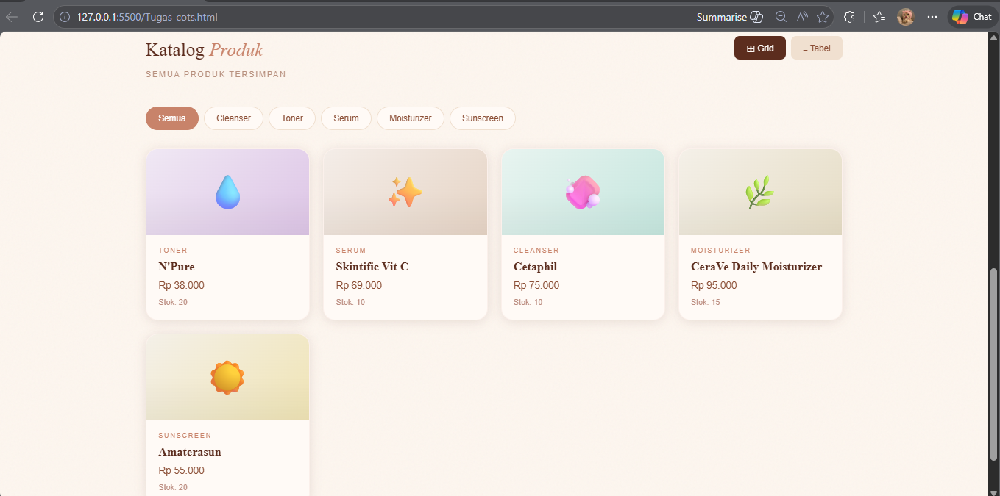

## 1.6 Tampilan Produk (Table View)
Selain grid view, sistem juga menyediakan table view untuk melihat data produk dalam bentuk tabel.
Fungsi yang digunakan untuk menampilkan tabel adalah:
```
function renderTable()
```
Struktur tabel terdiri dari beberapa kolom berikut:
| No | Produk | Kategori | Harga | Stok | Aksi |
| -- | ------ | -------- | ----- | ---- | ---- |
Pada kolom aksi terdapat tombol:
* Edit produk
* Hapus produk
Pengguna dapat berpindah antara tampilan grid dan tabel menggunakan tombol navigasi.

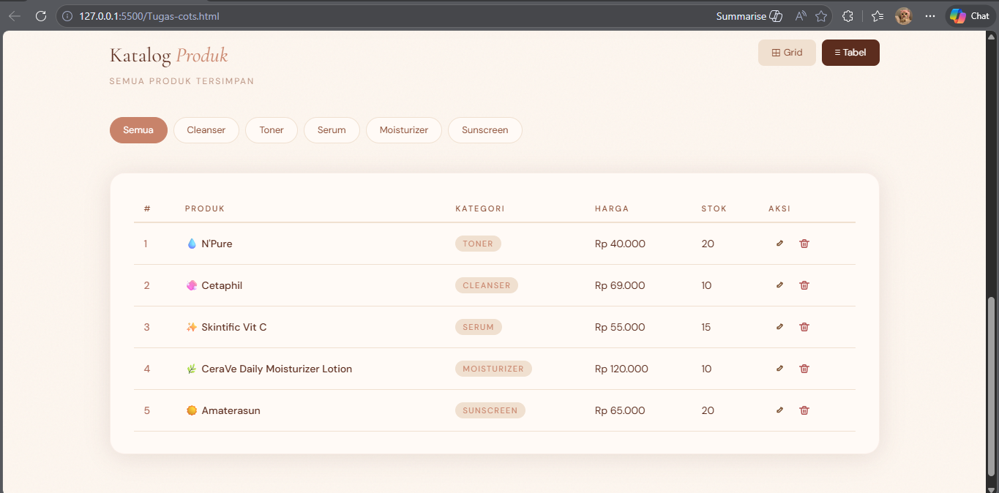

## 1.7 Fitur Hapus Produk
Fitur hapus digunakan untuk menghapus produk dari sistem.
Contoh kode untuk menghapus data:
```
dataProduk.splice(id, 1);
```
Ketika tombol hapus ditekan:
* Produk dihapus dari array dataProduk
* Tampilan katalog diperbarui
* Sistem menampilkan notifikasi bahwa produk berhasil dihapus

## 1.8 Fitur Edit Produk
Selain menghapus data, pengguna juga dapat memperbarui informasi produk menggunakan fitur Edit Produk.
Ketika tombol edit ditekan:
* Data produk dimasukkan ke dalam form edit
* Modal edit ditampilkan
* Pengguna dapat mengubah data produk
Contoh kode update data:
```
dataProduk[id] = {
nama: editNama,
kategori: editKategori,
harga: editHarga,
stok: editStok
};
```
Setelah tombol Simpan Perubahan ditekan, data produk akan diperbarui dan ditampilkan kembali pada katalog.

## 1.9 Fitur Filter Produk Berdasarkan Kategori
Pada halaman katalog produk terdapat fitur **filter kategori** yang memungkinkan pengguna untuk menampilkan produk berdasarkan jenis kategori tertentu.
Beberapa kategori yang tersedia pada aplikasi ini antara lain:
- Semua
- Cleanser
- Toner
- Serum
- Moisturizer
- Sunscreen
Ketika pengguna menekan salah satu tombol kategori, sistem akan menampilkan hanya produk dengan kategori yang sesuai. Contoh:
- Jika tombol **Cleanser** ditekan, maka hanya produk kategori Cleanser yang akan ditampilkan.
  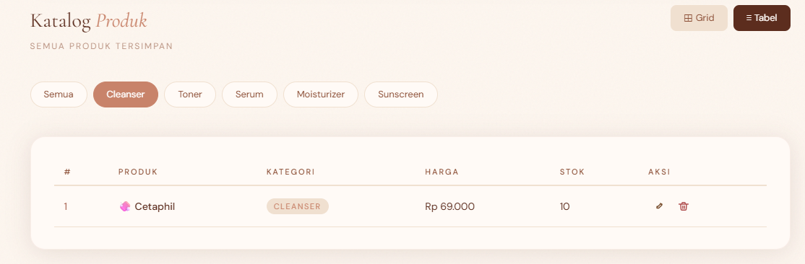
- Jika tombol **Serum** ditekan, maka hanya produk kategori Serum yang akan muncul.
  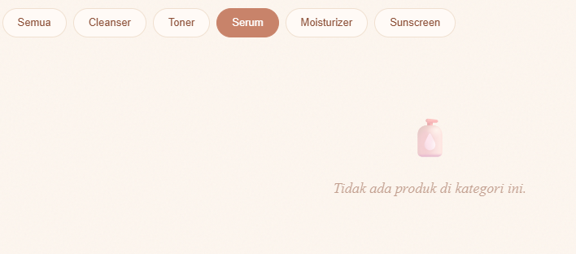
- Jika tombol **Semua** ditekan, maka seluruh produk akan ditampilkan kembali.
  
Fitur ini membantu pengguna dalam mencari produk dengan lebih cepat dan terorganisir.

## 1.10 Sistem CRUD
Aplikasi ini menerapkan konsep CRUD (Create, Read, Update, Delete).
| Operasi | Fungsi               |
| ------- | -------------------- |
| Create  | Menambahkan produk   |
| Read    | Menampilkan produk   |
| Update  | Mengubah data produk |
| Delete  | Menghapus produk     |
Alur CRUD pada aplikasi:
```
CREATE -> push() ke array
READ -> render produk ke halaman
UPDATE -> update object berdasarkan index
DELETE -> splice() dari array
```
Tampilan:
Create
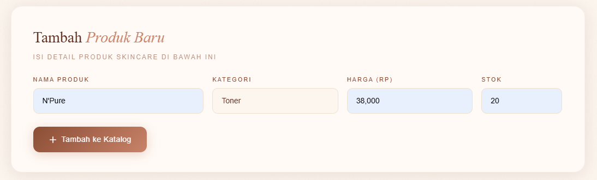

Read
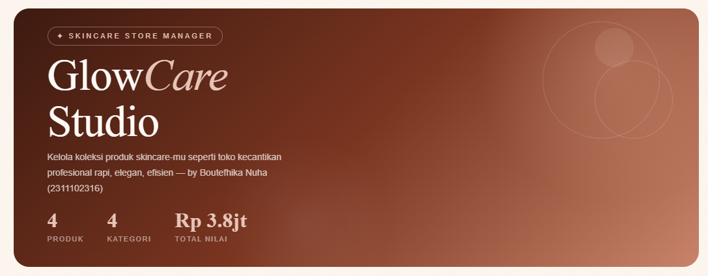

Update
Edit produk toner:
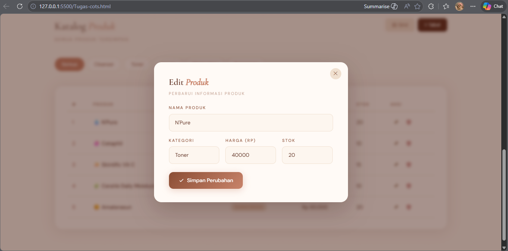
Setelah diedit:
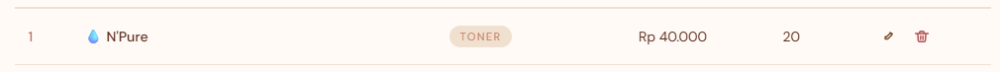

Delete
Hapus produk serum
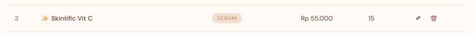
Setelah dihapus
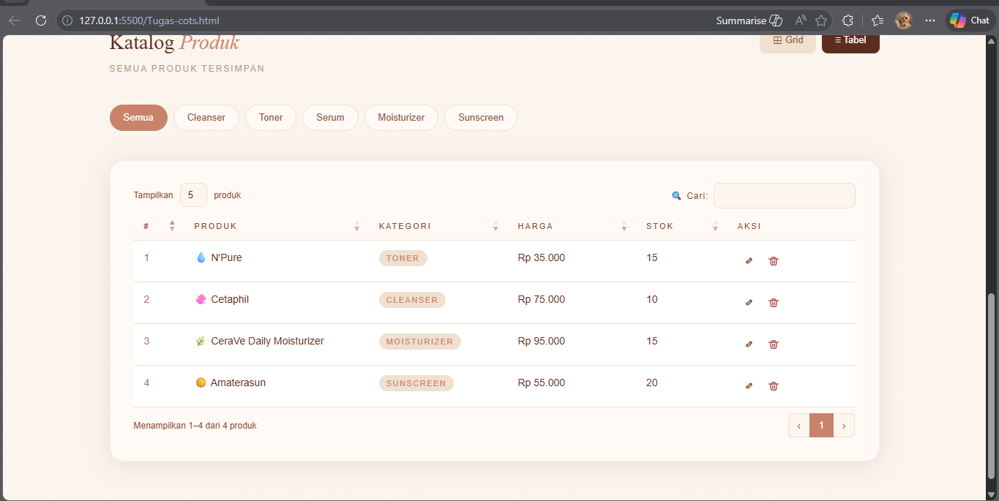

Output:
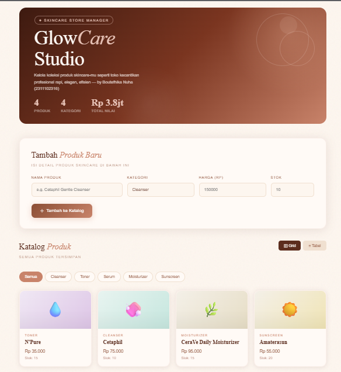

## Kesimpulan
Berdasarkan yang telah dilakukan, dapat disimpulkan bahwa pembuatan aplikasi web sederhana untuk manajemen produk dapat dilakukan menggunakan HTML, CSS, JavaScript, dan Bootstrap.Dengan memanfaatkan JavaScript object sebagai penyimpanan data, sistem CRUD dapat diterapkan tanpa menggunakan database. Penggunaan Bootstrap membantu mempercepat proses pembuatan tampilan yang responsif dan modern, serta JavaScript memungkinkan interaksi pengguna dilakukan secara dinamis tanpa perlu memuat ulang halaman.

